# 教材下载流程时序图

## 完整下载流程时序图

```mermaid
sequenceDiagram
    participant U as 用户
    participant V as MyResourcesView
    participant A as ApiService
    participant R as ResourceManager
    participant DB as IndexedDB
    participant S as 服务器

    Note over U,S: 场景1: 首次下载教材

    U->>V: 点击下载按钮
    V->>A: downloadTextbook(textbook)
    A->>V: 设置downloadStatus = 1 (下载中)
    
    Note over A,S: 阶段1: 获取学习资源包
    
    A->>S: 获取服务器端学习资源包
    S-->>A: 返回learningPackages数据
    A->>R: 获取本地学习资源包
    R->>DB: 查询localLearningPackages
    DB-->>R: 返回本地数据
    R-->>A: 返回本地学习资源包
    
    Note over A,DB: 阶段2: 文件筛选与下载
    
    A->>A: 筛选需要下载的文件<br/>(新文件/校验和不匹配/fileData不存在)
    loop 每个需要下载的文件
        A->>S: 下载文件数据
        S-->>A: 返回文件内容
        A->>R: 保存文件到IndexedDB
        R->>DB: 存储fileData
        A->>V: 更新进度回调<br/>(progress, downloadedCount, totalToDownload)
        V->>V: 更新UI进度显示
    end
    
    A->>R: 更新学习资源包信息
    R->>DB: 保存localLearningPackages
    A->>V: 设置downloadStatus = 2 (下载完成)
    V->>V: 更新UI状态为已下载

    Note over U,S: 场景2: 暂停下载

    U->>V: 点击暂停按钮
    V->>A: 暂停下载请求
    A->>A: 中断当前下载循环
    A->>V: 设置downloadStatus = 3 (已暂停)
    V->>V: 更新UI显示暂停状态

    Note over U,S: 场景3: 继续下载 (增量下载)

    U->>V: 点击继续下载按钮
    V->>A: downloadTextbook(textbook)
    A->>V: 设置downloadStatus = 1 (下载中)
    
    Note over A,S: 阶段1: 重新获取学习资源包
    
    A->>S: 获取服务器端学习资源包
    S-->>A: 返回learningPackages数据
    A->>R: 获取本地学习资源包
    R->>DB: 查询localLearningPackages
    DB-->>R: 返回本地数据
    R-->>A: 返回本地学习资源包
    
    Note over A,DB: 阶段2: 增量文件筛选
    
    A->>A: 筛选需要下载的文件<br/>(只下载fileData中不存在的文件)
    Note over A: 关键优化: 跳过已下载的文件
    loop 每个需要下载的文件
        A->>S: 下载文件数据
        S-->>A: 返回文件内容
        A->>R: 保存文件到IndexedDB
        R->>DB: 存储fileData
        A->>V: 更新进度回调
        V->>V: 更新UI进度显示
    end
    
    A->>R: 更新学习资源包信息
    R->>DB: 保存localLearningPackages
    A->>V: 设置downloadStatus = 2 (下载完成)
    V->>V: 更新UI状态为已下载

    Note over U,S: 场景4: 重新下载 (全量下载)

    U->>V: 点击重新下载按钮
    V->>A: downloadTextbook(textbook)
    A->>V: 设置downloadStatus = 1 (下载中)
    
    Note over A,S: 阶段1: 获取学习资源包
    
    A->>S: 获取服务器端学习资源包
    S-->>A: 返回learningPackages数据
    A->>R: 获取本地学习资源包
    R->>DB: 查询localLearningPackages
    DB-->>R: 返回本地数据
    R-->>A: 返回本地学习资源包
    
    Note over A,DB: 阶段2: 全量文件筛选
    
    A->>A: 筛选需要下载的文件<br/>(新文件/校验和不匹配/强制重新下载)
    Note over A: 重新下载: 忽略fileData存在性检查
    loop 每个需要下载的文件
        A->>S: 下载文件数据
        S-->>A: 返回文件内容
        A->>R: 保存文件到IndexedDB
        R->>DB: 存储fileData
        A->>V: 更新进度回调
        V->>V: 更新UI进度显示
    end
    
    A->>R: 更新学习资源包信息
    R->>DB: 保存localLearningPackages
    A->>V: 设置downloadStatus = 2 (下载完成)
    V->>V: 更新UI状态为已下载

    Note over U,S: 场景5: 教材更新检测与下载

    U->>V: 页面加载/刷新
    V->>A: 检查教材更新状态
    A->>S: 获取服务器端学习资源包
    S-->>A: 返回learningPackages数据
    A->>R: 获取本地学习资源包
    R->>DB: 查询localLearningPackages
    DB-->>R: 返回本地数据
    R-->>A: 返回本地学习资源包
    
    Note over A,DB: 阶段1: 更新检测
    
    A->>A: 比较服务器与本地版本
    A->>A: 检测文件校验和变化
    A->>V: 返回更新状态<br/>(hasUpdate: true/false)
    
    alt 检测到更新
        V->>V: 显示更新提示UI<br/>(更新按钮/版本信息)
        U->>V: 点击更新按钮
        V->>A: downloadTextbook(textbook)
        A->>V: 设置downloadStatus = 1 (更新中)
        
        Note over A,DB: 阶段2: 增量更新下载
        
        A->>A: 筛选需要更新的文件<br/>(校验和不匹配的文件)
        Note over A: 更新优化: 只下载变更的文件
        loop 每个需要更新的文件
            A->>S: 下载更新文件数据
            S-->>A: 返回文件内容
            A->>R: 更新文件到IndexedDB
            R->>DB: 更新fileData
            A->>V: 更新进度回调<br/>(更新进度显示)
            V->>V: 更新UI进度显示
        end
        
        A->>R: 更新学习资源包版本信息
        R->>DB: 保存localLearningPackages
        A->>V: 设置downloadStatus = 2 (更新完成)
        V->>V: 更新UI状态为已更新
    else 无更新
        V->>V: 显示当前版本信息<br/>(无需更新)
    end

    Note over U,S: 场景6: 下载失败处理

    U->>V: 点击下载按钮
    V->>A: downloadTextbook(textbook)
    A->>V: 设置downloadStatus = 1 (下载中)
    
    A->>S: 获取服务器端学习资源包
    S-->>A: 返回learningPackages数据
    
    loop 下载文件过程中
        A->>S: 下载文件数据
        S-->>A: 网络错误/服务器错误
        A->>A: 捕获异常
        A->>V: 设置downloadStatus = 0 (下载失败)
        V->>V: 显示错误信息
        Note over A,V: 下载失败，保持已下载的文件状态
    end
```



## 关键优化点说明

### 1. 增量下载优化
- **继续下载时**：只下载 `fileData` 中不存在的文件
- **避免重复下载**：已下载完成的文件不会重新下载
- **提高效率**：减少网络请求和存储操作

### 2. 文件筛选逻辑
```typescript
// 文件需要下载的条件：
1. localFiles 中没有记录 (新文件)
2. 校验和不匹配 (文件已更新)  
3. fileData 中不存在实际数据 (暂停后继续下载)

// 文件需要更新的条件：
1. 校验和不匹配 (服务器文件已变更)
2. 版本号不同 (教材版本更新)
```

### 3. 状态管理
- `downloadStatus = 0`: 未下载/下载失败
- `downloadStatus = 1`: 下载中
- `downloadStatus = 2`: 下载完成
- `downloadStatus = 3`: 已暂停

### 4. 进度回调机制
- 实时更新下载进度
- 显示已下载文件数/总文件数
- 提供用户友好的进度反馈

## 不同场景的Note分割说明

1. **场景1**: 首次下载 - 完整流程展示
2. **场景2**: 暂停下载 - 中断机制
3. **场景3**: 继续下载 - 增量下载优化
4. **场景4**: 重新下载 - 全量下载
5. **场景5**: 教材更新检测与下载 - 智能更新机制
6. **场景6**: 错误处理 - 异常情况处理

每个场景都通过 `Note over` 进行清晰分割，便于理解不同操作模式下的流程差异。

### 更新场景特色功能

- **自动检测**: 页面加载时自动检查更新
- **版本比较**: 服务器与本地版本对比
- **校验和验证**: 文件内容变更检测
- **增量更新**: 只下载变更的文件
- **用户选择**: 检测到更新后用户可选择是否更新
