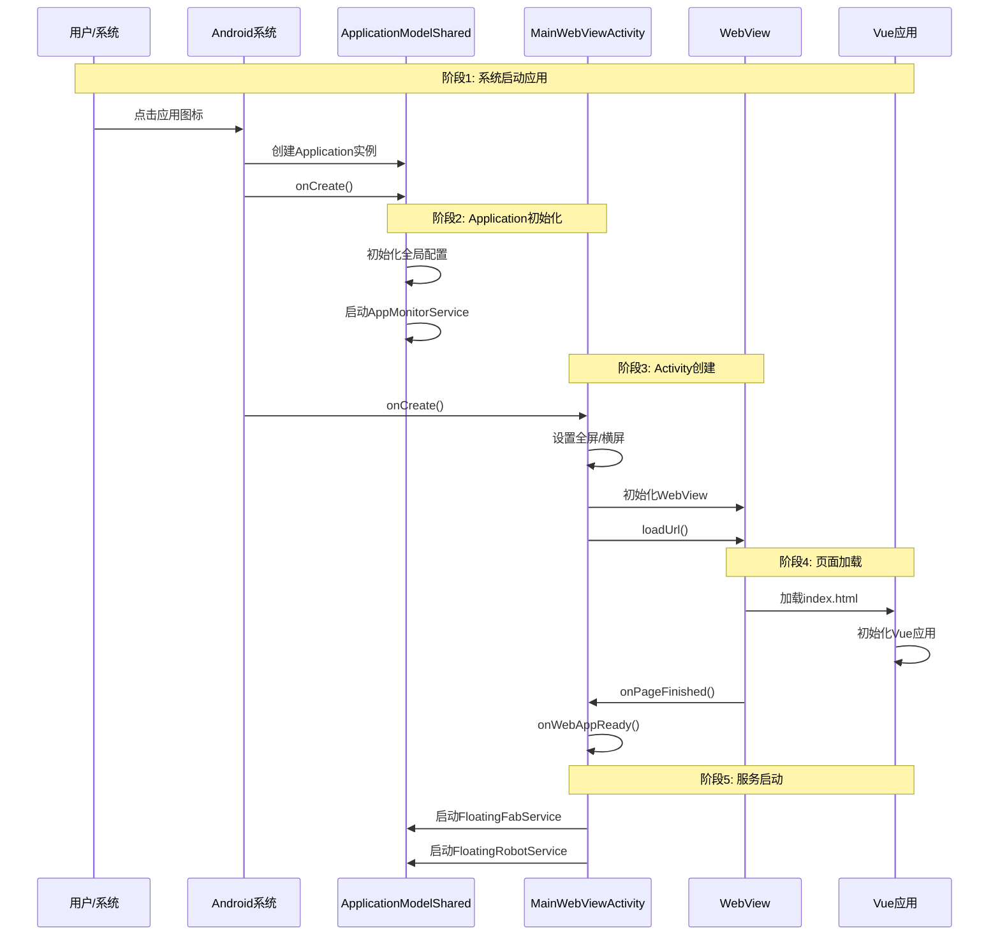
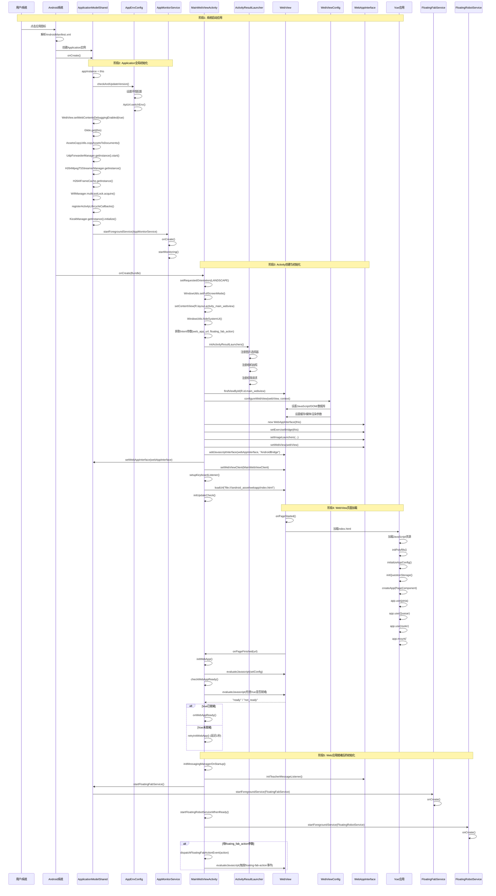

# Android原生启动流程时序图

## 📋 概述

本文档用三个详细程度的时序图完整呈现Android原生应用的启动流程，从用户点击应用图标到Web应用完全就绪的整个过程。

---

## 🎯 版本一：简略版本

适用于快速了解启动流程的主要阶段。

---

## 📖 版本二：详细版本

包含关键初始化步骤和组件交互。

---

## 🔬 版本三：极其详细版本

包含所有细节、方法调用和组件交互。

```mermaid
sequenceDiagram
    participant User as 用户/系统
    participant System as Android系统
    participant Manifest as AndroidManifest.xml
    participant App as ApplicationModelShared
    participant Env as AppEnvConfig
    participant Assets as AssetsCopyUtils
    participant Udp as UdpForwarderManager
    participant H264TS as H264MpegTSStreamerManager
    participant H264IF as H264IFrameCache
    participant Wifi as WifiManager
    participant Kiosk as KioskManager
    participant Service as AppMonitorService
    participant Activity as MainWebViewActivity
    participant Window as WindowUtils
    participant Launcher as ActivityResultLauncher
    participant ImagePick as ImagePickLauncher
    participant ImageCap as ImageCaptureLauncher
    participant CameraPerm as CameraPermissionLauncher
    participant AudioPerm as AudioPermissionLauncher
    participant WebView as WebView
    participant Settings as WebSettings
    participant Config as WebViewConfig
    participant Interface as WebAppInterface
    participant Client as MainWebViewClient
    participant Keyboard as ViewTreeObserver
    participant Update as EasyUpdate
    participant Vue as Vue应用
    participant Polyfills as Polyfills
    participant Storage as IndexedDB
    participant Pinia as Pinia Store
    participant Quasar as Quasar
    participant Router as Vue Router
    participant Messaging as MessagingManager
    participant FabService as FloatingFabService
    participant RobotService as FloatingRobotService

    Note over User,Vue: ==========================================<br/>阶段1: 系统启动应用<br/>==========================================
    User->>System: 点击应用图标 / 开机自启 / 系统唤醒
    System->>Manifest: 解析AndroidManifest.xml
    Manifest-->>System: 获取Application类: ApplicationModelShared
    Manifest-->>System: 获取主Activity: MainWebViewActivity (MAIN/LAUNCHER)
    System->>System: 创建Application实例
    System->>App: new ApplicationModelShared()
    System->>App: onCreate()

    Note over App,Service: ==========================================<br/>阶段2: Application全局初始化<br/>==========================================
    App->>App: super.onCreate()
    App->>App: appInstance = this
    App->>App: 初始化ViewModelStore
    
    App->>Env: checkAndUpdateVersion(this)
    Env->>Env: SharedPreferences.getSharedPreferences("app_env_config")
    Env->>Env: 读取KEY_ENV_TYPE
    alt 环境类型为空
        Env->>Env: forceEnvType(RELEASE)
    else 环境类型已存在
        Env->>Env: forceEnvType(getCurrentEnvType())
    end
    Env->>Env: ApiUrl.switchEnv(targetEnv)
    Env-->>App: 环境配置完成
    
    App->>App: 检查Build.VERSION.SDK_INT >= Build.VERSION_CODES.KITKAT
    App->>App: WebView.setWebContentsDebuggingEnabled(true)
    
    App->>App: Glide.get(this)
    
    App->>Assets: copyAssetsToDocuments(this)
    Assets->>Assets: 遍历assets目录
    Assets->>Assets: 复制文件到Documents目录
    Assets-->>App: 文件复制完成
    
    App->>Udp: getInstance().start()
    Udp->>Udp: 初始化UDP转发器
    Udp-->>App: UDP转发器启动
    
    App->>H264TS: getInstance()
    H264TS->>H264TS: 初始化H264流管理器
    H264TS-->>App: H264流管理器就绪
    
    App->>H264IF: getInstance()
    H264IF->>H264IF: 初始化H264 I帧缓存
    H264IF-->>App: I帧缓存就绪
    
    App->>Wifi: getSystemService(Context.WIFI_SERVICE)
    App->>Wifi: createMulticastLock("media-play")
    App->>Wifi: multicastLock.setReferenceCounted(true)
    App->>Wifi: multicastLock.acquire()
    
    App->>App: registerActivityLifecycleCallbacks(new ActivityLifecycleCallbacks())
    App->>App: 设置Activity生命周期监听器
    
    App->>Kiosk: getInstance().initialize(this)
    Kiosk->>Kiosk: 初始化Kiosk模式管理器
    Kiosk-->>App: Kiosk管理器就绪
    
    App->>Service: startForegroundService(Intent(AppMonitorService))
    alt Build.VERSION.SDK_INT >= Build.VERSION_CODES.O
        System->>Service: startForegroundService()
    else 低版本
        System->>Service: startService()
    end
    Service->>Service: onCreate()
    Service->>Service: activityManager = getSystemService(ACTIVITY_SERVICE)
    Service->>Service: usageStatsManager = getSystemService(USAGE_STATS_SERVICE)
    Service->>Service: kioskManager = KioskManager.getInstance()
    Service->>Service: handler = new Handler(Looper.getMainLooper())
    Service->>Service: createNotificationChannel()
    Service->>Service: startForeground(NOTIFICATION_ID, createNotification())
    Service->>Service: startMonitoring()
    Service->>Service: handler.postDelayed(monitorRunnable, CHECK_INTERVAL)
    Service-->>App: 监控服务启动完成

    Note over Activity,Interface: ==========================================<br/>阶段3: Activity创建与初始化<br/>==========================================
    System->>Activity: onCreate(Bundle savedInstanceState)
    Activity->>Activity: super.onCreate(savedInstanceState)
    
    Activity->>Activity: setRequestedOrientation(ActivityInfo.SCREEN_ORIENTATION_LANDSCAPE)
    Activity->>Window: setFullScreenMode(this)
    Window->>Activity: getWindow().getDecorView()
    Window->>Activity: 设置FLAG_FULLSCREEN
    Window->>Activity: 设置SYSTEM_UI_FLAG_HIDE_NAVIGATION
    Window->>Activity: 设置SYSTEM_UI_FLAG_FULLSCREEN
    Window->>Activity: 设置SYSTEM_UI_FLAG_IMMERSIVE_STICKY
    Window-->>Activity: 全屏模式设置完成
    
    alt Build.VERSION.SDK_INT >= Build.VERSION_CODES.N
        Activity->>Activity: getWindow().setLayout(MATCH_PARENT, MATCH_PARENT)
    end
    
    Activity->>Activity: setContentView(R.layout.activity_main_webview)
    Activity->>Activity: 加载布局文件
    
    Activity->>Window: hideSystemUI(this)
    Window->>Activity: getWindow().getDecorView()
    Window->>Activity: 隐藏系统UI
    
    Activity->>Activity: getIntent().getStringExtra("web_app_url")
    Activity->>Activity: 读取自定义URL参数
    alt customUrl不为空
        Activity->>Activity: webAppUrl = customUrl
    else customUrl为空
        Activity->>Activity: webAppUrl = "file:///android_asset/webapp/index.html"
    end
    
    Activity->>Activity: getIntent().getStringExtra("floating_fab_action")
    Activity->>Activity: 读取悬浮FAB按钮action参数
    
    Activity->>Launcher: initActivityResultLaunchers()
    Activity->>ImagePick: registerForActivityResult(StartActivityForResult)
    ImagePick->>ImagePick: 注册图片选择器回调
    Activity->>ImageCap: registerForActivityResult(StartActivityForResult)
    ImageCap->>ImageCap: 注册相机拍照回调
    Activity->>CameraPerm: registerForActivityResult(RequestPermission)
    CameraPerm->>CameraPerm: 注册相机权限请求回调
    Activity->>AudioPerm: registerForActivityResult(RequestPermission)
    AudioPerm->>AudioPerm: 注册录音权限请求回调
    Launcher-->>Activity: Activity Result Launchers初始化完成
    
    Activity->>WebView: initWebView()
    Activity->>WebView: findViewById(R.id.main_webview)
    WebView-->>Activity: 获取WebView实例
    
    alt Build.VERSION.SDK_INT >= Build.VERSION_CODES.KITKAT
        Activity->>WebView: WebView.setWebContentsDebuggingEnabled(true)
    end
    
    Activity->>Config: configureWebView(webView, this)
    Config->>Settings: webView.getSettings()
    Settings-->>Config: 获取WebSettings实例
    Config->>Settings: setJavaScriptEnabled(true)
    Config->>Settings: setDomStorageEnabled(true)
    Config->>Settings: setDatabaseEnabled(true)
    Config->>Settings: setCacheMode(LOAD_DEFAULT)
    Config->>Settings: setMediaPlaybackRequiresUserGesture(false)
    Config->>Settings: setAllowFileAccess(true)
    Config->>Settings: setAllowContentAccess(true)
    Config->>Settings: setAllowFileAccessFromFileURLs(true)
    Config->>Settings: setAllowUniversalAccessFromFileURLs(true)
    Config->>Settings: setRenderPriority(RenderPriority.HIGH)
    Config->>Settings: setLayoutAlgorithm(LayoutAlgorithm.TEXT_AUTOSIZING)
    Config->>Settings: setSupportZoom(false)
    Config->>Settings: setBuiltInZoomControls(false)
    Config->>Settings: setDisplayZoomControls(false)
    Config->>Settings: setMixedContentMode(MIXED_CONTENT_ALWAYS_ALLOW)
    Config->>Settings: getUserAgentString()
    Config->>Settings: setUserAgentString(userAgent + " FindExerciseApp/1.0")
    Config->>WebView: setLayerType(LAYER_TYPE_HARDWARE, null)
    Config-->>Activity: WebView配置完成
    
    Activity->>WebView: setLongClickable(false)
    Activity->>WebView: setOnLongClickListener(v -> true)
    Activity->>WebView: setHapticFeedbackEnabled(false)
    Activity->>WebView: setVerticalScrollBarEnabled(false)
    Activity->>WebView: setHorizontalScrollBarEnabled(false)
    
    Activity->>Interface: new WebAppInterface(this)
    Interface->>Interface: 初始化WebAppInterface
    Activity->>Interface: setExerciseBridge(this)
    Activity->>Interface: setImageLaunchers(imagePickLauncher, imageCaptureLauncher)
    Activity->>Interface: setCameraPermissionLauncher(cameraPermissionLauncher)
    Activity->>Interface: setAudioPermissionLauncher(audioPermissionLauncher)
    Activity->>Interface: setWebView(webView)
    Activity->>WebView: addJavascriptInterface(webAppInterface, "AndroidBridge")
    WebView->>WebView: 将WebAppInterface暴露给JavaScript
    
    Activity->>App: getApplication()
    Activity->>App: setWebAppInterface(webAppInterface)
    App->>App: 保存webAppInterface供其他Service使用
    
    Activity->>Client: new MainWebViewClient()
    Activity->>WebView: setWebViewClient(client)
    
    Activity->>Activity: setupKeyboardListener()
    Activity->>Activity: findViewById(android.R.id.content)
    Activity->>Keyboard: getViewTreeObserver()
    Activity->>Keyboard: addOnGlobalLayoutListener()
    Keyboard->>Keyboard: 监听窗口大小变化
    Keyboard-->>Activity: 键盘监听器设置完成
    
    Activity->>Activity: loadWebApp()
    Activity->>Activity: 判断webAppUrl类型
    alt webAppUrl.startsWith("http://") || webAppUrl.startsWith("https://")
        Activity->>WebView: loadUrl(webAppUrl)
    else 本地文件
        Activity->>Activity: webAppUrl = "file:///android_asset/webapp/index.html"
        Activity->>WebView: loadUrl(webAppUrl)
    end
    
    Activity->>Activity: initUpdateCheck()
    Activity->>Activity: mCheckUpdateTick = System.currentTimeMillis()
    Activity->>Update: Handler.postDelayed(mCheckUpdateRunnable, 60000)
    Update-->>Activity: 更新检查初始化完成 (60秒后首次检查)

    Note over WebView,Vue: ==========================================<br/>阶段4: WebView页面加载<br/>==========================================
    WebView->>Client: onPageStarted(view, url, favicon)
    Client->>Client: 记录页面开始加载
    
    WebView->>Vue: 加载index.html
    Vue->>Vue: 解析HTML文档
    Vue->>Vue: 加载CSS资源
    Vue->>Vue: 加载JavaScript资源 (main-webview.js)
    
    Vue->>Polyfills: initPolyfills()
    Polyfills->>Polyfills: 初始化WebView兼容性polyfills
    Polyfills-->>Vue: Polyfills初始化完成
    
    Vue->>Vue: initializeAppConfig()
    Vue->>Vue: 读取应用配置
    Vue->>Vue: 设置认证token
    Vue->>Vue: 配置完成
    
    Vue->>Storage: initQuestionStorage()
    Storage->>Storage: 提前初始化IndexedDB (并行加载)
    Storage-->>Vue: IndexedDB初始化完成
    
    Vue->>Vue: loadPageComponent()
    Vue->>Vue: 动态加载MainView组件
    Vue-->>Vue: PageComponent就绪
    
    Vue->>Vue: createApp(PageComponent)
    Vue->>Vue: 创建Vue应用实例
    
    Vue->>Pinia: createPinia()
    Vue->>Vue: app.use(pinia)
    Pinia-->>Vue: Pinia状态管理初始化完成
    
    Vue->>Quasar: app.use(Quasar, { plugins: {} })
    Quasar->>Quasar: 初始化Quasar组件库
    Quasar-->>Vue: Quasar初始化完成
    
    Vue->>Router: app.use(router)
    Router->>Router: 初始化Vue Router
    Router-->>Vue: 路由初始化完成
    
    Vue->>Vue: app.mount('#app')
    Vue->>Vue: 挂载Vue应用到DOM
    Vue->>Vue: Vue应用完全初始化
    
    WebView->>Client: onPageFinished(view, url)
    Client->>Activity: initWebApp()
    Activity->>Activity: 构造config JSON对象
    Activity->>Activity: config.put("theme", "light")
    Activity->>Activity: config.put("language", "zh-CN")
    Activity->>Activity: config.put("debug", false)
    Activity->>WebView: evaluateJavascript(setConfig代码)
    WebView->>Vue: 执行setConfig JavaScript
    Vue->>Vue: window.AndroidBridge.setConfig(config)
    Vue-->>Activity: 配置设置完成
    
    Activity->>Activity: checkWebAppReady()
    Activity->>WebView: evaluateJavascript(检查Vue是否就绪的代码)
    WebView->>Vue: 执行检查代码
    Vue->>Vue: 检查window.Vue && window.Vue.version
    Vue-->>WebView: 返回 "ready" 或 "not_ready"
    WebView-->>Activity: 返回检查结果
    
    alt 返回 "ready"
        Activity->>Activity: onWebAppReady()
    else 返回 "not_ready"
        Activity->>Activity: retryInitWebApp()
        Activity->>Activity: webView.postDelayed(() -> checkWebAppReady(), 1000)
    end

    Note over Activity,RobotService: ==========================================<br/>阶段5: Web应用就绪后的初始化<br/>==========================================
    Activity->>Activity: initMessagingManagerOnStartup()
    Activity->>Activity: AppUtils.getUserId()
    alt userId不为空
        Activity->>Interface: initTeacherMessageListener()
        Interface->>Messaging: 初始化MessagingManager
        Interface->>Messaging: 设置消息监听器
        Messaging-->>Interface: 消息管理器初始化完成
        Interface-->>Activity: 初始化结果
    else userId为空
        Activity->>Activity: 跳过初始化 (用户未登录)
    end
    
    Activity->>Activity: startFloatingFabServiceWhenReady()
    Activity->>App: getApplication()
    Activity->>App: startFloatingFabService()
    App->>App: 检查floatingFabService是否已启动
    alt floatingFabService == null
        App->>FabService: startForegroundService(Intent(FloatingFabService))
        alt Build.VERSION.SDK_INT >= Build.VERSION_CODES.O
            System->>FabService: startForegroundService()
        else 低版本
            System->>FabService: startService()
        end
        FabService->>FabService: onCreate()
        FabService->>FabService: 初始化悬浮FAB按钮服务
        FabService->>FabService: 创建悬浮窗
        FabService->>App: setFloatingFabService(this)
        FabService-->>App: 悬浮FAB按钮服务启动完成
    else 已启动
        App->>App: 跳过重复启动
    end
    
    Activity->>Activity: startFloatingRobotServiceWhenReady()
    Activity->>RobotService: startForegroundService(Intent(FloatingRobotService))
    alt Build.VERSION.SDK_INT >= Build.VERSION_CODES.O
        System->>RobotService: startForegroundService()
    else 低版本
        System->>RobotService: startService()
    end
    RobotService->>RobotService: onCreate()
    RobotService->>RobotService: 初始化浮动机器人服务
    RobotService->>RobotService: 创建悬浮窗
    RobotService->>App: setFloatingWindowService(this)
    RobotService-->>Activity: 浮动机器人服务启动完成
    
    alt floatingFabAction != null && !floatingFabAction.isEmpty()
        Activity->>Activity: webView.postDelayed(() -> dispatchFloatingFabActionEvent(), 500)
        Activity->>Activity: dispatchFloatingFabActionEvent(floatingFabAction)
        Activity->>Activity: 构造detail JSON对象
        Activity->>Activity: detail.put("action", floatingFabAction)
        Activity->>WebView: evaluateJavascript(触发floating-fab-action事件的代码)
        WebView->>Vue: 执行JavaScript代码
        Vue->>Vue: new CustomEvent('floating-fab-action', { detail })
        Vue->>Vue: window.dispatchEvent(event)
        Vue-->>Activity: 事件触发完成
        Activity->>Activity: floatingFabAction = null (清除，避免重复触发)
    end
    
    Note over User,Vue: ==========================================<br/>启动流程完成<br/>应用已完全就绪<br/>==========================================
```

---

## 📊 启动流程阶段总结

### 阶段1: 系统启动应用
- **触发**: 用户点击应用图标 / 开机自启 / 系统唤醒
- **关键步骤**: 系统解析AndroidManifest.xml，创建Application实例

### 阶段2: Application全局初始化
- **核心组件**: ApplicationModelShared
- **主要任务**:
  - 环境配置检查 (AppEnvConfig)
  - WebView调试启用
  - 图片加载库初始化 (Glide)
  - 资源文件复制 (AssetsCopyUtils)
  - 屏幕投屏服务初始化
  - WifiManager MulticastLock
  - Activity生命周期监听
  - Kiosk模式管理器初始化
  - AppMonitorService启动

### 阶段3: Activity创建与初始化
- **核心组件**: MainWebViewActivity
- **主要任务**:
  - 设置横屏/全屏模式
  - 加载布局文件
  - 初始化Activity Result Launchers
  - WebView配置 (WebViewConfig)
  - WebAppInterface创建与绑定
  - 键盘监听器设置
  - 更新检查初始化
  - 加载Web应用页面

### 阶段4: WebView页面加载
- **核心组件**: WebView, Vue应用
- **主要任务**:
  - HTML页面加载
  - JavaScript资源加载
  - Polyfills初始化
  - IndexedDB初始化
  - Vue应用创建与挂载
  - 页面加载完成回调
  - Web应用就绪检查

### 阶段5: Web应用就绪后的初始化
- **核心组件**: 各种Service
- **主要任务**:
  - MessagingManager预初始化
  - FloatingFabService启动
  - FloatingRobotService启动
  - 悬浮FAB按钮action事件处理

---

## 🔍 关键时序点

1. **Application.onCreate()** - 应用全局初始化入口
2. **MainWebViewActivity.onCreate()** - Activity创建入口
3. **WebView.loadUrl()** - Web页面加载开始
4. **onPageFinished()** - 页面加载完成
5. **onWebAppReady()** - Web应用完全就绪

---

## 📝 注意事项

1. **启动顺序**: Application.onCreate() 总是在Activity.onCreate()之前执行
2. **Service启动时机**: 
   - AppMonitorService 在Application.onCreate()中启动
   - FloatingFabService 和 FloatingRobotService 在onWebAppReady()中启动
3. **WebView初始化**: 必须在Activity Result Launchers初始化之后
4. **Vue就绪检查**: 使用轮询机制，如果未就绪则延迟1秒后重试
5. **异步操作**: IndexedDB初始化是并行加载，不阻塞应用启动

---

## 🔗 相关文档

- [ApplicationModelShared关系说明.md](../../app/docs/ApplicationModelShared关系说明.md)
- [浮动机器人启动问题分析.md](./浮动机器人启动问题分析.md)
- [Android启动日志传递MainView实现方案.md](./Android启动日志传递MainView实现方案.md)

