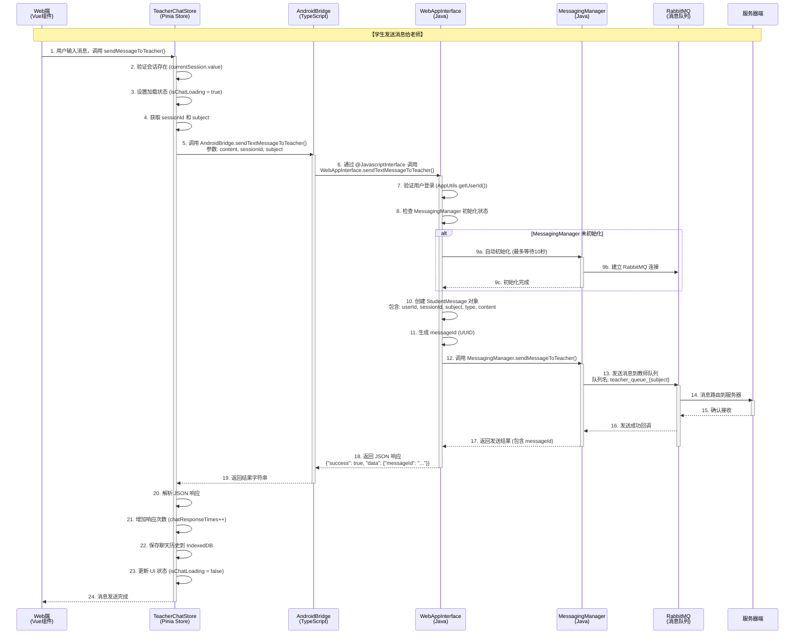
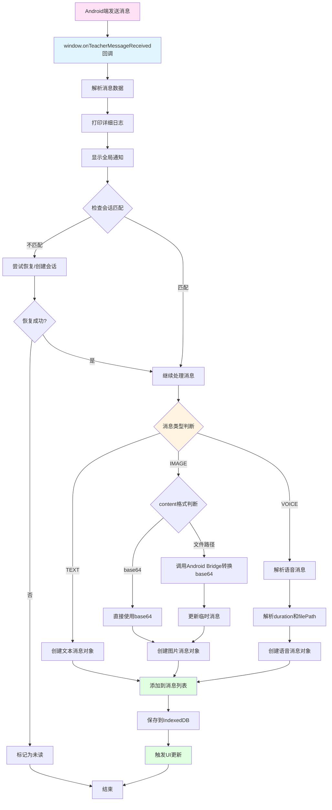
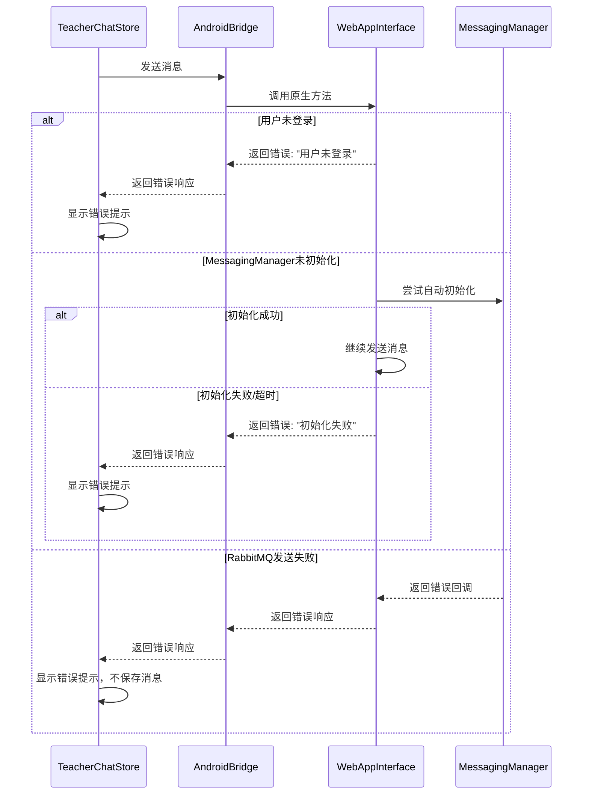
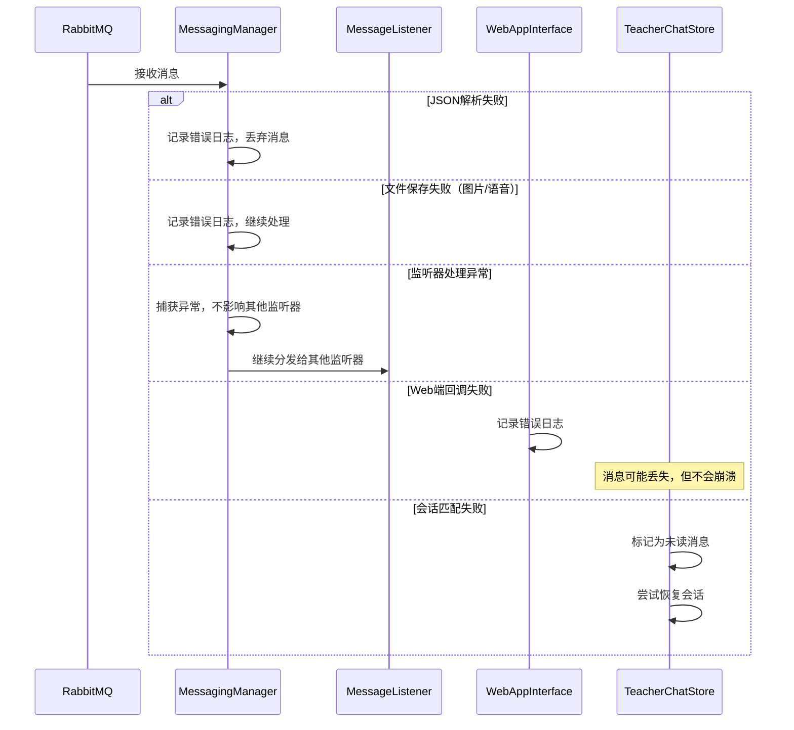
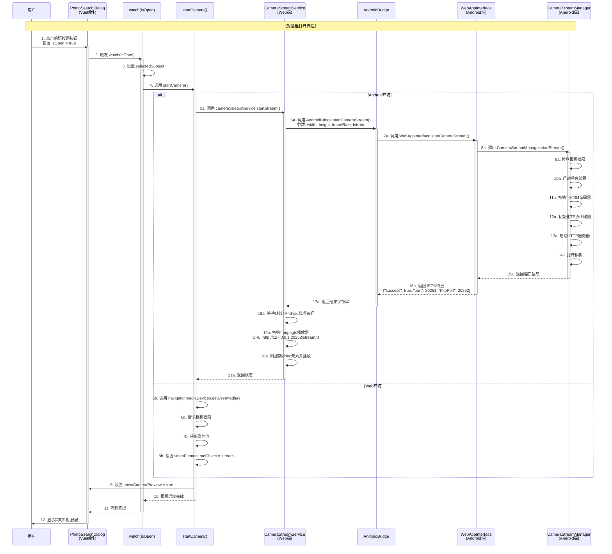
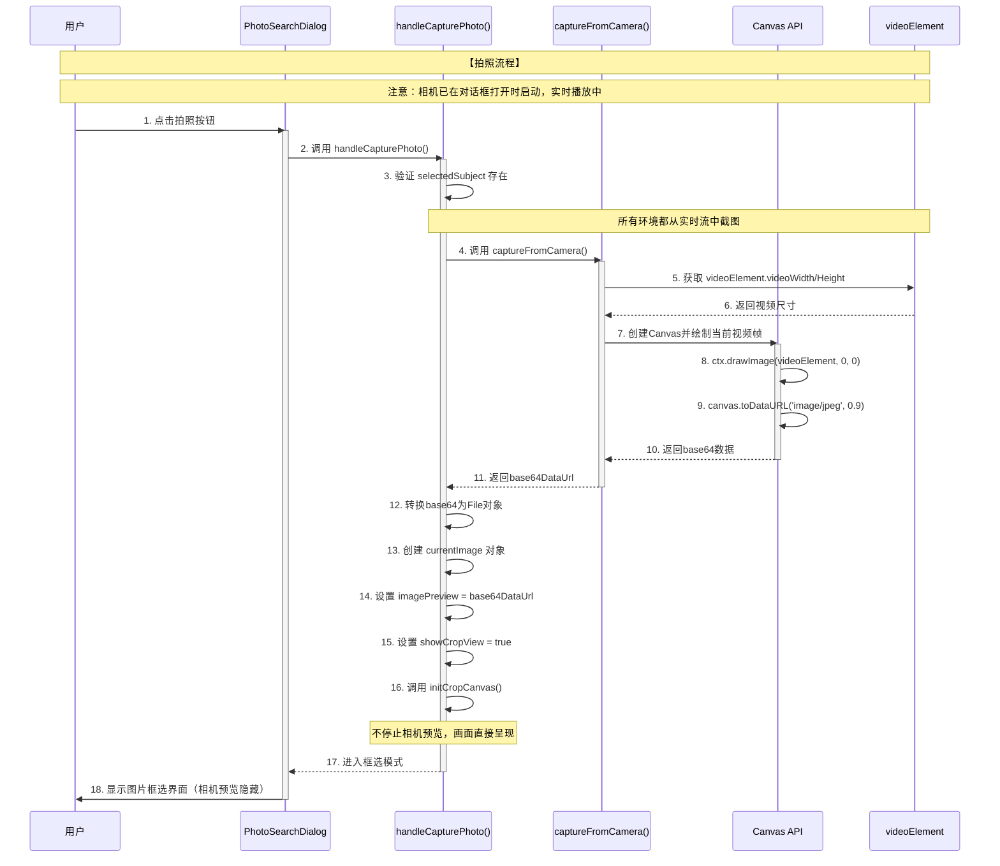
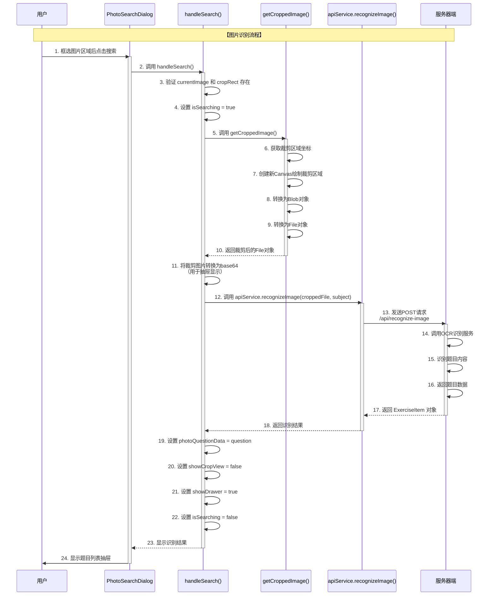
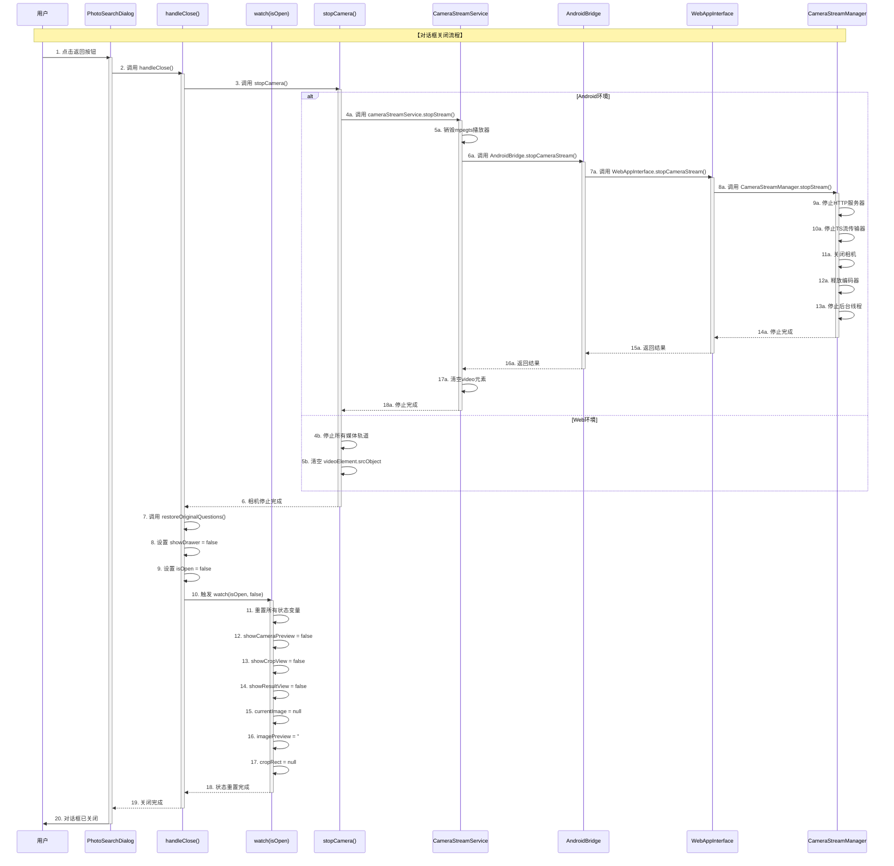

# Android和Web端教师会话管理流程分析

## 概述

本文档详细分析Android端和Web端在教师会话管理、消息发送和接收方面的完整流程，包括数据存储、消息传递和状态同步机制。

---

## 📌 教师消息监听器详解

### 什么是教师消息监听器？

**教师消息监听器（Teacher Message Listener）**是一个**双向通信机制**，用于在Android端和Web端之间传递教师发送的消息。

### 监听器的组成

教师消息监听器由**三层架构**组成：

#### 1. **RabbitMQ层**（最底层）
- **职责**：从RabbitMQ消息队列接收教师回复
- **位置**：`RabbitMQManager.startListeningForTeacherReplies()`
- **机制**：监听学生专属队列（`student_queue_{userId}`）

```java
// RabbitMQManager.java
channel.basicConsume(studentQueueName, false, deliverCallback, consumerTag -> {
    // 当有新消息时，deliverCallback会被调用
});
```

#### 2. **MessagingManager层**（中间层）
- **职责**：管理消息监听器列表，分发消息到所有监听器
- **位置**：`MessagingManager.java`
- **机制**：使用观察者模式，维护多个监听器

```java
// MessagingManager.java
private final List<MessageListener> messageListeners = new ArrayList<>();

// 收到消息时，分发给所有监听器
for (MessageListener listener : messageListeners) {
    listener.onTeacherMessageReceived(chatMsg);
}
```

#### 3. **WebAppInterface层**（接口层）
- **职责**：将Android端消息转换为JSON，通过JavaScript回调传递给Web端
- **位置**：`WebAppInterface.java`
- **机制**：调用JavaScript函数 `window.onTeacherMessageReceived()`

```java
// WebAppInterface.java
private void notifyTeacherMessageReceived(ChatMessage teacherMessage) {
    // 构建JSON
    JSONObject messageJson = new JSONObject();
    messageJson.put("messageId", teacherMessage.messageId);
    // ...
    
    // 调用JavaScript回调
    String script = "if (window.onTeacherMessageReceived) { " +
                   "window.onTeacherMessageReceived(" + messageJson.toString() + "); }";
    executeJavaScript(script);
}
```

### 监听器的工作流程

```
┌─────────────────────────────────────────────────────────────┐
│ 【第1层】RabbitMQ接收消息                                     │
│ └─> RabbitMQ队列收到教师消息                                 │
└─────────────────────────────────────────────────────────────┘
                        ↓
┌─────────────────────────────────────────────────────────────┐
│ 【第2层】MessagingManager处理                                 │
│ ├─> 解析JSON → TeacherMessage                               │
│ ├─> 转换为ChatMessage                                       │
│ ├─> 保存文件（图片/语音）                                    │
│ └─> 分发给所有监听器                                        │
└─────────────────────────────────────────────────────────────┘
                        ↓
┌─────────────────────────────────────────────────────────────┐
│ 【第3层】WebAppInterface通知Web端                            │
│ ├─> 构建消息JSON                                            │
│ └─> 调用 window.onTeacherMessageReceived(messageJson)       │
└─────────────────────────────────────────────────────────────┘
                        ↓
┌─────────────────────────────────────────────────────────────┐
│ 【Web端】处理消息                                            │
│ ├─> 解析消息数据                                            │
│ ├─> 检查会话匹配                                            │
│ ├─> 添加到消息列表                                          │
│ └─> 保存到IndexedDB                                         │
└─────────────────────────────────────────────────────────────┘
```

### 初始化监听器

#### Android端初始化

```java
// WebAppInterface.java
@JavascriptInterface
public String initTeacherMessageListener() {
    // 1. 初始化MessagingManager（建立RabbitMQ连接）
    MessagingManager.getInstance().initialize(mContext, userId);
    
    // 2. 添加消息监听器（将WebAppInterface注册为监听器）
    MessagingManager.getInstance().addMessageListener(
        this::notifyTeacherMessageReceived
    );
    
    return createResponse(true, "老师消息监听器初始化成功", null);
}
```

#### Web端初始化

```typescript
// teacherChatStore.ts
const doInitMessageReceiver = async (): Promise<void> => {
  // 1. 设置全局回调函数（Android端会调用这个函数）
  window.onTeacherMessageReceived = async (messageData: unknown) => {
    // 处理消息...
  }
  
  // 2. 调用Android Bridge初始化监听器
  const result = window.AndroidBridge.initTeacherMessageListener()
  
  // 3. 等待初始化完成（最多10秒）
  // ...
}
```

### 监听器的特点

#### ✅ 支持多个监听器
- `MessagingManager` 维护一个监听器列表
- 可以同时注册多个监听器
- 消息会分发给所有监听器

#### ✅ 线程安全
- RabbitMQ消息接收在后台线程
- 通过 `mainHandler.post()` 切换到主线程
- 确保UI更新在主线程执行

#### ✅ 自动重连
- 连接断开时自动重连
- 监听器自动恢复

#### ✅ 异常隔离
- 单个监听器的异常不影响其他监听器
- 消息处理失败不会导致监听器崩溃

### 清理监听器

```java
// WebAppInterface.java
@JavascriptInterface
public String cleanupTeacherMessageListener() {
    // 移除当前监听器
    MessagingManager.getInstance().removeMessageListener(
        this::notifyTeacherMessageReceived
    );
    return createResponse(true, "老师消息监听器清理成功", null);
}
```

**注意**：清理监听器不会关闭RabbitMQ连接，只是移除当前监听器。如果还有其他监听器，消息仍然会被分发。

---

## 📌 Web端sessionId的作用详解

### sessionId的核心作用

**sessionId（会话ID）**是Web端教师会话管理的**核心标识符**，用于唯一标识一个教师对话会话。它在整个会话生命周期中起到关键作用。

### 1. **会话标识**（核心功能）

sessionId用于唯一标识一个教师对话会话：

```typescript
interface TeacherSession {
  sessionId: string      // 会话唯一标识
  sessionName: string    // 会话名称，如"数学答疑"、"生物答疑"
  subject: string       // 科目：'biology' | 'math'
  createTime: number     // 创建时间戳
}
```

**生成规则**：
- 格式：`teacher-{hash}-{timestamp}` 或 `teacher-{timestamp}`
- 示例：`teacher-abc123-1234567890` 或 `teacher-1234567890`

### 2. **消息关联**（关键功能）

sessionId用于将消息与特定会话关联：

#### 2.1 发送消息时携带sessionId

```typescript
// teacherChatStore.ts - sendMessageToTeacher()
const sessionId = currentSession.value.sessionId
const subject = currentSession.value.subject || 'math'

// 发送消息到Android端
await window.AndroidBridge.sendTextMessageToTeacher(
  content,
  sessionId,  // 携带sessionId
  subject
)
```

**作用**：确保消息发送到正确的会话，Android端会将该sessionId附加到RabbitMQ消息中。

#### 2.2 接收消息时匹配sessionId

```typescript
// teacherChatStore.ts - handleTeacherMessageReceived()
const isCurrentSession = currentSession.value?.sessionId === data.sessionId

if (!isCurrentSession) {
  // 消息不属于当前会话，尝试恢复或创建会话
  await createOrRestoreSessionForMessage(data.sessionId)
}
```

**作用**：
- 判断接收到的消息是否属于当前打开的会话
- 如果不属于，自动恢复或创建对应的会话
- 如果无法恢复，标记为未读消息

### 3. **数据存储**（持久化功能）

sessionId用作存储键的一部分，用于持久化会话信息和聊天历史：

#### 3.1 会话信息存储

```typescript
// 存储键格式
const storageKey = `${userId}_teacher_chat_${sessionId}_session`

// 存储会话信息到localStorage
localStorage.setItem(storageKey, JSON.stringify(session))
```

**存储位置**：`localStorage`  
**数据内容**：会话元数据（sessionId、sessionName、subject、createTime）

#### 3.2 聊天历史存储

```typescript
// 存储键格式
const storageKey = `teacher_chat_${sessionId}`

// 存储聊天历史到IndexedDB（降级到localStorage）
await asyncStorage.saveChatHistory(storageKey, {
  messages: messages.value,
  chatResponseTimes: chatResponseTimes.value
})
```

**存储位置**：`IndexedDB`（优先）或 `localStorage`（降级）  
**数据内容**：消息列表、聊天响应次数等

### 4. **会话切换和加载**（导航功能）

sessionId用于在不同会话之间切换和加载：

```typescript
// 加载指定会话的聊天历史
const loadChatHistory = async (sessionId: string): Promise<void> => {
  const storageKey = `teacher_chat_${sessionId}`
  const history = await asyncStorage.loadChatHistory(storageKey)
  
  if (history && history.messages) {
    messages.value = history.messages  // 加载消息列表
    currentSession.value = session     // 设置当前会话
  }
}
```

**作用**：
- 切换会话时，根据sessionId加载对应的聊天历史
- 保证用户看到的是正确的会话内容

### 5. **未读消息标记**（状态管理）

sessionId用于标记会话的未读状态：

```typescript
// 标记未读
const unreadKey = `teacher_${sessionId}`
unreadStore.markUnread(unreadKey)

// 清除未读
unreadStore.clearUnread(unreadKey)
```

**作用**：
- 当收到不属于当前会话的消息时，标记该会话为未读
- 当用户切换到该会话时，清除未读标记

### 6. **会话列表管理**（组织功能）

sessionId用于识别和管理会话列表：

```typescript
// 加载所有会话
const userId = getCurrentUserIdOrDefault()
const sessionPrefix = `${userId}_teacher_chat_`

// 遍历localStorage查找所有教师会话
for (let i = 0; i < localStorage.length; i++) {
  const key = localStorage.key(i)
  if (key?.startsWith(sessionPrefix) && key.endsWith('_session')) {
    // 提取sessionId
    const sessionId = key.replace(sessionPrefix, '').replace('_session', '')
    const session = JSON.parse(localStorage.getItem(key))
    // 添加到会话列表
  }
}
```

**作用**：
- 通过sessionId识别不同的会话
- 在会话列表中显示和管理多个会话

### 7. **消息过滤和路由**（分发功能）

sessionId用于将接收到的消息路由到正确的会话：

```typescript
// 接收消息时
const data = { sessionId: 'teacher-123', content: '...', ... }

// 检查消息是否属于当前会话
if (currentSession.value?.sessionId === data.sessionId) {
  // 属于当前会话，直接添加到消息列表
  addMessage(convertToChatBubble(data))
} else {
  // 不属于当前会话，尝试恢复会话或标记未读
  await createOrRestoreSessionForMessage(data.sessionId)
}
```

**作用**：
- 确保消息被正确分发到对应的会话
- 防止消息混乱或丢失

### sessionId的生命周期

```
┌─────────────────────────────────────────────────────────────┐
│ 1. 会话创建                                                  │
│    generateSessionId() → "teacher-abc123-1234567890"        │
└─────────────────────────────────────────────────────────────┘
                        ↓
┌─────────────────────────────────────────────────────────────┐
│ 2. 会话保存                                                  │
│    localStorage.setItem(`${userId}_teacher_chat_${sessionId}_session`) │
└─────────────────────────────────────────────────────────────┘
                        ↓
┌─────────────────────────────────────────────────────────────┐
│ 3. 消息发送                                                  │
│    sendTextMessageToTeacher(content, sessionId, subject)     │
│    → Android端将sessionId附加到RabbitMQ消息                  │
└─────────────────────────────────────────────────────────────┘
                        ↓
┌─────────────────────────────────────────────────────────────┐
│ 4. 消息接收                                                  │
│    handleTeacherMessageReceived(data)                       │
│    → 通过data.sessionId匹配会话                             │
└─────────────────────────────────────────────────────────────┘
                        ↓
┌─────────────────────────────────────────────────────────────┐
│ 5. 聊天历史存储                                              │
│    saveChatHistory(sessionId)                               │
│    → 以sessionId为键存储到IndexedDB                         │
└─────────────────────────────────────────────────────────────┘
                        ↓
┌─────────────────────────────────────────────────────────────┐
│ 6. 会话切换                                                  │
│    loadChatHistory(sessionId)                               │
│    → 根据sessionId加载对应的聊天历史                         │
└─────────────────────────────────────────────────────────────┘
```

### 关键设计要点

1. **唯一性**：每个会话都有唯一的sessionId
2. **持久化**：sessionId作为存储键的一部分，确保数据持久化
3. **关联性**：所有消息都携带sessionId，确保消息与会话关联
4. **路由性**：通过sessionId将消息路由到正确的会话
5. **状态管理**：通过sessionId管理会话的未读状态

### 常见问题

#### Q1: 为什么需要sessionId？
**A**: sessionId用于唯一标识会话，确保消息、聊天历史、未读状态等都能正确关联到对应的会话。

#### Q2: sessionId如何生成？
**A**: 通常基于时间戳和哈希值生成，格式为 `teacher-{hash}-{timestamp}` 或 `teacher-{timestamp}`。

#### Q3: 如果sessionId丢失会怎样？
**A**: 如果sessionId丢失，将无法：
- 加载对应的聊天历史
- 正确关联接收到的消息
- 管理会话的未读状态

#### Q4: sessionId在Android端的作用？
**A**: Android端将sessionId附加到RabbitMQ消息中，用于：
- 标识消息属于哪个会话
- 服务器端可以根据sessionId进行消息路由和处理

---

## 📌 消息转发时序图详解

### 时序图概述

消息转发系统包含**两个方向的通信流程**：

1. **学生发送消息给老师**：Web端 → Android端 → RabbitMQ → 服务器 → 老师
2. **老师回复消息给学生**：老师 → 服务器 → RabbitMQ → Android端 → Web端

### 1. 学生发送消息给老师（上行流程）

#### 完整时序图



#### 关键步骤说明

**步骤1-4：Web端准备**
- 用户触发发送消息
- 验证会话存在
- 获取 sessionId 和 subject
- 设置加载状态

**步骤5-6：跨平台调用**
- Web端通过 AndroidBridge 调用 Android 原生方法
- Android 的 WebAppInterface 接收调用

**步骤7-9：Android端验证和初始化**
- 验证用户登录状态
- 检查 MessagingManager 是否已初始化
- 如果未初始化，自动初始化（最多等待10秒）

**步骤10-11：创建消息对象**
- 创建 StudentMessage 对象
- 生成唯一的 messageId（UUID）

**步骤12-17：发送到RabbitMQ**
- 通过 MessagingManager 发送消息
- 消息发送到对应的教师队列（`teacher_queue_{subject}`）
- 等待发送结果回调

**步骤18-24：返回结果**
- Android端返回 JSON 格式的响应
- Web端解析响应，更新状态
- 保存聊天历史

### 2. 老师回复消息给学生（下行流程）

#### 完整时序图

```mermaid
sequenceDiagram
    participant Teacher as 老师端
    participant Server as 服务器端
    participant RabbitMQ as RabbitMQ<br/>(消息队列)
    participant Manager as MessagingManager<br/>(Java)
    participant Listener as MessageListener<br/>(观察者模式)
    participant WebView as WebAppInterface<br/>(Java)
    participant Bridge as AndroidBridge<br/>(TypeScript)
    participant Store as TeacherChatStore<br/>(Pinia Store)
    participant Web as Web端<br/>(Vue组件)

    Note over Teacher,Web: 【老师回复消息给学生】

    Teacher->>Server: 1. 老师发送回复消息
    activate Server
    
    Server->>RabbitMQ: 2. 发送消息到学生队列<br/>队列名: student_queue_{userId}
    activate RabbitMQ
    
    RabbitMQ->>Manager: 3. 消息到达，触发 deliverCallback
    activate Manager
    
    Manager->>Manager: 4. 解析 JSON → TeacherMessage
    Manager->>Manager: 5. 转换为 ChatMessage
    Manager->>Manager: 6. 保存文件（如果是图片/语音）
    
    Manager->>Listener: 7. 分发给所有监听器<br/>listener.onTeacherMessageReceived(chatMsg)
    activate Listener
    
    Listener->>WebView: 8. WebAppInterface.notifyTeacherMessageReceived()
    activate WebView
    
    WebView->>WebView: 9. 构建消息 JSON 对象<br/>包含: messageId, sessionId, content, messageType, timestamp, etc.
    
    WebView->>Bridge: 10. 调用 JavaScript 回调<br/>window.onTeacherMessageReceived(messageJson)
    activate Bridge
    
    Bridge->>Store: 11. 触发 handleTeacherMessageReceived()<br/>通过 window.onTeacherMessageReceived 回调
    activate Store
    
    Store->>Store: 12. 解析消息数据
    Store->>Store: 13. 检查消息是否属于当前会话<br/>(currentSession.sessionId === data.sessionId)
    
    alt 消息不属于当前会话
        Store->>Store: 14a. 尝试从 localStorage 恢复会话
        alt 会话存在
            Store->>Store: 14b. 恢复会话 (currentSession = restoredSession)
            Store->>Web: 14c. 触发 'teacher-session-restored' 事件
        else 会话不存在
            Store->>Store: 14d. 创建新会话 (createOrRestoreSessionForMessage)
        end
        
        alt 仍然无法恢复
            Store->>Store: 14e. 标记为未读消息
            Store-->>Bridge: 14f. 返回（不添加到消息列表）
            deactivate Store
            deactivate Bridge
            deactivate WebView
            deactivate Listener
            deactivate Manager
            deactivate RabbitMQ
            deactivate Server
            return
        end
    end
    
    Store->>Store: 15. 处理不同类型的消息<br/>(TEXT/IMAGE/VOICE)
    
    alt 图片消息且 content 是文件路径
        Store->>Bridge: 16a. 调用 AndroidBridge.getBase64FromFile()
        Bridge->>WebView: 16b. 读取文件并转换为 base64
        WebView-->>Bridge: 16c. 返回 base64 数据
        Bridge-->>Store: 16d. 返回 base64 数据
    end
    
    Store->>Store: 17. 转换为 ChatBubble 格式
    Store->>Store: 18. 添加到消息列表 (messages.value.push())
    Store->>Store: 19. 保存聊天历史到 IndexedDB
    Store->>Store: 20. 显示全局通知 (showMessage)
    
    Store->>Web: 21. 触发 UI 更新（响应式）
    deactivate Store
    deactivate Bridge
    deactivate WebView
    deactivate Listener
    deactivate Manager
    deactivate RabbitMQ
    deactivate Server
    
    Web->>Web: 22. 渲染新消息到界面
```

#### 关键步骤说明

**步骤1-2：服务器端处理**
- 老师发送回复消息
- 服务器将消息发送到学生的专属队列（`student_queue_{userId}`）

**步骤3-6：RabbitMQ接收和处理**
- RabbitMQ 接收到消息，触发 deliverCallback
- MessagingManager 解析 JSON，转换为 ChatMessage
- 如果是图片/语音消息，保存文件到本地

**步骤7-8：观察者模式分发**
- MessagingManager 使用观察者模式，分发给所有注册的监听器
- WebAppInterface 作为监听器之一，接收消息

**步骤9-10：跨平台回调**
- WebAppInterface 构建消息 JSON
- 通过 JavaScript 回调传递给 Web 端（`window.onTeacherMessageReceived`）

**步骤11-14：Web端会话匹配**
- TeacherChatStore 接收消息
- 检查消息是否属于当前会话
- 如果不属于，尝试恢复或创建会话
- 如果无法恢复，标记为未读

**步骤15-20：消息处理和存储**
- 根据消息类型（TEXT/IMAGE/VOICE）进行处理
- 如果是图片且是文件路径，转换为 base64
- 转换为 ChatBubble 格式，添加到消息列表
- 保存到 IndexedDB，显示通知

**步骤21-22：UI更新**
- 响应式系统自动更新 UI
- 渲染新消息到界面

### 2.1 Web端接收的数据格式详解

#### Android端发送的数据结构

Android端通过 `notifyTeacherMessageReceived()` 方法构建JSON对象，并通过JavaScript回调传递给Web端：

```java
// Android端构建的JSON对象（WebAppInterface.java）
JSONObject messageJson = new JSONObject();
messageJson.put("messageId", teacherMessage.messageId);      // 消息唯一ID（UUID）
messageJson.put("sessionId", teacherMessage.sessionId);      // 会话ID
messageJson.put("content", teacherMessage.content);          // 消息内容
messageJson.put("messageType", getMessageTypeString(...));   // 消息类型：TEXT/IMAGE/VOICE
messageJson.put("isSelf", teacherMessage.isSelf);            // 是否是自己发送的（通常为false）
messageJson.put("timestamp", teacherMessage.timestamp);      // 时间戳（毫秒）
messageJson.put("chatRole", "TEACHER");                      // 聊天角色
messageJson.put("debugLogs", logsArray);                      // 调试日志（可选）
```

#### Web端接收的数据类型定义

```typescript
// Web端接收的数据结构（teacherChatStore.ts）
interface TeacherMessageData {
  messageId: string          // 消息唯一ID（UUID格式）
  sessionId: string          // 会话ID，用于匹配当前会话
  content: string            // 消息内容（根据类型不同，格式不同）
  messageType: string        // 消息类型：'TEXT' | 'IMAGE' | 'VOICE'
  isSelf: boolean            // 是否是自己发送的（老师消息通常为false）
  timestamp: number          // 时间戳（毫秒，Unix时间戳）
  chatRole: string           // 聊天角色：'TEACHER'
  debugLogs?: string[]       // Android端调试日志（可选，用于排查问题）
}
```

#### 不同消息类型的content格式

**1. 文本消息（TEXT）**
```typescript
{
  messageType: 'TEXT',
  content: '这是老师的回复消息内容'  // 直接是文本内容
}
```

**2. 图片消息（IMAGE）**
```typescript
{
  messageType: 'IMAGE',
  content: '/storage/emulated/0/.../image.jpg'  // 文件路径（需要转换为base64）
  // 或者
  content: 'data:image/jpeg;base64,/9j/4AAQSkZJRg...'  // 已经是base64格式
}
```

**3. 语音消息（VOICE）**
```typescript
{
  messageType: 'VOICE',
  content: '5,/storage/emulated/0/.../voice.amr'  // 格式：'duration,filePath'
  // duration: 时长（秒）
  // filePath: 文件路径
}
```

### 2.2 Web端数据处理流程详解

#### 完整处理流程图



#### 步骤1：接收和解析数据

```typescript
// teacherChatStore.ts - window.onTeacherMessageReceived 回调
window.onTeacherMessageReceived = async (messageData: unknown) => {
  // 类型断言，定义接收的数据结构
  const data = messageData as {
    messageId: string
    sessionId: string
    content: string
    messageType: string
    isSelf: boolean
    timestamp: number
    chatRole: string
    debugLogs?: string[]
  }
  
  // 打印详细日志（用于调试）
  console.group('[TeacherStore] 📨 收到教师消息')
  console.log('[TeacherStore] 📨 原始消息数据:', messageData)
  
  // 打印Android端调试日志（如果有）
  if (data.debugLogs && data.debugLogs.length > 0) {
    data.debugLogs.forEach((log, index) => {
      console.log(`[${index + 1}]`, log)
    })
  }
}
```

#### 步骤2：显示全局通知

```typescript
// 根据消息类型构建通知文本
let notificationText = ''
if (data.messageType === 'IMAGE') {
  notificationText = '收到老师发送的图片'
} else if (data.messageType === 'VOICE') {
  notificationText = '收到老师发送的语音'
} else {
  // 文本消息，显示内容预览（最多50个字符）
  const contentPreview = data.content?.substring(0, 50) || ''
  notificationText = contentPreview.length >= 50 
    ? `${contentPreview}...` 
    : contentPreview
}

// 如果不在当前会话，添加提示
if (!isCurrentSession) {
  notificationText = `[其他会话] ${notificationText}`
}

// 显示通知
showMessage(notificationText, 'info', 3000)
```

#### 步骤3：会话匹配和恢复

```typescript
// 检查消息是否属于当前会话
const isCurrentSession = currentSession.value?.sessionId === data.sessionId

if (!isCurrentSession) {
  // 尝试从 localStorage 恢复会话
  const userId = getCurrentUserIdOrDefault()
  const sessionKey = `${userId}_teacher_chat_${data.sessionId}_session`
  const sessionData = localStorage.getItem(sessionKey)
  
  if (sessionData) {
    // 恢复会话
    const restoredSession = JSON.parse(sessionData) as TeacherSession
    currentSession.value = restoredSession
    
    // 触发事件，通知组件刷新会话列表
    window.dispatchEvent(new CustomEvent('teacher-session-restored', {
      detail: { sessionId: restoredSession.sessionId, session: restoredSession }
    }))
  } else {
    // 创建新会话
    await createOrRestoreSessionForMessage(data.sessionId)
  }
  
  // 如果仍然无法恢复，标记为未读
  if (currentSession.value?.sessionId !== data.sessionId) {
    const unreadStore = useUnreadMessageStore()
    unreadStore.markUnread(`teacher_${data.sessionId}`)
    return  // 不处理消息
  }
}
```

#### 步骤4：处理不同类型的消息

**4.1 文本消息处理**

```typescript
if (data.messageType === 'TEXT') {
  const teacherMessage: ChatBubble = {
    id: data.messageId,
    content: data.content,                    // 直接使用文本内容
    type: 'ai',                               // 类型为AI（老师）
    timestamp: new Date(data.timestamp).toISOString(),
    sender: 'teacher'                         // 发送者为老师
  }
  addMessage(teacherMessage)
  saveChatHistory(true)
}
```

**4.2 图片消息处理**

```typescript
if (data.messageType === 'IMAGE') {
  // 检查content是否是文件路径
  const isFilePath = data.content?.startsWith('/storage/') 
    || data.content?.startsWith('/data/')
  
  if (isFilePath) {
    // 情况1：content是文件路径，需要转换为base64
    // 先创建临时消息
    const tempMessage: ChatBubble = {
      id: data.messageId,
      content: '[图片加载中...]',
      type: 'ai',
      timestamp: new Date(data.timestamp).toISOString(),
      sender: 'teacher',
      messageType: 'image',
      imageData: {
        filePath: data.content,
        width: 0,
        height: 0,
        fileSize: 0
      }
    }
    addMessage(tempMessage)
    
    // 异步转换文件路径为base64
    ;(async () => {
      try {
        const bridge = window.AndroidBridge as any
        const base64Result = bridge.loadImageFileToBase64(data.content)
        const base64Data = JSON.parse(base64Result)
        
        if (base64Data.success && base64Data.data) {
          // 更新消息，添加base64数据
          const imageMessage: ChatBubble = {
            id: data.messageId,
            content: '',
            type: 'ai',
            timestamp: new Date(data.timestamp).toISOString(),
            sender: 'teacher',
            messageType: 'image',
            imageData: {
              filePath: data.content,
              base64DataUrl: base64Data.data,  // 添加base64数据
              width: 0,
              height: 0,
              fileSize: 0
            }
          }
          
          // 更新消息列表中的消息
          const index = messages.value.findIndex(m => m.id === data.messageId)
          if (index !== -1) {
            messages.value[index] = imageMessage
            saveChatHistory(true)
          }
        }
      } catch (error) {
        // 处理错误，更新消息显示错误信息
        console.error('[TeacherStore] ❌ 转换文件路径时出错:', error)
      }
    })()
  } else {
    // 情况2：content已经是base64数据，直接使用
    const imageMessage: ChatBubble = {
      id: data.messageId,
      content: '',
      type: 'ai',
      timestamp: new Date(data.timestamp).toISOString(),
      sender: 'teacher',
      messageType: 'image',
      imageData: {
        filePath: '',
        base64DataUrl: data.content,  // 直接使用content作为base64
        width: 0,
        height: 0,
        fileSize: 0
      }
    }
    addMessage(imageMessage)
    saveChatHistory(true)
  }
}
```

**4.3 语音消息处理**

```typescript
if (data.messageType === 'VOICE') {
  // 解析语音消息内容：格式为 "duration,filePath"
  let voiceFilePath = data.content
  let voiceDuration = 0
  
  if (data.content && data.content.includes(',')) {
    const parts = data.content.split(',')
    if (parts.length >= 2) {
      // 第一部分是时长（秒），第二部分是文件路径
      const durationStr = parts[0].trim()
      voiceFilePath = parts.slice(1).join(',')  // 处理路径中可能包含逗号的情况
      voiceDuration = parseInt(durationStr, 10) || 0
    }
  }
  
  const teacherMessage: ChatBubble = {
    id: data.messageId,
    content: data.content,
    type: 'ai',
    timestamp: new Date(data.timestamp).toISOString(),
    sender: 'teacher',
    messageType: 'voice',
    voiceData: {
      filePath: voiceFilePath,
      duration: voiceDuration * 1000,  // 转换为毫秒
      fileSize: 0
    }
  }
  addMessage(teacherMessage)
  saveChatHistory(true)
}
```

#### 步骤5：转换为ChatBubble格式并保存

```typescript
// ChatBubble 是Web端统一的消息格式
interface ChatBubble {
  id: string                    // 消息ID（使用messageId）
  content: string               // 消息内容
  type: 'user' | 'ai'          // 消息类型（老师消息为'ai'）
  timestamp: string            // ISO格式的时间戳
  sender: 'teacher'            // 发送者标识
  messageType?: 'text' | 'image' | 'voice'  // 消息类型（可选）
  imageData?: {                // 图片数据（图片消息）
    filePath?: string
    base64DataUrl?: string
    width: number
    height: number
    fileSize: number
  }
  voiceData?: {                // 语音数据（语音消息）
    filePath: string
    duration: number           // 毫秒
    fileSize: number
  }
  isError?: boolean            // 是否错误消息
}

// 添加到消息列表
const addMessage = (message: ChatBubble) => {
  messages.value.push(message)
}

// 保存到IndexedDB
const saveChatHistory = async (silent = false) => {
  // 保存当前会话的聊天历史到IndexedDB
  // ...
}
```

### 2.3 数据转换映射表

| Android端字段 | Web端字段 | 转换说明 |
|--------------|----------|---------|
| `messageId` | `id` | 直接映射 |
| `sessionId` | - | 用于会话匹配，不存储到消息对象 |
| `content` | `content` | 根据消息类型处理（文本直接使用，图片/语音需要解析） |
| `messageType` | `messageType` | 转换为小写：'TEXT' → 'text', 'IMAGE' → 'image', 'VOICE' → 'voice' |
| `timestamp` | `timestamp` | 转换为ISO格式：`new Date(timestamp).toISOString()` |
| `isSelf` | - | 不存储（老师消息始终为false） |
| `chatRole` | `sender` | 固定为 'teacher' |
| - | `type` | 固定为 'ai'（表示AI/老师消息） |

### 2.4 错误处理机制

#### 常见错误场景和处理

**1. 会话不匹配且无法恢复**
```typescript
// 标记为未读，不添加到消息列表
if (currentSession.value?.sessionId !== data.sessionId) {
  unreadStore.markUnread(`teacher_${data.sessionId}`)
  return  // 不处理消息
}
```

**2. 图片文件路径转换失败**
```typescript
// 更新消息显示错误信息
messages.value[index] = {
  ...tempMessage,
  content: '[图片加载失败: ' + error.message + ']',
  isError: true
}
```

**3. 语音消息格式异常**
```typescript
// 记录警告日志，但继续处理（使用默认值）
if (!data.content.includes(',')) {
  console.warn('[TeacherStore] ⚠️ 语音消息格式异常')
  // 使用默认值继续处理
  voiceDuration = 0
  voiceFilePath = data.content
}
```

### 2.5 性能优化要点

1. **异步处理图片转换**：文件路径转base64是异步操作，先显示临时消息，转换完成后再更新
2. **批量保存历史**：使用 `silent` 参数控制是否静默保存，避免频繁写入IndexedDB
3. **会话缓存**：从localStorage快速恢复会话，避免重复创建
4. **响应式更新**：使用Vue的响应式系统，自动更新UI

### 3. 消息转发完整流程图

#### 双向通信架构

```
┌─────────────────────────────────────────────────────────────────┐
│                    消息转发完整流程                              │
└─────────────────────────────────────────────────────────────────┘

【上行流程：学生 → 老师】
┌──────────┐    ┌──────────┐    ┌──────────┐    ┌──────────┐
│  Web端   │───▶│ Android  │───▶│ RabbitMQ │───▶│  服务器  │
│ (Vue)    │    │  (Java)  │    │          │    │          │
└──────────┘    └──────────┘    └──────────┘    └──────────┘
     │                │                │                │
     │                │                │                │
     │ 1.用户输入     │ 2.验证初始化   │ 3.发送到队列   │ 4.路由给老师
     │ 2.调用Bridge   │ 3.创建消息     │                │
     │ 3.等待响应     │ 4.发送到MQ    │                │
     │                │                │                │
     └────────────────┴────────────────┴────────────────┘

【下行流程：老师 → 学生】
┌──────────┐    ┌──────────┐    ┌──────────┐    ┌──────────┐
│  服务器  │───▶│ RabbitMQ │───▶│ Android  │───▶│  Web端   │
│          │    │          │    │  (Java)  │    │  (Vue)   │
└──────────┘    └──────────┘    └──────────┘    └──────────┘
     │                │                │                │
     │                │                │                │
     │ 1.老师发送     │ 2.路由到队列   │ 3.监听器接收   │ 4.回调Web端
     │                │                │ 4.分发消息     │ 5.更新UI
     │                │                │ 5.JS回调       │
     │                │                │                │
     └────────────────┴────────────────┴────────────────┘
```

### 4. 关键组件交互图

```mermaid
graph TB
    subgraph "Web端"
        A[Vue组件] --> B[TeacherChatStore]
        B --> C[AndroidBridge]
    end
    
    subgraph "Android端"
        C --> D[WebAppInterface]
        D --> E[MessagingManager]
        E --> F[RabbitMQManager]
        E --> G[MessageListener列表]
    end
    
    subgraph "消息队列"
        F --> H[teacher_queue_{subject}]
        I[student_queue_{userId}] --> E
    end
    
    subgraph "服务器"
        H --> J[消息路由]
        J --> I
    end
    
    style A fill:#e1f5ff
    style B fill:#e1f5ff
    style C fill:#fff4e1
    style D fill:#ffe1f5
    style E fill:#ffe1f5
    style F fill:#ffe1f5
    style G fill:#ffe1f5
    style H fill:#e1ffe1
    style I fill:#e1ffe1
    style J fill:#f5e1ff
```

### 5. 消息格式转换流程

#### 上行消息格式转换

```
Web端 ChatBubble
    ↓
{
  type: 'user',
  content: '消息内容',
  imageData?: { filePath, base64DataUrl },
  voiceData?: { filePath, duration }
}
    ↓
AndroidBridge.sendTextMessageToTeacher(content, sessionId, subject)
    ↓
StudentMessage (Java对象)
    ↓
{
  userId: string,
  sessionId: string,
  subject: string,
  messageType: 'TEXT' | 'IMAGE' | 'VOICE',
  content: string (文本或base64),
  messageId: UUID
}
    ↓
JSON序列化
    ↓
RabbitMQ消息
```

#### 下行消息格式转换

```
RabbitMQ消息 (JSON)
    ↓
TeacherMessage (Java对象)
    ↓
ChatMessage (Java对象)
    ↓
JSON对象
{
  messageId: string,
  sessionId: string,
  content: string,
  messageType: 'TEXT' | 'IMAGE' | 'VOICE',
  timestamp: number,
  isSelf: boolean,
  chatRole: string
}
    ↓
window.onTeacherMessageReceived(messageJson)
    ↓
TeacherChatStore.handleTeacherMessageReceived()
    ↓
ChatBubble (TypeScript对象)
    ↓
Vue组件渲染
```

### 6. 错误处理和重试机制

#### 上行消息错误处理



#### 下行消息错误处理



### 7. 性能优化要点

#### 异步处理
- **Web端**：所有消息发送和接收都是异步的，使用 `async/await`
- **Android端**：RabbitMQ 操作在后台线程，UI更新在主线程

#### 批量处理
- **消息转发**：多条消息逐条发送，每条之间延迟50ms，避免服务器压力

#### 连接复用
- **RabbitMQ连接**：MessagingManager 维护单例连接，所有消息共享
- **监听器管理**：支持多个监听器，消息分发使用观察者模式

#### 数据缓存
- **聊天历史**：存储在 IndexedDB，避免频繁读取
- **会话信息**：存储在 localStorage，快速访问

### 8. 时序图关键时间点

#### 上行消息时间线

| 时间点 | 操作 | 预计耗时 |
|--------|------|----------|
| T0 | 用户点击发送 | 0ms |
| T1 | Web端验证和准备 | 1-5ms |
| T2 | AndroidBridge调用 | 1-2ms |
| T3 | Android端验证和初始化检查 | 5-50ms（如果已初始化） |
| T4 | 创建StudentMessage | 1-2ms |
| T5 | 发送到RabbitMQ | 10-100ms（网络延迟） |
| T6 | 返回结果到Web端 | 1-2ms |
| T7 | Web端更新UI | 1-5ms |
| **总计** | | **20-166ms** |

#### 下行消息时间线

| 时间点 | 操作 | 预计耗时 |
|--------|------|----------|
| T0 | 老师发送消息 | 0ms |
| T1 | 服务器路由到RabbitMQ | 10-50ms |
| T2 | RabbitMQ触发回调 | 1-5ms |
| T3 | MessagingManager处理 | 5-20ms |
| T4 | 分发给监听器 | 1-2ms |
| T5 | WebAppInterface构建JSON | 1-2ms |
| T6 | JavaScript回调 | 1-2ms |
| T7 | Web端处理消息 | 5-50ms（包括会话匹配） |
| T8 | UI更新 | 1-5ms |
| **总计** | | **25-156ms** |

---

## 📌 RabbitMQ连接配置详解

### 建立RabbitMQ连接需要的数据

建立RabbitMQ连接需要以下**两类数据**：

#### 1. **连接参数**（必需）

这些参数用于建立与RabbitMQ服务器的连接：

| 参数 | 来源 | 说明 | 示例值 |
|------|------|------|--------|
| **HOST** | `ApiUrl.MQ_HOST_BASE` | RabbitMQ服务器地址 | `www.imates.com.cn` |
| **PORT** | `ApiUrl.MQ_HOST_PORT` | RabbitMQ服务器端口 | `5673` |
| **USERNAME** | 硬编码 | 用户名 | `admin` |
| **PASSWORD** | 硬编码 | 密码 | `admin` |
| **VIRTUAL_HOST** | 硬编码 | 虚拟主机 | `/` |
| **userId** | `AppUtils.getUserId()` | 学生用户ID | 用于生成专属队列 |

**关键代码**：

```java
// RabbitMQManager.java
private static final String HOST = ApiUrl.MQ_HOST_BASE;  // 从ApiUrl获取
private static final int PORT = ApiUrl.MQ_HOST_PORT;     // 从ApiUrl获取
private static final String USERNAME = "admin";           // 硬编码
private static final String PASSWORD = "admin";           // 硬编码
private static final String VIRTUAL_HOST = "/";             // 硬编码

// 创建连接
ConnectionFactory factory = new ConnectionFactory();
factory.setHost(HOST);
factory.setPort(PORT);
factory.setUsername(USERNAME);
factory.setPassword(PASSWORD);
factory.setVirtualHost(VIRTUAL_HOST);
factory.setAutomaticRecoveryEnabled(true);  // 启用自动重连
factory.setNetworkRecoveryInterval(5000);    // 重连间隔5秒
```

#### 2. **Exchange和Queue配置**（必需）

这些参数用于声明和配置消息交换机和队列：

| 配置项 | 值 | 说明 |
|--------|-----|------|
| **EXCHANGE_NAME** | `student_teacher_exchange` | Direct类型的交换机 |
| **EXCHANGE_TYPE** | `direct` | 交换机类型 |
| **ROUTE_KEY_STUDENT_TO_TEACHER** | `student_route_teacher` | 学生→教师的路由键 |
| **ROUTE_KEY_TEACHER_TO_STUDENT** | `teacher_route_student_{userId}` | 教师→学生的路由键（动态） |
| **TEACHER_QUEUE_NAME** | `QUESTION_RECEIVE_QUEUE` | 教师的共享队列 |
| **STUDENT_QUEUE_NAME** | `{userId}_a` | 学生的私有队列（动态） |

**关键代码**：

```java
// 声明Exchange
channel.exchangeDeclare(EXCHANGE_NAME, EXCHANGE_TYPE, true);

// 声明教师队列（持久化）
channel.queueDeclare(TEACHER_QUEUE_NAME, true, false, false, null);

// 声明学生接收队列（持久化）
String studentQueueName = userId + "_a";
channel.queueDeclare(studentQueueName, true, false, false, null);

// 绑定教师队列到Exchange
channel.queueBind(TEACHER_QUEUE_NAME, EXCHANGE_NAME, ROUTE_KEY_STUDENT_TO_TEACHER);

// 绑定学生队列到Exchange
String routeKeyTeacherToStudent = "teacher_route_student_" + userId;
channel.queueBind(studentQueueName, EXCHANGE_NAME, routeKeyTeacherToStudent);
```

### 配置初始化流程

RabbitMQ连接配置的初始化流程：

```
┌─────────────────────────────────────────────────────────────┐
│ 1. 应用启动                                                  │
│    ApplicationModelShared.onCreate()                        │
└─────────────────────────────────────────────────────────────┘
                        ↓
┌─────────────────────────────────────────────────────────────┐
│ 2. 检查环境配置                                              │
│    AppEnvConfig.checkAndUpdateVersion(context)               │
│    └─> 根据环境类型（RELEASE/INTERNAL_TEST）设置配置          │
└─────────────────────────────────────────────────────────────┘
                        ↓
┌─────────────────────────────────────────────────────────────┐
│ 3. 设置RabbitMQ配置                                          │
│    ApiUrl.switchEnv(envType)                                │
│    ├─> MQ_HOST_BASE = "www.imates.com.cn"                   │
│    └─> MQ_HOST_PORT = 5673                                  │
└─────────────────────────────────────────────────────────────┘
                        ↓
┌─────────────────────────────────────────────────────────────┐
│ 4. 初始化消息监听器                                          │
│    Web端调用 initTeacherMessageListener()                    │
│    └─> MessagingManager.initialize(context, userId)          │
└─────────────────────────────────────────────────────────────┘
                        ↓
┌─────────────────────────────────────────────────────────────┐
│ 5. 建立RabbitMQ连接                                          │
│    RabbitMQManager.initialize()                             │
│    ├─> 使用ApiUrl中的HOST和PORT                             │
│    ├─> 创建ConnectionFactory                                │
│    ├─> 建立连接和通道                                        │
│    ├─> 声明Exchange和队列                                    │
│    └─> 绑定队列到Exchange                                    │
└─────────────────────────────────────────────────────────────┘
```

### 环境配置说明

根据环境类型，RabbitMQ配置会有所不同：

#### RELEASE（生产环境）
```java
MQ_HOST_BASE = "www.imates.com.cn"
MQ_HOST_PORT = 5673
```

#### INTERNAL_TEST（内部测试环境）
```java
MQ_HOST_BASE = "www.imates.com.cn"
MQ_HOST_PORT = 5673
```

**注意**：当前代码中，两个环境使用相同的RabbitMQ服务器地址和端口。

### 连接验证

在建立连接前，代码会验证配置的有效性：

```java
// 验证HOST配置
if (HOST == null || HOST.isEmpty()) {
    throw new IllegalStateException(
        "RabbitMQ HOST配置未初始化. 请确保ApiUrl.switchEnv()已被调用"
    );
}

// 验证PORT配置
if (PORT <= 0 || PORT > 65535) {
    throw new IllegalStateException(
        "RabbitMQ PORT配置无效. 请确保ApiUrl.switchEnv()已被调用"
    );
}
```

### 连接特性

- **自动重连**：`setAutomaticRecoveryEnabled(true)`
- **重连间隔**：5秒（`setNetworkRecoveryInterval(5000)`）
- **消息持久化**：队列和消息都设置为持久化（`durable=true`）
- **手动确认**：消息消费使用手动确认模式（`autoAck=false`）

### 常见问题

#### Q1: 连接失败，提示"HOST配置未初始化"
**原因**：`ApiUrl.switchEnv()` 未被调用  
**解决**：确保在应用启动时调用 `AppEnvConfig.checkAndUpdateVersion(context)`

#### Q2: 连接失败，提示"PORT配置无效"
**原因**：`ApiUrl.MQ_HOST_PORT` 为0或超出范围  
**解决**：检查 `ApiUrl.switchEnv()` 是否正确设置了PORT值

#### Q3: 连接建立成功，但无法接收消息
**原因**：可能是队列未正确绑定到Exchange  
**解决**：检查路由键是否正确，确保教师的回复使用正确的路由键格式：`teacher_route_student_{userId}`

---

## 一、Android端教师会话管理

### 1.1 会话存储机制

**重要**：Android端**不直接存储**教师会话信息，会话管理由Web端负责。

#### 会话管理职责分工

- **Web端**：负责会话的创建、存储、加载、删除
  - 会话信息存储在 `localStorage`
  - 聊天历史存储在 `IndexedDB` 或 `localStorage`
  
- **Android端**：负责消息的发送和接收
  - 通过RabbitMQ发送消息到服务器
  - 通过RabbitMQ监听教师回复
  - **不存储会话元数据**（会话ID、会话名称等由Web端管理）

### 1.2 Android端核心组件

#### MessagingManager（消息管理器）

**位置**：`app/src/main/java/com/cosinetech/imates/teachermessagemq/MessagingManager.java`

**职责**：
- 管理RabbitMQ连接
- 发送学生消息到RabbitMQ
- 监听教师回复消息
- 消息分发到监听器

**关键方法**：

```java
// 初始化RabbitMQ连接和监听
public void initialize(Context context, String userId)

// 发送消息到教师
public void sendMessageToTeacher(StudentMessage message, SendCallback callback)

// 添加消息监听器
public void addMessageListener(MessageListener listener)

// 移除消息监听器
public void removeMessageListener(MessageListener listener)
```

#### RabbitMQManager（RabbitMQ管理器）

**位置**：`app/src/main/java/com/cosinetech/imates/teachermessagemq/RabbitMQManager.java`

**职责**：
- 建立RabbitMQ连接
- 管理消息队列
- 发送消息到教师队列
- 监听学生队列接收教师回复

**关键方法**：

```java
// 发送消息到教师
public String sendMessageToTeacher(StudentMessage message)

// 开始监听教师回复
public void startListeningForTeacherReplies(MessageCallback callback)
```

#### WebAppInterface（Web桥接接口）

**位置**：`app/src/main/java/com/cosinetech/imates/ui/webview/common/WebAppInterface.java`

**职责**：
- 提供JavaScript接口供Web端调用
- 处理Web端发送消息的请求
- 将接收到的教师消息通知到Web端

**关键方法**：

```java
// 发送文本消息给教师
@JavascriptInterface
public String sendTextMessageToTeacher(String content, String sessionId, String subject)

// 发送图片消息给教师
@JavascriptInterface
public String sendPictureToTeacher(String imagePath, String sessionId, String subject)

// 发送语音消息给教师
@JavascriptInterface
public String sendVoiceMessageToTeacher(String voicePath, String duration, String sessionId, String subject)

// 初始化教师消息监听器
@JavascriptInterface
public String initTeacherMessageListener()

// 清理教师消息监听器
@JavascriptInterface
public String cleanupTeacherMessageListener()
```

---

## 二、Android端消息接收流程

### 2.1 初始化消息监听

**触发时机**：Web端调用 `initTeacherMessageListener()` 时

**流程**：

```
1. Web端调用 initTeacherMessageListener()
   └─> WebAppInterface.initTeacherMessageListener()

2. 初始化MessagingManager
   ├─> MessagingManager.getInstance().initialize(context, userId)
   └─> 在线程池中执行初始化

3. 创建RabbitMQManager
   ├─> 建立RabbitMQ连接
   ├─> 创建学生队列（student_queue_{userId}）
   └─> 绑定到教师回复交换机

4. 开始监听教师回复
   ├─> rabbitMQManager.startListeningForTeacherReplies(callback)
   └─> 设置消息消费回调

5. 添加消息监听器
   └─> MessagingManager.addMessageListener(WebAppInterface::notifyTeacherMessageReceived)
```

**关键代码**：

```java
// WebAppInterface.java
@JavascriptInterface
public String initTeacherMessageListener() {
    String userId = AppUtils.getUserId();
    
    // 初始化MessagingManager
    MessagingManager.getInstance().initialize(mContext, userId);
    
    // 添加消息监听器
    MessagingManager.getInstance().addMessageListener(this::notifyTeacherMessageReceived);
    
    return createResponse(true, "老师消息监听器初始化成功", null);
}
```

### 2.2 接收教师消息流程

**完整流程**：

```
┌─────────────────────────────────────────────────────────────┐
│ 1. RabbitMQ接收消息                                          │
│    └─> RabbitMQManager.startListeningForTeacherReplies()    │
│        └─> DeliverCallback.onReceive()                      │
└─────────────────────────────────────────────────────────────┘
                        ↓
┌─────────────────────────────────────────────────────────────┐
│ 2. 解析消息JSON                                              │
│    └─> new TeacherMessage(jsonObject)                       │
│        └─> 解析messageId, sessionId, messageType, content等 │
└─────────────────────────────────────────────────────────────┘
                        ↓
┌─────────────────────────────────────────────────────────────┐
│ 3. 转换为ChatMessage                                         │
│    └─> teacherMessage.toChatMessage()                       │
│        ├─> 文本消息：直接创建ChatMessage                    │
│        ├─> 图片消息：保存图片到本地，设置filePath             │
│        └─> 语音消息：保存语音到本地，获取时长，设置filePath  │
└─────────────────────────────────────────────────────────────┘
                        ↓
┌─────────────────────────────────────────────────────────────┐
│ 4. 分发到主线程                                              │
│    └─> mainHandler.post(() -> {                             │
│            for (MessageListener listener : messageListeners) │
│                listener.onTeacherMessageReceived(chatMsg);   │
│        })                                                    │
└─────────────────────────────────────────────────────────────┘
                        ↓
┌─────────────────────────────────────────────────────────────┐
│ 5. 通知Web端                                                 │
│    └─> WebAppInterface.notifyTeacherMessageReceived()        │
│        ├─> 构建消息JSON                                      │
│        ├─> 添加调试日志（如果有）                            │
│        └─> 调用JavaScript回调                               │
│            └─> window.onTeacherMessageReceived(messageJson)  │
└─────────────────────────────────────────────────────────────┘
```

### 2.3 消息类型处理

#### 文本消息

```java
// TeacherMessage.java
case TeacherQaType.QA_MSG_TYPE_TEXT:
    chatMessage = new ChatMessage(
        this.getContent(),           // 文本内容
        false,                       // isSelf
        ChatMessage.MessageType.TEXT,
        this.getSessionId(),
        this.getTimestamp(),
        ChatAiView.ChatRole.CHAT_ROLE_TEACHER
    );
    break;
```

#### 图片消息

```java
// TeacherMessage.java
case TeacherQaType.QA_MSG_TYPE_PICTURE:
    chatMessage = new ChatMessage(
        "",                          // content为空（图片不显示文字）
        false,
        ChatMessage.MessageType.IMAGE,
        this.getSessionId(),
        this.getTimestamp(),
        ChatAiView.ChatRole.CHAT_ROLE_TEACHER
    );
    
    // 保存图片到本地
    String filePath = baseDir.getAbsolutePath() + "/" + chatMessage.messageId + ".png";
    ImageUtils.saveImageFile(this.getContent(), filePath);  // content是base64数据
    chatMessage.content = filePath;  // 设置文件路径
    break;
```

**处理逻辑**：
1. 从消息中获取base64图片数据（`content`字段）
2. 保存到本地文件系统（`{用户目录}/{messageId}.png`）
3. 将文件路径设置到`chatMessage.content`

#### 语音消息

```java
// TeacherMessage.java
case TeacherQaType.QA_MSG_TYPE_VOICE:
    chatMessage = new ChatMessage(
        "",
        false,
        ChatMessage.MessageType.VOICE,
        this.getSessionId(),
        this.getTimestamp(),
        ChatAiView.ChatRole.CHAT_ROLE_TEACHER
    );
    
    // 保存语音到本地
    String filePath = baseDir.getAbsolutePath() + "/" + chatMessage.messageId + ".voice";
    VoiceDbUtil.saveVoiceFile(this.getContent(), filePath, debugLogs);
    
    // 获取时长（秒）
    long duration = VoiceDbUtil.getDuration(filePath, debugLogs);
    
    // 设置content为 "duration,filePath" 格式
    chatMessage.content = duration + "," + filePath;
    break;
```

**处理逻辑**：
1. 从消息中获取base64语音数据（`content`字段，格式：`data:audio/aac;base64,{base64数据}`）
2. 保存到本地文件系统（`{用户目录}/{messageId}.voice`）
3. 获取音频时长（秒）
4. 将content设置为 `"duration,filePath"` 格式

**调试日志**：
- Android端会收集详细的调试日志（`VoiceDebugLogs`）
- 日志会传递到Web端，帮助排查问题
- 日志包含文件保存状态、时长获取结果等

### 2.4 消息ID处理

**重要**：Android端会对消息ID进行哈希处理：

```java
// TeacherMessage.java
if(chatMessage != null) {
    // 使用UUID.nameUUIDFromBytes对messageId进行哈希
    chatMessage.messageId = UUID.nameUUIDFromBytes(this.messageId.getBytes()).toString();
}
```

**原因**：
- 确保消息ID的唯一性和一致性
- 与Web端生成sessionId的逻辑保持一致

### 2.5 MessagingManager初始化时机

**重要说明**：MessagingManager**不是**在应用启动时（`ApplicationModelShared.onCreate()`）自动初始化的，而是在**Web应用（Vue）就绪后**自动初始化。

#### 2.5.0 初始化流程

**初始化流程日志和特殊标志**：

MessagingManager的初始化流程会输出详细的日志，日志使用**特殊标志**标识不同的执行线程，便于调试和问题排查。

**日志格式规范**：

所有日志统一使用以下格式：
```
方法名: [线程标志] 具体操作描述
```

**线程标志说明**：

| 标志 | 含义 | 执行线程 | 示例 |
|------|------|---------|------|
| **无标志** | 主线程（调用方法时） | Main Thread | `initialize: 被调用, userId=12345` |
| **`[线程池]`** | 线程池中的后台线程 | ExecutorService Thread | `initialize: [线程池] 开始初始化MessagingManager` |
| **`[回调线程]`** | RabbitMQ消息回调线程 | RabbitMQ Consumer Thread | `initialize: [回调线程] 收到老师消息` |
| **`[主线程]`** | 主线程（通过Handler切换） | Main Thread (via Handler) | `initialize: [主线程] 分发老师消息到3个监听器` |

**初始化流程日志示例**：

```java
// 1. 主线程：方法被调用
Log.d(TAG, "initialize: 被调用, userId=12345, context=可用");
Log.d(TAG, "initialize: 当前状态 - isInitialized=false, isConnecting=false");
Log.d(TAG, "initialize: 设置isConnecting=true，提交到线程池执行");
Log.d(TAG, "initialize: 已提交到线程池，方法返回");

// 2. 线程池：开始初始化
Log.d(TAG, "initialize: [线程池] 开始初始化MessagingManager, userId=12345");
Log.d(TAG, "initialize: [线程池] 创建RabbitMQManager实例");
Log.d(TAG, "initialize: [线程池] 调用RabbitMQManager.initialize()");
Log.d(TAG, "initialize: [线程池] RabbitMQManager.initialize()完成");
Log.d(TAG, "initialize: [线程池] 开始监听老师回复");
Log.d(TAG, "initialize: [线程池] 监听老师回复设置完成");
Log.d(TAG, "initialize: [线程池] MessagingManager初始化成功, 耗时=1234ms");

// 3. 回调线程：收到消息（后续流程）
Log.d(TAG, "initialize: [回调线程] 收到老师消息, messageId=msg-001");

// 4. 主线程：分发消息（后续流程）
Log.d(TAG, "initialize: [主线程] 分发老师消息到3个监听器");
```

**日志过滤方法**：

在Android Studio的Logcat中，可以使用以下过滤器快速查看MessagingManager的初始化日志：

1. **查看所有初始化日志**：
   ```
   tag:MessagingManager initialize
   ```

2. **只看线程池日志**：
   ```
   tag:MessagingManager [线程池]
   ```

3. **只看主线程日志**：
   ```
   tag:MessagingManager [主线程]
   ```

4. **只看回调线程日志**：
   ```
   tag:MessagingManager [回调线程]
   ```

5. **查看错误日志**：
   ```
   tag:MessagingManager level:ERROR
   ```

**日志的关键信息**：

- **耗时统计**：初始化成功时会记录耗时（毫秒），如 `耗时=1234ms`
- **状态信息**：记录 `isInitialized` 和 `isConnecting` 的状态
- **异常信息**：异常日志会记录异常类型和异常消息
- **监听器数量**：消息分发时会记录当前监听器数量

**日志的作用**：

1. **问题排查**：通过线程标志可以快速定位问题发生在哪个线程
2. **性能分析**：通过耗时统计可以分析初始化性能
3. **流程追踪**：通过日志可以完整追踪初始化流程的每个步骤
4. **状态监控**：通过状态日志可以了解MessagingManager的当前状态

---

**完整调用链**：

```
1. 应用启动
   └─> ApplicationModelShared.onCreate()
       └─> ❌ 不初始化MessagingManager

2. MainWebViewActivity启动
   └─> onCreate()
       └─> initWebView()
       └─> loadWebApp()

3. 页面加载完成
   └─> WebViewClient.onPageFinished()
       └─> initWebApp()
           └─> checkWebAppReady()
               └─> 检查Vue是否就绪（轮询检查）

4. Vue就绪后
   └─> onWebAppReady()
       └─> initMessagingManagerOnStartup()
           └─> webAppInterface.initTeacherMessageListener()
               └─> MessagingManager.getInstance().initialize()
                   └─> ✅ 创建RabbitMQ连接并开始监听
```

**关键代码位置**：

```java
// MainWebViewActivity.java
@Override
public void onPageFinished(WebView view, String url) {
    super.onPageFinished(view, url);
    initWebApp();  // 页面加载完成后初始化
}

private void initWebApp() {
    checkWebAppReady();  // 检查Vue是否就绪
}

private void checkWebAppReady() {
    // 检查window.Vue是否存在
    webView.evaluateJavascript(jsCode, result -> {
        if ("ready".equals(result)) {
            onWebAppReady();  // Vue就绪后调用
        } else {
            retryInitWebApp();  // 未就绪则重试
        }
    });
}

private void onWebAppReady() {
    // 自动初始化MessagingManager
    initMessagingManagerOnStartup();
}

private void initMessagingManagerOnStartup() {
    String userId = AppUtils.getUserId();
    if (userId == null || userId.isEmpty()) {
        return;  // 用户未登录，跳过
    }
    
    // 通过WebAppInterface初始化
    webAppInterface.initTeacherMessageListener();
}
```

**初始化时机总结**：

| 时机 | 是否初始化 | 说明 |
|------|-----------|------|
| 应用启动（Application.onCreate） | ❌ 否 | 此时WebView还未加载，Vue未初始化 |
| MainWebViewActivity启动 | ❌ 否 | 页面还在加载中 |
| 页面加载完成（onPageFinished） | ⏳ 等待 | 开始检查Vue是否就绪 |
| Vue就绪后（onWebAppReady） | ✅ 是 | **此时自动初始化MessagingManager** |

**设计原因**：
- 确保Web应用和Vue完全初始化后再建立RabbitMQ连接
- 避免在WebView未准备好时尝试调用JavaScript接口
- 与FloatingRobotService、FloatingFabService的启动时机保持一致

**注意事项**：
- 如果用户未登录（`userId`为空），则不会初始化MessagingManager
- 如果Vue未就绪，会每1秒重试一次，直到Vue就绪
- 初始化是异步的，不会阻塞主线程

---

### 2.6 监听教师回复具体实现详解

本节详细说明监听教师回复的完整实现过程，包括代码层面的具体细节。

#### 2.6.1 第一步：RabbitMQ层监听消息

**位置**：`RabbitMQManager.startListeningForTeacherReplies()`

**实现代码**：

```java
// RabbitMQManager.java
public void startListeningForTeacherReplies(MessageCallback callback)
        throws IOException, IllegalStateException {
    if (!isConnected) {
        throw new IllegalStateException("RabbitMQ connection not initialized");
    }

    try {
        Log.d(TAG, "Starting to listen for teacher replies on queue: " + studentQueueName);

        // 创建消息接收回调
        DeliverCallback deliverCallback = (consumerTag, delivery) -> {
            // 1. 从RabbitMQ获取消息体（JSON字符串）
            String messageJson = new String(delivery.getBody(), StandardCharsets.UTF_8);
            long deliveryTag = delivery.getEnvelope().getDeliveryTag();

            try {
                // 2. 解析JSON为TeacherMessage对象
                JSONObject jsonObject = new JSONObject(messageJson);
                TeacherMessage message = new TeacherMessage(jsonObject);

                Log.d(TAG, "Received teacher reply with ID: " + message.getMessageId());

                // 3. 调用回调处理消息
                try {
                    callback.onMessageReceived(message);
                } catch (Exception callbackException) {
                    Log.e(TAG, "Error in message callback handler", callbackException);
                    // 回调异常不应该导致消息被拒绝，记录日志即可
                }

                // 4. 确认消息（手动确认模式）
                try {
                    if (channel != null && channel.isOpen()) {
                        channel.basicAck(deliveryTag, false);
                        Log.d(TAG, "Message acknowledged successfully, deliveryTag=" + deliveryTag);
                    }
                } catch (IOException ackError) {
                    Log.e(TAG, "Failed to acknowledge message", ackError);
                }
            } catch (JSONException e) {
                Log.e(TAG, "Error parsing teacher reply JSON", e);
                // 解析错误，拒绝消息并不重新入队
                try {
                    if (channel != null && channel.isOpen()) {
                        channel.basicReject(deliveryTag, false);
                    }
                } catch (IOException rejectError) {
                    Log.e(TAG, "Failed to reject message", rejectError);
                }
            }
        };

        // 5. 开始消费消息（手动确认模式，autoAck=false）
        channel.basicConsume(studentQueueName, false, deliverCallback, consumerTag -> {
            Log.d(TAG, "Consumer cancelled: " + consumerTag);
        });
    } catch (IOException e) {
        Log.e(TAG, "Failed to start listening for teacher replies", e);
        throw e;
    }
}
```

**关键点**：
- **队列名称**：`studentQueueName = userId + "_a"`（例如：`12345_a`）
- **消费模式**：手动确认（`autoAck=false`），确保消息处理成功后才确认
- **异常处理**：解析错误时拒绝消息，但不重新入队（`basicReject(deliveryTag, false)`）
- **回调保护**：使用try-catch包装回调，防止回调异常导致通道关闭

#### 2.6.2 第二步：MessagingManager初始化监听

**位置**：`MessagingManager.initialize()`

**实现代码**：

```java
// MessagingManager.java
public void initialize(Context context, String userId) {
    // ... 省略重复初始化检查 ...
    
    executorService.execute(() -> {
        try {
            // 1. 创建RabbitMQManager实例
            rabbitMQManager = new RabbitMQManager(userId);
            
            // 2. 初始化RabbitMQ连接（建立连接、声明队列、绑定路由）
            rabbitMQManager.initialize();
            
            // 3. 开始监听教师回复，设置消息回调
            rabbitMQManager.startListeningForTeacherReplies(message -> {
                Log.d(TAG, "收到老师消息, messageId=" + message.getMessageId());
                try {
                    // 4. 将TeacherMessage转换为ChatMessage
                    ChatMessage chatMsg = message.toChatMessage();
                    if (chatMsg == null) {
                        Log.e(TAG, "toChatMessage() returned null, messageId=" + message.getMessageId());
                        return; // 跳过此消息
                    }
                    
                    // 5. 切换到主线程，分发给所有监听器
                    mainHandler.post(() -> {
                        Log.d(TAG, "分发老师消息到" + messageListeners.size() + "个监听器");
                        for (MessageListener listener : messageListeners) {
                            listener.onTeacherMessageReceived(chatMsg);
                        }
                    });
                } catch (Exception e) {
                    Log.e(TAG, "Error converting teacher message to ChatMessage", e);
                    // 不抛出异常，避免影响消息监听
                }
            });
            
            isInitialized.set(true);
            Log.d(TAG, "MessagingManager初始化成功");
        } catch (Exception e) {
            Log.e(TAG, "初始化失败", e);
            scheduleReconnect(); // 失败时自动重连
        }
    });
}
```

**关键点**：
- **异步初始化**：在线程池中执行，不阻塞主线程
- **线程切换**：RabbitMQ回调在后台线程，通过`mainHandler.post()`切换到主线程
- **观察者模式**：维护`messageListeners`列表，消息分发给所有监听器
- **异常隔离**：单个消息处理失败不影响其他消息

#### 2.6.2.1 MessagingManager如何收集监听器

**监听器存储机制**：

MessagingManager使用**观察者模式**收集和管理多个监听器，通过`List<MessageListener>`存储所有注册的监听器。

**核心代码**：

```java
// MessagingManager.java
public class MessagingManager {
    // 1. 监听器列表（使用ArrayList存储）
    private final List<MessageListener> messageListeners = new ArrayList<>();
    
    // 2. 注册监听器（避免重复添加）
    public void addMessageListener(MessageListener listener) {
        if (!messageListeners.contains(listener)) {
            messageListeners.add(listener);
            Log.d(TAG, "添加监听器，当前监听器数量=" + messageListeners.size());
        } else {
            Log.d(TAG, "监听器已存在，跳过添加");
        }
    }
    
    // 3. 移除监听器
    public void removeMessageListener(MessageListener listener) {
        messageListeners.remove(listener);
        Log.d(TAG, "移除监听器，当前监听器数量=" + messageListeners.size());
    }
    
    // 4. 消息分发（遍历所有监听器）
    mainHandler.post(() -> {
        Log.d(TAG, "分发老师消息到" + messageListeners.size() + "个监听器");
        for (MessageListener listener : messageListeners) {
            listener.onTeacherMessageReceived(chatMsg);
        }
    });
    
    // 5. 监听器接口定义
    public interface MessageListener {
        void onTeacherMessageReceived(ChatMessage message);
    }
}
```

**监听器注册来源**：

MessagingManager的监听器来自多个组件，每个组件在需要接收教师消息时注册监听器：

| 组件 | 注册方式 | 注册时机 | 移除时机 | 说明 |
|------|---------|---------|---------|------|
| **WebAppInterface** | `this::notifyTeacherMessageReceived`（方法引用） | Vue就绪后，通过`initTeacherMessageListener()` | 通过`cleanupTeacherMessageListener()` | 将消息传递给Web端（Vue） |
| **FloatingRobotService** | `this`（实现MessageListener接口） | Service启动时（`onCreate()`） | Service销毁时 | 浮动机器人显示新消息提示 |
| **ExerciseSolveActivity** | `this`（实现MessageListener接口） | Activity创建时（`onCreate()`） | Activity销毁时（`onDestroy()`） | 练习页面接收教师回复 |
| **ChatAiActivity** | `this`（实现MessageListener接口） | Activity创建时（`onCreate()`） | Activity销毁时（`onDestroy()`） | AI聊天页面接收教师回复 |

**具体注册代码示例**：

**1. WebAppInterface（方法引用方式）**：

```java
// WebAppInterface.java
@JavascriptInterface
public String initTeacherMessageListener() {
    // 初始化MessagingManager
    MessagingManager.getInstance().initialize(mContext, userId);
    
    // 注册监听器（使用方法引用）
    MessagingManager.getInstance().addMessageListener(this::notifyTeacherMessageReceived);
    
    return createResponse(true, "老师消息监听器初始化成功", null);
}

// 通知Web端的方法
private void notifyTeacherMessageReceived(ChatMessage teacherMessage) {
    // 将消息转换为JSON，调用JavaScript函数
    runOnUiThread(() -> {
        webView.evaluateJavascript(
            "window.onTeacherMessageReceived(" + json + ")", null
        );
    });
}
```

**2. FloatingRobotService（接口实现方式）**：

```java
// FloatingRobotService.java
public class FloatingRobotService extends Service 
        implements MessagingManager.MessageListener {
    
    @Override
    public void onCreate() {
        super.onCreate();
        // 注册监听器（直接传入this）
        MessagingManager.getInstance().addMessageListener(this);
        MessagingManager.getInstance().initialize(getApplicationContext(), userId);
    }
    
    @Override
    public void onTeacherMessageReceived(ChatMessage message) {
        // 显示新消息提示
        showNewMessageIndicator();
    }
}
```

**3. ExerciseSolveActivity（接口实现方式）**：

```java
// ExerciseSolveActivity.java
public class ExerciseSolveActivity extends BaseActivity 
        implements MessagingManager.MessageListener {
    
    @Override
    protected void onCreate(Bundle savedInstanceState) {
        super.onCreate(savedInstanceState);
        // 注册监听器
        MessagingManager.getInstance().addMessageListener(this);
    }
    
    @Override
    protected void onDestroy() {
        super.onDestroy();
        // 移除监听器（避免内存泄漏）
        MessagingManager.getInstance().removeMessageListener(this);
    }
    
    @Override
    public void onTeacherMessageReceived(ChatMessage message) {
        // 处理教师回复
        updateExerciseWithTeacherReply(message);
    }
}
```

**监听器收集的关键设计**：

1. **去重机制**：
   - `addMessageListener()`使用`contains()`检查，避免重复添加相同的监听器
   - 对于方法引用（如`this::notifyTeacherMessageReceived`），每次调用都会创建新的对象，但`contains()`基于`equals()`比较，可能无法正确去重

2. **线程安全**：
   - `messageListeners`是普通的`ArrayList`，不是线程安全的
   - 但所有操作（添加、移除、遍历）都在主线程执行，因此是安全的
   - 消息分发通过`mainHandler.post()`切换到主线程

3. **生命周期管理**：
   - Activity/Service应在`onCreate()`注册，`onDestroy()`移除
   - 避免监听器持有Activity/Service引用导致内存泄漏
   - WebAppInterface提供`cleanupTeacherMessageListener()`供Web端调用

4. **消息广播**：
   - 收到消息时，遍历所有监听器并调用`onTeacherMessageReceived()`
   - 每个监听器独立处理消息，互不影响
   - 如果某个监听器抛出异常，不会影响其他监听器（异常已在分发前捕获）

**监听器数量统计**：

在消息分发时，会记录当前监听器数量：

```java
Log.d(TAG, "分发老师消息到" + messageListeners.size() + "个监听器");
```

**典型场景下的监听器数量**：

- **仅Web端**：1个监听器（WebAppInterface）
- **Web端 + 浮动机器人**：2个监听器（WebAppInterface + FloatingRobotService）
- **Web端 + 浮动机器人 + 练习页面**：3个监听器
- **Web端 + 浮动机器人 + 练习页面 + AI聊天页面**：4个监听器

**注意事项**：

1. **方法引用的去重问题**：
   - `this::notifyTeacherMessageReceived`每次调用都会创建新的对象
   - `contains()`可能无法正确识别重复的方法引用
   - 如果多次调用`initTeacherMessageListener()`，可能会添加多个相同的监听器
   - **建议**：在注册前先移除，或使用其他方式存储监听器引用

2. **监听器清理**：
   - `shutdown()`方法会清空所有监听器：`messageListeners.clear()`
   - 但通常不需要手动调用，各组件应在生命周期结束时自行移除

3. **监听器顺序**：
   - 监听器按注册顺序分发消息
   - 不保证执行顺序，因为每个监听器可能在不同线程处理

---

#### 2.6.3 第三步：TeacherMessage解析和转换

**位置**：`TeacherMessage`构造函数和`toChatMessage()`方法

**2.6.3.1 JSON解析（构造函数）**：

```java
// TeacherMessage.java
public TeacherMessage(JSONObject json) throws JSONException {
    this.messageId = json.getString("messageId");
    this.sessionId = json.getString("sessionId");
    this.messageType = json.getInt("messageType");
    this.content = json.getString("content");
    this.timestamp = json.getLong("timestamp");
    
    // 可选字段
    if (json.has("subjectId")) {
        this.subjectId = json.getString("subjectId");
    }
    
    // 语音消息特殊处理：收集调试日志
    if (this.messageType == TeacherQaType.QA_MSG_TYPE_VOICE) {
        this.constructorLogs = new ArrayList<>();
        this.constructorLogs.add("[TeacherMessage构造函数] 从JSON解析语音消息");
        this.constructorLogs.add("[TeacherMessage构造函数] messageId: " + this.messageId);
        // ... 更多日志 ...
    }
}
```

**2.6.3.2 转换为ChatMessage（toChatMessage方法）**：

```java
// TeacherMessage.java
public ChatMessage toChatMessage() {
    ChatMessage chatMessage = null;
    
    switch (this.getMessageType()) {
        case TeacherQaType.QA_MSG_TYPE_TEXT:
            // 文本消息：直接创建
            chatMessage = new ChatMessage(
                this.getContent(),           // 文本内容
                false,                       // isSelf=false（教师消息）
                ChatMessage.MessageType.TEXT,
                this.getSessionId(),
                this.getTimestamp(),
                ChatAiView.ChatRole.CHAT_ROLE_TEACHER
            );
            break;
            
        case TeacherQaType.QA_MSG_TYPE_PICTURE:
            // 图片消息：保存到本地
            chatMessage = new ChatMessage(
                "",                          // content先为空
                false,
                ChatMessage.MessageType.IMAGE,
                this.getSessionId(),
                this.getTimestamp(),
                ChatAiView.ChatRole.CHAT_ROLE_TEACHER
            );
            
            // 获取保存目录
            File baseDir = AppUtils.getUserFilePath();
            if (baseDir == null) {
                baseDir = ApplicationModelShared.getInstance().getExternalFilesDir(null);
            }
            
            // 保存图片（content是base64数据）
            String imagePath = baseDir.getAbsolutePath() + "/" + chatMessage.messageId + ".png";
            ImageUtils.saveImageFile(this.getContent(), imagePath);
            chatMessage.content = imagePath;  // 设置文件路径
            break;
            
        case TeacherQaType.QA_MSG_TYPE_VOICE:
            // 语音消息：保存到本地并获取时长
            VoiceDbUtil.VoiceDebugLogs debugLogs = new VoiceDbUtil.VoiceDebugLogs();
            
            chatMessage = new ChatMessage(
                "",
                false,
                ChatMessage.MessageType.VOICE,
                this.getSessionId(),
                this.getTimestamp(),
                ChatAiView.ChatRole.CHAT_ROLE_TEACHER
            );
            
            // 获取保存目录
            File voiceBaseDir = AppUtils.getUserFilePath();
            if (voiceBaseDir == null) {
                voiceBaseDir = ApplicationModelShared.getInstance().getExternalFilesDir(null);
            }
            
            // 保存语音文件（content格式：data:audio/aac;base64,{base64数据}）
            String voicePath = voiceBaseDir.getAbsolutePath() + "/" + chatMessage.messageId + ".voice";
            boolean saveSuccess = VoiceDbUtil.saveVoiceFile(this.getContent(), voicePath, debugLogs);
            
            // 获取音频时长（秒）
            long duration = VoiceDbUtil.getDuration(voicePath, debugLogs);
            
            // 设置content为 "duration,filePath" 格式
            chatMessage.content = duration + "," + voicePath;
            
            // 保存调试日志到ChatMessage
            chatMessage.debugLogs = debugLogs.getLogs();
            break;
    }
    
    // 对messageId进行哈希处理
    if (chatMessage != null) {
        chatMessage.messageId = UUID.nameUUIDFromBytes(this.messageId.getBytes()).toString();
    }
    
    return chatMessage;
}
```

**关键点**：
- **文本消息**：直接使用content字段
- **图片消息**：content是base64数据，需要解码保存为PNG文件，然后设置文件路径
- **语音消息**：content是`data:audio/aac;base64,{base64数据}`格式，需要：
  1. 提取base64数据
  2. 保存为`.voice`文件
  3. 获取音频时长
  4. 设置content为`"duration,filePath"`格式
  5. 收集调试日志（用于问题排查）

#### 2.6.4 第四步：WebAppInterface通知Web端

**位置**：`WebAppInterface.notifyTeacherMessageReceived()`

**实现代码**：

```java
// WebAppInterface.java
private void notifyTeacherMessageReceived(ChatMessage teacherMessage) {
    if (mContext instanceof Activity) {
        ((Activity) mContext).runOnUiThread(() -> {
            try {
                // 1. 构建消息JSON对象
                JSONObject messageJson = new JSONObject();
                messageJson.put("messageId", teacherMessage.messageId);
                messageJson.put("sessionId", teacherMessage.sessionId);
                messageJson.put("content", teacherMessage.content);
                messageJson.put("messageType", getMessageTypeString(teacherMessage.type));
                messageJson.put("isSelf", teacherMessage.isSelf);
                messageJson.put("timestamp", teacherMessage.timestamp);
                messageJson.put("chatRole", "TEACHER");
                
                // 2. 添加调试日志（如果有，主要用于语音消息）
                if (teacherMessage.debugLogs != null && !teacherMessage.debugLogs.isEmpty()) {
                    org.json.JSONArray logsArray = new org.json.JSONArray();
                    for (String log : teacherMessage.debugLogs) {
                        logsArray.put(log);
                    }
                    messageJson.put("debugLogs", logsArray);
                }

                // 3. 调用JavaScript回调函数
                String script = String.format(Locale.getDefault(),
                        "if (window.onTeacherMessageReceived) { window.onTeacherMessageReceived(%s); }",
                        messageJson.toString());

                executeJavaScript(script);
                Log.d(TAG, "Teacher message received: " + messageJson.toString());

            } catch (Exception e) {
                Log.e(TAG, "Failed to notify teacher message", e);
            }
        });
    }
}
```

**关键点**：
- **主线程执行**：使用`runOnUiThread()`确保在主线程执行
- **JSON构建**：构建包含所有消息字段的JSON对象
- **调试日志传递**：将Android端的调试日志传递到Web端（主要用于语音消息问题排查）
- **JavaScript回调**：调用全局函数`window.onTeacherMessageReceived()`

#### 2.6.5 完整调用链总结

```
┌─────────────────────────────────────────────────────────────┐
│ 【第1层】RabbitMQ接收消息                                      │
│ RabbitMQManager.startListeningForTeacherReplies()            │
│ ├─> channel.basicConsume(studentQueueName, ...)             │
│ └─> DeliverCallback.onReceive()                              │
│     ├─> 从delivery.getBody()获取JSON字符串                    │
│     ├─> 解析JSON为TeacherMessage对象                         │
│     └─> 调用callback.onMessageReceived(message)              │
└─────────────────────────────────────────────────────────────┘
                        ↓
┌─────────────────────────────────────────────────────────────┐
│ 【第2层】MessagingManager处理                                  │
│ MessagingManager.initialize()中的回调                        │
│ ├─> message.toChatMessage()                                 │
│ │   ├─> 文本：直接创建ChatMessage                            │
│ │   ├─> 图片：保存base64为PNG文件，设置filePath              │
│ │   └─> 语音：保存base64为.voice文件，获取时长，设置格式     │
│ └─> mainHandler.post(() -> {                                │
│         for (MessageListener listener : messageListeners)   │
│             listener.onTeacherMessageReceived(chatMsg);      │
│     })                                                       │
└─────────────────────────────────────────────────────────────┘
                        ↓
┌─────────────────────────────────────────────────────────────┐
│ 【第3层】WebAppInterface通知Web端                             │
│ WebAppInterface.notifyTeacherMessageReceived()               │
│ ├─> 构建消息JSON对象                                         │
│ ├─> 添加调试日志（如果有）                                   │
│ └─> executeJavaScript("window.onTeacherMessageReceived(...)")│
└─────────────────────────────────────────────────────────────┘
                        ↓
┌─────────────────────────────────────────────────────────────┐
│ 【Web端】处理消息                                             │
│ window.onTeacherMessageReceived(messageData)                │
│ ├─> teacherChatStore处理消息                                 │
│ ├─> 检查会话匹配                                             │
│ ├─> 添加到消息列表                                           │
│ └─> 保存到IndexedDB                                          │
└─────────────────────────────────────────────────────────────┘
```

#### 2.6.6 关键设计要点

1. **线程安全**
   - RabbitMQ回调在后台线程执行
   - 通过`mainHandler.post()`切换到主线程
   - 确保UI更新在主线程执行

2. **异常隔离**
   - 每个步骤都有独立的异常处理
   - 单个消息处理失败不影响其他消息
   - 回调异常不会导致通道关闭

3. **消息确认机制**
   - 使用手动确认模式（`autoAck=false`）
   - 消息处理成功后才确认（`basicAck`）
   - 解析错误时拒绝消息但不重新入队（`basicReject(deliveryTag, false)`）

4. **观察者模式**
   - `MessagingManager`维护监听器列表
   - 支持多个监听器同时注册
   - 消息会分发给所有监听器

5. **文件处理**
   - 图片和语音消息保存到本地文件系统
   - 文件路径格式：`{用户目录}/{messageId}.{扩展名}`
   - 语音消息content格式：`"duration,filePath"`

6. **调试支持**
   - 语音消息处理过程收集详细日志
   - 日志传递到Web端，便于问题排查
   - 日志包含文件保存状态、时长获取结果等

---

## 三、Web端消息接收流程

### 3.1 初始化消息接收器

**触发时机**：组件挂载或创建教师会话时

**位置**：`teacherChatStore.ts` - `initMessageReceiver()`

**流程**：

```
1. 设置全局回调函数
   └─> window.onTeacherMessageReceived = async (messageData) => { ... }

2. 调用Android Bridge初始化
   └─> window.AndroidBridge.initTeacherMessageListener()

3. 等待初始化完成（最多10秒）
   └─> 轮询检查 isMessagingManagerInitialized()

4. 确保监听器已添加
   └─> 如果已初始化，确保监听器已添加（避免重复）
```

**关键代码**：

```typescript
// teacherChatStore.ts
const doInitMessageReceiver = async (): Promise<void> => {
  // 第1步：设置全局回调
  window.onTeacherMessageReceived = async (messageData: unknown) => {
    // 处理消息...
  }
  
  // 第2步：初始化Android端监听器
  if (!window.AndroidBridge.isMessagingManagerInitialized?.()) {
    const result = window.AndroidBridge.initTeacherMessageListener()
    // 等待初始化完成...
  }
}
```

### 3.2 接收消息处理

**完整流程**：

```
┌─────────────────────────────────────────────────────────────┐
│ 1. Android端调用JavaScript回调                              │
│    └─> window.onTeacherMessageReceived(messageJson)         │
└─────────────────────────────────────────────────────────────┘
                        ↓
┌─────────────────────────────────────────────────────────────┐
│ 2. Web端解析消息数据                                         │
│    └─> 解析messageId, sessionId, content, messageType等     │
└─────────────────────────────────────────────────────────────┘
                        ↓
┌─────────────────────────────────────────────────────────────┐
│ 3. 检查会话是否匹配                                          │
│    ├─> 是：直接处理消息                                      │
│    └─> 否：尝试恢复或创建会话                                │
│        ├─> 从localStorage恢复会话                            │
│        └─> 如果不存在，创建新会话                            │
└─────────────────────────────────────────────────────────────┘
                        ↓
┌─────────────────────────────────────────────────────────────┐
│ 4. 处理不同类型的消息                                        │
│    ├─> 文本消息：直接添加到消息列表                          │
│    ├─> 图片消息：处理文件路径或base64数据                    │
│    └─> 语音消息：解析duration和filePath                     │
└─────────────────────────────────────────────────────────────┘
                        ↓
┌─────────────────────────────────────────────────────────────┐
│ 5. 保存聊天历史                                              │
│    └─> saveChatHistory(true)  // 立即保存                    │
└─────────────────────────────────────────────────────────────┘
```

**关键代码**：

```typescript
// teacherChatStore.ts
window.onTeacherMessageReceived = async (messageData: unknown) => {
  const data = messageData as {
    messageId: string
    sessionId: string
    content: string
    messageType: string
    timestamp: number
    debugLogs?: string[]
  }
  
  // 检查是否属于当前会话
  const isCurrentSession = currentSession.value?.sessionId === data.sessionId
  
  // 如果不在当前会话，尝试恢复或创建会话
  if (!isCurrentSession) {
    // 从localStorage恢复会话或创建新会话
    await createOrRestoreSessionForMessage(data.sessionId)
  }
  
  // 处理不同类型的消息
  if (data.messageType === 'IMAGE') {
    // 处理图片消息...
  } else if (data.messageType === 'VOICE') {
    // 处理语音消息...
  } else {
    // 处理文本消息
    const teacherMessage: ChatBubble = {
      id: data.messageId,
      content: data.content,
      type: 'ai',
      timestamp: new Date(data.timestamp).toISOString(),
      sender: 'teacher'
    }
    addMessage(teacherMessage)
    saveChatHistory(true)
  }
}
```

### 3.3 消息类型处理

#### 文本消息

```typescript
const teacherMessage: ChatBubble = {
  id: data.messageId,
  content: data.content,
  type: 'ai',
  timestamp: new Date(data.timestamp).toISOString(),
  sender: 'teacher'
}
addMessage(teacherMessage)
```

#### 图片消息

**情况1：content是文件路径**

```typescript
if (data.content?.startsWith('/storage/') || data.content?.startsWith('/data/')) {
  // 调用Android Bridge转换为base64
  const base64Result = window.AndroidBridge.loadImageFileToBase64(data.content)
  const base64Data = JSON.parse(base64Result)
  
  if (base64Data.success) {
    const imageMessage: ChatBubble = {
      id: data.messageId,
      content: '',
      type: 'ai',
      messageType: 'image',
      imageData: {
        filePath: data.content,
        base64DataUrl: base64Data.data,
        width: 0,
        height: 0,
        fileSize: 0
      }
    }
    addMessage(imageMessage)
  }
}
```

**情况2：content是base64数据**

```typescript
const imageMessage: ChatBubble = {
  id: data.messageId,
  content: '',
  type: 'ai',
  messageType: 'image',
  imageData: {
    filePath: '',
    base64DataUrl: data.content,  // 直接使用base64数据
    width: 0,
    height: 0,
    fileSize: 0
  }
}
addMessage(imageMessage)
```

#### 语音消息

```typescript
// content格式："{duration},{filePath}"
const parts = data.content.split(',')
const durationStr = parts[0].trim()
const filePath = parts.slice(1).join(',')
const duration = parseInt(durationStr, 10) || 0

const teacherMessage: ChatBubble = {
  id: data.messageId,
  content: data.content,
  type: 'ai',
  timestamp: new Date(data.timestamp).toISOString(),
  sender: 'teacher',
  messageType: 'voice',
  voiceData: {
    filePath: filePath,
    duration: duration * 1000,  // 转换为毫秒
    fileSize: 0
  }
}
addMessage(teacherMessage)
```

### 3.4 会话恢复机制

**场景**：学生删除了会话，但教师仍在回复消息

**流程**：

```typescript
// teacherChatStore.ts
const createOrRestoreSessionForMessage = async (sessionId: string): Promise<void> => {
  // 第1步：尝试从localStorage恢复会话
  const userId = getCurrentUserIdOrDefault()
  const sessionKey = `${userId}_teacher_chat_${sessionId}_session`
  const sessionData = localStorage.getItem(sessionKey)
  
  if (sessionData) {
    // 恢复会话
    const restoredSession = JSON.parse(sessionData) as TeacherSession
    currentSession.value = restoredSession
  } else {
    // 第2步：创建新会话（使用默认科目）
    const newSession: TeacherSession = {
      sessionId: sessionId,
      sessionName: '老师答疑',
      subject: 'math',  // 默认数学
      createTime: Date.now()
    }
    
    // 保存到localStorage
    localStorage.setItem(sessionKey, JSON.stringify(newSession))
    currentSession.value = newSession
  }
  
  // 第3步：加载聊天历史（如果存在）
  await loadChatHistory(sessionId)
  
  // 第4步：触发事件通知组件刷新会话列表
  window.dispatchEvent(new CustomEvent('teacher-session-restored', {
    detail: { sessionId, session: newSession }
  }))
}
```

---

## 四、消息发送流程（Web → Android → RabbitMQ）

### 4.1 文本消息发送

**完整流程**：

```
┌─────────────────────────────────────────────────────────────┐
│ 1. Web端发送消息                                             │
│    └─> teacherChatStore.sendMessage()                       │
│        └─> window.AndroidBridge.sendTextMessageToTeacher()   │
└─────────────────────────────────────────────────────────────┘
                        ↓
┌─────────────────────────────────────────────────────────────┐
│ 2. Android Bridge接收                                        │
│    └─> WebAppInterface.sendTextMessageToTeacher()           │
│        ├─> 验证用户登录                                     │
│        ├─> 检查MessagingManager初始化状态                    │
│        └─> 如果未初始化，自动初始化（最多等待10秒）          │
└─────────────────────────────────────────────────────────────┘
                        ↓
┌─────────────────────────────────────────────────────────────┐
│ 3. 创建StudentMessage                                        │
│    └─> new StudentMessage(userId, sessionId, subject, type, content) │
│        └─> 生成messageId（UUID）                             │
└─────────────────────────────────────────────────────────────┘
                        ↓
┌─────────────────────────────────────────────────────────────┐
│ 4. 发送到RabbitMQ                                            │
│    └─> MessagingManager.sendMessageToTeacher()               │
│        └─> RabbitMQManager.sendMessageToTeacher()            │
│            └─> 发送到教师队列（teacher_queue_{subject}）      │
└─────────────────────────────────────────────────────────────┘
                        ↓
┌─────────────────────────────────────────────────────────────┐
│ 5. 返回结果到Web端                                           │
│    └─> 通过回调返回JSON                                     │
│        └─> { success: true, data: { messageId, ... } }      │
└─────────────────────────────────────────────────────────────┘
```

**关键代码**：

```typescript
// teacherChatStore.ts
const sendMessage = async (content: string, imageData?: ChatImageData): Promise<void> => {
  // 调用Android Bridge
  const result = await window.AndroidBridge.sendTextMessageToTeacher(
    content,
    currentSession.value.sessionId,
    currentSession.value.subject
  )
  
  // 解析结果
  const data = JSON.parse(result)
  if (data.success) {
    // 增加响应次数
    chatResponseTimes.value++
    // 保存聊天历史
    await saveChatHistory()
  }
}
```

```java
// WebAppInterface.java
@JavascriptInterface
public String sendTextMessageToTeacher(String content, String sessionId, String subject) {
    // 验证用户登录
    String userId = AppUtils.getUserId();
    
    // 检查并初始化MessagingManager
    MessagingManager messagingManager = MessagingManager.getInstance();
    if (!messagingManager.isInitialized()) {
        // 自动初始化或等待初始化完成
    }
    
    // 创建StudentMessage
    StudentMessage studentMsg = new StudentMessage(
        userId, sessionId, teacherSubject, 0, content
    );
    
    // 发送到RabbitMQ（异步）
    messagingManager.sendMessageToTeacher(studentMsg, callback);
    
    // 等待回调（最多5秒）
    latch.await(5, TimeUnit.SECONDS);
    
    // 返回结果
    return createResponseWithJsonData(true, "消息发送成功", messageData);
}
```

### 4.2 图片消息发送

**流程**：

```
1. Web端选择图片
   └─> 转换为base64或获取filePath

2. 调用Android Bridge
   └─> window.AndroidBridge.sendPictureToTeacher()

3. Android端处理
   ├─> 如果传入filePath：读取文件并转换为base64
   ├─> 如果传入base64：直接使用
   └─> 创建StudentMessage（messageType = 1）

4. 发送到RabbitMQ
   └─> 发送到教师队列
```

### 4.3 语音消息发送

**流程**：

```
1. Web端录制语音
   └─> 保存到本地文件

2. 调用Android Bridge
   └─> window.AndroidBridge.sendVoiceMessageToTeacher()

3. Android端处理
   ├─> 读取语音文件
   ├─> 转换为base64（data:audio/aac;base64,{base64数据}）
   └─> 创建StudentMessage（messageType = 2）

4. 发送到RabbitMQ
   └─> 发送到教师队列
```

---

## 五、数据流转图

### 5.1 消息发送流程

```
┌──────────┐         ┌──────────────┐         ┌─────────────┐
│  Web端   │ ──────> │ Android Bridge│ ──────> │  RabbitMQ   │
│          │         │              │         │             │
│ Store    │         │ WebAppInterface│       │ 教师队列    │
└──────────┘         └──────────────┘         └─────────────┘
     │                       │
     │                       │
     │                       ▼
     │                ┌──────────────┐
     │                │MessagingManager│
     │                │              │
     │                │RabbitMQManager│
     │                └──────────────┘
     │
     ▼
┌──────────┐
│localStorage│ 保存会话信息
│IndexedDB  │ 保存聊天历史
└──────────┘
```

### 5.2 消息接收流程

```
┌─────────────┐         ┌──────────────┐         ┌──────────┐
│  RabbitMQ   │ ──────> │ Android端    │ ──────> │  Web端   │
│             │         │              │         │          │
│ 学生队列    │         │MessagingManager│       │ Store    │
└─────────────┘         └──────────────┘         └──────────┘
                              │                        │
                              │                        │
                              ▼                        ▼
                       ┌──────────────┐         ┌──────────┐
                       │TeacherMessage│         │localStorage│
                       │              │         │IndexedDB  │
                       │toChatMessage│         │           │
                       └──────────────┘         └──────────┘
```

---

## 六、关键代码位置

### 6.1 Android端

| 功能 | 文件 | 关键方法 |
|------|------|----------|
| 消息管理器 | `MessagingManager.java` | `initialize()`, `sendMessageToTeacher()`, `addMessageListener()` |
| RabbitMQ管理 | `RabbitMQManager.java` | `sendMessageToTeacher()`, `startListeningForTeacherReplies()` |
| Web桥接 | `WebAppInterface.java` | `sendTextMessageToTeacher()`, `sendPictureToTeacher()`, `initTeacherMessageListener()` |
| 消息转换 | `TeacherMessage.java` | `toChatMessage()` |

### 6.2 Web端

| 功能 | 文件 | 关键方法 |
|------|------|----------|
| 消息发送 | `teacherChatStore.ts` | `sendMessage()` |
| 消息接收 | `teacherChatStore.ts` | `initMessageReceiver()`, `window.onTeacherMessageReceived` |
| 会话管理 | `teacherChatStore.ts` | `createTeacherSession()`, `createOrRestoreSessionForMessage()` |
| 存储管理 | `chat-storage.ts` | `saveChatHistory()`, `loadChatHistory()` |

---

## 七、注意事项

### 7.1 会话管理

⚠️ **重要**：
- Android端**不存储**会话信息，仅负责消息传递
- 会话的创建、存储、删除都由Web端管理
- 会话ID由Web端生成和管理

### 7.2 消息ID处理

⚠️ **注意**：
- Android端会对消息ID进行哈希处理（`UUID.nameUUIDFromBytes`）
- Web端收到消息后，使用哈希后的messageId
- 确保消息ID的一致性

### 7.3 初始化时序

⚠️ **重要**：
- MessagingManager的初始化是异步的
- 发送消息前需要确保已初始化
- 如果未初始化，会自动初始化或等待初始化完成（最多等待10秒）

### 7.4 消息类型

⚠️ **注意**：
- 文本消息：直接传递内容
- 图片消息：Android端保存到本地，传递文件路径给Web端
- 语音消息：Android端保存到本地，传递`"duration,filePath"`格式给Web端

### 7.5 会话恢复

⚠️ **场景**：
- 学生删除了会话，但教师仍在回复
- Web端会自动恢复或创建会话来接收消息
- 恢复的会话会触发事件通知组件刷新

---

## 八、总结

### 8.1 职责分工

| 端 | 职责 |
|---|------|
| **Android端** | 消息发送和接收、RabbitMQ连接管理、文件处理（图片/语音） |
| **Web端** | 会话管理、消息存储、UI展示、用户交互 |

### 8.2 数据流

1. **发送消息**：Web端 → Android Bridge → RabbitMQ → 服务器
2. **接收消息**：服务器 → RabbitMQ → Android端 → Web端 → 存储

### 8.3 存储机制

- **Web端**：会话信息（localStorage）+ 聊天历史（IndexedDB）
- **Android端**：临时文件（图片/语音），不存储会话信息

### 8.4 关键特性

- ✅ 异步初始化：MessagingManager初始化不阻塞主线程
- ✅ 自动重连：连接断开时自动重连
- ✅ 会话恢复：自动恢复被删除的会话
- ✅ 调试日志：详细的日志帮助排查问题
- ✅ 消息确认：RabbitMQ消息确认机制确保消息不丢失

---

## 九、拍照搜题功能时序图

### 9.1 拍照搜题完整流程

拍照搜题功能支持Android和Web两种环境，使用不同的相机实现方式。

#### 9.1.1 对话框打开流程



#### 9.1.2 拍照流程



#### 9.1.3 图片识别流程



#### 9.1.4 对话框关闭流程



### 9.2 关键组件说明

#### 9.2.1 Android端相机流架构

```
┌─────────────────────────────────────────────────────────────┐
│ CameraStreamManager (Android端)                              │
├─────────────────────────────────────────────────────────────┤
│ 1. 初始化H264编码器                                           │
│ 2. 打开相机并获取Surface                                      │
│ 3. 相机帧 → MediaCodec编码 → H264数据                        │
│ 4. H264数据 → FFmpegPipeStreamer → UDP流                     │
│ 5. UDP流 → CameraStreamHttpServer → HTTP流                  │
│ 6. HTTP流地址: http://127.0.0.1:20252/stream.ts             │
└─────────────────────────────────────────────────────────────┘
                        ↓
┌─────────────────────────────────────────────────────────────┐
│ CameraStreamService (Web端)                                  │
├─────────────────────────────────────────────────────────────┤
│ 1. 调用Android Bridge启动相机流                               │
│ 2. 初始化mpegts.js播放器                                      │
│ 3. 连接到 http://127.0.0.1:20252/stream.ts                   │
│ 4. 播放TS流到video元素                                        │
└─────────────────────────────────────────────────────────────┘
```

#### 9.2.2 Web端相机预览架构

```
┌─────────────────────────────────────────────────────────────┐
│ PhotoSearchDialog (Vue组件)                                  │
├─────────────────────────────────────────────────────────────┤
│ 1. 调用 navigator.mediaDevices.getUserMedia()                │
│ 2. 获取MediaStream对象                                        │
│ 3. 设置 videoElement.srcObject = stream                      │
│ 4. 浏览器自动播放视频流                                       │
└─────────────────────────────────────────────────────────────┘
```

### 9.3 环境差异对比

| 功能 | Android环境 | Web环境 |
|------|------------|---------|
| **相机启动** | 通过Android Bridge调用原生相机流 | 使用Web API getUserMedia |
| **流传输** | H264编码 → UDP → HTTP → TS流 | 直接使用MediaStream |
| **播放器** | mpegts.js播放TS流 | 浏览器原生video元素 |
| **拍照方式** | 从实时流中截图 | 从video元素截图 |
| **性能** | 低延迟，高质量 | 依赖浏览器实现 |
| **权限** | Android相机权限 | 浏览器相机权限 |

### 9.4 关键时间点

#### 对话框打开时间线

| 时间点 | 操作 | Android环境耗时 | Web环境耗时 |
|--------|------|---------------|------------|
| T0 | 用户点击拍照搜题 | 0ms | 0ms |
| T1 | 触发watch(isOpen) | 1-5ms | 1-5ms |
| T2 | 调用startCamera() | 1-2ms | 1-2ms |
| T3 | Android Bridge调用 | 1-2ms | - |
| T4 | 初始化编码器和服务器 | 50-200ms | - |
| T5 | 打开相机 | 100-500ms | - |
| T6 | 初始化mpegts播放器 | 100-300ms | - |
| T7 | 开始播放视频流 | 200-500ms | - |
| T8 | Web API获取媒体流 | - | 50-200ms |
| T9 | 设置video元素 | - | 1-5ms |
| **总计** | | **453-1507ms** | **53-212ms** |

#### 拍照时间线

| 时间点 | 操作 | Android环境耗时 | Web环境耗时 |
|--------|------|---------------|------------|
| T0 | 用户点击拍照 | 0ms | 0ms |
| T1 | 验证学科选择 | 1-2ms | 1-2ms |
| T2 | 从video元素截图 | 10-50ms | 10-50ms |
| T3 | 转换为File对象 | 10-50ms | 10-50ms |
| T4 | 创建currentImage对象 | 1-5ms | 1-5ms |
| T5 | 进入框选模式 | 10-50ms | 10-50ms |
| **总计** | | **32-157ms** | **32-157ms** |

**注意**：
- 相机已在对话框打开时启动，无需再次唤醒
- 拍完照后不停止相机预览，画面直接呈现
- 所有环境都从实时流中截图，流程统一

### 9.5 错误处理机制

#### 相机启动失败

```typescript
// PhotoSearchDialog.vue
try {
  await startCamera()
} catch (error) {
  console.error('启动相机失败:', error)
  showMessage('无法启动相机，请检查权限设置', 'warning')
  showCameraPreview.value = false
}
```

#### 拍照失败

```typescript
// 所有环境都从实时流中截图
const base64DataUrl = await captureFromCamera()
if (!base64DataUrl) {
  showMessage('拍照失败', 'error')
  return
}

// captureFromCamera 内部会检查：
// 1. videoElement 是否存在
// 2. 视频尺寸是否有效（videoWidth/videoHeight > 0）
// 3. Canvas 绘制是否成功
```

#### 图片识别失败

```typescript
try {
  const question = await apiService.recognizeImage(croppedFile, subject)
  if (question) {
    photoQuestionData.value = question
  } else {
    showMessage('未识别到题目', 'warning')
  }
} catch (error) {
  console.error('图片识别失败:', error)
  showMessage('图片识别失败', 'error')
} finally {
  isSearching.value = false
}
```

### 9.6 状态管理

#### 主要状态变量

```typescript
// 对话框显示状态
const isOpen = computed(() => props.modelValue)

// 视图状态
const showCameraPreview = ref(true)    // 相机预览视图
const showCropView = ref(false)        // 图片框选视图
const showResultView = ref(false)       // 识别结果视图
const showDrawer = ref(false)          // 抽屉视图

// 图片数据
const currentImage = ref<ImageFile | null>(null)
const imagePreview = ref<string>('')
const cropRect = ref<CropRect | null>(null)

// 识别结果
const photoQuestionData = ref<ExerciseItem | null>(null)
const isSearching = ref(false)
```

#### 状态转换图

```
┌─────────────────┐
│ 对话框关闭状态   │
└────────┬────────┘
         │ 打开对话框
         ↓
┌─────────────────┐
│ 相机预览状态     │ ←──┐
│ showCameraPreview│    │ 重新拍照
└────────┬────────┘    │
         │ 拍照        │
         ↓             │
┌─────────────────┐    │
│ 图片框选状态    │    │
│ showCropView    │    │
└────────┬────────┘    │
         │ 搜索        │
         ↓             │
┌─────────────────┐    │
│ 识别结果状态    │    │
│ showDrawer      │    │
└────────┬────────┘    │
         │ 关闭抽屉    │
         └─────────────┘
```

