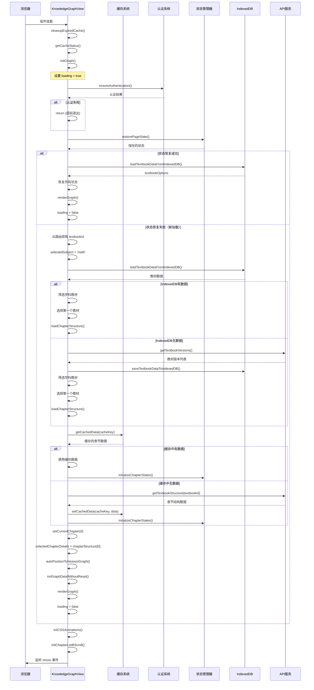

# KnowledgeGraphView 初始化逻辑分析

## 1. 概述

本文档详细分析 `KnowledgeGraphView.vue` 组件的初始化逻辑，包括组件挂载、数据加载、状态恢复等关键流程。

## 2. 初始化入口

### 2.1 onMounted 生命周期钩子

组件挂载时，`onMounted` 钩子（2401-2436行）会执行以下操作：

```2401:2436:imates-web/src/views/KnowledgeGraphView.vue
// 组件挂载时初始化
onMounted(async () => {
  // 清理过期的缓存数据
  cleanupExpiredCache()
  
  // 获取缓存状态信息
  getCacheStatus()
  
  
  initGraph()
  initCSSAnimations()
  
  // 输出角度分布总览
  nextTick(() => {
    logAngleDistribution()
  })
  
  // 初始化章节列表 BScroll
  await initChapterListBScroll()
  
  // 更新屏幕高度
  const updateScreenHeight = () => {
    screenHeight.value = window.innerHeight
  }
  
  window.addEventListener('resize', updateScreenHeight)
  
  // 清理函数
  onUnmounted(() => {
    window.removeEventListener('resize', updateScreenHeight)
    
    // 清理防抖定时器
    if (debounceTimer.value) {
      clearTimeout(debounceTimer.value)
    }
  })
})
```

### 2.2 初始化步骤说明

1. **清理过期缓存**：调用 `cleanupExpiredCache()` 清理 localStorage 中过期的章节结构缓存
2. **获取缓存状态**：调用 `getCacheStatus()` 获取缓存统计信息
3. **初始化图谱**：调用 `initGraph()` 执行核心初始化逻辑
4. **初始化CSS动画**：调用 `initCSSAnimations()` 初始化动画配置
5. **输出角度分布**：在 nextTick 中输出知识图谱的角度分布信息
6. **初始化滚动组件**：调用 `initChapterListBScroll()` 初始化章节列表的滚动功能
7. **监听窗口大小**：注册窗口大小变化监听器，用于响应式布局

## 3. 核心初始化流程：initGraph

`initGraph` 函数（1669-1748行）是初始化的核心逻辑：

```1669:1748:imates-web/src/views/KnowledgeGraphView.vue
// 第32步：初始化图谱
const initGraph = async () => {
  loading.value = true
  
  try {
    // 使用智能认证，只在必要时重新登录
    const authSuccess = await sessionManager.ensureAuthentication()
    
    if (!authSuccess) {
      return
    }
    
    // 第33步：优先尝试恢复保存的页面状态
    const stateRestored = await restorePageStateFromStore()
    
    if (stateRestored) {
      // 状态恢复成功，直接渲染图谱
      await nextTick()
      renderGraph()
      
      return
    }
    
    // 检查路由查询参数中是否有 textbookId
    const queryTextbookId = route.query.textbookId as string | undefined
    
    // 设置默认学科
    selectedSubject.value = 'math'
    
    // 根据科目加载教材数据
    await loadTextbookDataBySubject(selectedSubject.value)
    
    // 如果有教材数据，优先根据查询参数选择教材，否则选择第一个教材
    if (textbookOptions.value.length > 0) {
      let targetTextbook: TextbookOption | undefined
      
      // 如果路由查询参数中有 textbookId，尝试查找对应的教材
      if (queryTextbookId) {
        targetTextbook = textbookOptions.value.find(
          opt => opt.textbookId === queryTextbookId || opt.value.includes(queryTextbookId)
        )
      }
      
      // 如果没有找到，使用第一个教材
      if (!targetTextbook) {
        targetTextbook = textbookOptions.value[0]
      }
      
      selectedTextbook.value = targetTextbook.value
      
      // 第34步：加载选中教材的章节结构
      if (targetTextbook.textbookId && targetTextbook.textbookId !== 'default') {
        await loadChapterStructure(targetTextbook.textbookId)
        
        // 自动选择第一个章节
        if (chapterStructure.value.length > 0) {
          setCurrentChapter(0)
          selectedChapterDetails.value = chapterStructure.value[0]
          
          // 初始状态下自动展开位于targetAngle的图谱
          await nextTick()
          autoPositionToNearestGraph()
        }
      }
    }
    
    // 初始化图谱数据（但不重置已选择的章节）
    initGraphDataWithoutReset()
    
    // 这里可以集成真实的图谱库，如 vis.js, d3.js, cytoscape.js 等
    // 目前使用简单的DOM渲染
    await nextTick()
    renderGraph()
    
  } catch {
    // 图谱初始化失败，静默处理
  } finally {
    loading.value = false
  }
}
```

### 3.1 初始化流程步骤

#### 步骤1：设置加载状态
- 将 `loading.value` 设置为 `true`，显示加载状态

#### 步骤2：智能认证
- 调用 `sessionManager.ensureAuthentication()` 确保用户已认证
- 如果认证失败，直接返回，不继续初始化

#### 步骤3：尝试恢复页面状态
- 调用 `restorePageStateFromStore()` 尝试恢复之前保存的页面状态
- 如果恢复成功：
  - 等待 DOM 更新（nextTick）
  - 直接调用 `renderGraph()` 渲染图谱
  - 返回，跳过后续初始化步骤

#### 步骤4：检查路由参数
- 从路由查询参数中获取 `textbookId`（如果存在）

#### 步骤5：设置默认学科
- 将 `selectedSubject.value` 设置为 `'math'`（数学）

#### 步骤6：加载教材数据
- 调用 `loadTextbookDataBySubject(selectedSubject.value)` 根据学科加载教材列表
- 该函数会：
  - 优先从 IndexedDB 加载教材数据
  - 如果 IndexedDB 中没有数据，从 API 获取
  - 将 API 数据保存到 IndexedDB
  - 根据学科筛选教材选项
  - 如果存在教材，自动选择第一个并加载其章节结构

#### 步骤7：选择教材
- 如果路由参数中有 `textbookId`，优先查找对应的教材
- 如果没有找到或没有路由参数，使用第一个教材
- 设置 `selectedTextbook.value`

#### 步骤8：加载章节结构
- 如果教材 ID 有效（不是 'default'），调用 `loadChapterStructure(textbookId)`
- 加载成功后：
  - 自动选择第一个章节（索引 0）
  - 设置 `selectedChapterDetails.value`
  - 等待 DOM 更新后，调用 `autoPositionToNearestGraph()` 自动展开位于 targetAngle 的知识图谱

#### 步骤9：初始化图谱数据
- 调用 `initGraphDataWithoutReset()` 初始化图谱数据（不清除已选择的章节）

#### 步骤10：渲染图谱
- 等待 DOM 更新后，调用 `renderGraph()` 渲染图谱

#### 步骤11：完成初始化
- 在 `finally` 块中将 `loading.value` 设置为 `false`

## 4. 关键函数详解

### 4.1 restorePageStateFromStore

```1194:1239:imates-web/src/views/KnowledgeGraphView.vue
// 第30步：恢复页面状态
const restorePageStateFromStore = async (): Promise<boolean> => {
  try {
    const savedState = restorePageState()
    if (!savedState) {
      return false
    }
    
    // 恢复基本状态
    selectedSubject.value = savedState.selectedSubject
    selectedTextbook.value = savedState.selectedTextbook
    chapters.value = savedState.chapters
    chapterStructure.value = savedState.chapterStructure
    
    // 从IndexedDB重新加载textbookOptions
    const localOptions = await loadTextbookDataFromIndexedDB()
    if (localOptions.length > 0) {
      textbookOptions.value = localOptions
    }
    
    // 恢复章节状态
    if (savedState.selectedChapterIndex >= 0 && savedState.selectedChapterIndex < chapterStructure.value.length) {
      setCurrentChapter(savedState.selectedChapterIndex)
      selectedChapterDetails.value = savedState.selectedChapterDetails
      
      // 恢复展开的知识图谱状态
      if (savedState.selectedChapterDetails) {
        const subChapters = getSubChapters(savedState.selectedChapterDetails)
        if (subChapters.length > 0) {
          // 尝试恢复之前展开的图谱，如果不存在则自动展开位于targetAngle的图谱
          const previousExpandedGraph = getCurrentChapterExpandedGraph()
          if (previousExpandedGraph && subChapters.some(sub => sub.id === previousExpandedGraph)) {
            setCurrentChapterExpandedGraph(previousExpandedGraph)
          } else {
            // 如果没有之前保存的展开状态，自动展开位于targetAngle的图谱
            await nextTick()
            autoPositionToNearestGraph()
          }
        }
      }
    }
    
    return true
  } catch {
    return false
  }
}
```

**功能**：从状态管理器中恢复之前保存的页面状态，包括：
- 选中的学科和教材
- 章节列表和章节结构
- 当前选中的章节
- 展开的知识图谱状态

### 4.2 loadTextbookDataBySubject

```1400:1502:imates-web/src/views/KnowledgeGraphView.vue
// 根据学科筛选教材数据 - 使用IndexedDB
const loadTextbookDataBySubject = async (subjectValue: string) => {
  try {
    // 先尝试从IndexedDB加载
    const localOptions = await loadTextbookDataFromIndexedDB()
    
    if (localOptions.length > 0) {
      // 根据学科筛选教材选项
      const subjectMap: { [key: string]: string } = {
        'math': '数学',
        'chinese': '语文', 
        'english': '英语',
        'physics': '物理',
        'chemistry': '化学',
        'biology': '生物',
        'geography': '地理',
        'history': '历史',
        'politics': '政治'
      }
      
      const subjectLabel = subjectMap[subjectValue] || '数学'
      
      textbookOptions.value = localOptions.filter(option => option.subject === subjectLabel)
      
      // 设置默认选中的教材
      if (textbookOptions.value.length > 0) {
        selectedTextbook.value = textbookOptions.value[0].value
        
        // 加载默认教材的章节结构
        const defaultOption = textbookOptions.value[0]
        if (defaultOption.textbookId) {
          await loadChapterStructure(defaultOption.textbookId)
        }
      } else {
        textbookOptions.value = []
        selectedTextbook.value = ''
        // 清空章节数据
        chapterStructure.value = []
        chapters.value = []
        selectedChapterDetails.value = null
      }
      return
    }

    // IndexedDB中没有数据，从API获取
    const versions = await apiService.getTextbookVersions()
    
    if (versions && versions.length > 0) {
      const allOptions = apiService.convertToTextbookOptions(versions)
      
      // 将API数据保存到IndexedDB
      await saveTextbookDataToIndexedDB(versions)
      
      // 根据学科筛选教材选项
      const subjectMap: { [key: string]: string } = {
        'math': '数学',
        'chinese': '语文', 
        'english': '英语',
        'physics': '物理',
        'chemistry': '化学',
        'biology': '生物',
        'geography': '地理',
        'history': '历史',
        'politics': '政治'
      }
      
      const subjectLabel = subjectMap[subjectValue] || '数学'
      
      textbookOptions.value = allOptions.filter(option => option.subject === subjectLabel)
      
      // 设置默认选中的教材
      if (textbookOptions.value.length > 0) {
        selectedTextbook.value = textbookOptions.value[0].value
        
        // 加载默认教材的章节结构
        const defaultOption = textbookOptions.value[0]
        if (defaultOption.textbookId) {
          await loadChapterStructure(defaultOption.textbookId)
        }
      } else {
        textbookOptions.value = []
        selectedTextbook.value = ''
        // 清空章节数据
        chapterStructure.value = []
        chapters.value = []
        selectedChapterDetails.value = null
      }
    } else {
      textbookOptions.value = []
      // 清空章节数据
      chapterStructure.value = []
      chapters.value = []
      selectedChapterDetails.value = null
    }
  } catch (error) {
    console.error('[流程2] 加载教材列表出错:', error)
    textbookOptions.value = []
    // 清空章节数据
    chapterStructure.value = []
    chapters.value = []
    selectedChapterDetails.value = null
  }
}
```

**功能**：根据学科加载教材数据，优先使用 IndexedDB 缓存，如果缓存不存在则从 API 获取并保存到 IndexedDB。

### 4.3 loadChapterStructure

```1504:1548:imates-web/src/views/KnowledgeGraphView.vue
// 加载章节结构
const loadChapterStructure = async (textbookId: string) => {
  try {
    // 先尝试从缓存加载章节结构
    const cacheKey = `${CACHE_KEYS.CHAPTER_STRUCTURE}${textbookId}`
    
    const cachedChapterData = getCachedData(cacheKey)
    
    if (cachedChapterData) {
      // 直接使用后台返回的顺序，不进行排序
      chapterStructure.value = cachedChapterData
      
      // 提取章节名称列表（所有level=0的章节），并转换为中文数字
      chapters.value = cachedChapterData.map((chapter: { name: string }) => convertToChineseNumber(chapter.name))
      
      // 初始化所有章节的状态
      initializeChapterStates(textbookId, cachedChapterData, getSubChapters)
      return
    }

    // 缓存中没有数据，从API获取
    const chapterData = await apiService.getTextbookStructure(textbookId)
    
    if (chapterData && chapterData.length > 0) {
      // 直接使用后台返回的顺序，不进行排序
      chapterStructure.value = chapterData
      
      // 缓存章节结构数据
      setCachedData(cacheKey, chapterData)
      
      // 提取章节名称列表（所有level=0的章节），并转换为中文数字
      chapters.value = chapterData.map(chapter => convertToChineseNumber(chapter.name))
      
      // 初始化所有章节的状态
      initializeChapterStates(textbookId, chapterData, getSubChapters)
    } else {
      chapterStructure.value = []
      chapters.value = []
    }
  } catch (error) {
    console.error('[流程] ❌ 加载章节结构出错:', error)
    chapterStructure.value = []
    chapters.value = []
  }
}
```

**功能**：加载指定教材的章节结构，优先使用 localStorage 缓存（24小时有效），如果缓存不存在或过期则从 API 获取。

## 5. 初始化时序图



## 6. 数据流分析

### 6.1 状态恢复流程

```
保存的状态（State Manager）
    ↓
恢复基本状态（selectedSubject, selectedTextbook, chapters, chapterStructure）
    ↓
从 IndexedDB 重新加载 textbookOptions
    ↓
恢复章节状态（setCurrentChapter, selectedChapterDetails）
    ↓
恢复展开的知识图谱状态（setCurrentChapterExpandedGraph）
    ↓
渲染图谱（renderGraph）
```

### 6.2 新加载流程

```
默认学科（math）
    ↓
加载教材数据（loadTextbookDataBySubject）
    ├─→ IndexedDB（优先）
    └─→ API（如果 IndexedDB 无数据）
        └─→ 保存到 IndexedDB
    ↓
选择教材（优先路由参数，否则第一个）
    ↓
加载章节结构（loadChapterStructure）
    ├─→ localStorage 缓存（优先，24小时有效）
    └─→ API（如果缓存不存在或过期）
        └─→ 保存到缓存
    ↓
初始化章节状态（initializeChapterStates）
    ↓
选择第一个章节
    ↓
自动展开知识图谱（autoPositionToNearestGraph）
    ↓
渲染图谱（renderGraph）
```

## 7. 关键优化点

### 7.1 缓存策略

1. **章节结构缓存**：使用 localStorage 缓存章节结构，有效期 24 小时
2. **教材数据缓存**：使用 IndexedDB 持久化存储教材数据
3. **页面状态缓存**：使用状态管理器保存页面状态，支持快速恢复

### 7.2 性能优化

1. **优先使用缓存**：初始化时优先从缓存加载数据，减少 API 请求
2. **智能认证**：只在必要时重新登录，避免不必要的认证请求
3. **异步加载**：所有数据加载都使用异步方式，不阻塞 UI

### 7.3 用户体验优化

1. **状态恢复**：支持恢复之前的页面状态，包括选中的章节和展开的知识图谱
2. **自动定位**：初始化时自动展开位于 targetAngle 的知识图谱
3. **加载状态**：使用 loading 状态提示用户正在加载

## 8. 错误处理

### 8.1 认证失败

- 如果认证失败，直接返回，不继续初始化
- 用户需要重新登录

### 8.2 数据加载失败

- 所有数据加载都有 try-catch 保护
- 加载失败时，静默处理，清空相关数据
- 不会导致整个组件崩溃

### 8.3 状态恢复失败

- 如果状态恢复失败，会继续执行新加载流程
- 确保用户总能看到界面内容

## 9. 总结

KnowledgeGraphView 的初始化逻辑采用了以下设计：

1. **分层初始化**：先清理缓存，再初始化核心功能，最后初始化辅助功能
2. **状态优先**：优先尝试恢复保存的状态，提升用户体验
3. **缓存优先**：优先使用缓存数据，减少网络请求
4. **错误容错**：所有关键步骤都有错误处理，确保组件稳定运行
5. **异步加载**：所有数据加载都使用异步方式，不阻塞 UI 渲染

这种设计既保证了性能，又提升了用户体验，同时确保了组件的稳定性。
