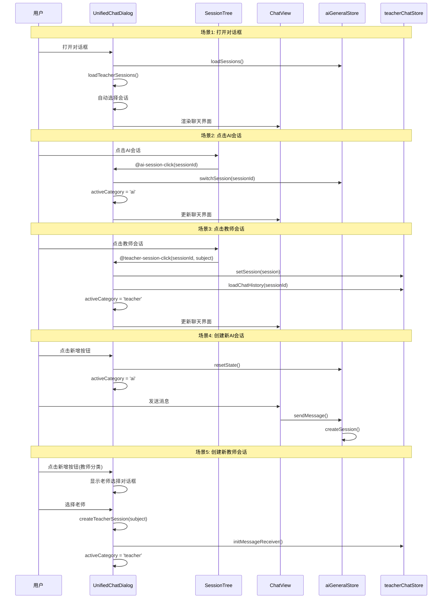

# UnifiedChatDialog.vue 时序图

本文档包含 UnifiedChatDialog.vue 组件各种功能的时序图，分为三个版本：简略版、详细版、极其详细版。

---

## 版本一：简略版

展示主要功能流程的核心步骤。



---

## 版本二：详细版

展示主要流程和关键步骤，包括状态管理和错误处理。

```mermaid
sequenceDiagram
    participant User as 用户
    participant UCD as UnifiedChatDialog
    participant ST as SessionTree
    participant CV as ChatView
    participant AIS as aiGeneralStore
    participant TCS as teacherChatStore
    participant LS as localStorage

    Note over User,LS: 场景1: 打开对话框并初始化
    User->>UCD: 设置 modelValue = true
    UCD->>UCD: localVisible = true
    UCD->>AIS: loadSessions()
    AIS-->>UCD: 返回会话列表
    UCD->>UCD: loadTeacherSessions()
    UCD->>LS: 遍历localStorage查找教师会话
    LS-->>UCD: 返回教师会话列表
    UCD->>UCD: 判断并选择会话
    alt 有当前AI会话
        UCD->>AIS: switchSession(currentSessionId)
        UCD->>UCD: activeCategory = 'ai'
    else 有AI会话列表
        UCD->>AIS: switchSession(firstSessionId)
        UCD->>UCD: activeCategory = 'ai'
    else 有教师会话
        UCD->>UCD: handleTeacherSessionClick()
        UCD->>UCD: activeCategory = 'teacher'
    else 无会话
        UCD->>UCD: activeCategory = 'ai'
    end
    UCD->>UCD: 启动定时刷新(5秒)
    UCD->>CV: 渲染对应类型的ChatView

    Note over User,LS: 场景2: 点击AI会话
    User->>ST: 点击AI会话节点
    ST->>UCD: @ai-session-click(sessionId)
    UCD->>UCD: handleAiSessionClick(sessionId)
    UCD->>AIS: switchSession(sessionId)
    AIS->>AIS: 查找会话
    AIS->>AIS: currentSession = session
    AIS->>AIS: loadChatHistory(sessionId)
    AIS-->>UCD: 完成切换
    UCD->>UCD: activeCategory = 'ai'
    UCD->>UCD: selectedSessionId computed更新
    UCD->>ST: 更新选中状态
    UCD->>CV: 渲染AI聊天界面

    Note over User,LS: 场景3: 点击教师会话
    User->>ST: 点击教师会话节点
    ST->>UCD: @teacher-session-click(sessionId, subject)
    UCD->>UCD: handleTeacherSessionClick(sessionId, subject)
    UCD->>UCD: teacherSessionId = sessionId
    UCD->>LS: 保存当前教师科目
    UCD->>TCS: setSession(session)
    UCD->>TCS: loadChatHistory(sessionId)
    TCS->>LS: 加载聊天历史
    TCS-->>UCD: 返回消息列表
    UCD->>UCD: activeCategory = 'teacher'
    UCD->>UCD: selectedSessionId computed更新
    UCD->>ST: 更新选中状态
    UCD->>CV: 渲染教师聊天界面(type="teacher")

    Note over User,LS: 场景4: 创建新AI会话
    User->>UCD: 点击新增按钮(AI分类)
    UCD->>UCD: handleAiNewChatClick()
    alt canCreateSession = false
        UCD->>User: 显示提示"请先在当前会话中发送消息"
    else canCreateSession = true
        UCD->>AIS: resetState()
        AIS->>AIS: 清空消息和会话状态
        UCD->>UCD: activeCategory = 'ai'
        User->>CV: 输入并发送消息
        CV->>AIS: sendMessage(content)
        AIS->>AIS: createSession(firstMessage)
        AIS->>AIS: 生成新会话ID和名称
        AIS->>AIS: 添加到会话列表
        AIS->>LS: 保存会话列表
    end

    Note over User,LS: 场景5: 创建新教师会话
    User->>ST: 选中教师分类节点
    User->>UCD: 点击新增按钮(教师分类)
    UCD->>UCD: handleAiNewChatClick()
    UCD->>TCS: getAvailableTeachers()
    TCS-->>UCD: 返回可用老师列表
    alt 无可用老师
        UCD->>User: 显示提示"所有老师都有对话记录"
    else 有可用老师
        UCD->>UCD: 显示老师选择对话框
        User->>UCD: 选择老师(subject)
        UCD->>UCD: handleTeacherSelect(subject)
        UCD->>UCD: handleTeacherNewChat(subject)
        UCD->>UCD: createTeacherSession(subject)
        UCD->>TCS: clearSession()
        UCD->>UCD: 获取用户信息
        UCD->>UCD: 生成新会话ID
        UCD->>LS: 保存会话数据
        UCD->>UCD: teacherSessionId = newSessionId
        UCD->>TCS: initMessageReceiver()
        UCD->>UCD: loadTeacherSessions()
        UCD->>UCD: activeCategory = 'teacher'
        UCD->>UCD: emit('session-created')
    end

    Note over User,LS: 场景6: 删除会话
    User->>ST: 点击删除按钮
    alt 删除AI会话
        ST->>UCD: @ai-session-delete(sessionId)
        UCD->>AIS: deleteSession(sessionId)
        AIS->>LS: 删除会话数据
        alt 删除的是当前会话
            UCD->>UCD: activeCategory = 'ai'
        end
    else 删除教师会话
        ST->>UCD: @teacher-session-delete(sessionId)
        UCD->>LS: 删除会话数据
        UCD->>TCS: clearChatHistory(sessionId)
        UCD->>UCD: loadTeacherSessions()
        alt 删除的是当前会话
            UCD->>UCD: teacherSessionId = ''
            UCD->>TCS: clearSession()
            UCD->>UCD: activeCategory = 'ai'
        end
    end
    UCD->>User: 显示"删除成功"

    Note over User,LS: 场景7: 转发到教师对话
    User->>CV: 点击转发按钮
    CV->>UCD: @open-teacher-dialog({sessionId})
    UCD->>UCD: handleOpenTeacherDialog({sessionId})
    UCD->>UCD: loadTeacherSessions() (如果未加载)
    UCD->>UCD: setTeacherSession(sessionId)
    UCD->>TCS: setSession(session)
    UCD->>LS: 保存当前教师科目
    UCD->>UCD: activeCategory = 'teacher'
    UCD->>ST: 更新选中状态
    UCD->>CV: 切换到教师聊天界面
```



---

## 版本三：极其详细版

展示所有细节，包括所有方法调用、状态变化、错误处理、定时刷新等。

```mermaid
sequenceDiagram
    participant User as 用户
    participant UCD as UnifiedChatDialog
    participant ST as SessionTree
    participant CV as ChatView
    participant AIS as aiGeneralStore
    participant TCS as teacherChatStore
    participant LS as localStorage
    participant API as API服务
    participant Timer as 定时器

    Note over User,Timer: 场景1: 打开对话框并初始化（极其详细）
    User->>UCD: 设置 props.modelValue = true
    UCD->>UCD: localVisible computed get() 返回 true
    UCD->>UCD: watch(localVisible) 触发
    UCD->>AIS: loadSessions()
    AIS->>LS: 从localStorage读取会话列表
    LS-->>AIS: 返回会话数据
    AIS->>AIS: sessions.value = 解析后的会话列表
    AIS->>AIS: 按updateTime排序
    AIS-->>UCD: 返回会话列表
    UCD->>UCD: loadTeacherSessions()
    UCD->>UCD: getCurrentUserIdOrDefault()
    UCD->>UCD: 构建sessionPrefix = "userId_teacher_chat_"
    UCD->>LS: 遍历localStorage所有key
    loop 遍历每个key
        alt key匹配sessionPrefix且以"_session"结尾
            UCD->>LS: getItem(key)
            LS-->>UCD: 返回会话数据JSON
            UCD->>UCD: JSON.parse(sessionData)
            alt 会话数据无效
                UCD->>UCD: console.warn跳过
            else 会话ID重复
                UCD->>UCD: console.warn跳过
                UCD->>LS: removeItem(错误的key)
            else 键名与sessionId不匹配
                UCD->>LS: removeItem(错误的key)
                UCD->>LS: setItem(正确的key, sessionData)
            else 数据有效
                UCD->>UCD: sessions.push(session)
                UCD->>UCD: sessionIds.add(sessionId)
            end
        end
    end
    UCD->>UCD: sessions.sort((a,b) => b.createTime - a.createTime)
    UCD->>UCD: teacherSessions.value = sessions
    UCD->>UCD: await nextTick()
    UCD->>UCD: 判断并选择会话
    alt aiGeneralStore.currentSession?.sessionId 存在
        UCD->>UCD: activeCategory.value = 'ai'
        UCD->>AIS: switchSession(currentSessionId)
        AIS->>AIS: 查找会话
        AIS->>AIS: currentSession.value = session
        AIS->>AIS: loadChatHistory(sessionId)
        AIS->>LS: 读取聊天历史
        AIS->>AIS: messages.value = 解析后的消息列表
    else aiGeneralStore.sessions.length > 0
        UCD->>UCD: activeCategory.value = 'ai'
        UCD->>AIS: switchSession(firstSessionId)
        AIS->>AIS: 查找会话
        AIS->>AIS: currentSession.value = session
        AIS->>AIS: loadChatHistory(sessionId)
    else teacherSessionId.value 存在且 teacherSessions.length > 0
        UCD->>UCD: 查找会话
        UCD->>UCD: handleTeacherSessionClick(sessionId, subject)
        UCD->>UCD: teacherSessionId.value = sessionId
        UCD->>LS: setItem('currentTeacherSubject', storeSubject)
        UCD->>TCS: setSession(session)
        UCD->>TCS: loadChatHistory(sessionId)
        UCD->>UCD: activeCategory.value = 'teacher'
    else teacherSessions.length > 0
        UCD->>UCD: handleTeacherSessionClick(firstSessionId, subject)
        UCD->>UCD: activeCategory.value = 'teacher'
    else 无会话
        UCD->>UCD: activeCategory.value = 'ai'
    end
    UCD->>UCD: refreshTimer = setInterval(() => loadTeacherSessions(), 5000)
    UCD->>ST: 传递会话列表和selectedSessionId
    UCD->>CV: 根据activeCategory渲染对应ChatView
    CV->>CV: 初始化聊天界面

    Note over User,Timer: 场景2: 点击AI会话（极其详细）
    User->>ST: 点击AI会话节点
    ST->>ST: handleSessionClick(node)
    ST->>ST: 检查node.level === 2
    ST->>ST: 检查node.category === 'ai'
    ST->>UCD: emit('ai-session-click', sessionId)
    UCD->>UCD: handleAiSessionClick(sessionId)
    UCD->>UCD: console.log('handleAiSessionClick', sessionId)
    UCD->>AIS: switchSession(sessionId)
    AIS->>AIS: 查找会话 sessions.value.find(s => s.sessionId === sessionId)
    alt 会话不存在
        AIS->>AIS: console.warn('会话不存在')
        AIS-->>UCD: 返回
    else 会话存在
        AIS->>AIS: currentSession.value = session
        AIS->>AIS: loadChatHistory(sessionId)
        AIS->>LS: 读取聊天历史数据
        AIS->>AIS: 解析消息列表
        AIS->>AIS: messages.value = 解析后的消息
        AIS-->>UCD: 完成切换
    end
    UCD->>UCD: activeCategory.value = 'ai'
    UCD->>UCD: selectedSessionId computed 自动更新
    UCD->>ST: 通过props.selectedSessionId更新选中状态
    ST->>ST: isSelectedNode() 检查选中状态
    ST->>ST: 更新q-tree的selected属性
    UCD->>CV: 重新渲染ChatView(type="ai-general")
    CV->>CV: 加载并显示消息列表

    Note over User,Timer: 场景3: 点击教师会话（极其详细）
    User->>ST: 点击教师会话节点
    ST->>ST: handleSessionClick(node)
    ST->>ST: 检查node.level === 2
    ST->>ST: 检查node.category === 'biology' || 'math'
    ST->>UCD: emit('teacher-session-click', sessionId, subject)
    UCD->>UCD: handleTeacherSessionClick(sessionId, subject)
    UCD->>UCD: console.log('handleTeacherSessionClick', sessionId, subject)
    UCD->>UCD: 查找会话 teacherSessions.value.find(s => s.sessionId === sessionId)
    alt 会话不存在
        UCD->>UCD: return
    else 会话存在
        UCD->>UCD: teacherSessionId.value = session.sessionId
        UCD->>UCD: getCurrentUserIdOrDefault()
        UCD->>UCD: storeSubject = subject === 'biology' ? 'BIOLOGY' : 'MATH'
        UCD->>LS: setItem('userId_currentTeacherSubject', storeSubject)
        UCD->>TCS: setSession(session)
        TCS->>TCS: currentSession.value = session
        TCS->>TCS: currentSubject.value = session.subject
        UCD->>TCS: loadChatHistory(session.sessionId)
        TCS->>LS: 读取聊天历史数据
        TCS->>TCS: 解析消息列表
        TCS->>TCS: messages.value = 解析后的消息
        TCS-->>UCD: 完成加载
    end
    UCD->>UCD: activeCategory.value = 'teacher'
    UCD->>UCD: selectedSessionId computed 自动更新
    UCD->>ST: 通过props.selectedSessionId更新选中状态
    UCD->>CV: 重新渲染ChatView(type="teacher", :session-id="teacherSessionId")
    CV->>CV: 加载并显示消息列表

    Note over User,Timer: 场景4: 创建新AI会话（极其详细）
    User->>ST: 选中AI分类节点
    User->>UCD: 点击新增按钮
    UCD->>UCD: handleAiNewChatClick()
    UCD->>ST: getSelectedCategory()
    ST-->>UCD: 返回'ai'或undefined
    alt selectedCategory === 'biology' || 'math'
        UCD->>TCS: getAvailableTeachers()
        TCS->>TCS: 检查哪些老师还没有会话
        TCS-->>UCD: 返回可用老师列表
        alt availableTeachers.length === 0
            UCD->>User: showMessage('所有老师都有对话记录', 'info')
            UCD->>UCD: return
        else availableTeachers.length > 0
            UCD->>UCD: availableTeachers.value = 可用老师列表
            UCD->>UCD: showTeacherSelectDialog.value = true
            Note over User,Timer: 显示老师选择对话框
        end
    else selectedCategory !== 'biology' && 'math'
        UCD->>UCD: 检查 canCreateSession
        UCD->>AIS: canCreateSession computed
        AIS->>AIS: 检查 isCreatingSession
        AIS->>AIS: 检查 currentSession 和 messages
        AIS-->>UCD: 返回canCreateSession值
        alt !canCreateSession
            alt !isCreatingSession
                UCD->>User: showMessage('请先在当前会话中发送消息', 'warning')
            end
            UCD->>UCD: return
        else canCreateSession
            UCD->>AIS: resetState()
            AIS->>AIS: currentSession.value = null
            AIS->>AIS: messages.value = []
            UCD->>UCD: activeCategory.value = 'ai'
            User->>CV: 输入消息内容
            User->>CV: 点击发送按钮
            CV->>CV: sendMessage()
            CV->>CV: 检查输入是否为空
            CV->>CV: 检查isLoading状态
            CV->>CV: 检查编辑模式
            CV->>CV: 检查是否需要选择题目
            CV->>AIS: sendMessage(content, options)
            AIS->>AIS: 检查是否需要创建会话
            AIS->>AIS: canCreateSession检查
            alt 需要创建会话
                AIS->>AIS: createSession(firstMessage)
                AIS->>AIS: 检查canCreateSession
                AIS->>AIS: isCreatingSession.value = true
                AIS->>AIS: 生成sessionId = "session_${Date.now()}_${random}"
                AIS->>AIS: 生成sessionName = firstMessage截取前20字符
                AIS->>AIS: 创建newSession对象
                AIS->>AIS: sessions.value.unshift(newSession)
                AIS->>AIS: currentSession.value = newSession
                AIS->>AIS: messages.value = []
                AIS->>LS: saveSessions()
                AIS->>LS: 保存会话列表到localStorage
                AIS->>AIS: setTimeout(() => isCreatingSession.value = false, 500)
            end
            AIS->>AIS: 创建用户消息
            AIS->>AIS: addMessageToStore(userMessage)
            AIS->>API: 发送消息到后端
            API-->>AIS: 返回AI回复
            AIS->>AIS: 创建AI回复消息
            AIS->>AIS: addMessageToStore(aiReply)
            AIS->>AIS: saveChatHistory()
            AIS->>LS: 保存聊天历史
        end
    end

    Note over User,Timer: 场景5: 创建新教师会话（极其详细）
    User->>ST: 选中教师分类节点
    User->>UCD: 点击新增按钮
    UCD->>UCD: handleAiNewChatClick()
    UCD->>ST: getSelectedCategory()
    ST-->>UCD: 返回'biology'或'math'
    UCD->>TCS: getAvailableTeachers()
    TCS->>TCS: 检查哪些老师还没有会话
    TCS-->>UCD: 返回可用老师列表
    alt availableTeachers.length === 0
        UCD->>User: showMessage('所有老师都有对话记录', 'info')
    else availableTeachers.length > 0
        UCD->>UCD: availableTeachers.value = 可用老师列表
        UCD->>UCD: showTeacherSelectDialog.value = true
        User->>UCD: 在对话框中选择老师
        UCD->>UCD: handleTeacherSelect(subject)
        UCD->>UCD: showTeacherSelectDialog.value = false
        UCD->>UCD: handleTeacherNewChat(subject)
        UCD->>UCD: createTeacherSession(subject)
        UCD->>TCS: clearSession()
        TCS->>TCS: currentSession.value = null
        TCS->>TCS: messages.value = []
        UCD->>UCD: userStore.userInfo
        alt !userInfo.id
            UCD->>User: showMessage('无法获取用户信息，请重新登录', 'error')
            UCD->>UCD: return
        else userInfo.id存在
            UCD->>UCD: getCurrentUserIdOrDefault()
            UCD->>UCD: storeSubject = subject === 'biology' ? 'BIOLOGY' : 'MATH'
            UCD->>LS: setItem('userId_currentTeacherSubject', storeSubject)
            UCD->>UCD: newSessionId = "teacher-${Date.now()}"
            UCD->>UCD: newSession = {sessionId, sessionName, subject, createTime}
            UCD->>LS: setItem('teacher_chat_${newSessionId}_session', JSON.stringify(newSession))
            UCD->>UCD: teacherSessionId.value = newSessionId
            UCD->>TCS: initMessageReceiver()
            TCS->>TCS: 初始化消息接收器
            TCS->>API: 建立WebSocket连接(如果需要)
            UCD->>UCD: loadTeacherSessions()
            UCD->>UCD: emit('session-created', newSessionId, 'teacher')
            UCD->>UCD: activeCategory.value = 'teacher'
            UCD->>ST: 更新会话列表
            UCD->>CV: 切换到教师聊天界面
        end
    end

    Note over User,Timer: 场景6: 删除AI会话（极其详细）
    User->>ST: 点击会话菜单按钮
    ST->>ST: 显示菜单
    User->>ST: 点击删除选项
    ST->>ST: handleDelete(node)
    ST->>UCD: emit('ai-session-delete', sessionId)
    UCD->>UCD: handleAiSessionDelete(sessionId)
    UCD->>UCD: try块开始
    UCD->>AIS: deleteSession(sessionId)
    AIS->>AIS: 查找会话索引
    AIS->>AIS: sessions.value.splice(index, 1)
    alt 删除的是当前会话
        AIS->>AIS: currentSession.value = null
        AIS->>AIS: messages.value = []
    end
    AIS->>LS: saveSessions()
    AIS->>LS: 删除会话数据
    AIS-->>UCD: 完成删除
    alt aiGeneralStore.currentSession?.sessionId === sessionId
        UCD->>UCD: activeCategory.value = 'ai'
    end
    UCD->>User: showMessage('删除成功', 'success')
    alt catch error
        UCD->>UCD: console.error('删除失败:', error)
        UCD->>User: showMessage('删除失败', 'error')
    end

    Note over User,Timer: 场景7: 删除教师会话（极其详细）
    User->>ST: 点击会话菜单按钮
    ST->>ST: 显示菜单
    User->>ST: 点击删除选项
    ST->>ST: handleDelete(node)
    ST->>UCD: emit('teacher-session-delete', sessionId)
    UCD->>UCD: handleTeacherSessionDelete(sessionId)
    UCD->>UCD: try块开始
    UCD->>UCD: getCurrentUserIdOrDefault()
    UCD->>UCD: sessionPrefix = "userId_teacher_chat_"
    UCD->>LS: removeItem("${sessionPrefix}${sessionId}_session")
    UCD->>TCS: clearChatHistory(sessionId)
    TCS->>LS: 删除聊天历史数据
    TCS-->>UCD: 完成清除
    UCD->>UCD: loadTeacherSessions()
    UCD->>UCD: 重新加载会话列表
    alt teacherSessionId.value === sessionId
        UCD->>UCD: teacherSessionId.value = ''
        UCD->>TCS: clearSession()
        TCS->>TCS: currentSession.value = null
        TCS->>TCS: messages.value = []
        UCD->>UCD: activeCategory.value = 'ai'
    end
    UCD->>User: showMessage('会话已删除', 'success')
    alt catch error
        UCD->>UCD: console.error('删除会话失败:', error)
        UCD->>User: showMessage('删除失败，请重试', 'error')
    end

    Note over User,Timer: 场景8: 重命名AI会话（极其详细）
    User->>ST: 点击会话菜单按钮
    ST->>ST: 显示菜单
    User->>ST: 点击重命名选项
    ST->>ST: handleRename(node)
    ST->>ST: currentSessionNode.value = {sessionId, label}
    ST->>ST: newSessionName.value = node.label
    ST->>ST: showRenameDialog.value = true
    User->>ST: 输入新名称
    User->>ST: 点击确认
    ST->>ST: handleRenameConfirm()
    ST->>UCD: emit('ai-session-rename', sessionId, newName)
    UCD->>UCD: handleAiSessionRename(sessionId, newName)
    UCD->>UCD: try块开始
    UCD->>AIS: renameSession(sessionId, newName)
    AIS->>AIS: 查找会话
    AIS->>AIS: session.sessionName = newName
    AIS->>AIS: session.updateTime = Date.now()
    AIS->>LS: saveSessions()
    AIS-->>UCD: 完成重命名
    UCD->>UCD: 查找会话索引
    UCD->>UCD: aiGeneralStore.sessions[index].sessionName = newName
    UCD->>AIS: saveSessions()
    AIS->>LS: 保存会话列表
    alt catch error
        UCD->>UCD: console.error('重命名失败:', error)
    end

    Note over User,Timer: 场景9: 置顶AI会话（极其详细）
    User->>ST: 点击会话菜单按钮
    ST->>ST: 显示菜单
    User->>ST: 点击置顶/取消置顶选项
    ST->>ST: handlePin(node)
    ST->>UCD: emit('ai-session-pin', sessionId)
    UCD->>UCD: handleAiSessionPin(sessionId)
    UCD->>UCD: try块开始
    UCD->>AIS: togglePin(sessionId)
    AIS->>AIS: 查找会话
    AIS->>AIS: session.pinned = !session.pinned
    AIS->>AIS: session.updateTime = Date.now()
    AIS->>LS: saveSessions()
    AIS-->>UCD: 完成置顶
    alt catch error
        UCD->>UCD: console.error('置顶操作失败:', error)
        UCD->>User: showMessage('操作失败', 'error')
    end

    Note over User,Timer: 场景10: 转发到教师对话（极其详细）
    User->>CV: 选择消息
    User->>CV: 点击转发按钮
    CV->>CV: 显示转发选项
    User->>CV: 选择转发到教师对话
    CV->>UCD: emit('open-teacher-dialog', {sessionId})
    UCD->>UCD: handleOpenTeacherDialog({sessionId})
    UCD->>UCD: try块开始
    alt teacherSessions.value.length === 0
        UCD->>UCD: loadTeacherSessions()
        UCD->>LS: 遍历localStorage查找教师会话
        UCD->>UCD: 更新teacherSessions.value
    end
    UCD->>UCD: setTeacherSession(sessionId)
    UCD->>UCD: teacherSessionId.value = sessionId
    UCD->>UCD: 查找会话 teacherSessions.value.find(s => s.sessionId === sessionId)
    alt 会话存在
        UCD->>TCS: setSession(session)
        TCS->>TCS: currentSession.value = session
        TCS->>TCS: currentSubject.value = session.subject
        UCD->>UCD: getCurrentUserIdOrDefault()
        UCD->>UCD: storeSubject = session.subject === 'biology' ? 'BIOLOGY' : 'MATH'
        UCD->>LS: setItem('userId_currentTeacherSubject', storeSubject)
    end
    UCD->>UCD: activeCategory.value = 'teacher'
    UCD->>UCD: selectedSessionId computed自动更新
    UCD->>ST: 通过props.selectedSessionId更新选中状态
    UCD->>CV: 切换到教师聊天界面
    alt catch error
        UCD->>UCD: console.error('设置老师会话失败:', error)
        UCD->>User: showMessage('设置老师会话失败', 'error')
    end

    Note over User,Timer: 场景11: 批量转发到教师对话（极其详细）
    User->>CV: 进入选择模式
    User->>CV: 选择多条消息
    User->>CV: 点击批量转发
    CV->>CV: 执行批量转发逻辑
    CV->>API: 批量发送消息到教师
    API-->>CV: 返回转发结果
    CV->>UCD: emit('switch-to-teacher', forwardData)
    UCD->>UCD: handleSwitchToTeacher(forwardData)
    alt !forwardData?.sessionId
        UCD->>UCD: return
    else forwardData.sessionId存在
        UCD->>UCD: try块开始
        alt teacherSessions.value.length === 0
            UCD->>UCD: loadTeacherSessions()
        end
        UCD->>UCD: setTeacherSession(forwardData.sessionId)
        UCD->>UCD: activeCategory.value = 'teacher'
        alt catch error
            UCD->>UCD: console.error('设置老师会话失败:', error)
            UCD->>User: showMessage('设置老师会话失败', 'error')
        end
    end

    Note over User,Timer: 场景12: 定时刷新教师会话列表（极其详细）
    UCD->>Timer: setInterval(() => loadTeacherSessions(), 5000)
    loop 每5秒执行一次
        Timer->>UCD: 触发定时器回调
        UCD->>UCD: loadTeacherSessions()
        UCD->>LS: 重新遍历localStorage
        UCD->>UCD: 更新teacherSessions.value
        UCD->>ST: 通过props更新会话列表
        ST->>ST: 重新构建树形结构
    end
    alt 对话框关闭
        UCD->>Timer: clearInterval(refreshTimer)
        Timer->>UCD: 停止定时器
    end

    Note over User,Timer: 场景13: 关闭对话框（极其详细）
    User->>UCD: 设置 modelValue = false
    UCD->>UCD: localVisible computed set() 触发
    UCD->>UCD: emit('update:modelValue', false)
    UCD->>UCD: watch(localVisible) 触发
    alt refreshTimer存在
        UCD->>Timer: clearInterval(refreshTimer)
        Timer->>UCD: 停止定时器
        UCD->>UCD: refreshTimer = null
    end
    alt teacherSessionId.value存在
        UCD->>TCS: cleanupMessageReceiver()
        TCS->>TCS: 清理消息接收器
        TCS->>API: 关闭WebSocket连接(如果有)
    end

    Note over User,Timer: 场景14: 监听会话恢复事件（极其详细）
    Note over User,Timer: 组件挂载时
    UCD->>UCD: onMounted()
    UCD->>UCD: 定义handleSessionRestored函数
    UCD->>UCD: window.addEventListener('teacher-session-restored', handleSessionRestored)
    Note over User,Timer: 当其他组件触发事件时
    OtherComponent->>Window: dispatchEvent('teacher-session-restored')
    Window->>UCD: 触发handleSessionRestored
    UCD->>UCD: loadTeacherSessions()
    UCD->>LS: 重新加载会话列表
    UCD->>ST: 更新会话列表显示
    Note over User,Timer: 组件卸载时
    UCD->>UCD: onUnmounted()
    UCD->>UCD: window.removeEventListener('teacher-session-restored', handleSessionRestored)
```

---

## 总结

- **简略版**：适合快速了解主要功能流程
- **详细版**：适合理解关键步骤和状态管理
- **极其详细版**：适合深入理解所有细节和实现逻辑

每个版本都使用 `Note over` 分割不同的场景和阶段，便于阅读和理解。


