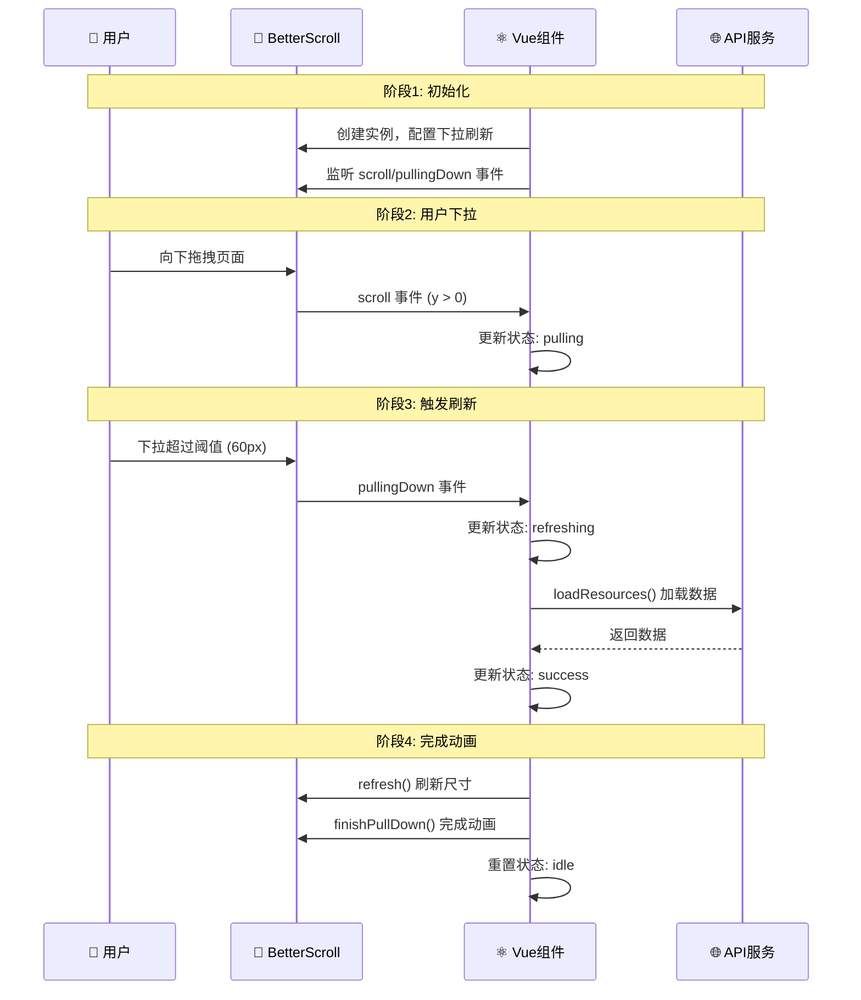
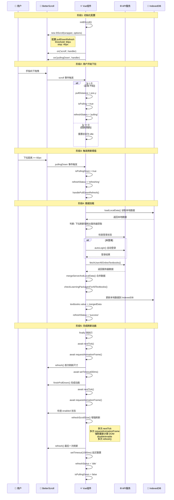

# 下拉刷新时序图

> 完整呈现下拉刷新流程的可视化时序图，分为三个版本：简略版、详细版、极其详细版

---

## 📊 版本1：简略版

**适用场景**：快速了解下拉刷新的核心流程

---

## 📊 版本2：详细版

**适用场景**：理解下拉刷新的完整流程和关键步骤

---

## 📊 版本3：极其详细版

**适用场景**：深入理解每个细节，包括错误处理、状态监控、DOM 更新时序等

```mermaid
sequenceDiagram
    participant User as 👤 用户
    participant BScroll as 🔄 BetterScroll
    participant Vue as ⚛️ Vue组件
    participant Reactive as 📡 响应式系统
    participant DOM as 🖼️ DOM渲染
    participant API as 🌐 API服务
    participant DB as 💾 IndexedDB
    participant Browser as 🌐 浏览器

    Note over User,Browser: 阶段1: 组件初始化
    Vue->>Vue: onMounted() 生命周期
    Vue->>DOM: await nextTick() 等待 DOM 挂载
    DOM-->>Vue: DOM 已挂载
    Vue->>Vue: initBScroll() 开始初始化
    Vue->>Vue: 检查 scrollWrapper.value 是否存在
    alt scrollWrapper 不存在
        Vue->>Vue: console.warn('scrollWrapper 不存在')
        Note right of Vue: 初始化失败
    else scrollWrapper 存在
        Vue->>BScroll: new BScroll(wrapper, options)
        Note right of BScroll: 配置项:<br/>- scrollY: true<br/>- pullDownRefresh: {<br/>    threshold: 60,<br/>    stop: 40<br/>  }<br/>- probeType: 2<br/>- bounce: {top: true}
        BScroll-->>Vue: BScroll 实例创建成功
        Vue->>Vue: 记录初始状态<br/>(initialY, initialMaxScrollY)
        Vue->>BScroll: on('scroll', scrollHandler)
        Note right of Vue: scrollHandler 逻辑:<br/>if (pos.y > 0 && status !== refreshing) {<br/>  pullDistance = pos.y<br/>  isPulling = true<br/>  refreshStatus = 'pulling'<br/>}
        Vue->>BScroll: on('pullingDown', pullingDownHandler)
        Note right of Vue: pullingDownHandler 逻辑:<br/>isPullingDown = true<br/>refreshStatus = 'refreshing'<br/>await handlePullDownRefresh()
        Vue->>Vue: console.log('下拉刷新事件监听器已注册')
    end

    Note over User,Browser: 阶段2: 用户开始下拉操作
    User->>BScroll: 手指按下，开始拖拽
    Browser->>BScroll: touchstart 事件
    User->>BScroll: 手指向下移动
    Browser->>BScroll: touchmove 事件
    BScroll->>BScroll: 计算滚动位置 y
    alt y > 0 (向下滚动超过顶部)
        BScroll->>Vue: scroll 事件触发<br/>{x: 0, y: posY}
        Vue->>Vue: 检查状态<br/>if (refreshStatus !== 'refreshing')
        Vue->>Reactive: pullDistance.value = pos.y
        Reactive->>DOM: 触发响应式更新
        Vue->>Reactive: isPulling.value = true
        Vue->>Reactive: refreshStatus.value = 'pulling'
        Vue->>Vue: console.log('滚动事件 - 下拉中', {...})
        Note right of Vue: 状态更新:<br/>- pullDistance: 实时更新<br/>- isPulling: true<br/>- refreshStatus: 'pulling'
    else y <= 0 (回到顶部或向上滚动)
        BScroll->>Vue: scroll 事件触发<br/>{x: 0, y: posY}
        Vue->>Reactive: pullDistance.value = 0
        Vue->>Reactive: isPulling.value = false
        Vue->>Reactive: refreshStatus.value = 'idle'
        Vue->>Vue: console.log('滚动事件 - 回到顶部')
    end

    Note over User,Browser: 阶段3: 达到刷新阈值
    User->>BScroll: 继续下拉，y >= 60px
    BScroll->>BScroll: 检查 pullDownRefresh.threshold
    BScroll->>BScroll: 触发 pullingDown 事件
    BScroll->>Vue: pullingDown 事件触发
    Vue->>Vue: 记录当前状态<br/>(currentPos, maxScrollY, isPullingDown)
    Vue->>Vue: console.log('========== pullingDown 事件触发 ==========')
    Vue->>Reactive: isPullingDown.value = true
    Reactive->>DOM: 触发响应式更新
    Vue->>Reactive: isPulling.value = false
    Vue->>Reactive: refreshStatus.value = 'refreshing'
    Vue->>Vue: console.log('状态已更新，准备调用 handlePullDownRefresh')
    Vue->>Vue: await handlePullDownRefresh()

    Note over User,Browser: 阶段4: 处理下拉刷新 - 开始
    Vue->>Vue: handlePullDownRefresh() 开始执行
    Vue->>Vue: refreshStartTime = Date.now()
    Vue->>Vue: 双重检查状态<br/>if (!isPullingDown.value) {<br/>  isPullingDown = true<br/>  refreshStatus = 'refreshing'<br/>}
    Vue->>Vue: collectRefreshStates() 收集所有状态
    Vue->>Vue: console.log('========== 下拉刷新开始 ==========')

    Note over User,Browser: 阶段5: 数据加载流程
    Vue->>Vue: await loadResources()
    Vue->>Vue: loadStartTime = Date.now()
    Vue->>Vue: isPullDownRefresh = isPullingDown.value (true)
    Vue->>Vue: initialLoadCompleted.value = false
    Vue->>Vue: console.log('loadResources 开始', {...})

    Note over User,DB: 5.1: 加载本地数据
    Vue->>Vue: await loadLocalData()
    Vue->>DB: indexedDB.open('textbooks')
    DB-->>Vue: 返回数据库对象
    Vue->>DB: transaction('textbooks', 'readonly')
    DB-->>Vue: 返回事务对象
    Vue->>DB: objectStore.getAll()
    DB-->>Vue: 返回本地教材数组
    Vue->>Vue: console.log('本地数据加载完成', {count: localTextbooks.length})

    Note over User,DB: 5.2: 判断是否需要从服务器获取
    Vue->>Vue: if (localTextbooks.length > 0 && !isPullDownRefresh)
    alt 有本地数据且不是下拉刷新
        Vue->>Reactive: textbooks.value = localTextbooks
        Reactive->>DOM: 触发响应式更新
        Vue->>Vue: updateSubjectChips()
        Vue->>Reactive: initialLoadCompleted.value = true
        Vue->>Vue: await nextTick()
        Vue->>Vue: fixInconsistentDownloadStatus()
        Note right of Vue: 使用本地数据，<br/>不进行服务器同步
    else 无本地数据或下拉刷新
        Vue->>Reactive: loading.value = true
        Reactive->>DOM: 显示加载状态

        Note over User,DB: 5.2.1: 检查登录状态
        Vue->>API: resourceManager.isLoggedIn()
        API-->>Vue: 返回登录状态
        alt 未登录
            Vue->>API: apiService.autoLogin(true)
            API->>API: 检查本地 token
            alt token 有效
                API-->>Vue: 返回 true
            else token 无效或过期
                API->>API: 尝试刷新 token
                alt 刷新成功
                    API-->>Vue: 返回 true
                else 刷新失败
                    API-->>Vue: 返回 false
                    Vue->>Reactive: textbooks.value = []
                    Vue->>Reactive: initialLoadCompleted.value = true
                    Note right of Vue: 加载失败，<br/>返回空列表
                end
            end
        end

        Note over User,DB: 5.2.2: 获取服务器数据
        Vue->>API: fetchUserAllOnlineTextbooks()
        API->>API: 构建请求 URL
        API->>API: 发送 HTTP GET 请求
        API->>API: 等待服务器响应
        alt 请求成功 (200)
            API-->>Vue: 返回教材数组
            Vue->>Vue: console.log('服务器教材数据获取完成')
        else 请求失败 (4xx/5xx)
            API-->>Vue: 抛出错误
            Vue->>Vue: catch 块捕获错误
            Vue->>Reactive: textbooks.value = []
            Vue->>Vue: showMessage('加载资源失败', 'error')
        end

        Note over User,DB: 5.2.3: 合并数据
        Vue->>Vue: mergeServerAndLocalData(serverTextbooks, localTextbooks)
        Note right of Vue: 合并逻辑:<br/>1. 以服务器数据为主<br/>2. 合并本地下载状态<br/>3. 合并本地文件路径<br/>4. 去重处理
        Vue->>Vue: mergedTextbooks = 合并后的数组

        Note over User,DB: 5.2.4: 检查学习资源包
        Vue->>Vue: await checkLearningPackagesForAllTextbooks(mergedTextbooks)
        loop 遍历每个教材
            Vue->>API: checkLearningPackage(textbookId)
            API-->>Vue: 返回资源包信息
            Vue->>Vue: 更新教材的 packageInfo
        end
        Vue->>Vue: console.log('学习资源包检查完成')

        Note over User,DB: 5.2.5: 更新本地数据库
        Vue->>Vue: for (textbook of mergedTextbooks)
        loop 遍历每个教材
            Vue->>DB: resourceManager.updateTextbookInfo(textbook)
            DB->>DB: indexedDB.open('textbooks')
            DB->>DB: transaction('textbooks', 'readwrite')
            DB->>DB: objectStore.put(textbook)
            DB-->>Vue: 更新完成
        end
        Vue->>Vue: console.log('本地教材数据更新完成')

        Note over User,DB: 5.2.6: 更新组件数据
        Vue->>Reactive: textbooks.value = mergedTextbooks
        Reactive->>DOM: 触发响应式更新
        Vue->>Vue: updateSubjectChips()
        Vue->>Reactive: loading.value = false
        Vue->>Reactive: initialLoadCompleted.value = true
    end

    Note over User,DB: 阶段6: 数据加载完成
    Vue->>Vue: console.log('========== 数据加载完成 ==========')
    Vue->>Vue: collectRefreshStates() 收集状态
    Vue->>Reactive: refreshStatus.value = 'success'
    Reactive->>DOM: 触发响应式更新
    Vue->>Vue: console.log('========== 刷新状态更新为成功 ==========')

    Note over User,DB: 阶段7: 显示成功提示
    Vue->>Vue: setTimeout(() => {...}, 1000)
    Note right of Vue: 延迟 1 秒后重置状态，<br/>让用户看到成功提示
    Browser->>Vue: 1 秒后触发回调
    Vue->>Reactive: refreshStatus.value = 'idle'
    Vue->>Reactive: isPulling.value = false
    Vue->>Reactive: pullDistance.value = 0
    Vue->>Vue: console.log('========== 状态重置完成 ==========')

    Note over User,DB: 阶段8: 错误处理 (如果发生)
    alt 数据加载失败
        Vue->>Vue: catch (error) 块执行
        Vue->>Vue: console.error('========== 下拉刷新失败 ==========')
        Vue->>Vue: showMessage('刷新失败，请稍后重试', 'error')
        Vue->>Reactive: refreshStatus.value = 'error'
        Vue->>Vue: setTimeout(() => {...}, 2000)
        Browser->>Vue: 2 秒后触发回调
        Vue->>Reactive: refreshStatus.value = 'idle'
        Vue->>Reactive: isPulling.value = false
        Vue->>Reactive: pullDistance.value = 0
    end

    Note over User,Browser: 阶段9: Finally 块 - 完成刷新动画
    Vue->>Vue: finally 块开始执行
    Vue->>Vue: console.log('========== finally 执行前 ==========')
    Vue->>Vue: collectRefreshStates() 收集状态
    Vue->>Reactive: isPullingDown.value = false
    Vue->>Vue: 检查 bscrollInstance.value 是否存在

    Note over User,Browser: 9.1: 首次刷新尺寸
    Vue->>Vue: await nextTick()
    DOM-->>Vue: DOM 更新队列执行完成
    Vue->>Vue: await requestAnimationFrame()
    Browser-->>Vue: 浏览器重绘完成
    Vue->>BScroll: refresh() 首次刷新
    Note right of BScroll: 重新读取 DOM 尺寸:<br/>scrollerHeight = scrollHeight<br/>wrapperHeight = clientHeight<br/>maxScrollY = scrollerHeight - wrapperHeight
    Vue->>Vue: await setTimeout(50ms)
    Browser->>Vue: 50ms 后触发回调

    Note over User,Browser: 9.2: 记录 finishPullDown 前状态
    Vue->>BScroll: 读取当前状态
    BScroll-->>Vue: {y, maxScrollY, hasVerticalScroll, enabled}
    Vue->>Vue: beforeFinish = {...}
    Vue->>Vue: console.log('finishPullDown 前状态:', beforeFinish)

    Note over User,Browser: 9.3: 完成下拉刷新动画
    Vue->>BScroll: finishPullDown()
    Note right of BScroll: finishPullDown 内部逻辑:<br/>1. 重置滚动位置 y = 0<br/>2. 重新计算 maxScrollY<br/>3. 更新 hasVerticalScroll<br/>4. 执行回弹动画
    BScroll->>DOM: 执行回弹动画 (stop: 40px)
    DOM-->>User: 视觉反馈：页面回弹到顶部

    Note over User,Browser: 9.4: 等待动画完成
    Vue->>Vue: await nextTick()
    DOM-->>Vue: DOM 更新完成
    Vue->>Vue: await requestAnimationFrame()
    Browser-->>Vue: 浏览器重绘完成

    Note over User,Browser: 9.5: 检查并启用 BScroll
    Vue->>BScroll: 检查 enabled 状态
    BScroll-->>Vue: 返回 enabled 值
    alt enabled === false
        Vue->>Vue: console.warn('BScroll 被禁用，正在重新启用')
        Vue->>BScroll: enable()
    end

    Note over User,Browser: 9.6: 等待 DOM 完全更新
    Vue->>Vue: await nextTick() (第1次)
    DOM-->>Vue: DOM 更新队列第1批完成
    Vue->>Vue: await nextTick() (第2次)
    DOM-->>Vue: DOM 更新队列第2批完成
    Vue->>Vue: await requestAnimationFrame() (第1次)
    Browser-->>Vue: 浏览器重绘第1帧完成
    Vue->>Vue: await requestAnimationFrame() (第2次)
    Browser-->>Vue: 浏览器重绘第2帧完成

    Note over User,Browser: 9.7: 增强刷新函数 refreshScrollSize()
    Vue->>Vue: console.log('步骤6: 开始使用增强刷新函数刷新 BScroll...')
    Vue->>Vue: refreshScrollSize() 开始执行

    Note over User,Browser: 9.7.1: 记录刷新前状态
    Vue->>BScroll: 读取当前状态
    BScroll-->>Vue: beforeRefresh = {maxScrollY, hasVerticalScroll, scrollHeight, wrapperHeight}
    Vue->>DOM: 读取实际 DOM 尺寸
    DOM-->>Vue: actualDOM = {wrapperHeight, contentHeight, ...}
    Vue->>Vue: console.log('📏 实际 DOM 尺寸:', actualDOM)
    Vue->>Vue: console.log('📏 BScroll 当前尺寸:', beforeRefresh)

    Note over User,Browser: 9.7.2: 多次等待 DOM 更新
    Vue->>Vue: await nextTick() (第1次)
    DOM-->>Vue: DOM 更新完成
    Vue->>Vue: await nextTick() (第2次)
    DOM-->>Vue: DOM 更新完成
    Vue->>Vue: await requestAnimationFrame() (第1次)
    Browser-->>Vue: 浏览器重绘完成
    Vue->>Vue: await requestAnimationFrame() (第2次)
    Browser-->>Vue: 浏览器重绘完成

    Note over User,Browser: 9.7.3: 强制重新计算 DOM 尺寸
    Vue->>DOM: forceRecalc() 执行
    DOM->>DOM: 读取 offsetHeight (触发 layout 计算)
    DOM->>DOM: 读取 scrollHeight (触发 layout 计算)
    DOM->>Browser: 触发浏览器重新计算布局
    Browser-->>DOM: 布局计算完成
    Vue->>Vue: await requestAnimationFrame()
    Browser-->>Vue: 浏览器重绘完成
    Vue->>Vue: forceRecalc() 再次执行
    DOM->>Browser: 再次触发布局计算

    Note over User,Browser: 9.7.4: 禁用/启用 BScroll (强制重新计算)
    Vue->>BScroll: disable()
    Note right of BScroll: 禁用滚动，<br/>强制重新初始化内部状态
    Vue->>Vue: await requestAnimationFrame()
    Browser-->>Vue: 浏览器重绘完成
    Vue->>BScroll: enable()
    Note right of BScroll: 重新启用滚动，<br/>重新计算尺寸
    Vue->>Vue: forceRecalc() 再次执行
    DOM->>Browser: 触发布局计算

    Note over User,Browser: 9.7.5: 多次调用 refresh()
    Vue->>Vue: await requestAnimationFrame()
    Browser-->>Vue: 浏览器重绘完成
    Vue->>BScroll: refresh() (第1次)
    BScroll->>BScroll: 重新读取 DOM 尺寸
    BScroll->>BScroll: 重新计算 maxScrollY
    Vue->>Vue: await setTimeout(100ms)
    Browser->>Vue: 100ms 后触发回调
    Vue->>Vue: forceRecalc() 再次执行
    DOM->>Browser: 触发布局计算
    Vue->>BScroll: refresh() (第2次)
    BScroll->>BScroll: 再次读取 DOM 尺寸
    BScroll->>BScroll: 再次计算 maxScrollY
    Vue->>Vue: await setTimeout(100ms)
    Browser->>Vue: 100ms 后触发回调
    Vue->>Vue: forceRecalc() 最后一次执行
    DOM->>Browser: 触发布局计算
    Vue->>BScroll: refresh() (第3次)
    BScroll->>BScroll: 最后一次读取 DOM 尺寸
    BScroll->>BScroll: 最后一次计算 maxScrollY
    Vue->>Vue: await setTimeout(50ms)
    Browser->>Vue: 50ms 后触发回调

    Note over User,Browser: 9.7.6: 验证刷新结果
    Vue->>DOM: 重新读取 DOM 尺寸
    DOM-->>Vue: actualDOMAfter = {...}
    Vue->>BScroll: 读取刷新后状态
    BScroll-->>Vue: afterRefresh = {maxScrollY, hasVerticalScroll, ...}
    Vue->>Vue: 计算期望值<br/>expectedMaxScrollY = contentHeight - wrapperHeight
    Vue->>Vue: 检查 maxScrollY 是否变化
    alt maxScrollY 已变化
        Vue->>Vue: console.log('✅ 尺寸已更新！')
        alt 值与期望值匹配 (误差 < 5px)
            Vue->>Vue: console.log('✅✅ 尺寸计算正确！')
        else 值与期望值不匹配
            Vue->>Vue: console.warn('⚠️ 尺寸计算可能仍有偏差')
        end
    else maxScrollY 未变化
        Vue->>Vue: console.warn('⚠️ maxScrollY 未变化！')
        Vue->>Vue: 输出可能的原因和建议
    end
    Vue->>Vue: 检查尺寸一致性<br/>(scrollHeight vs contentHeight)
    Vue-->>Vue: refreshScrollSize() 返回 true/false

    Note over User,Browser: 9.8: 备用刷新方案
    alt refreshScrollSize 成功
        Vue->>Vue: console.log('✅ BScroll 尺寸刷新成功')
    else refreshScrollSize 失败
        Vue->>Vue: console.warn('⚠️ BScroll 尺寸刷新失败，尝试简单刷新')
        Vue->>BScroll: refresh() (简单刷新)
        Vue->>Vue: await setTimeout(100ms)
        Browser->>Vue: 100ms 后触发回调
        Vue->>BScroll: refresh() (再次简单刷新)
    end

    Note over User,Browser: 9.9: 最终刷新
    Vue->>Vue: await nextTick()
    DOM-->>Vue: DOM 更新完成
    Vue->>Vue: await setTimeout(100ms)
    Browser->>Vue: 100ms 后触发回调
    alt bscrollInstance 仍然存在
        Vue->>BScroll: refresh() (最后一次刷新)
        Vue->>Vue: await setTimeout(50ms)
        Browser->>Vue: 50ms 后触发回调
    end

    Note over User,Browser: 9.10: 记录最终状态
    Vue->>BScroll: 读取最终状态
    BScroll-->>Vue: afterRefresh = {y, maxScrollY, hasVerticalScroll, enabled, ...}
    Vue->>Vue: console.log('========== 下拉刷新完成 ==========')
    Vue->>Vue: console.log('最终状态:', afterRefresh)
    Vue->>Vue: console.log('总耗时:', Date.now() - refreshStartTime + 'ms')

    Note over User,Browser: 阶段10: 完成
    Vue->>Vue: handlePullDownRefresh() 执行完成
    Vue->>Vue: console.log('handlePullDownRefresh 执行完成')
    BScroll-->>User: 滚动功能恢复正常
    DOM-->>User: 显示最新数据
```

---

## 📝 使用说明

### 版本选择建议

- **简略版**：适合快速概览、新人培训、文档概述
- **详细版**：适合理解完整流程、开发调试、问题排查
- **极其详细版**：适合深入理解实现细节、性能优化、bug 修复

### 关键阶段说明

1. **初始化**：创建 BScroll 实例并配置下拉刷新
2. **用户下拉**：监听滚动事件，更新下拉状态
3. **触发刷新**：达到阈值后触发 pullingDown 事件
4. **数据加载**：从服务器获取最新数据
5. **完成动画**：刷新尺寸并完成下拉刷新动画
6. **状态重置**：重置所有状态为初始值

### 关键时序点

- **DOM 更新**：使用 `nextTick()` 等待 Vue 响应式更新
- **浏览器重绘**：使用 `requestAnimationFrame()` 等待浏览器渲染
- **尺寸刷新**：多次调用 `refresh()` 确保尺寸正确
- **状态验证**：刷新后验证 `maxScrollY` 是否正确

---

## 🔗 相关文档

- [maxScrollY详解.md](./maxScrollY详解.md)
- [下拉刷新maxScrollY问题分析.md](./下拉刷新maxScrollY问题分析.md)
- [下拉刷新测试指南.md](./下拉刷新测试指南.md)
