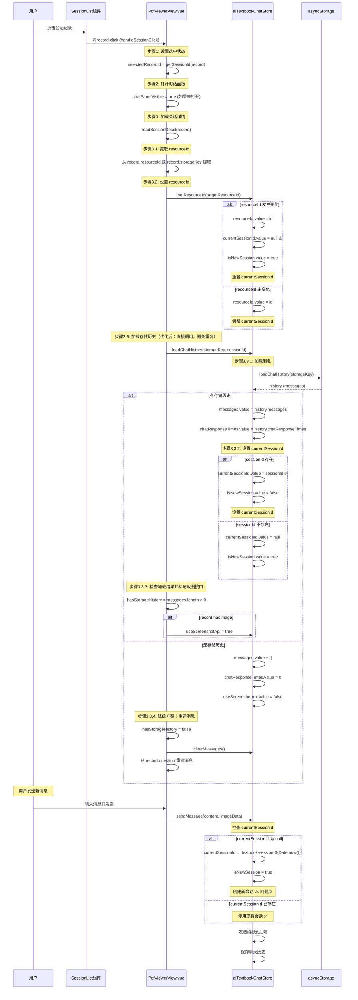

# AI 教材聊天 - 切换会话时序图

## 概述

本文档描述了在 PDF 查看器中切换会话时的完整时序流程，包括状态管理和可能的问题点。

## 时序图



## 关键问题点分析

### 优化点: 移除重复的 loadChatHistory 调用

**位置**: `PdfViewerView.vue:349-396`

**优化前**:
- 先调用 `asyncStorage.loadChatHistory(storageKey)` 检查是否有历史记录
- 如果有，再调用 `aiTextbookStore.loadChatHistory(storageKey, sessionId)`
- 导致 `asyncStorage.loadChatHistory` 被调用两次

**优化后**:
- 直接调用 `aiTextbookStore.loadChatHistory(storageKey, sessionId)`
- 根据 `aiTextbookStore.messages.length` 判断是否有历史记录
- 避免了重复调用，提高了性能

### 问题1: setResourceId 可能重置 currentSessionId

**位置**: `aiTextbookChatStore.ts:468-488`

**问题描述**:
- 当 `setResourceId` 被调用时，如果 `resourceId` 发生变化，会重置 `currentSessionId` 为 `null`
- 即使 `resourceId` 相同，如果 `setResourceId` 在 `loadChatHistory` 之后被调用，也可能导致问题

**修复方案**:
```typescript
const setResourceId = (id: string): void => {
  const resourceIdChanged = resourceId.value !== id
  const oldResourceId = resourceId.value
  resourceId.value = id
  // 只有在 resourceId 真正变化时才重置 currentSessionId
  if (resourceIdChanged) {
    currentSessionId.value = null
    isNewSession.value = true
  } else {
    // resourceId 未变化，保留当前的 currentSessionId
    // 这样可以保留从 loadChatHistory 设置的 currentSessionId
  }
}
```

### 问题2: loadChatHistory 设置 currentSessionId 的时机

**位置**: `aiTextbookChatStore.ts:524-585`

**问题描述**:
- `loadChatHistory` 在加载消息后才会设置 `currentSessionId`
- 如果 `setResourceId` 在 `loadChatHistory` 之后被调用（即使 resourceId 相同），理论上不应该重置

**当前逻辑**:
```typescript
// 如果加载成功且有 sessionId，更新 currentSessionId
if (sessionId) {
  currentSessionId.value = sessionId
  isNewSession.value = false
} else {
  currentSessionId.value = null
  isNewSession.value = true
}
```

### 问题3: sendMessage 时 currentSessionId 为 null

**位置**: `aiTextbookChatStore.ts:212-223`

**问题描述**:
- 如果 `sendMessage` 时 `currentSessionId` 为 `null`，会创建新会话
- 这会导致切换会话后发送消息时创建新会话，而不是使用已加载的会话

**当前逻辑**:
```typescript
if (builderImageData && !currentSessionId.value) {
  currentSessionId.value = `textbook-session-${Date.now()}`
  isNewSession.value = true
} else if (!currentSessionId.value) {
  currentSessionId.value = `textbook-session-${Date.now()}`
  isNewSession.value = true
}
```

## 调用顺序分析

### 正常流程（有存储历史）- 优化后

1. **用户点击会话** → `handleSessionClick(record)`
2. **设置选中状态** → `selectedRecordId = getSessionId(record)`
3. **打开对话面板** → `chatPanelVisible = true`
4. **加载会话详情** → `loadSessionDetail(record)`
5. **设置 resourceId** → `setResourceId(targetResourceId)` 
   - 如果 resourceId 变化 → 重置 `currentSessionId = null`
   - 如果 resourceId 相同 → 保留 `currentSessionId`
6. **加载聊天历史** → `loadChatHistory(storageKey, sessionId)` ✅ **优化：直接调用，避免重复**
   - 内部调用 `asyncStorage.loadChatHistory(storageKey)` → 加载消息
   - 设置消息 → `messages.value = history.messages`
   - 设置 currentSessionId → `currentSessionId.value = sessionId` ✅
7. **检查加载结果** → `hasStorageHistory = messages.length > 0`
8. **用户发送消息** → `sendMessage(content)`
   - 检查 currentSessionId → 如果已存在，使用现有会话 ✅

### 问题流程（currentSessionId 被重置）

1. **用户点击会话** → `handleSessionClick(record)`
2. **设置 resourceId** → `setResourceId(targetResourceId)`
   - resourceId 变化 → 重置 `currentSessionId = null` ⚠️
3. **加载聊天历史** → `loadChatHistory(storageKey, sessionId)`
   - 设置 `currentSessionId.value = sessionId` ✅
4. **再次调用 setResourceId** → `setResourceId(targetResourceId)` (resourceId 相同)
   - resourceId 未变化 → 应该保留 currentSessionId ✅
5. **用户发送消息** → `sendMessage(content)`
   - 如果 currentSessionId 为 null → 创建新会话 ⚠️

## 日志追踪

### 关键日志点

1. **setResourceId 调用**
   ```
   重置currentSessionId { oldResourceId, newResourceId, currentSessionId, willReset: true }
   或
   setResourceId: resourceId 未变化，不重置 currentSessionId { resourceId, currentSessionId }
   ```

2. **loadChatHistory 调用**
   ```
   更新currentSessionId { sessionId, currentSessionId }
   ```

3. **sendMessage 调用**
   ```
   没有设置 sessionId
   或
   已经有 sessionId { currentSessionId }
   ```

## 修复建议

### 1. 确保 setResourceId 不会重置已设置的 currentSessionId

✅ **已修复**: 只有在 resourceId 真正变化时才重置 currentSessionId

### 2. 确保 loadChatHistory 设置的 currentSessionId 不会被覆盖

✅ **已修复**: setResourceId 检查 resourceId 是否变化

### 3. 添加详细日志追踪

✅ **已添加**: 在关键位置添加了详细日志

### 4. 测试场景

需要测试以下场景：

1. **场景1**: 切换不同 resourceId 的会话
   - 预期: currentSessionId 被重置，然后从 loadChatHistory 设置

2. **场景2**: 切换相同 resourceId 的不同会话
   - 预期: currentSessionId 不被重置，从 loadChatHistory 设置新的 sessionId

3. **场景3**: 切换相同 resourceId 的相同会话
   - 预期: currentSessionId 不被重置，保留现有值

4. **场景4**: 切换会话后立即发送消息
   - 预期: 使用已加载的 currentSessionId，不创建新会话

## 总结

切换会话的关键时序：

1. **setResourceId** → 可能重置 currentSessionId（如果 resourceId 变化）
2. **loadChatHistory** → 设置 currentSessionId（如果有 sessionId）
3. **sendMessage** → 使用 currentSessionId（如果存在）

**关键修复点**:
- ✅ `setResourceId` 只在 resourceId 真正变化时重置 currentSessionId
- ✅ 添加详细日志追踪问题
- ⚠️ 需要测试验证修复效果

