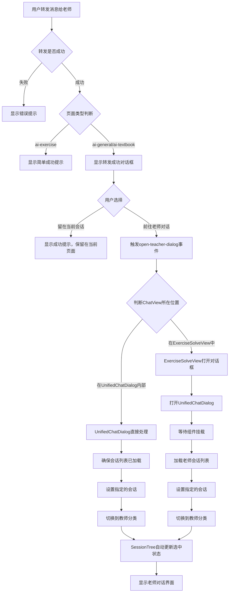
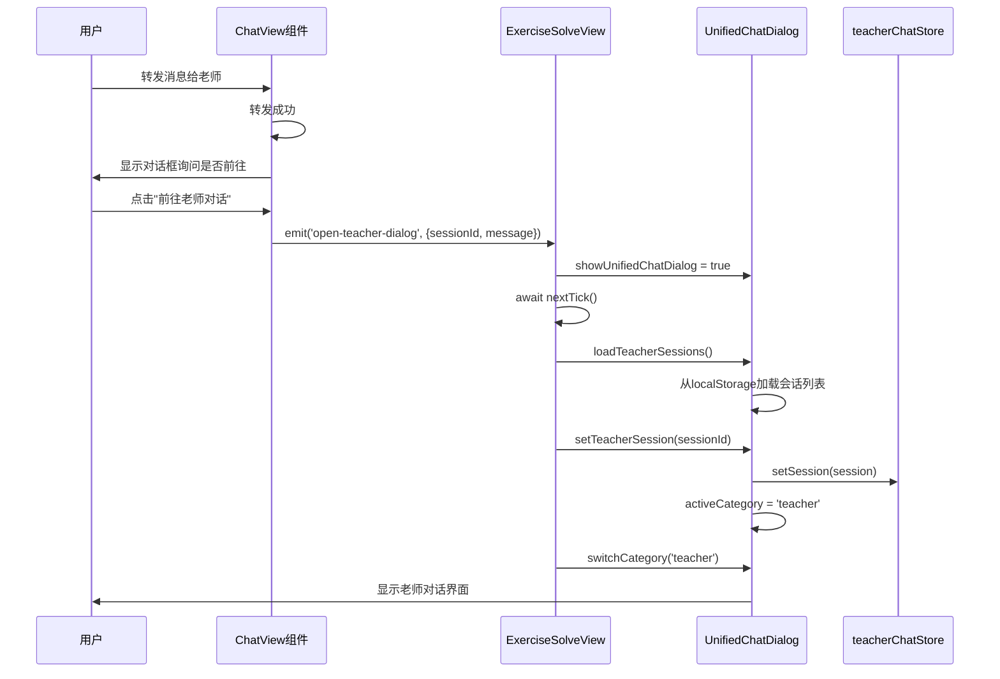

# 前往老师对话逻辑分析

## 一、功能概述

"前往老师对话"功能是在用户转发消息给老师成功后，提供的一个快捷跳转功能。用户可以选择是否跳转到老师对话页面查看转发的消息。

## 二、触发场景

### 2.1 触发时机

"前往老师对话"功能在以下场景中触发：

1. **单条消息转发成功后**
   - 用户在AI对话页面转发单条消息给老师
   - 转发成功后，系统显示对话框询问是否前往老师对话

2. **批量消息转发成功后**
   - 用户在AI对话页面批量转发多条消息给老师
   - 转发成功后，系统显示对话框询问是否前往老师对话

### 2.2 页面类型限制

**显示对话框的页面：**
- `ai-general`：AI通用对话页面
- `ai-textbook`：AI教材对话页面

**不显示对话框的页面：**
- `ai-exercise`：AI题目对话页面（只显示简单的成功提示，不显示对话框）

## 三、完整流程分析

### 3.1 流程图



### 3.2 详细步骤

#### 步骤1：转发成功后的对话框显示

**位置：** `imates-web/src/components/ChatView.vue`

**单条消息转发：**
```typescript
// 第1952-1986行
Dialog.create({
  title: '转发成功',
  message: '消息已成功转发给老师，是否前往老师对话查看？',
  cancel: {
    label: '留在当前会话',
    color: 'grey-7',
    flat: true,
  },
  ok: {
    label: '前往老师对话',
    color: 'primary',
    unelevated: true,
  },
  persistent: false,
}).onOk(() => {
  // 用户点击"前往老师对话"
  if (teacherSession.value) {
    emit('open-teacher-dialog', {
      sessionId: teacherSession.value.sessionId,
      message: message,
    })
  } else {
    showMessage('无法获取老师会话信息，请重试', 'error')
  }
}).onCancel(() => {
  // 用户点击"留在当前会话"
  showMessage('转发成功，已留在当前会话', 'success')
})
```

**批量消息转发：**
```typescript
// 第2397-2431行
Dialog.create({
  title: '转发成功',
  message: `已成功转发 ${successCount} 条消息给老师，是否前往老师对话查看？`,
  cancel: {
    label: '留在当前会话',
    color: 'grey-7',
    flat: true,
  },
  ok: {
    label: '前往老师对话',
    color: 'primary',
    unelevated: true,
  },
  persistent: false,
}).onOk(() => {
  // 用户点击"前往老师对话"
  const forwardData = {
    messages: messages,
    currentQuestion: currentQuestion.value,
    additionalMessage: additionalMessage,
    forwardMode: 'separate',
    successCount: successCount,
    sessionId: teacherSession.value?.sessionId,
  }
  emit('switchToTeacher', forwardData)
}).onCancel(() => {
  // 用户点击"留在当前会话"
  showMessage(`转发成功，已转发 ${successCount} 条消息`, 'success')
})
```

#### 步骤2：事件传递

**事件定义：**
```typescript
// ChatView.vue 第203行
const emit = defineEmits<{
  'open-teacher-dialog': [{ sessionId: string; message: ChatBubble }]
  'switchToTeacher': [{ 
    messages?: any[]; 
    currentQuestion?: unknown; 
    additionalMessage?: string;
    forwardMode?: string;
    successCount?: number;
    sessionId?: string;
  }]
}>()
```

**事件触发：**
- `open-teacher-dialog`：单条消息转发后触发
- `switchToTeacher`：批量消息转发后触发

#### 步骤3：事件处理（根据ChatView所在位置）

**关键点：** 根据 `ChatView` 所在位置，处理逻辑不同：

1. **在 `UnifiedChatDialog` 内部**：对话框已经打开，直接设置会话即可
2. **在 `ExerciseSolveView` 中**：需要打开 `UnifiedChatDialog` 并设置会话

##### 3.1 UnifiedChatDialog 内部处理

**位置：** `imates-web/src/components/UnifiedChatDialog.vue`

**事件监听：**
```vue
<!-- 第81-86行 -->
<ChatView 
  v-if="activeCategory === 'ai'"
  type="ai-general"
  @open-teacher-dialog="handleOpenTeacherDialog"
  @switch-to-teacher="handleSwitchToTeacher"
/>
```

**处理函数1：handleOpenTeacherDialog**
```typescript
// 第486-502行
const handleOpenTeacherDialog = async ({ sessionId }: { sessionId: string; message?: any }) => {
  try {
    // 确保会话列表已加载（如果还未加载）
    if (teacherSessions.value.length === 0) {
      loadTeacherSessions()
    }
    
    // 设置指定的会话（会自动切换到教师分类）
    setTeacherSession(sessionId)
    
    // SessionTree 会自动通过 selectedSessionId computed 更新选中状态
  } catch (error) {
    console.error('设置老师会话失败:', error)
    showMessage('设置老师会话失败', 'error')
  }
}
```

**处理函数2：handleSwitchToTeacher**
```typescript
// 第504-531行
const handleSwitchToTeacher = async (forwardData?: { 
  messages?: any[]; 
  currentQuestion?: unknown; 
  additionalMessage?: string;
  forwardMode?: string;
  successCount?: number;
  sessionId?: string;
}) => {
  if (!forwardData?.sessionId) {
    return
  }
  
  try {
    // 确保会话列表已加载（如果还未加载）
    if (teacherSessions.value.length === 0) {
      loadTeacherSessions()
    }
    
    // 设置指定的会话（会自动切换到教师分类）
    setTeacherSession(forwardData.sessionId)
    
    // SessionTree 会自动通过 selectedSessionId computed 更新选中状态
  } catch (error) {
    console.error('设置老师会话失败:', error)
    showMessage('设置老师会话失败', 'error')
  }
}
```

**关键点：**
- 对话框已经打开，不需要再次打开
- 只需要确保会话列表已加载，然后设置会话
- `setTeacherSession` 会自动切换到教师分类
- `SessionTree` 会自动通过 `selectedSessionId` computed 更新选中状态

##### 3.2 ExerciseSolveView 中处理

**位置：** `imates-web/src/views/ExerciseSolveView.vue`

**事件监听：**
```vue
<!-- 第161-169行 -->
<ChatView
  v-if="currentFunction === 'chatAi'"
  type="ai-exercise"
  @response="handleChatResponse"
  @switch-to-teacher="handleSwitchToTeacher"
  @open-teacher-dialog="handleOpenTeacherDialog"
  @scroll-to-question-and-select="handleScrollToQuestionAndSelect"
  @scroll-to-bottom="scrollToBottom"
/>
```

**处理函数1：handleOpenTeacherDialog**
```typescript
// 第391-429行
const handleOpenTeacherDialog = async ({ sessionId, message }: { 
  sessionId: string; 
  message: ChatBubble 
}) => {
  try {
    // 第1步：打开 UnifiedChatDialog
    showUnifiedChatDialog.value = true
    
    // 第2步：等待下一个 tick，确保 UnifiedChatDialog 已经挂载
    await nextTick()
    
    // 第3步：如果 UnifiedChatDialog 已经挂载，设置会话
    if (unifiedChatDialogRef.value) {
      // 第4步：加载老师会话列表
      await unifiedChatDialogRef.value.loadTeacherSessions()
      
      // 第5步：设置当前会话为转发的会话
      await unifiedChatDialogRef.value.setTeacherSession(sessionId)
      
      // 第6步：切换到教师分类
      unifiedChatDialogRef.value.switchCategory('teacher')
    } else {
      showMessage('打开老师对话框失败：对话框未初始化', 'error')
    }
  } catch (error) {
    console.error('打开老师对话框失败:', error)
    showMessage('打开老师对话框失败', 'error')
  }
}
```

**处理函数2：handleSwitchToTeacher**
```typescript
// 第335-388行
const handleSwitchToTeacher = async (forwardData?: { 
  messages?: any[]; 
  currentQuestion?: unknown; 
  additionalMessage?: string;
  forwardMode?: string;
  successCount?: number;
  sessionId?: string;
}) => {
  // 第1步：切换到老师界面（消息已经持久化到store中）
  currentFunction.value = 'askTeacher'
  
  // 第2步：如果有会话ID，打开UnifiedChatDialog并设置会话
  if (forwardData?.sessionId) {
    try {
      // 第3步：打开 UnifiedChatDialog
      showUnifiedChatDialog.value = true
      
      // 第4步：等待下一个 tick，确保 UnifiedChatDialog 已经挂载
      await nextTick()
      
      // 第5步：如果 UnifiedChatDialog 已经挂载，设置会话
      if (unifiedChatDialogRef.value) {
        // 第6步：加载老师会话列表
        unifiedChatDialogRef.value.loadTeacherSessions()
        
        // 第7步：设置当前会话为转发的会话
        unifiedChatDialogRef.value.setTeacherSession(forwardData.sessionId)
        
        // 第8步：切换到教师分类
        unifiedChatDialogRef.value.switchCategory('teacher')
      } else {
        showMessage('打开老师对话框失败：对话框未初始化', 'error')
      }
    } catch (error) {
      console.error('打开老师对话框失败:', error)
      showMessage('打开老师对话框失败', 'error')
    }
  }
}
```

**关键点：**
- 需要打开 `UnifiedChatDialog`（因为对话框还未打开）
- 等待组件挂载后，加载会话列表并设置会话
- 切换到教师分类

#### 步骤4：父组件事件处理（仅适用于ExerciseSolveView）

**位置：** `imates-web/src/views/ExerciseSolveView.vue`

**事件监听：**
```typescript
// 第166行
<ChatView
  v-if="currentFunction === 'chatAi'"
  type="ai-exercise"
  @open-teacher-dialog="handleOpenTeacherDialog"
  @switch-to-teacher="handleSwitchToTeacher"
/>
```

**处理函数1：handleOpenTeacherDialog**
```typescript
// 第391-429行
const handleOpenTeacherDialog = async ({ sessionId, message }: { 
  sessionId: string; 
  message: ChatBubble 
}) => {
  try {
    // 第1步：打开 UnifiedChatDialog
    showUnifiedChatDialog.value = true
    
    // 第2步：等待下一个 tick，确保 UnifiedChatDialog 已经挂载
    await nextTick()
    
    // 第3步：如果 UnifiedChatDialog 已经挂载，设置会话
    if (unifiedChatDialogRef.value) {
      // 第4步：加载老师会话列表
      await unifiedChatDialogRef.value.loadTeacherSessions()
      
      // 第5步：设置当前会话为转发的会话
      await unifiedChatDialogRef.value.setTeacherSession(sessionId)
      
      // 第6步：切换到教师分类
      unifiedChatDialogRef.value.switchCategory('teacher')
    } else {
      showMessage('打开老师对话框失败：对话框未初始化', 'error')
    }
  } catch (error) {
    console.error('打开老师对话框失败:', error)
    showMessage('打开老师对话框失败', 'error')
  }
}
```

**处理函数2：handleSwitchToTeacher**
```typescript
// 第335-388行
const handleSwitchToTeacher = async (forwardData?: { 
  messages?: any[]; 
  currentQuestion?: unknown; 
  additionalMessage?: string;
  forwardMode?: string;
  successCount?: number;
  sessionId?: string;
}) => {
  // 第1步：切换到老师界面（消息已经持久化到store中）
  currentFunction.value = 'askTeacher'
  
  // 第2步：如果有会话ID，打开UnifiedChatDialog并设置会话
  if (forwardData?.sessionId) {
    try {
      // 第3步：打开 UnifiedChatDialog
      showUnifiedChatDialog.value = true
      
      // 第4步：等待下一个 tick，确保 UnifiedChatDialog 已经挂载
      await nextTick()
      
      // 第5步：如果 UnifiedChatDialog 已经挂载，设置会话
      if (unifiedChatDialogRef.value) {
        // 第6步：加载老师会话列表
        unifiedChatDialogRef.value.loadTeacherSessions()
        
        // 第7步：设置当前会话为转发的会话
        unifiedChatDialogRef.value.setTeacherSession(forwardData.sessionId)
        
        // 第8步：切换到教师分类
        unifiedChatDialogRef.value.switchCategory('teacher')
      } else {
        showMessage('打开老师对话框失败：对话框未初始化', 'error')
      }
    } catch (error) {
      console.error('打开老师对话框失败:', error)
      showMessage('打开老师对话框失败', 'error')
    }
  }
}
```

#### 步骤5：UnifiedChatDialog 组件处理（仅适用于ExerciseSolveView场景）

**位置：** `imates-web/src/components/UnifiedChatDialog.vue`

**组件引用：**
```typescript
// ExerciseSolveView.vue 第199-203行
<UnifiedChatDialog 
  ref="unifiedChatDialogRef"
  v-model="showUnifiedChatDialog"
  :initial-teacher-subject="currentSubject"
/>
```

**暴露的方法：**
```typescript
// UnifiedChatDialog.vue 第490-495行
defineExpose({
  createTeacherSession,
  setTeacherSession,
  switchCategory,
  loadTeacherSessions
})
```

**方法1：loadTeacherSessions**
```typescript
// 第322-377行
const loadTeacherSessions = () => {
  // 第1步：获取当前用户ID并构建会话前缀
  const userId = getCurrentUserIdOrDefault()
  const sessionPrefix = `${userId}_teacher_chat_`
  
  const sessions: TeacherSession[] = []
  const sessionIds = new Set<string>()
  
  // 第2步：遍历localStorage查找所有教师会话（仅当前用户）
  for (let i = 0; i < localStorage.length; i++) {
    const key = localStorage.key(i)
    if (key?.startsWith(sessionPrefix) && key.endsWith('_session')) {
      try {
        const sessionData = localStorage.getItem(key)
        if (sessionData) {
          const session = JSON.parse(sessionData)
          
          // 验证会话数据有效性
          if (!session || !session.sessionId || !session.sessionName) {
            continue
          }
          
          // 检查重复会话ID
          if (sessionIds.has(session.sessionId)) {
            continue
          }
          
          sessions.push(session)
          sessionIds.add(session.sessionId)
        }
      } catch (error) {
        console.error('解析会话数据失败:', key, error)
      }
    }
  }
  
  // 第3步：按创建时间倒序排列
  sessions.sort((a, b) => b.createTime - a.createTime)
  teacherSessions.value = sessions
}
```

**方法2：setTeacherSession**
```typescript
// 第472-482行
const setTeacherSession = (sessionId: string) => {
  // 第1步：设置当前教师会话ID
  teacherSessionId.value = sessionId
  
  // 第2步：从会话列表中找到对应的会话
  const session = teacherSessions.value.find(s => s.sessionId === sessionId)
  if (session) {
    // 第3步：设置会话到Store
    teacherChatStore.setSession(session)
    
    // 第4步：保存当前教师科目到localStorage
    const userId = getCurrentUserIdOrDefault()
    const storeSubject = session.subject === 'biology' ? 'BIOLOGY' : 'MATH'
    localStorage.setItem(`${userId}_currentTeacherSubject`, storeSubject)
  }
  
  // 第5步：切换到教师分类
  activeCategory.value = 'teacher'
}
```

**方法3：switchCategory**
```typescript
// 第485-487行
const switchCategory = (category: 'ai' | 'teacher') => {
  activeCategory.value = category
}
```

#### 步骤6：会话加载和显示

**会话加载：**
```typescript
// UnifiedChatDialog.vue 第380-396行
const handleTeacherSessionClick = async (sessionId: string, subject: string) => {
  const session = teacherSessions.value.find(s => s.sessionId === sessionId)
  if (!session) return
  
  // 第1步：设置当前会话ID
  teacherSessionId.value = session.sessionId
  
  // 第2步：保存当前教师科目
  const userId = getCurrentUserIdOrDefault()
  const storeSubject = subject === 'biology' ? 'BIOLOGY' : 'MATH'
  localStorage.setItem(`${userId}_currentTeacherSubject`, storeSubject)
  
  // 第3步：设置会话到Store
  teacherChatStore.setSession(session)
  
  // 第4步：加载聊天历史
  await teacherChatStore.loadChatHistory(session.sessionId)
  
  // 第5步：切换到教师分类
  activeCategory.value = 'teacher'
}
```

**界面显示：**
```vue
<!-- UnifiedChatDialog.vue 第79-95行 -->
<div class="right-panel">
  <!-- 聊天界面 - 根据当前选中的对话类型动态确定 type -->
  <ChatView 
    v-if="activeCategory === 'ai'"
    type="ai-general"
  />
  <ChatView 
    v-else-if="activeCategory === 'teacher' && teacherSessionId"
    type="teacher"
    :session-id="teacherSessionId"
    :key="teacherSessionId"
  />
  <!-- 空状态 -->
  <div v-else class="empty-chat">
    <q-icon name="chat" size="64px" color="grey-4" />
    <div class="text-grey-6 q-mt-md">请选择或创建一个会话</div>
  </div>
</div>
```

## 四、关键组件和文件

### 4.1 核心组件

1. **ChatView.vue**
   - 位置：`imates-web/src/components/ChatView.vue`
   - 职责：处理转发逻辑，显示对话框，触发事件
   - 关键方法：
     - `handleForwardMessage()`：单条消息转发
     - `forwardAsSeparateMessages()`：批量消息转发
     - 对话框显示逻辑（第1952-1986行，第2397-2431行）

2. **UnifiedChatDialog.vue**
   - 位置：`imates-web/src/components/UnifiedChatDialog.vue`
   - 职责：统一聊天对话框，管理AI和老师对话
   - 关键方法：
     - `loadTeacherSessions()`：加载老师会话列表
     - `setTeacherSession()`：设置当前老师会话
     - `switchCategory()`：切换对话分类
     - `handleTeacherSessionClick()`：处理老师会话点击

3. **ExerciseSolveView.vue**
   - 位置：`imates-web/src/views/ExerciseSolveView.vue`
   - 职责：习题解答页面，处理事件传递
   - 关键方法：
     - `handleOpenTeacherDialog()`：处理打开老师对话框事件
     - `handleSwitchToTeacher()`：处理切换到老师对话事件

### 4.2 相关Store

1. **teacherChatStore.ts**
   - 位置：`imates-web/src/stores/teacherChatStore.ts`
   - 职责：管理老师对话的状态和数据
   - 关键方法：
     - `setSession()`：设置当前会话
     - `loadChatHistory()`：加载聊天历史

### 4.3 事件流

```
ChatView.vue (转发成功)
  ↓ emit('open-teacher-dialog')
ExerciseSolveView.vue (接收事件)
  ↓ handleOpenTeacherDialog()
UnifiedChatDialog.vue (打开对话框)
  ↓ loadTeacherSessions()
  ↓ setTeacherSession()
  ↓ switchCategory('teacher')
ChatView.vue (显示老师对话界面)
```

## 五、时序图



## 六、注意事项

### 6.1 异步处理

1. **组件挂载等待**（仅适用于ExerciseSolveView场景）
   - 使用 `await nextTick()` 确保 `UnifiedChatDialog` 组件已完全挂载
   - 避免在组件未挂载时调用其方法导致错误
   - **注意：** 在 `UnifiedChatDialog` 内部处理时，对话框已经打开，不需要等待挂载

2. **会话加载**
   - `loadTeacherSessions()` 是同步方法，但需要确保在调用 `setTeacherSession()` 之前执行
   - `setTeacherSession()` 需要会话列表已加载完成
   - 在 `UnifiedChatDialog` 内部处理时，如果会话列表为空，会自动加载

### 6.2 错误处理

1. **组件引用检查**
   ```typescript
   if (unifiedChatDialogRef.value) {
     // 执行操作
   } else {
     showMessage('打开老师对话框失败：对话框未初始化', 'error')
   }
   ```

2. **会话验证**
   ```typescript
   if (teacherSession.value) {
     emit('open-teacher-dialog', { sessionId, message })
   } else {
     showMessage('无法获取老师会话信息，请重试', 'error')
   }
   ```

### 6.3 状态管理

1. **会话ID存储**
   - 会话ID存储在 `UnifiedChatDialog` 的 `teacherSessionId` ref 中
   - 通过 `setTeacherSession()` 方法设置

2. **分类切换**
   - 通过 `activeCategory` ref 控制显示AI对话还是老师对话
   - 使用 `switchCategory()` 方法切换

3. **Store同步**
   - 调用 `teacherChatStore.setSession()` 同步会话状态
   - 调用 `teacherChatStore.loadChatHistory()` 加载聊天历史

### 6.4 页面类型差异

1. **ai-exercise页面**
   - 不显示对话框，只显示简单的成功提示
   - 使用 `switchToTeacher` 事件，会同时切换页面功能为 `askTeacher`
   - `ChatView` 在 `ExerciseSolveView` 中，需要打开 `UnifiedChatDialog`

2. **ai-general/ai-textbook页面**
   - 显示对话框询问是否前往老师对话
   - 使用 `open-teacher-dialog` 事件，只打开对话框，不切换页面功能
   - `ChatView` 在 `UnifiedChatDialog` 内部，对话框已经打开，直接设置会话即可

### 6.5 处理逻辑差异

**关键区别：**

1. **在 `UnifiedChatDialog` 内部**：
   - 对话框已经打开，不需要再次打开
   - 只需要确保会话列表已加载，然后设置会话
   - 不需要等待组件挂载
   - `SessionTree` 会自动更新选中状态

2. **在 `ExerciseSolveView` 中**：
   - 需要打开 `UnifiedChatDialog`
   - 需要等待组件挂载
   - 需要加载会话列表并设置会话
   - 需要切换到教师分类

## 七、相关文档

- [转发给老师场景与业务流程分析.md](./转发给老师场景与业务流程分析.md)
- [项目架构梳理.md](./项目架构梳理.md)

## 八、总结

"前往老师对话"功能是一个完整的用户交互流程，涉及：

1. **事件触发**：转发成功后显示对话框
2. **事件传递**：通过Vue事件系统传递会话信息
3. **智能处理**：根据 `ChatView` 所在位置，采用不同的处理逻辑
   - **在 `UnifiedChatDialog` 内部**：对话框已打开，直接设置会话
   - **在 `ExerciseSolveView` 中**：需要打开对话框并设置会话
4. **会话加载**：从localStorage加载老师会话列表
5. **会话设置**：设置指定的会话为当前会话
6. **界面切换**：切换到教师分类，显示老师对话界面
7. **自动更新**：`SessionTree` 自动通过 `selectedSessionId` computed 更新选中状态

**关键优化：**
- 在 `UnifiedChatDialog` 内部处理时，不需要再次打开对话框，提高了性能和用户体验
- 通过响应式系统自动更新 `SessionTree` 的选中状态，无需手动操作

整个流程通过组件间的协作和Vue的响应式系统完成，确保了用户能够快速跳转到老师对话页面查看转发的消息。

