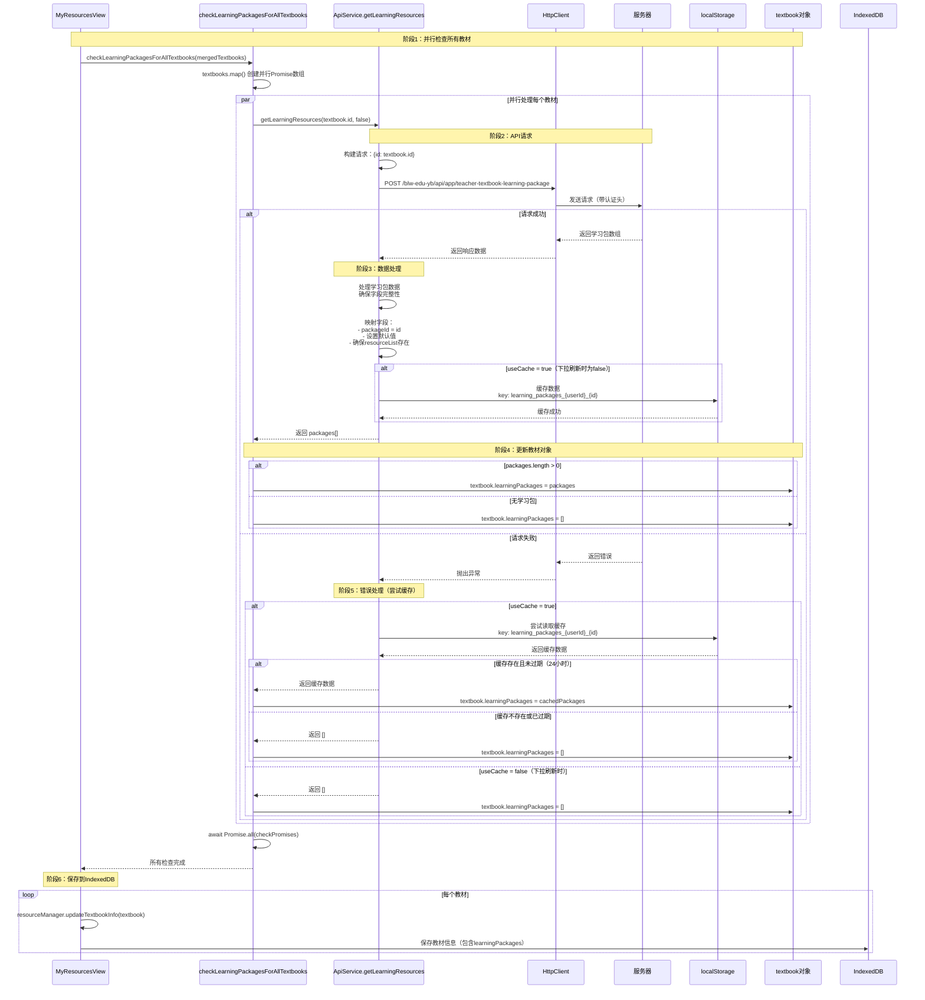

# 学习资源包检查逻辑分析

## 📋 概述

本文档详细分析资源管理中检查学习资源包的完整逻辑，包括检查时机、API 调用、数据处理、缓存机制和错误处理等各个环节。

## 🎯 核心功能

**学习资源包（Learning Package）**：每个教材可能包含多个学习方案（资源包），每个方案包含多个资源文件（如 PPT、PDF、视频等）。

## 🔄 检查流程

### 1. 触发时机

#### 1.1 下拉刷新时
**位置**：`MyResourcesView.vue` - `loadResources()` 函数  

**行号**：1243-1246

```typescript
// 合并服务器数据和本地数据
const mergedTextbooks = mergeServerAndLocalData(serverTextbooks, localTextbooks)

// 为每个教材检查学习资源包（并行处理）
await checkLearningPackagesForAllTextbooks(mergedTextbooks)
```

**触发条件**：
- 用户执行下拉刷新操作
- 首次加载且无本地数据
- 强制从服务器获取最新数据

**✅ 重要说明**：
- **下拉刷新时会异步执行三级对比标记更新逻辑**
- 首先进行数据合并（`mergeServerAndLocalData`）和学习资源包检查（`checkLearningPackagesForAllTextbooks`）
- 在数据加载完成后，**异步调用** `apiService.checkForUpdates()` 执行三级对比
- 使用 `markUpdatesFromCheckResult()` 函数标记 `hasUpdatesAvailable` 状态（不显示通知，避免干扰用户）
- 三级对比在后台异步执行，不阻塞UI，失败不影响下拉刷新的成功

#### 1.2 手动检查更新（三级对比版本）
**位置**：`MyResourcesView.vue` - `checkForUpdates()` 函数  
**行号**：1332-1391

```typescript
// 检查更新 - 三级对比版本
const checkForUpdates = async () => {
  // 开始执行三级更新检查
  const updatedTextbooks = await apiService.checkForUpdates()
  
  // 重置所有更新状态
  // 标记有更新的教材
  // 保存到 IndexedDB
}
```

**触发条件**：
- 用户点击"检查更新"按钮
- 应用启动时的自动检查（`App.vue`）

**三级对比逻辑**：
1. **第一级：教材级别** - 比较教材更新时间
2. **第二级：包级别** - 比较学习包更新时间和包的新增/删除
3. **第三级：文件级别** - 比较文件校验和（checksum）和文件的新增/删除

**标记更新状态**：
- 通过三级对比后，将有更新的教材标记为 `hasUpdatesAvailable = true`
- 保存到 IndexedDB，用于在UI中显示更新标识

#### 1.3 其他触发场景

**下载教材时**：
- 位置：`api-service.ts` - `downloadTextbook()` 函数
- 用途：获取资源包列表用于下载文件

**自动检查更新**：
- 位置：`App.vue` - `checkResourceUpdates()` 函数
- 用途：应用启动时自动检查更新（使用三级对比逻辑）

## 📊 完整时序图



## 🔍 核心代码分析

### 1. 检查函数实现

**文件**：`imates-web/src/views/MyResourcesView.vue`  
**行号**：1091-1114

```typescript
// 为所有教材检查学习资源包（并行处理）
const checkLearningPackagesForAllTextbooks = async (textbooks: UserTextbookInfo[]) => {
  // 并行处理所有教材的学习资源包检查
  const checkPromises = textbooks.map(async (textbook) => {
    try {
      // 调用 getLearningResources 检查学习资源包
      // ⚠️ 注意：下拉刷新时 useCache = false，不使用缓存
      const packages = await apiService.getLearningResources(textbook.id, false)

      if (packages && packages.length > 0) {
        // 有学习资源包，更新教材信息
        textbook.learningPackages = packages
      } else {
        // 没有学习资源包
        textbook.learningPackages = []
      }
    } catch {
      // 检查失败，标记为无学习资源
      // ⚠️ 静默处理错误，不抛出异常
      textbook.learningPackages = []
    }
  })

  // 等待所有检查完成
  await Promise.all(checkPromises)
}
```

**关键特性**：
1. **并行处理**：使用 `Promise.all()` 并行检查所有教材，提高性能
2. **错误隔离**：每个教材的检查失败不影响其他教材
3. **静默处理**：检查失败时设置空数组，不抛出异常
4. **不使用缓存**：下拉刷新时 `useCache = false`，强制从服务器获取最新数据

### 2. API 服务实现

**文件**：`imates-web/src/services/api-service.ts`  
**行号**：1505-1573

```typescript
/**
 * 获取学习资源包 - 修正为与Android端一致的流程，支持缓存
 */
public async getLearningResources(id: string, useCache: boolean = true): Promise<LearningPackage[]> {
  try {
    const endpoint = API_ENDPOINTS.LEARNING_RESOURCE.TEXTBOOK.LEARNING_PACKAGE
    const request: LearningResourcesRequest = { id: id }
    
    // 使用httpClient而不是optimizedRequest，确保认证头正确添加
    const response = await httpClient.post<{
      data: LearningPackage[]
    }>(endpoint, request)
    
    if (response.success && response.data && response.data.data) {
      // 处理学习包数据，确保字段完整性
      const packages = response.data.data.map((pkg: LearningPackage) => ({
        ...pkg,
        packageId: pkg.id,  // 兼容性字段
        sectionId: pkg.sectionId || '',
        packageName: pkg.packageName || '未命名方案',
        description: pkg.description || '暂无描述',
        updateTime: pkg.updateTime || new Date().toISOString(),
        isDefault: pkg.isDefault || 0,
        userId: pkg.userId || '',
        releaseStatus: pkg.releaseStatus || false,
        visibility: pkg.visibility || 0,
        authors: pkg.authors || '{}',
        tags: pkg.tags || '{}',
        resourceList: pkg.resourceList || []  // 确保resourceList存在
      }))
      
      // 缓存到本地存储（加上用户ID前缀，实现账号隔离）
      if (useCache) {
        try {
          const userId = getCurrentUserIdOrDefault()
          localStorage.setItem(`learning_packages_${userId}_${id}`, JSON.stringify({
            data: packages,
            timestamp: Date.now()
          }))
        } catch (storageError) {
          // 静默处理存储错误
        }
      }
      
      return packages
    }
    
    return []
  } catch (error) {
    // 尝试从本地缓存获取数据（加上用户ID前缀，实现账号隔离）
    if (useCache) {
      try {
        const userId = getCurrentUserIdOrDefault()
        const cached = localStorage.getItem(`learning_packages_${userId}_${id}`)
        if (cached) {
          const cachedData = JSON.parse(cached)
          // 检查缓存是否过期（24小时）
          if (Date.now() - cachedData.timestamp < 24 * 60 * 60 * 1000) {
            return cachedData.data
          }
        }
      } catch (cacheError) {
        // 静默处理缓存错误
      }
    }
    
    return []
  }
}
```

**关键特性**：
1. **字段完整性处理**：确保所有必需字段都有默认值
2. **缓存机制**：
   - 缓存键：`learning_packages_{userId}_{id}`（账号隔离）
   - 缓存有效期：24 小时
   - 仅在 `useCache = true` 时使用缓存
3. **错误降级**：请求失败时尝试从缓存读取
4. **账号隔离**：使用用户ID前缀，避免不同账号数据混淆

### 3. API 端点配置

**文件**：`imates-web/src/services/api-endpoints.ts`  
**行号**：95

```typescript
LEARNING_PACKAGE: '/blw-edu-yb/api/app/teacher-textbook-learning-package'
```

**请求格式**：
- **方法**：POST
- **路径**：`/blw-edu-yb/api/app/teacher-textbook-learning-package`
- **请求体**：`{ id: string }`（教材ID）
- **认证头**：`sa-token`（从 localStorage 获取）

**响应格式**：
```typescript
{
  success: boolean
  data: {
    data: LearningPackage[]
  }
}
```

### 4. 数据模型

**文件**：`imates-web/src/types/textbook.ts`  
**行号**：71-86

```typescript
export interface LearningPackage {
  id: string                    // 资源包唯一标识
  packageId?: string            // 资源包ID（与id相同，用于兼容性）
  sectionId: string             // 章节ID
  packageName: string           // 资源包名称
  description: string           // 资源包描述
  updateTime: string            // 更新时间
  isDefault: number             // 是否为默认方案（0=否, 1=是）
  userId: string               // 用户ID
  releaseStatus: boolean         // 发布状态
  visibility: number             // 可见性
  authors: string               // 作者信息（JSON字符串）
  tags: string                  // 标签信息（JSON字符串）
  resourceList: ResourceFile[]  // 资源文件列表
  localFiles?: LocalFileInfo[]  // 本地文件信息列表（可选）
}
```

**字段说明**：
- `resourceList`：包含该资源包的所有资源文件（PPT、PDF、视频等）
- `isDefault`：标识是否为默认学习方案
- `localFiles`：存储已下载文件的元数据信息

## 🔄 数据流转

### 1. 检查流程
```
mergedTextbooks (合并后的教材列表)
  ↓
checkLearningPackagesForAllTextbooks()
  ↓
并行调用 getLearningResources() 对每个教材
  ↓
API 请求 / 从缓存读取
  ↓
处理数据，确保字段完整性
  ↓
更新 textbook.learningPackages
  ↓
保存到 IndexedDB（通过 updateTextbookInfo）
```

### 2. 缓存策略

**缓存键格式**：
```
learning_packages_{userId}_{textbookId}
```

**缓存数据结构**：
```typescript
{
  data: LearningPackage[],
  timestamp: number  // 时间戳（毫秒）
}
```

**缓存有效期**：24 小时

**缓存使用场景**：
- ✅ 正常加载时：`useCache = true`，使用缓存
- ❌ 下拉刷新时：`useCache = false`，不使用缓存
- ✅ 请求失败时：尝试从缓存读取（降级策略）

## ⚠️ 注意事项

### 1. 性能优化
- **并行处理**：所有教材的检查并行执行，提高效率
- **错误隔离**：单个教材检查失败不影响其他教材
- **缓存机制**：避免重复请求相同数据

### 2. 错误处理
- **静默处理**：检查失败时设置空数组，不抛出异常
- **降级策略**：请求失败时尝试从缓存读取
- **账号隔离**：使用用户ID前缀，避免数据混淆

### 3. 数据一致性
- **字段完整性**：确保所有字段都有默认值
- **兼容性处理**：`packageId = id` 确保向后兼容
- **空数组处理**：无学习包时设置为空数组，避免 undefined

### 4. 缓存策略
- **下拉刷新时**：`useCache = false`，强制从服务器获取最新数据
- **正常加载时**：`useCache = true`，优先使用缓存
- **缓存过期**：24 小时后自动失效

## 🧪 测试要点

### 1. 功能测试
- ✅ 验证并行检查所有教材
- ✅ 验证 API 请求正确发送
- ✅ 验证数据字段完整性处理
- ✅ 验证缓存机制正常工作
- ✅ 验证错误处理和降级策略

### 2. 性能测试
- ✅ 验证大量教材时的并行处理性能
- ✅ 验证缓存命中率
- ✅ 验证网络错误时的降级策略

### 3. 边界测试
- ✅ 无学习包的教材
- ✅ API 返回空数组
- ✅ 网络请求失败
- ✅ 缓存不存在或已过期
- ✅ 不同用户账号的数据隔离

## 🔍 三级对比逻辑详解

### 三级对比是什么？

三级对比是指检查教材更新时，从三个层级进行对比：

1. **教材级别（第一级）**
   - 比较服务器教材的 `textbookUpdateTime` 和本地教材的 `textbookUpdateTime`
   - 如果服务器版本更新，则标记为需要更新

2. **包级别（第二级）**
   - 比较学习资源包（LearningPackage）的 `updateTime`
   - 检查是否有新增的学习包
   - 检查是否有删除的学习包

3. **文件级别（第三级）**
   - 比较资源文件的 `checksum`（校验和）
   - 检查是否有新增的文件
   - 检查是否有删除的文件

### 三级对比实现位置

**文件**：`imates-web/src/services/api-service.ts`

#### 1. 主入口函数
**行号**：1741-1768
```typescript
public async checkForUpdates(): Promise<TextbookVersion[]>
```

#### 2. 教材级别检查
**行号**：1774-1801
```typescript
private async checkTextbookUpdate(serverTextbook: TextbookVersion, localTextbook?: UserTextbookInfo): Promise<boolean>
```

#### 3. 包级别检查
**行号**：1807-1848
```typescript
private async checkLearningPackageUpdates(serverTextbook: TextbookVersion, localTextbook: UserTextbookInfo): Promise<boolean>
```

#### 4. 文件级别检查
**行号**：1855-1897
```typescript
private hasFileUpdates(serverPackages: LearningPackage[], textbook: UserTextbookInfo): boolean
```

### 下拉刷新 vs 检查更新的区别

| 功能 | 下拉刷新 | 检查更新 |
|------|---------|---------|
| **触发方式** | 下拉刷新手势 | 点击"检查更新"按钮 |
| **数据获取** | ✅ 获取服务器教材列表 | ✅ 获取服务器教材列表 |
| **学习包检查** | ✅ 检查学习资源包 | ✅ 检查学习资源包 |
| **三级对比** | ✅ **异步执行**（后台执行） | ✅ **同步执行** |
| **标记更新** | ✅ **异步标记** `hasUpdatesAvailable`（不显示通知） | ✅ **标记** `hasUpdatesAvailable`（显示通知） |
| **性能影响** | 快速响应（三级对比异步执行） | 较慢（需要等待三级对比完成） |
| **用途** | 同步最新数据 + 后台检测更新 | 主动检测更新状态 |

### 下拉刷新中三级对比的实现方式

**实现位置**：`MyResourcesView.vue` - `loadResources()` 函数（行号：1257-1270）

```typescript
// 🔥 下拉刷新时执行三级对比标记更新（异步执行，不阻塞UI）
// 在下拉刷新完成后，异步执行三级对比，标记有更新的教材
apiService
  .checkForUpdates()
  .then((updatedTextbooks) => {
    // 使用公共函数标记更新状态（不显示通知，避免干扰用户）
    markUpdatesFromCheckResult(updatedTextbooks, false).catch((error) => {
      console.warn('下拉刷新时标记更新状态失败:', error)
    })
  })
  .catch((error) => {
    // 三级对比失败不影响下拉刷新的成功，只记录错误
    console.warn('下拉刷新时执行三级对比失败:', error)
  })
```

**设计考虑**：

1. **异步执行**：三级对比在后台异步执行，不阻塞UI响应
2. **不显示通知**：下拉刷新时标记更新不显示通知消息，避免干扰用户
3. **容错处理**：三级对比失败不影响下拉刷新的成功，只记录错误日志
4. **代码复用**：使用 `markUpdatesFromCheckResult()` 公共函数，与手动检查更新共用逻辑

**优势**：

- ✅ 用户下拉刷新时自动检测更新，无需手动点击"检查更新"
- ✅ 不阻塞UI，用户体验流畅
- ✅ 自动标记更新状态，用户可以看到哪些教材有更新
- ✅ 失败不影响主要功能，保证稳定性

**公共函数**：`markUpdatesFromCheckResult()`

为了代码复用，将标记更新状态的逻辑提取为独立函数 `markUpdatesFromCheckResult()`：

- **位置**：`MyResourcesView.vue`（行号：1347-1393）
- **参数**：
  - `updatedTextbooks: TextbookVersion[]` - 三级对比返回的需要更新的教材列表
  - `showNotification: boolean` - 是否显示通知消息（默认true）
- **功能**：
  - 重置所有教材的更新状态
  - 标记有更新的教材
  - 保存到 IndexedDB
  - 更新 `updateCount` 计数
  - 通知其他组件更新状态已变化

该函数被以下场景复用：
- 下拉刷新时：`showNotification = false`（不显示通知）
- 手动检查更新时：`showNotification = true`（显示通知）

## 📚 相关文档

- [资源管理下拉刷新时序图](./资源管理下拉刷新时序图.md)
- [MyResourcesView.vue 实现文档](./src/views/MyResourcesView.vue.md)
- [ApiService 服务文档](../services/api-service.md)
- [ResourceManager 服务文档](../services/resource-storage.md)

## 🔗 相关代码位置

### 检查函数
- **文件**：`imates-web/src/views/MyResourcesView.vue`
- **行号**：1091-1114

### API 服务
- **文件**：`imates-web/src/services/api-service.ts`
- **行号**：1505-1573

### API 端点
- **文件**：`imates-web/src/services/api-endpoints.ts`
- **行号**：95

### 数据模型
- **文件**：`imates-web/src/types/textbook.ts`
- **行号**：71-86

