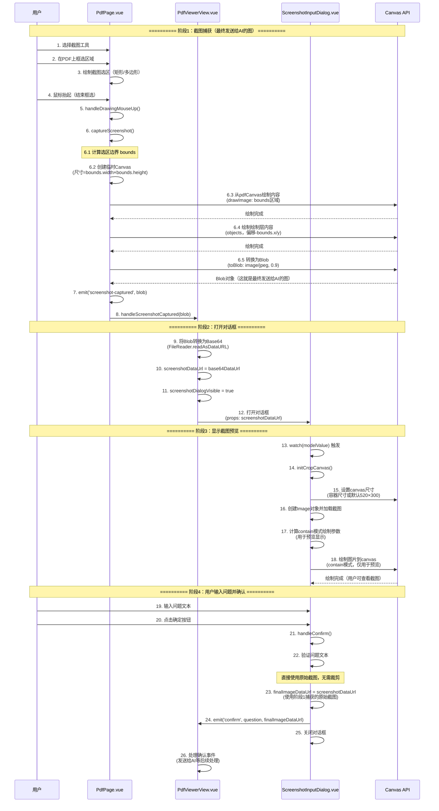
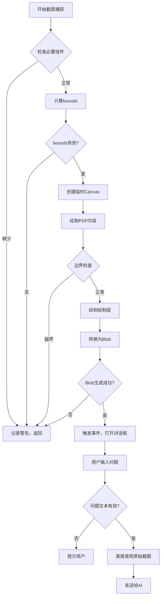

# 截图功能时序图

## 完整流程图



## 关键数据流转

### 1. 截图捕获阶段（最终发送给AI的图）
```
用户框选区域
  ↓
bounds: { x, y, width, height }  (PDF Canvas坐标)
  ↓
临时Canvas (尺寸 = bounds.width × bounds.height)
  ↓
从pdfCanvas绘制: bounds区域 → 临时Canvas
  ↓
从drawingCanvas绘制: objects (偏移-bounds.x/y) → 临时Canvas
  ↓
Blob对象 (image/jpeg) ← 这就是最终发送给AI的图
```

### 2. 对话框显示阶段（仅用于预览）
```
Blob对象
  ↓
Base64 DataURL (screenshotDataUrl)
  ↓
Image对象加载
  ↓
计算contain模式绘制参数（仅用于预览显示）
  ↓
绘制到Canvas（用户可查看截图预览）
```

### 3. 确认提交阶段
```
用户输入问题
  ↓
验证问题文本
  ↓
直接使用原始截图 (screenshotDataUrl)
  ↓
发送给AI (question + screenshotDataUrl)
```

## 关键坐标系统

### 坐标系统：PDF Canvas坐标
- **范围**: (0, 0) 到 (pdfCanvas.width, pdfCanvas.height)
- **用途**: 截图捕获时的选区坐标
- **示例**: bounds = { x: 100, y: 200, width: 300, height: 400 }
- **说明**: 用户在PDF上框选的区域，直接映射到截图Canvas的坐标

## 截图捕获流程说明

### 截图尺寸
- 截图Canvas的尺寸 = 用户框选区域的尺寸 (bounds.width × bounds.height)
- 无需缩放，1:1 映射

### 内容绘制
1. **PDF内容**: 从pdfCanvas的bounds区域直接绘制到临时Canvas的(0,0)位置
2. **绘制层内容**: 从drawingCanvas绘制objects，坐标偏移(-bounds.x, -bounds.y)
3. **结果**: 得到完整的截图，包含PDF内容和用户绘制的标注

## 边界检查点

### 检查点：截图捕获时
```javascript
// 确保截图区域在PDF Canvas范围内
sourceBounds: {
  xInBounds: bounds.x >= 0 && bounds.x < pdfCanvasWidth,
  yInBounds: bounds.y >= 0 && bounds.y < pdfCanvasHeight,
  widthInBounds: bounds.x + bounds.width <= pdfCanvasWidth,
  heightInBounds: bounds.y + bounds.height <= pdfCanvasHeight,
  validSize: bounds.width > 0 && bounds.height > 0
}
```

## 错误处理流程



## 性能优化点

1. **截图捕获**: 使用临时Canvas，避免重复渲染
2. **图片预览**: 使用requestAnimationFrame确保DOM渲染完成后再初始化Canvas
3. **数据传递**: 直接使用原始截图，无需额外的裁剪处理，减少计算开销

