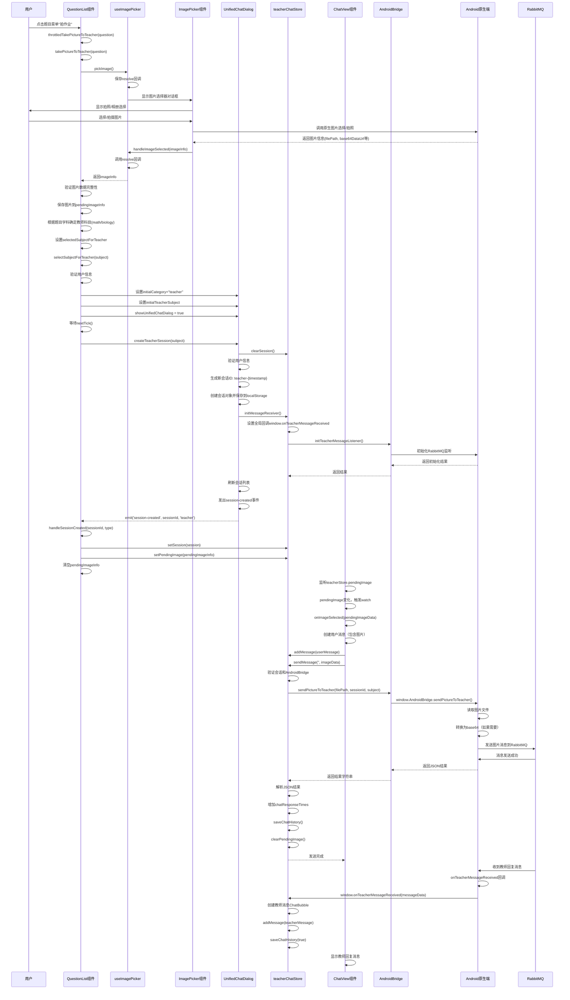

# 拍作业功能时序图分析

## 📋 概述

本文档详细分析了习题页面（QuestionList）中"拍作业"功能的完整实现流程，包括用户交互、图片选择、会话创建、消息发送等各个环节的时序关系。

## 🎯 功能说明

拍作业功能允许用户从题目列表中，通过拍照或选择图片的方式，将作业图片发送给教师进行答疑。

**主要流程**：
1. 用户在题目列表中点击"拍作业"菜单项
2. 系统弹出图片选择器（拍照或相册）
3. 用户选择/拍摄图片后，系统根据题目学科创建对应的教师会话
4. 打开教师答疑对话框，自动发送图片消息
5. 图片通过Android Bridge发送到原生端，最终通过RabbitMQ发送给教师

## 📊 时序图

### 完整时序图



## 🔍 关键流程详解

### 1. 图片选择流程

**参与者**：QuestionList → useImagePicker → ImagePicker组件 → Android原生端

**详细步骤**：
1. QuestionList调用`useImagePicker().pickImage()`
2. useImagePicker创建Promise，保存resolve回调
3. 显示ImagePicker对话框，提供拍照/相册选择
4. 用户选择后，通过AndroidBridge调用原生图片选择/拍照
5. 原生端返回图片信息（filePath, base64DataUrl, width, height, fileSize）
6. ImagePicker调用`handleImageSelected`，触发Promise resolve
7. QuestionList接收图片信息

**关键代码位置**：
- `QuestionList.vue:704-746` - takePictureToTeacher函数
- `useImagePicker.ts:14-25` - pickImage函数
- `ImagePicker.vue` - 图片选择器组件

### 2. 会话创建流程

**参与者**：QuestionList → UnifiedChatDialog → teacherChatStore

**详细步骤**：
1. QuestionList根据题目学科确定教师科目（math/biology）
2. 打开UnifiedChatDialog，设置initialCategory="teacher"
3. UnifiedChatDialog调用`createTeacherSession(subject)`
4. 生成新会话ID：`teacher-{Date.now()}`
5. 创建会话对象并保存到localStorage（带用户ID前缀）
6. 初始化教师消息接收器（RabbitMQ监听）
7. 刷新会话列表，发出session-created事件

**关键代码位置**：
- `QuestionList.vue:748-783` - selectSubjectForTeacher函数
- `UnifiedChatDialog.vue:441-493` - createTeacherSession函数
- `teacherChatStore.ts:451-535` - createTeacherSession函数

### 3. 图片发送流程

**参与者**：QuestionList → ChatView → teacherChatStore → AndroidBridge → RabbitMQ

**详细步骤**：
1. QuestionList在handleSessionCreated中设置pendingImage
2. ChatView监听teacherStore.pendingImage变化
3. 当pendingImage有值时，自动调用onImageSelected
4. 创建用户消息（包含图片数据）
5. 调用teacherChatStore.sendMessage发送
6. 通过AndroidBridge.sendPictureToTeacher发送到原生端
7. 原生端读取图片文件，发送到RabbitMQ
8. 保存聊天历史，清除pendingImage

**关键代码位置**：
- `QuestionList.vue:786-802` - handleSessionCreated函数
- `ChatView.vue:2543-2565` - 监听pendingImage的watch
- `teacherChatStore.ts:140-244` - sendMessage函数
- `android-bridge.ts:824-833` - sendPictureToTeacher函数

### 4. 消息接收流程

**参与者**：RabbitMQ → Android原生端 → teacherChatStore → ChatView

**详细步骤**：
1. 教师通过RabbitMQ发送回复消息
2. Android原生端接收消息，调用全局回调
3. window.onTeacherMessageReceived被触发
4. teacherChatStore创建教师消息ChatBubble
5. 添加到消息列表，保存聊天历史
6. ChatView自动显示新消息

**关键代码位置**：
- `teacherChatStore.ts:820-871` - initMessageReceiver函数
- `teacherChatStore.ts:822-848` - window.onTeacherMessageReceived回调

## 📝 关键数据结构

### 图片信息结构（ImageData）

```typescript
interface ImageData {
  filePath: string        // 图片文件路径（用于发送）
  base64DataUrl?: string  // Base64数据URL（用于前端显示）
  width: number          // 图片宽度
  height: number         // 图片高度
  fileSize: number       // 文件大小（字节）
}
```

### 教师会话结构（TeacherSession）

```typescript
interface TeacherSession {
  sessionId: string      // 会话ID: teacher-{timestamp}
  sessionName: string    // 会话名称（如"数学答疑"）
  subject: string       // 学科: 'math' | 'biology'
  createTime: number    // 创建时间戳
}
```

### 待发送图片结构（pendingImage）

```typescript
{
  filePath: string
  width: number
  height: number
  fileSize: number
  base64DataUrl?: string
}
```

## 🔄 状态流转

### 拍作业状态流转

```
用户点击"拍作业"
    ↓
显示图片选择器
    ↓
用户选择/拍摄图片
    ↓
验证图片数据
    ↓
保存到pendingImageInfo
    ↓
确定教师科目（math/biology）
    ↓
打开UnifiedChatDialog
    ↓
创建教师会话
    ↓
初始化RabbitMQ监听
    ↓
设置pendingImage到Store
    ↓
ChatView监听并自动发送
    ↓
通过AndroidBridge发送到RabbitMQ
    ↓
等待教师回复（异步）
```

## ⚠️ 关键注意事项

### 1. 图片数据传输

- **filePath优先**：发送时优先使用filePath，Android端会读取文件并转换为base64
- **base64DataUrl用于显示**：前端UI显示使用base64DataUrl，不用于发送
- **数据完整性验证**：必须同时有filePath和base64DataUrl

### 2. 会话管理

- **用户ID隔离**：所有会话数据都带用户ID前缀，确保多账号隔离
- **会话复用逻辑**：如果已存在相同名称和学科的会话，会尝试复用
- **会话ID格式**：`teacher-{timestamp}`，确保唯一性

### 3. 异步处理

- **Promise链式调用**：图片选择使用Promise，确保异步流程正确
- **nextTick等待**：创建会话后需要等待DOM更新
- **事件驱动**：通过session-created事件通知图片发送

### 4. 错误处理

- **AndroidBridge检查**：发送前必须检查AndroidBridge是否可用
- **用户信息验证**：创建会话前必须验证用户信息
- **图片验证**：发送前验证图片数据完整性

## 🔧 相关文件清单

### 核心组件

1. **QuestionList.vue** (`src/components/QuestionList.vue`)
   - 拍作业入口：`takePictureToTeacher`函数（704-746行）
   - 会话创建：`selectSubjectForTeacher`函数（748-783行）
   - 会话创建处理：`handleSessionCreated`函数（786-802行）

2. **UnifiedChatDialog.vue** (`src/components/UnifiedChatDialog.vue`)
   - 创建教师会话：`createTeacherSession`函数（441-493行）
   - 会话列表管理：`loadTeacherSessions`函数（302-361行）

3. **ChatView.vue** (`src/components/ChatView.vue`)
   - 监听pendingImage：watch监听（2543-2565行）
   - 图片发送：`onImageSelected`函数

### Store管理

4. **teacherChatStore.ts** (`src/stores/teacherChatStore.ts`)
   - 发送消息：`sendMessage`函数（140-244行）
   - 创建会话：`createTeacherSession`函数（451-535行）
   - 消息接收：`initMessageReceiver`函数（820-871行）
   - 待发送图片：`setPendingImage`函数（911-920行）

### 工具函数

5. **useImagePicker.ts** (`src/composables/useImagePicker.ts`)
   - 图片选择：`pickImage`函数（14-25行）
   - 选择处理：`handleImageSelected`函数（29-41行）

### 原生桥接

6. **android-bridge.ts** (`src/services/android-bridge.ts`)
   - 发送图片：`sendPictureToTeacher`函数（824-833行）
   - 初始化监听：`initTeacherMessageListener`函数（873-881行）

### 类型定义

7. **types/bridge.ts** (`src/types/bridge.ts`)
   - AndroidBridge接口定义
   - sendPictureToTeacher方法签名

## 🐛 常见问题

### 1. 图片发送失败

**可能原因**：
- AndroidBridge未初始化
- 图片文件路径不存在
- 会话未创建

**解决方案**：
- 检查AndroidBridge是否可用
- 验证图片filePath是否存在
- 确保会话创建成功后再发送

### 2. 会话创建失败

**可能原因**：
- 用户信息未加载
- localStorage存储失败
- RabbitMQ监听初始化失败

**解决方案**：
- 确保用户信息已加载
- 检查localStorage是否可用
- 验证AndroidBridge.initTeacherMessageListener是否成功

### 3. 图片选择器不显示

**可能原因**：
- ImagePicker组件未正确注册
- isPickerVisible状态未正确设置

**解决方案**：
- 检查ImagePicker组件是否在全局注册
- 验证useImagePicker的isPickerVisible状态

## 📈 性能优化建议

1. **图片压缩**：发送前可考虑压缩图片，减少传输时间
2. **懒加载**：会话列表使用虚拟滚动，提升性能
3. **防抖处理**：图片选择使用throttle，避免重复触发
4. **异步加载**：聊天历史异步加载，不阻塞UI

## 🔐 安全考虑

1. **用户隔离**：所有数据都带用户ID前缀，确保多账号数据隔离
2. **图片验证**：发送前验证图片数据完整性，防止恶意数据
3. **会话验证**：发送前验证会话是否存在，防止无效发送

---

**文档版本**：v1.0  
**创建日期**：2025-01-27  
**维护者**：开发团队

