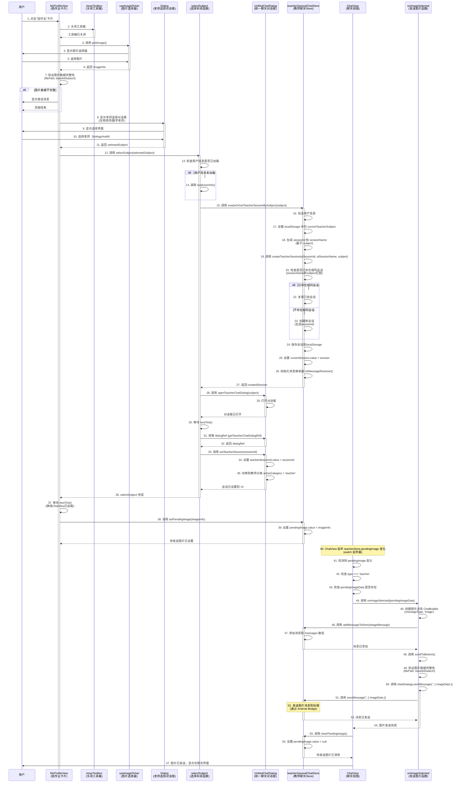

# 拍作业流程时序图

## 流程概述

本文档描述了从用户点击"拍作业"卡片到图片自动发送给老师的完整流程。

## 时序图

## 关键流程说明

### 1. 图片选择阶段（步骤 1-7）

- **步骤 1-2**: 用户点击"拍作业"卡片，关闭工具箱
- **步骤 3-6**: 调用图片选择器，用户选择图片后返回 `imageInfo`
- **步骤 7**: 验证图片数据完整性（`filePath` 和 `base64DataUrl` 必须存在）

### 2. 老师选择阶段（步骤 8-11）

- **步骤 8-11**: 显示老师选择对话框，用户选择生物老师或数学老师

### 3. 会话创建阶段（步骤 12-36）

- **步骤 12-14**: 调用 `selectSubject`，确保用户信息已加载
- **步骤 15-27**: **Store 层创建或复用教师会话**（`createOrGetTeacherSessionBySubject`）
  - 验证用户信息
  - 设置 localStorage 中的 `currentTeacherSubject`
  - 生成 sessionId 和 sessionName（基于 subject）
  - 调用 `createTeacherSession` 检查是否已存在相同会话（`sessionName` 和 `subject` 匹配）
  - 如果存在，复用已有会话；否则创建新会话
  - 保存会话到 localStorage，设置 `currentSession`
  - 初始化消息接收器
  - 返回创建的会话
- **步骤 28-35**: 打开对话框并设置会话到 UI
  - 打开教师聊天对话框
  - 获取对话框引用
  - 调用 `UnifiedChatDialog.setTeacherSession` 设置会话到 UI
  - 切换到教师分类

### 4. 图片发送阶段（步骤 37-57）

- **步骤 37-39**: 设置待发送图片到 Store（`setPendingImage`）
- **步骤 40-43**: ChatView 监听 `pendingImage` 变化（watch 监听器）
- **步骤 44-54**: 自动调用 `onImageSelected` 发送图片
  - 创建图片消息并添加到 Store
  - 调用 `chatStrategy.sendMessage` 发送图片到后端
- **步骤 55-57**: 清除待发送图片状态，图片显示在聊天界面

## 关键组件说明

### MyProfileView
- 负责处理用户交互（点击"拍作业"卡片）
- 协调图片选择、老师选择、会话创建和图片发送流程

### useImagePicker
- 全局图片选择器 Composable
- 提供统一的图片选择 API，确保全局只有一个 ImagePicker 实例

### UnifiedChatDialog
**核心作用**：统一聊天对话框组件，是 AI 通用聊天和教师聊天的统一界面容器

**职责划分原则**：
- **只负责 UI 渲染和用户交互**：根据分类动态渲染对应的 `ChatView` 组件
- **不负责业务逻辑**：会话创建等业务逻辑由 Store 层负责

**在拍作业流程中的具体职责**：

1. **对话框管理**
   - 管理聊天对话框的打开/关闭状态
   - 提供统一的聊天界面容器（左侧会话列表 + 右侧聊天视图）

2. **分类动态渲染**
   - 管理 `activeCategory`（当前激活的分类：`ai-general` 或 `teacher`）
   - 根据当前分类动态渲染对应的 `ChatView` 组件
   - 协调 `SessionTree`（会话列表）和 `ChatView`（聊天视图）的交互

3. **会话设置（不负责创建）**
   - 提供 `setTeacherSession(sessionId)` 方法：设置当前教师会话到 UI
     - 从会话列表中查找指定会话
     - 设置到组件的 `teacherSessionId`
     - 切换到教师分类（`activeCategory = 'teacher'`）
   - 提供 `createTeacherSession(subject)` 方法：**仅作为 UI 入口，实际调用 Store 方法**
     - 调用 `teacherChatStore.createOrGetTeacherSessionBySubject(subject)`
     - 更新 UI 状态（`teacherSessionId`、`activeCategory`）
     - 加载会话列表

4. **接口暴露**
   - 通过 `defineExpose` 暴露方法供外部调用：
     - `createTeacherSession(subject)`: UI 入口，调用 Store 创建会话
     - `setTeacherSession(sessionId)`: 设置教师会话到 UI
     - `switchCategory(category)`: 切换分类
     - `loadTeacherSessions()`: 加载教师会话列表

5. **在拍作业流程中的关键步骤**
   - **步骤 28-29**: 接收 `openTeacherChatDialog(subject)` 调用，打开对话框
   - **步骤 31-35**: 调用 `setTeacherSession` 设置会话到 UI
   - **步骤 40-57**: 提供 `ChatView` 容器，让 `ChatView` 能够监听 `pendingImage` 并自动发送图片

**设计模式**：
- 使用**容器组件模式**：`UnifiedChatDialog` 作为容器，管理多个子组件（`SessionTree`、`ChatView`）
- 使用**单一职责原则**：只负责 UI 渲染，不负责业务逻辑
- 使用**依赖注入模式**：通过 `provide/inject` 向子组件提供对话框引用和方法

### teacherGeneralChatStore
**核心作用**：教师聊天状态管理 Store，负责所有教师聊天相关的业务逻辑

**职责划分**：
- **负责业务逻辑**：会话创建、消息管理、状态管理等
- **不负责 UI 渲染**：UI 渲染由组件层负责

**在拍作业流程中的具体职责**：

1. **会话创建与管理**
   - 提供 `createOrGetTeacherSessionBySubject(subject)` 方法：**完整的会话创建流程**
     - 验证用户信息
     - 设置 localStorage 中的 `currentTeacherSubject`
     - 生成 sessionId 和 sessionName（基于 subject）
     - 调用 `createTeacherSession` 检查是否已存在相同会话
     - 如果存在，复用已有会话；否则创建新会话
     - 保存会话到 localStorage，设置 `currentSession`
     - 初始化消息接收器
   - 提供 `createTeacherSession(aiSessionId, aiSessionName, subject)` 方法：底层会话创建逻辑
   - 提供 `setSession(session)` 方法：设置当前会话
   - 提供 `getAllSessions()` 方法：获取所有会话列表

2. **消息管理**
   - 管理消息列表、当前会话、消息发送等

3. **状态管理**
   - 提供 `pendingImage` 状态用于拍作业场景
   - 管理聊天加载状态、消息接收状态等

**设计模式**：
- 使用**单一职责原则**：只负责业务逻辑，不负责 UI 渲染
- 使用**状态管理模式**：集中管理所有教师聊天相关的状态

### ChatView
- 聊天视图组件
- 监听 `pendingImage` 变化，自动发送图片
- 处理图片消息的显示和发送

## 错误处理

1. **图片数据不完整**: 在步骤 7 验证失败时，显示错误消息并终止流程
2. **会话创建失败**: 在步骤 15-27 中，如果 Store 层创建会话失败，显示错误消息并终止流程
3. **图片发送失败**: 在步骤 44-54 中，如果发送失败，清除待发送图片状态并显示错误消息

## 注意事项

1. **时序问题**: 使用 `nextTick()` 确保组件已挂载完成
2. **会话复用**: 系统会检查是否已存在相同会话，避免重复创建
3. **自动发送**: 通过 watch 监听器实现图片的自动发送，无需手动调用
4. **状态清理**: 发送完成后自动清除 `pendingImage` 状态，避免重复发送

