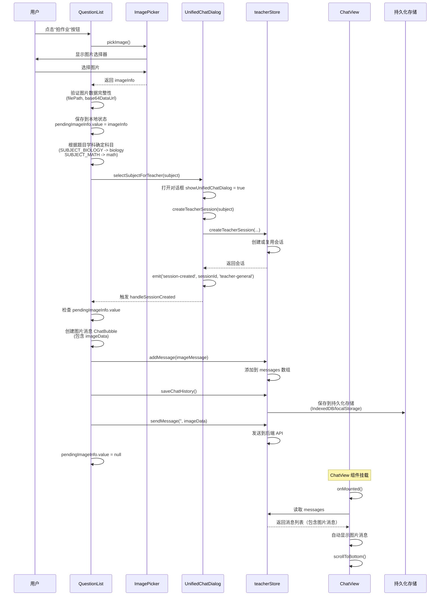
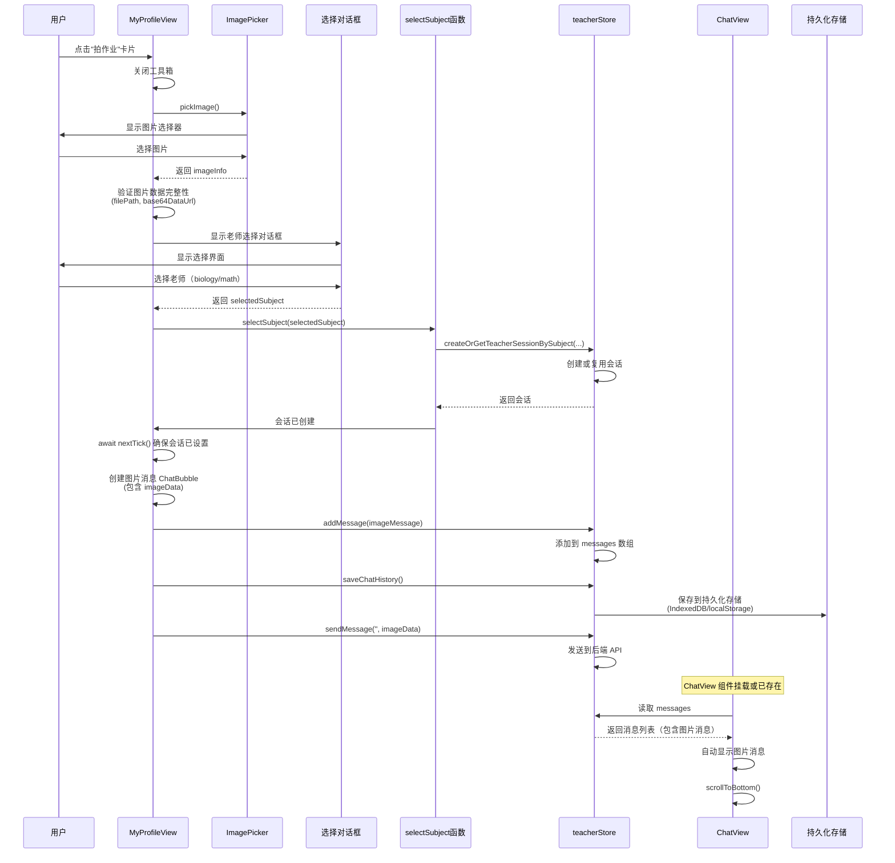

# 拍作业逻辑梳理

## 概述

拍作业功能允许用户从题目列表或个人中心选择图片，自动发送给对应的教师（生物老师或数学老师）。本文档梳理了完整的实现逻辑。

## 重要变更（最新）

**已移除 `pendingImage` 状态管理机制**：
- 拍作业确定老师后，直接将图片消息存储到老师对应的消息存储中
- ChatView 加载时从持久化数据中读取并显示
- 不再使用临时状态 `pendingImage`，简化了流程并提高了可靠性

## 入口点

拍作业功能有两个入口：

1. **QuestionList.vue** - 从题目列表拍作业
   - 函数：`takePictureToTeacher(question: ExerciseItem)`
   - 特点：根据题目的学科自动确定教师科目

2. **MyProfileView.vue** - 从个人中心拍作业
   - 函数：`takePictureToTeacher()`
   - 特点：用户手动选择教师科目（生物老师/数学老师）

## 完整流程

### 场景1：从题目列表拍作业（QuestionList.vue）



#### 详细步骤

1. **选择图片**（`takePictureToTeacher`）
   ```typescript
   const imageInfo = await pickImage()
   ```
   - 调用图片选择器
   - 返回图片信息：`{ filePath, width, height, fileSize, base64DataUrl }`

2. **验证图片数据**
   ```typescript
   if (!imageInfo.filePath || !imageInfo.base64DataUrl) {
     showMessage('图片数据不完整，请重试', 'error')
     return
   }
   ```

3. **保存图片到本地状态**
   ```typescript
   pendingImageInfo.value = imageInfo  // QuestionList 组件的本地状态
   ```

4. **确定教师科目**
   ```typescript
   let subject: 'biology' | 'math' = 'math'
   if (question.subject) {
     const subjectMap = {
       'SUBJECT_BIOLOGY': 'biology',
       'SUBJECT_MATH': 'math',
     }
     subject = subjectMap[question.subject.toUpperCase()]
   }
   ```

5. **创建教师会话**
   ```typescript
   await selectSubjectForTeacher(subject)
   // -> 打开 UnifiedChatDialog
   // -> 调用 createTeacherSession(subject)
   // -> 创建或复用会话
   // -> 触发 'session-created' 事件
   ```

6. **直接创建消息并保存**（`handleSessionCreated`）
   ```typescript
   if (pendingImageInfo.value) {
     const imageInfo = pendingImageInfo.value
     pendingImageInfo.value = null
     
     // 创建图片消息
     const imageMessage: ChatBubble = {
       id: Date.now().toString(),
       content: '',
       type: 'user',
       timestamp: new Date().toISOString(),
       sender: 'user',
       messageType: 'image',
       imageData: {
         filePath: imageInfo.filePath,
         width: imageInfo.width,
         height: imageInfo.height,
         fileSize: imageInfo.fileSize,
         base64DataUrl: imageInfo.base64DataUrl,
       },
     }
     
     // 添加到 store
     teacherStore.addMessage(imageMessage)
     
     // 保存到持久化存储
     await teacherStore.saveChatHistory()
     
     // 发送到后端
     await teacherStore.sendMessage('', {
       filePath: imageInfo.filePath,
       width: imageInfo.width,
       height: imageInfo.height,
       fileSize: imageInfo.fileSize,
       base64DataUrl: imageInfo.base64DataUrl,
     })
   }
   ```

7. **ChatView 自动显示**
   - ChatView 加载时自动从 `store.messages` 读取消息
   - 图片消息已保存在持久化存储中，自动显示
   - 无需特殊处理，通过响应式数据自动更新

### 场景2：从个人中心拍作业（MyProfileView.vue）



#### 详细步骤

1. **选择图片**（同场景1）

2. **验证图片数据**（同场景1）

3. **显示老师选择对话框**
   ```typescript
   Dialog.create({
     title: '选择老师',
     options: {
       items: [
         { label: '生物老师', value: 'biology' },
         { label: '数学老师', value: 'math' },
       ],
     },
   }).onOk(async (selectedSubject) => {
     // 处理选择
   })
   ```

4. **创建或获取教师会话**
   ```typescript
   await selectSubject(selectedSubject)
   // -> createOrGetTeacherSessionBySubject(...)
   // -> 创建或复用会话
   ```

5. **直接创建消息并保存**
   ```typescript
   await nextTick()  // 确保会话已设置完成
   
   // 创建图片消息
   const imageMessage: ChatBubble = {
     id: Date.now().toString(),
     content: '',
     type: 'user',
     timestamp: new Date().toISOString(),
     sender: 'user',
     messageType: 'image',
     imageData: {
       filePath: imageInfo.filePath,
       width: imageInfo.width,
       height: imageInfo.height,
       fileSize: imageInfo.fileSize,
       base64DataUrl: imageInfo.base64DataUrl,
     },
   }
   
   // 添加到 store
   teacherStore.addMessage(imageMessage)
   
   // 保存到持久化存储
   await teacherStore.saveChatHistory()
   
   // 发送到后端
   await teacherStore.sendMessage('', {
     filePath: imageInfo.filePath,
     width: imageInfo.width,
     height: imageInfo.height,
     fileSize: imageInfo.fileSize,
     base64DataUrl: imageInfo.base64DataUrl,
   })
   ```

6. **ChatView 自动显示**（同场景1）
   - ChatView 加载时自动从 `store.messages` 读取消息
   - 图片消息已保存在持久化存储中，自动显示

## 关键组件和函数

### 1. Store 层（teacherGeneralChatStore.ts）

#### `addMessage` 方法
```typescript
const addMessage = (message: ChatBubble): void => {
  // 检查是否已存在相同的消息ID（去重）
  const existingIndex = findMessageIndex(messages.value, message.id)
  if (existingIndex >= 0) {
    return // 已存在，跳过添加
  }
  messages.value.push(message)
}
```

#### `saveChatHistory` 方法
```typescript
const saveChatHistory = async (): Promise<void> => {
  // 保存消息到持久化存储（IndexedDB/localStorage）
  // 过滤掉错误消息、流式消息等
  // 保存会话信息到 localStorage
}
```

### 2. ChatView 组件（ChatView.vue）

#### `onMounted` 钩子
```typescript
onMounted(async () => {
  // ... 其他初始化逻辑
  
  // 图片消息已直接保存到持久化存储，ChatView加载时会自动从store中读取并显示
  // 无需特殊处理
})
```

**说明**：ChatView 通过计算属性 `messages` 自动从 store 读取消息，消息已保存在持久化存储中，组件挂载时会自动显示。

#### `onImageSelected` 函数
```typescript
const onImageSelected = async (imageInfo: {...}): Promise<void> => {
  isLoading.value = true
  try {
    const messageText = chatStrategy.value?.shouldClearInputAfterImage() 
      ? inputMessage.value || '' 
      : ''
    
    await chatStrategy.value?.sendImageMessage(imageInfo, messageText, {
      selectedModel: selectedModel.value,
    })
    
    if (chatStrategy.value?.shouldClearInputAfterImage()) {
      inputMessage.value = ''
    }
    
    await scrollToBottom()
    emit('response')
  } catch (error) {
    showMessage(error.message, 'error')
  } finally {
    isLoading.value = false
  }
}
```

### 3. 策略模式（TeacherGeneralStrategy.ts）

#### `sendImageMessage` 方法
```typescript
async sendImageMessage(
  imageInfo: {...},
  messageText: string,
  options?: {...}
): Promise<void> {
  // 1. 创建图片消息
  const imageMessage: ChatBubble = {
    id: Date.now().toString(),
    content: messageText || '[图片消息]',
    type: 'user',
    messageType: 'image',
    imageUrl: imageInfo.filePath,
    imageWidth: imageInfo.width,
    imageHeight: imageInfo.height,
    // ...
  }
  
  // 2. 添加到 store
  await this.store.addMessageToStore(imageMessage)
  
  // 3. 发送到后端
  await this.store.sendMessage(messageText, {
    imageData: {
      filePath: imageInfo.filePath,
      base64DataUrl: imageInfo.base64DataUrl,
      width: imageInfo.width,
      height: imageInfo.height,
      fileSize: imageInfo.fileSize,
    },
  })
}
```

## 数据流

```
用户选择图片
    ↓
[QuestionList/MyProfileView]
    ↓ 验证图片数据
[创建教师会话]
    ↓ 会话创建完成
[创建图片消息 ChatBubble]
    ↓
[teacherStore.addMessage] → 添加到 store.messages
    ↓
[teacherStore.saveChatHistory] → 保存到持久化存储（IndexedDB/localStorage）
    ↓
[teacherStore.sendMessage] → 发送到后端 API
    ↓
[ChatView 加载] → 自动从 store.messages 读取并显示
```

## 关键设计点

### 1. 直接存储消息到持久化存储

**新设计**：拍作业确定老师后，直接创建消息并保存到持久化存储

- **优势**：
  - 消息立即持久化，即使应用崩溃也不会丢失
  - 简化了状态管理，不需要临时状态
  - ChatView 加载时自动从持久化存储读取，无需特殊处理
  - 更符合数据流的设计原则

- **实现方式**：
  1. 会话创建后，立即创建图片消息（`ChatBubble`）
  2. 调用 `teacherStore.addMessage()` 添加到 store
  3. 调用 `teacherStore.saveChatHistory()` 保存到持久化存储（IndexedDB/localStorage）
  4. 调用 `teacherStore.sendMessage()` 发送到后端

### 2. ChatView 自动加载

- **无需特殊处理**：ChatView 加载时会自动从 store 的 `messages` 中读取消息
- **持久化保证**：消息已保存到持久化存储，即使组件重新挂载也能正确显示
- **数据一致性**：消息存储和显示使用同一数据源（store.messages）

### 4. 两个入口的区别

| 特性 | QuestionList | MyProfileView |
|------|-------------|---------------|
| 科目确定 | 根据题目学科自动确定 | 用户手动选择 |
| 图片保存 | 先保存到本地状态 `pendingImageInfo` | 直接使用 `imageInfo` |
| 会话创建 | 通过 `UnifiedChatDialog.createTeacherSession` | 通过 `selectSubject` 创建 |
| 消息创建时机 | 会话创建后（`handleSessionCreated`） | 会话创建后（`selectSubject` 回调） |
| 消息存储 | 直接调用 `addMessage` + `saveChatHistory` | 直接调用 `addMessage` + `saveChatHistory` |
| ChatView 显示 | 自动从 `store.messages` 读取 | 自动从 `store.messages` 读取 |

## 错误处理

### 1. 图片数据验证
```typescript
if (!imageInfo.filePath) {
  showMessage('图片路径不存在，请重试', 'error')
  return
}
if (!imageInfo.base64DataUrl) {
  showMessage('图片数据不完整，请重试', 'error')
  return
}
```

### 2. 发送失败处理
```typescript
try {
  await teacherStore.sendMessage('', {
    filePath: imageInfo.filePath,
    width: imageInfo.width,
    height: imageInfo.height,
    fileSize: imageInfo.fileSize,
    base64DataUrl: imageInfo.base64DataUrl,
  })
} catch (error) {
  console.error('[QuestionList] ❌ 发送图片消息失败:', error)
  showMessage('发送图片消息失败，请重试', 'error')
  // 消息已保存到 store 和持久化存储，即使发送失败也会显示
  // 用户可以看到消息，但需要手动重试发送
}
```

### 3. 会话创建失败
```typescript
try {
  await selectSubjectForTeacher(subject)
} catch (error) {
  console.error('[QuestionList] ❌ 处理图片失败:', error)
  showMessage('处理图片失败，请重试', 'error')
  pendingImageInfo.value = null  // 清除本地状态
}
```

## 优化建议

### 1. 统一入口逻辑
- 两个入口的实现略有不同，可以考虑抽取公共逻辑（创建消息、保存、发送）

### 2. 错误恢复
- 发送失败后，消息已保存在 store 中，用户可以看到消息
- 可以考虑添加重试机制，允许用户手动重试发送失败的消息

### 3. 消息状态管理
- 可以考虑为消息添加发送状态（pending/sent/failed），便于显示发送状态和重试

## 相关文件

- `imates-web/src/components/QuestionList.vue` - 题目列表拍作业入口
- `imates-web/src/views/MyProfileView.vue` - 个人中心拍作业入口
- `imates-web/src/components/ChatView.vue` - 聊天视图，处理图片发送
- `imates-web/src/stores/teacherGeneralChatStore.ts` - 教师聊天 store
- `imates-web/src/components/chat/strategies/TeacherGeneralStrategy.ts` - 教师聊天策略
- `imates-web/src/components/UnifiedChatDialog.vue` - 统一聊天对话框

## 历史变更

### 2024-XX-XX：移除 pendingImage 状态管理，直接存储消息
- **原因**：简化状态管理，提高可靠性，消息立即持久化
- **变更**：
  - 删除 `teacherStore.pendingImage` 状态
  - 删除 `setPendingImage` 和 `clearPendingImage` 方法
  - 删除 `aiGeneralStore.pendingImage` 相关代码
  - 删除 ChatView 中检查 `pendingImage` 的逻辑
- **新增**：拍作业确定老师后，直接创建消息并保存到持久化存储
- **优势**：
  - 消息立即持久化，不会丢失
  - 简化了状态管理流程
  - ChatView 自动从持久化存储读取，无需特殊处理

### 2024-XX-XX：移除 watch，改为 onMounted 检查（已废弃）
- **原因**：避免 watch 带来的响应式开销
- **变更**：移除 `watch(teacherStore.pendingImage, ...)` 和 `watch(aiGeneralStore.pendingImage, ...)`
- **新增**：在 `onMounted` 中检查 `pendingImage` 并发送
- **状态**：已废弃，改为直接存储消息的方式

