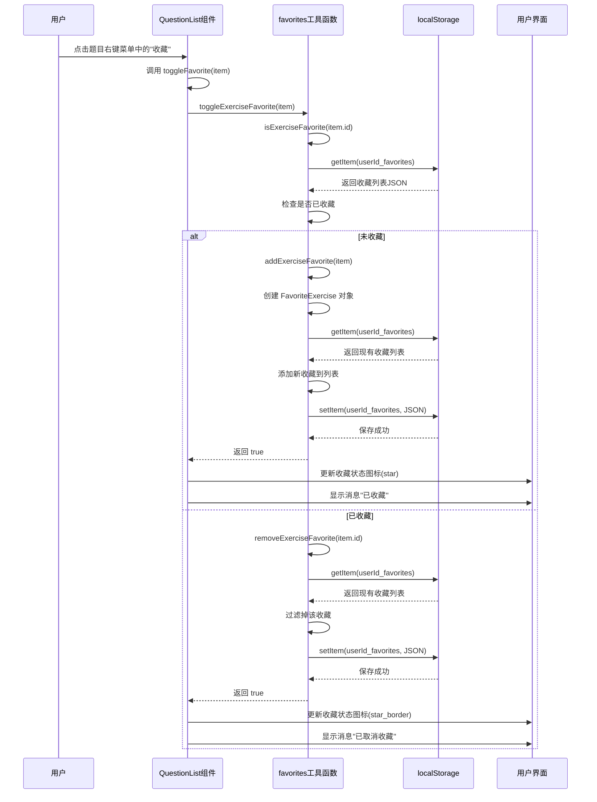
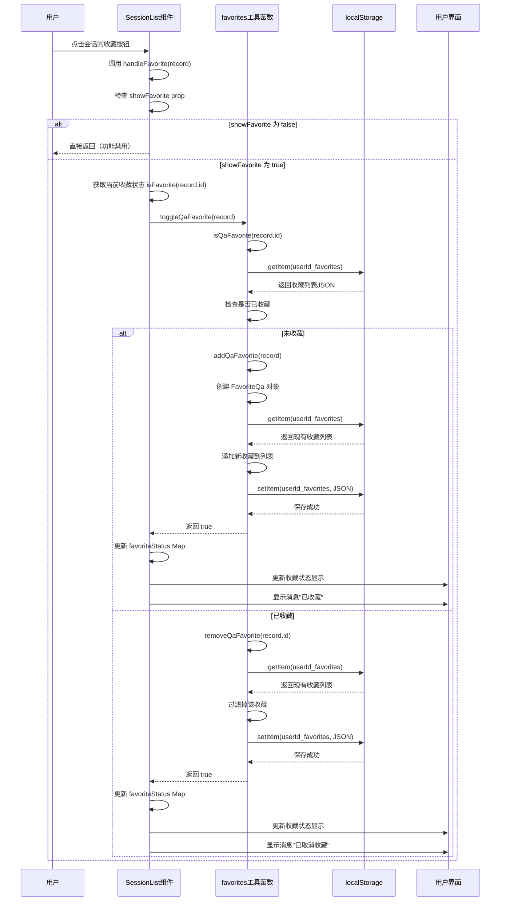
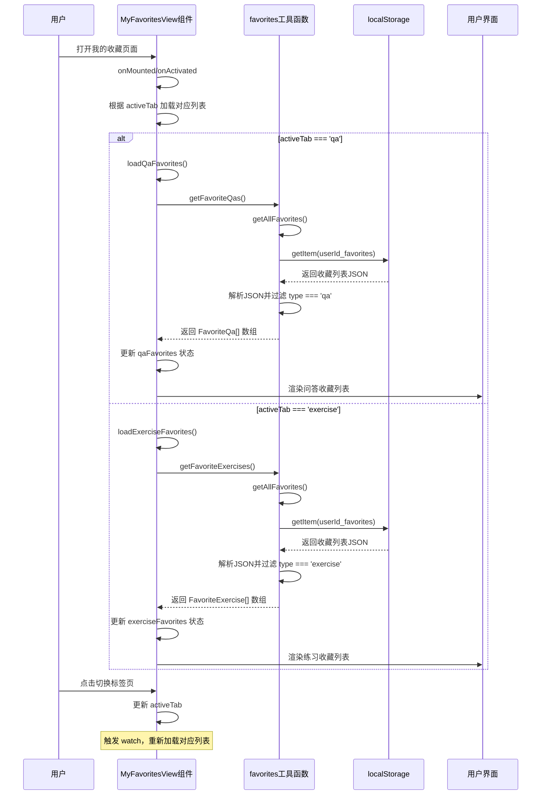
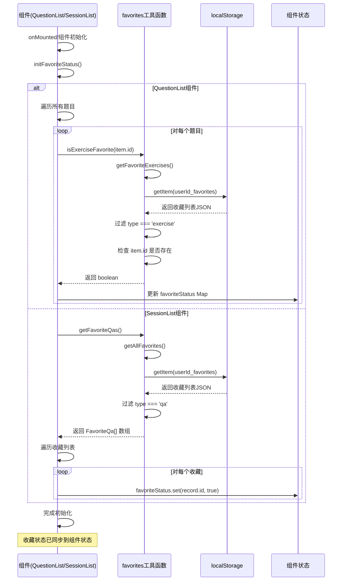

# 收藏功能分析文档

## 概述

本文档分析了代码库中所有实现收藏功能的位置和实现方式。

## 收藏功能核心工具

### 1. 收藏工具函数
**文件路径**: `imates-web/src/utils/storage/favorites.ts`

**功能说明**:
- 提供所有收藏功能的底层实现
- 使用 localStorage 存储收藏数据
- 支持三种类型的收藏：
  - **问答收藏** (FavoriteQa): 收藏问答会话
  - **练习收藏** (FavoriteExercise): 收藏练习题目
  - **会话收藏** (FavoriteSession): 收藏AI通用会话

**主要函数**:
- `getFavoriteQas()`: 获取所有收藏的问答会话
- `getFavoriteExercises()`: 获取所有收藏的练习题目
- `getFavoriteSessions()`: 获取所有收藏的会话
- `toggleQaFavorite()`: 切换问答收藏状态
- `toggleExerciseFavorite()`: 切换练习收藏状态
- `toggleSessionFavorite()`: 切换会话收藏状态
- `isQaFavorite()`: 检查问答是否已收藏
- `isExerciseFavorite()`: 检查题目是否已收藏
- `isSessionFavorite()`: 检查会话是否已收藏

## 收藏功能使用位置

### 1. 我的收藏页面
**文件路径**: `imates-web/src/views/MyFavoritesView.vue`

**功能说明**:
- 显示所有收藏的问答和练习题目
- 分为两个标签页：
  - **问答收藏**: 显示收藏的问答会话列表
  - **练习收藏**: 显示收藏的练习题目列表
- 支持查看、删除收藏的问答会话
- 支持点击练习卡片跳转到我的习题页面

**关键功能**:
- 加载收藏列表: `loadQaFavorites()`, `loadExerciseFavorites()`
- 删除问答会话: `handleDeleteSession()`
- 查看问答会话: `handleQaCardClick()`
- 跳转练习题目: `handleExerciseCardClick()`

### 2. 我的个人资料页面
**文件路径**: `imates-web/src/views/MyProfileView.vue`

**功能说明**:
- 提供"我的收藏"功能卡片
- 点击后跳转到我的收藏页面

**关键代码**:
```vue
<div class="feature-card favorites-card" @click="showFavorites">
  
  <div class="card-text">我的收藏</div>
</div>
```

### 3. 会话树组件
**文件路径**: `imates-web/src/components/SessionTree.vue`

**功能说明**:
- 在会话树的右键菜单中提供收藏功能
- 可以收藏/取消收藏AI通用会话
- 收藏状态会显示在会话节点上

**关键功能**:
- `handleFavorite()`: 处理收藏/取消收藏操作
- 使用 `toggleSessionFavorite()` 切换收藏状态
- 使用 `isSessionFavorite()` 检查收藏状态

**关键代码位置**:
```99:111:imates-web/src/components/SessionTree.vue
                        <q-item
                          v-if="prop.node.category === 'ai'"
                          clickable
                          v-close-popup
                          @click="handleFavorite(prop.node)"
                        >
                          <q-item-section avatar>
                            <q-icon 
                              :name="prop.node.favorited ? 'star' : 'star_border'" 
                              size="xs"
                              :color="prop.node.favorited ? 'warning' : undefined"
                            />
                          </q-item-section>
                          <q-item-section>
                            {{ prop.node.favorited ? '取消收藏' : '收藏' }}
                          </q-item-section>
                        </q-item>
```

### 4. 问题列表组件
**文件路径**: `imates-web/src/components/QuestionList.vue`

**功能说明**:
- 在题目列表的右键菜单中提供收藏功能
- 可以收藏/取消收藏练习题目
- 收藏状态会实时更新显示

**关键功能**:
- `toggleFavorite()`: 切换题目收藏状态
- `isExerciseFavorite()`: 检查题目是否已收藏
- `initFavoriteStatus()`: 初始化收藏状态
- 使用节流函数 `throttledToggleFavorite` 防止频繁操作

**关键代码位置**:
```155:181:imates-web/src/components/QuestionList.vue
                            <!-- 收藏 -->
                            <q-item
                              clickable
                              @click="
                                closeMenuAndExecute(item.id, () =>
                                  throttledToggleFavorite(item.question!),
                                )
                              "
                              class="menu-item"
                            >
                              <q-item-section avatar>
                                <q-icon
                                  :name="
                                    isExerciseFavorite(item.question!.id) ? 'star' : 'star_border'
                                  "
                                  :color="
                                    isExerciseFavorite(item.question!.id) ? 'warning' : 'grey-7'
                                  "
                                  size="20px"
                                />
                              </q-item-section>
                              <q-item-section>
                                {{
                                  isExerciseFavorite(item.question!.id) ? '取消收藏' : '收藏题目'
                                }}
                              </q-item-section>
                            </q-item>
```

### 5. 会话列表组件
**文件路径**: `imates-web/src/components/SessionList.vue`

**功能说明**:
- 在会话列表中提供收藏功能（可选）
- 通过 `showFavorite` prop 控制是否显示收藏功能
- 可以收藏/取消收藏问答会话

**关键功能**:
- `handleFavorite()`: 处理收藏/取消收藏操作
- `isFavorite()`: 检查会话是否已收藏
- `initFavoriteStatus()`: 初始化收藏状态

**关键代码位置**:
```374:389:imates-web/src/components/SessionList.vue
// 第7步：处理收藏/取消收藏
const handleFavorite = (record: QuestionRecord) => {
  // 如果禁用收藏功能，直接返回
  if (!props.showFavorite) return
  
  const wasFavorite = isFavorite(record.id)
  const success = toggleQaFavorite(record)
  
  if (success) {
    // 更新收藏状态
    favoriteStatus.value.set(record.id, !wasFavorite)
    showMessage(!wasFavorite ? '已收藏' : '已取消收藏', 'success')
  } else {
    showMessage('操作失败，请重试', 'error')
  }
}
```

### 6. 拍照搜索输入组件
**文件路径**: `imates-web/src/components/PhotoSearchInput.vue`

**功能说明**:
- 在拍照搜索界面提供收藏功能
- 可以收藏当前显示的练习题目
- 收藏状态会实时更新

**关键功能**:
- `handleFavorite()`: 处理收藏/取消收藏操作
- `checkFavoriteStatus()`: 检查收藏状态
- 监听题目变化，自动更新收藏状态

**关键代码位置**:
```136:151:imates-web/src/components/PhotoSearchInput.vue
// 处理收藏
const handleFavorite = () => {
  if (!props.currentQuestion) {
    showMessage('没有可收藏的题目', 'warning')
    return
  }
  
  const success = toggleExerciseFavorite(props.currentQuestion)
  if (success) {
    isFavorite.value = !isFavorite.value
    showMessage(isFavorite.value ? '已收藏' : '已取消收藏', 'success')
    emit('favorite')
  } else {
    showMessage('操作失败，请重试', 'error')
  }
}
```

## 收藏数据类型

### 1. 问答收藏 (FavoriteQa)
```typescript
interface FavoriteQa {
  id: string
  type: 'qa'
  record: QuestionRecord
  timestamp: number
}
```

### 2. 练习收藏 (FavoriteExercise)
```typescript
interface FavoriteExercise {
  id: string
  type: 'exercise'
  item: ExerciseItem
  timestamp: number
}
```

### 3. 会话收藏 (FavoriteSession)
```typescript
interface FavoriteSession {
  id: string
  type: 'session'
  session: AiGeneralSession
  timestamp: number
}
```

## 存储方式

- **存储位置**: localStorage
- **存储键名**: `${userId}_favorites` (带用户ID前缀)
- **存储格式**: JSON数组，包含所有类型的收藏数据

## 时序图

### 1. 收藏练习题目时序图

以下时序图展示了在问题列表组件中收藏练习题目的完整流程：



### 2. 收藏问答会话时序图

以下时序图展示了在会话列表组件中收藏问答会话的完整流程：



### 3. 查看收藏列表时序图

以下时序图展示了在我的收藏页面中查看收藏列表的完整流程：



### 4. 初始化收藏状态时序图

以下时序图展示了组件初始化时加载收藏状态的流程：



## 总结

### 收藏功能分布

1. **问答收藏** (3个位置):
   - 会话列表组件 (SessionList.vue)
   - 我的收藏页面 (MyFavoritesView.vue) - 显示和管理
   - 我的个人资料页面 (MyProfileView.vue) - 入口

2. **练习收藏** (2个位置):
   - 问题列表组件 (QuestionList.vue)
   - 拍照搜索输入组件 (PhotoSearchInput.vue)
   - 我的收藏页面 (MyFavoritesView.vue) - 显示和管理

3. **会话收藏** (1个位置):
   - 会话树组件 (SessionTree.vue)

### 收藏功能特点

- ✅ 统一的工具函数管理所有收藏操作
- ✅ 支持三种类型的收藏（问答、练习、会话）
- ✅ 使用 localStorage 持久化存储
- ✅ 支持用户隔离（通过用户ID前缀）
- ✅ 实时更新收藏状态显示
- ✅ 提供统一的收藏管理页面

### 注意事项

1. **收藏状态同步**: 各个组件需要自行维护收藏状态的显示，通过监听数据变化或手动刷新
2. **性能优化**: 部分组件使用节流函数防止频繁操作
3. **错误处理**: 所有收藏操作都有错误处理，失败时会显示错误提示
4. **用户体验**: 收藏操作后会显示成功/失败提示消息

