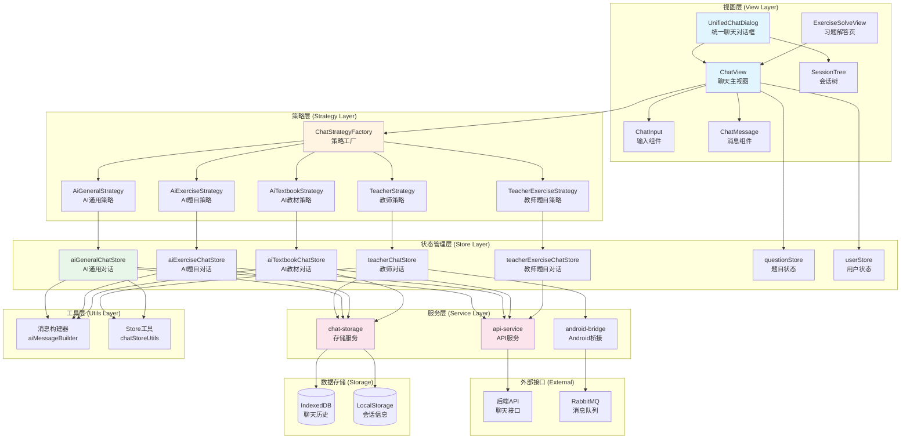
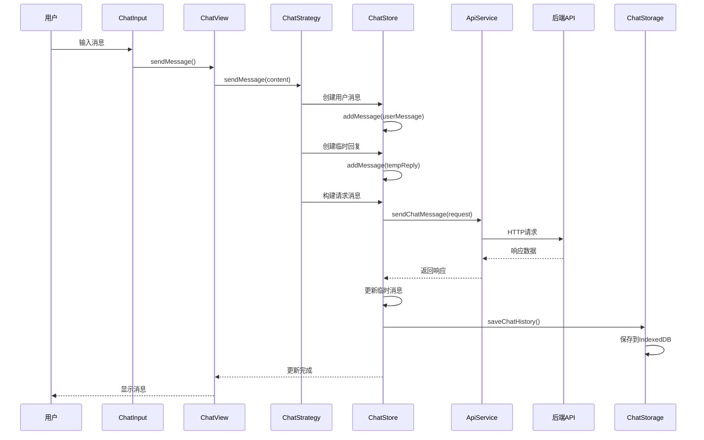
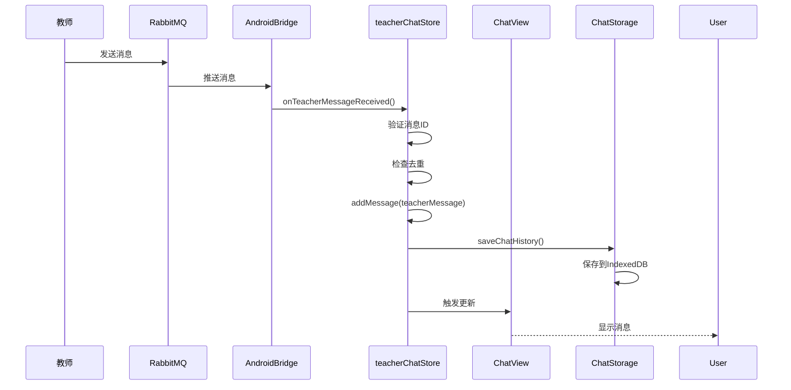
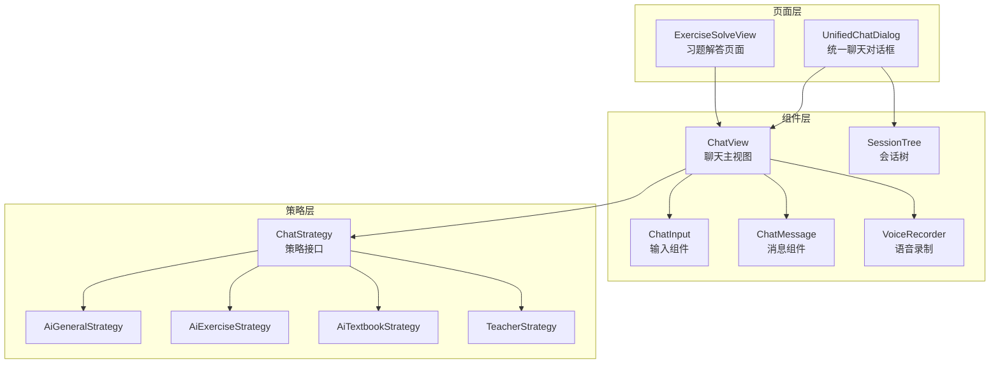
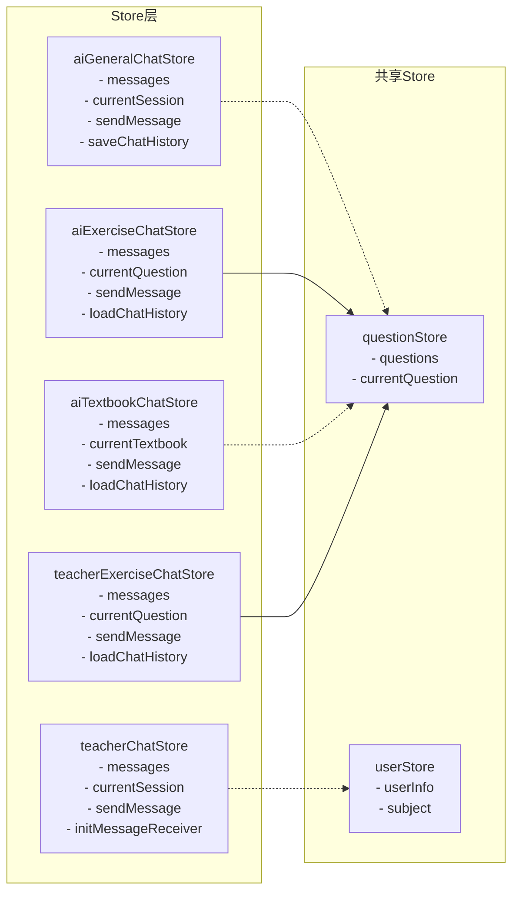
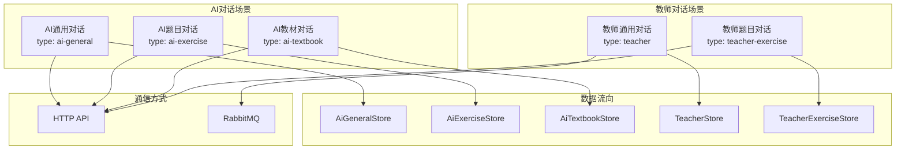
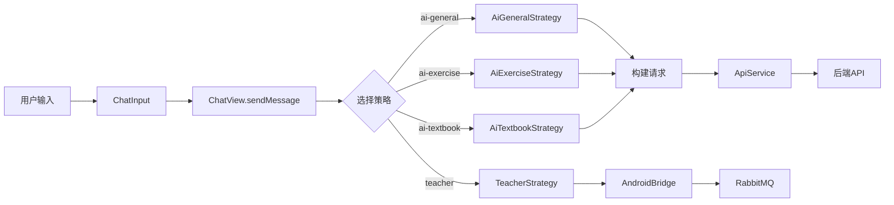
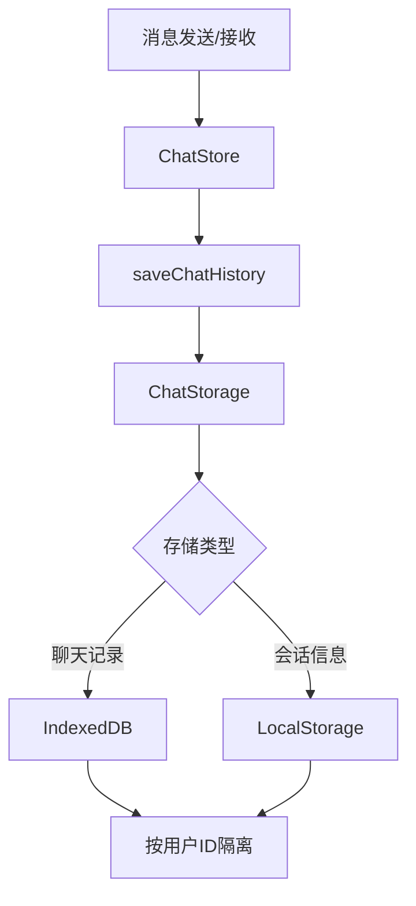

# Vue项目聊天功能架构图

## 一、整体架构图



## 二、数据流图

### 2.1 发送消息流程



### 2.2 接收消息流程（教师对话）



## 三、组件层次结构



## 四、Store架构



## 五、聊天场景分类



## 六、核心功能模块

### 6.1 消息发送模块



### 6.2 消息存储模块



### 6.3 会话管理模块

```mermaid
graph TB
    A[创建会话] --> B[ChatStore.createSession]
    B --> C{会话类型}
    C -->|AI通用| D[生成UUID]
    C -->|AI题目| E[基于题目ID]
    C -->|教师| F[teacher-{hex}-{timestamp}]
    D --> G[保存到LocalStorage]
    E --> G
    F --> G
    G --> H[加载历史消息]
    H --> I[从IndexedDB读取]
```

## 七、技术栈

| 层级 | 技术/工具 |
|------|----------|
| 视图层 | Vue 3 + Quasar |
| 状态管理 | Pinia |
| 策略模式 | TypeScript Interface |
| 存储 | IndexedDB (localforage) + LocalStorage |
| HTTP请求 | Axios |
| 消息队列 | RabbitMQ (通过Android Bridge) |
| 滚动控制 | BetterScroll |

## 八、关键设计模式

1. **策略模式 (Strategy Pattern)**
   - 不同聊天场景使用不同的策略类
   - 统一接口，便于扩展和维护

2. **工厂模式 (Factory Pattern)**
   - ChatStrategyFactory 根据 type 创建对应策略

3. **单例模式 (Singleton Pattern)**
   - ApiService、ChatStorage 使用单例模式

4. **观察者模式 (Observer Pattern)**
   - Store 响应式更新，组件自动刷新

## 九、数据流向总结

```
用户输入 
  ↓
ChatInput 组件
  ↓
ChatView 组件 (策略选择)
  ↓
ChatStrategy (具体策略)
  ↓
ChatStore (状态管理)
  ↓
ApiService / AndroidBridge (服务层)
  ↓
后端API / RabbitMQ (外部接口)
  ↓
响应处理
  ↓
ChatStore 更新状态
  ↓
ChatStorage 持久化
  ↓
UI 自动更新
```

## 十、关键文件清单

### 组件文件
- `src/components/ChatView.vue` - 聊天主视图
- `src/components/UnifiedChatDialog.vue` - 统一聊天对话框
- `src/components/SessionTree.vue` - 会话树
- `src/components/chat/ChatInput.vue` - 输入组件
- `src/components/chat/ChatMessage.vue` - 消息组件

### Store文件
- `src/stores/aiGeneralChatStore.ts` - AI通用对话
- `src/stores/aiExerciseChatStore.ts` - AI题目对话
- `src/stores/aiTextbookChatStore.ts` - AI教材对话
- `src/stores/teacherChatStore.ts` - 教师对话
- `src/stores/teacherExerciseChatStore.ts` - 教师题目对话

### 策略文件
- `src/components/chat/strategies/ChatStrategy.ts` - 策略接口
- `src/components/chat/strategies/ChatStrategyFactory.ts` - 策略工厂
- `src/components/chat/strategies/AiGeneralStrategy.ts` - AI通用策略
- `src/components/chat/strategies/AiExerciseStrategy.ts` - AI题目策略
- `src/components/chat/strategies/AiTextbookStrategy.ts` - AI教材策略
- `src/components/chat/strategies/TeacherStrategy.ts` - 教师策略

### 服务文件
- `src/services/api-service.ts` - API服务
- `src/services/chat-storage.ts` - 存储服务
- `src/services/android-bridge.ts` - Android桥接

### 工具文件
- `src/stores/utils/aiMessageBuilder.ts` - 消息构建器
- `src/stores/utils/chatStoreUtils.ts` - Store工具函数

