# 资源管理下拉刷新时序图

## 📋 概述

本文档分析 `MyResourcesView.vue` 中下拉刷新功能的完整时序流程，包括用户交互、事件处理、数据加载和状态更新的各个环节。

## 🎯 核心组件

- **MyResourcesView.vue**：资源管理主视图
- **BetterScroll (BScroll)**：滚动容器，提供下拉刷新能力
- **ResourceManager**：资源管理器，处理本地数据存储
- **ApiService**：API 服务，处理服务器请求

## 🔄 完整时序图

```mermaid
sequenceDiagram
    participant User as 用户
    participant BScroll as BetterScroll
    participant View as MyResourcesView
    participant RefreshHandler as handlePullDownRefresh
    participant ResourceLoader as loadResources
    participant ResourceManager as ResourceManager
    participant ApiService as ApiService
    participant Server as 服务器
    participant IndexedDB as IndexedDB

    Note over User,IndexedDB: 阶段1：用户下拉触发
    
    User->>BScroll: 手指下拉操作
    BScroll->>BScroll: scroll 事件触发<br/>(pos.y > 0)
    BScroll->>View: 更新 pullDistance<br/>refreshStatus = 'pulling'
    View->>View: 显示"下拉刷新"提示
    
    User->>BScroll: 继续下拉超过阈值<br/>(PULL_THRESHOLD)
    BScroll->>View: 更新提示为"释放刷新"
    
    User->>BScroll: 释放手指
    BScroll->>BScroll: pullingDown 事件触发
    BScroll->>RefreshHandler: 调用 handlePullDownRefresh()
    RefreshHandler->>View: isPullingDown = true<br/>refreshStatus = 'refreshing'
    View->>View: 显示刷新动画
    
    Note over User,IndexedDB: 阶段2：暂停下载任务
    
    RefreshHandler->>View: pauseAllDownloadingTasks()
    View->>View: 查找所有 downloadStatus === 1 的教材
    loop 每个正在下载的教材
        View->>ApiService: pauseDownload(textbookId)
        ApiService->>Server: POST /pauseDownload
        Server-->>ApiService: 返回暂停结果
        ApiService-->>View: 返回 success
        View->>View: 更新教材状态为已暂停<br/>(downloadStatus = 3)
        View->>ResourceManager: updateTextbookInfo(textbook)
        ResourceManager->>IndexedDB: 更新教材数据
    end
    
    Note over User,IndexedDB: 阶段3：加载资源数据
    
    RefreshHandler->>ResourceLoader: loadResources()
    ResourceLoader->>ResourceManager: loadLocalData()
    ResourceManager->>IndexedDB: getUserLocalTextbooks()
    IndexedDB-->>ResourceManager: 返回本地教材列表
    ResourceManager-->>ResourceLoader: 返回 localTextbooks
    
    Note over ResourceLoader: 下拉刷新时强制从服务器获取<br/>不使用本地缓存
    
    ResourceLoader->>View: loading = true
    ResourceLoader->>ResourceManager: isLoggedIn()
    ResourceManager-->>ResourceLoader: 返回登录状态
    
    alt 未登录
        ResourceLoader->>ApiService: autoLogin(true)
        ApiService->>Server: 自动登录请求
        Server-->>ApiService: 返回登录结果
        alt 登录失败
            ApiService-->>ResourceLoader: 返回 false
            ResourceLoader->>View: textbooks.value = []
            ResourceLoader->>View: initialLoadCompleted = true
            ResourceLoader-->>RefreshHandler: 返回（提前结束）
        else 登录成功
            ApiService-->>ResourceLoader: 返回 true
        end
    end
    
    Note over User,IndexedDB: 阶段4：获取服务器数据
    
    ResourceLoader->>ApiService: fetchUserAllOnlineTextbooks()
    ApiService->>Server: POST /fetchUserAllOnlineTextbooks
    Server-->>ApiService: 返回教材列表
    ApiService-->>ResourceLoader: 返回 serverTextbooks
    
    Note over User,IndexedDB: 阶段5：合并和检查数据
    
    ResourceLoader->>View: mergeServerAndLocalData()<br/>(serverTextbooks, localTextbooks)
    View->>View: 合并服务器和本地数据<br/>保留本地状态和进度
    View-->>ResourceLoader: 返回 mergedTextbooks
    
    ResourceLoader->>View: checkLearningPackagesForAllTextbooks()<br/>(mergedTextbooks)
    par 并行检查每个教材的学习资源包
        View->>ApiService: getLearningResources(textbook.id, false)
        ApiService->>Server: GET /learningResources
        Server-->>ApiService: 返回资源包列表
        ApiService-->>View: 返回 packages
        View->>View: textbook.learningPackages = packages
    end
    View-->>ResourceLoader: 检查完成
    
    Note over User,IndexedDB: 阶段6：更新本地数据
    
    loop 每个合并后的教材
        ResourceLoader->>ResourceManager: updateTextbookInfo(textbook)
        ResourceManager->>IndexedDB: 更新教材数据
        IndexedDB-->>ResourceManager: 更新成功
        ResourceManager-->>ResourceLoader: 返回成功
    end
    
    Note over User,IndexedDB: 阶段7：更新视图
    
    ResourceLoader->>View: textbooks.value = mergedTextbooks
    View->>View: nextTick() 等待 DOM 更新
    View->>BScroll: refresh() 刷新滚动尺寸
    
    ResourceLoader->>View: updateSubjectChips()
    View->>View: 更新学科筛选选项
    View->>View: nextTick() 等待 DOM 更新
    View->>BScroll: refresh() 再次刷新尺寸
    
    ResourceLoader->>View: loading = false
    ResourceLoader->>View: initialLoadCompleted = true
    ResourceLoader->>View: nextTick() 最终等待
    View->>BScroll: refresh() 最终刷新
    ResourceLoader-->>RefreshHandler: 返回成功
    
    Note over User,IndexedDB: 阶段8：完成刷新动画
    
    RefreshHandler->>View: refreshStatus = 'success'
    View->>View: nextTick() 等待 DOM 更新
    View->>BScroll: refresh() 刷新尺寸
    View->>BScroll: finishPullDown() 完成下拉动画
    View->>View: nextTick() + requestAnimationFrame
    View->>BScroll: refresh() 再次刷新尺寸
    
    RefreshHandler->>View: refreshStatus = 'idle'
    RefreshHandler->>View: isPullingDown = false
    RefreshHandler->>View: pullDistance = 0
    View->>View: 隐藏刷新提示
```



## 📊 关键流程说明

### 1. 用户交互阶段

**触发条件**：
- 用户在列表顶部向下拉动
- BetterScroll 检测到 `pos.y > 0`（向下滚动超过顶部）
- 下拉距离超过阈值 `PULL_THRESHOLD`

**状态变化**：
```
idle → pulling → refreshing → success → idle
```

### 2. 暂停下载任务

**目的**：下拉刷新时暂停所有正在下载的任务，避免干扰数据刷新

**处理逻辑**：
1. 查找所有 `downloadStatus === 1` 的教材
2. 并行调用 `pauseDownload` API 暂停每个任务
3. 更新教材状态为 `downloadStatus = 3`（已暂停）
4. 保存暂停状态到 IndexedDB

### 3. 数据加载流程

**关键决策点**：
- **下拉刷新时**：强制从服务器获取最新数据，不使用本地缓存
- **正常加载时**：优先显示本地数据，后台同步服务器数据

**数据加载步骤**：
1. **加载本地数据**：从 IndexedDB 获取本地教材列表
2. **检查登录状态**：如果未登录，尝试自动登录
3. **获取服务器数据**：调用 `fetchUserAllOnlineTextbooks()` API
4. **合并数据**：将服务器数据和本地数据合并，保留本地状态
5. **检查学习资源包**：并行检查每个教材的学习资源包
6. **更新本地存储**：将合并后的数据保存到 IndexedDB

### 4. 数据合并策略

**mergeServerAndLocalData** 合并逻辑：
- **服务器存在的教材**：
  - 如果本地也有：合并两者，保留本地下载状态和进度
  - 如果本地没有：创建新教材，初始化默认状态
- **本地独有的教材**：添加到合并列表（防止数据丢失）

**保留的本地字段**：
- `localFiles`：本地文件列表
- `downloadStatus`：下载状态
- `downloadedFiles`：已下载文件数
- `isDownloaded`：是否已下载
- `lastDownloadTime`：最后下载时间

### 5. 视图更新流程

**更新顺序**：
1. 更新 `textbooks.value`（触发响应式更新）
2. 等待 DOM 更新（`nextTick()`）
3. 刷新 BetterScroll 尺寸（`refresh()`）
4. 更新学科筛选选项（`updateSubjectChips()`）
5. 再次等待 DOM 更新
6. 再次刷新 BetterScroll 尺寸

**多次刷新的原因**：
- `updateSubjectChips()` 可能修改 DOM 结构
- BetterScroll 需要重新计算滚动区域尺寸
- 确保滚动位置和状态正确

### 6. 完成刷新动画

**关键步骤**：
1. 设置刷新状态为 `success`
2. 等待 DOM 更新
3. 刷新 BetterScroll 尺寸
4. 调用 `finishPullDown()` 完成动画
5. 等待动画完成（`nextTick()` + `requestAnimationFrame`）
6. 最终刷新尺寸
7. 重置所有状态为 `idle`

## 🔍 关键代码位置

### 初始化 BetterScroll
**文件**：`imates-web/src/views/MyResourcesView.vue`  
**行号**：584-638

### 下拉刷新处理
**文件**：`imates-web/src/views/MyResourcesView.vue`  
**行号**：640-711

### 数据加载
**文件**：`imates-web/src/views/MyResourcesView.vue`  
**行号**：1177-1296

### 暂停下载任务
**文件**：`imates-web/src/views/MyResourcesView.vue`  
**行号**：1714-1752

## ⚠️ 注意事项

### 1. 状态管理
- `isPullingDown` 标志用于区分下拉刷新和正常加载
- 下拉刷新时强制从服务器获取数据，不使用本地缓存
- 刷新状态必须在 `finally` 块中重置，确保异常时也能正确恢复

### 2. 性能优化
- 学习资源包检查使用并行处理（`Promise.all`）
- 暂停下载任务使用并行处理
- 多次调用 `refresh()` 确保 BetterScroll 尺寸计算正确

### 3. 错误处理
- 登录失败时提前返回，不继续加载数据
- 数据加载失败时显示错误提示，但不影响界面状态
- 所有异常都在 `try-catch` 中处理，确保刷新流程完整

### 4. DOM 更新同步
- 使用 `nextTick()` 确保 DOM 更新完成后再刷新 BetterScroll
- 使用 `requestAnimationFrame` 确保动画完成后再刷新尺寸
- 多次刷新确保不同阶段的 DOM 变化都被正确计算

## 🧪 测试要点

### 功能测试
1. **下拉触发测试**：
   - 验证下拉距离小于阈值时显示"下拉刷新"
   - 验证下拉距离超过阈值时显示"释放刷新"
   - 验证释放后触发刷新流程

2. **数据刷新测试**：
   - 验证下拉刷新时强制从服务器获取数据
   - 验证服务器数据正确合并到本地数据
   - 验证学习资源包检查正确执行

3. **状态更新测试**：
   - 验证刷新状态正确变化（pulling → refreshing → success → idle）
   - 验证下载任务正确暂停
   - 验证视图正确更新

4. **错误处理测试**：
   - 验证网络错误时显示错误提示
   - 验证登录失败时正确处理
   - 验证异常时状态正确恢复

### 性能测试
1. 验证大量教材时的刷新性能
2. 验证并行处理的有效性
3. 验证多次 `refresh()` 调用的必要性

## 📚 相关文档

- [MyResourcesView.vue 实现文档](./src/views/MyResourcesView.vue.md)
- [ResourceManager 服务文档](../services/resource-storage.md)
- [ApiService 服务文档](../services/api-service.md)

