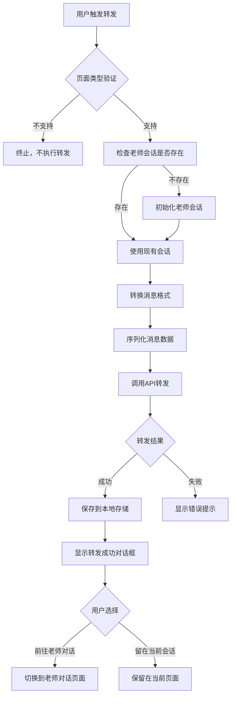

# 转发给老师场景与业务流程分析

## 一、功能概述

"转发给老师"功能允许学生将AI对话中的消息转发给老师，实现学生与老师之间的沟通。该功能仅在AI对话场景下可用，支持单条消息转发和批量消息转发两种模式。

## 二、使用场景

### 2.1 支持的页面类型

转发功能仅在以下三种AI对话页面中可用：

1. **AI通用对话页面** (`ai-general`)
   - 通用AI对话场景
   - 学生可以咨询各种问题

2. **AI题目对话页面** (`ai-exercise`)
   - 题目解答场景
   - 学生可以针对具体题目进行提问

3. **AI教材对话页面** (`ai-textbook`)
   - 教材内容学习场景
   - 学生可以针对教材内容提问

### 2.2 不支持转发的场景

- **老师对话页面** (`teacher`)：老师对话页面本身不支持转发功能
- **其他页面类型**：任何非AI对话页面都不支持转发

## 三、触发方式

### 3.1 单条消息转发

**触发入口：**
- 消息气泡长按/右键菜单中的"转发"按钮
- 消息操作菜单中的"转发"选项

**显示条件：**
- 当前页面类型为 `ai-general`、`ai-exercise` 或 `ai-textbook`
- 消息为最后一条消息（功能按钮仅显示在最后一条消息上）
- 消息不是欢迎消息（ID不以 `welcome_` 开头）
- 消息不是流式输出状态（AI消息需等待流式输出完成）

**触发流程：**
```typescript
handleForwardMessage(message)
  ↓
验证页面类型
  ↓
选择老师会话（显示选择对话框）
  ↓
用户选择会话或创建新会话
  ↓
调用 forwardMessageToTeacher([message])
  ↓
显示转发结果对话框
```

### 3.2 批量消息转发

**触发入口：**
- 多选模式工具栏中的"转发"按钮

**进入多选模式的方式：**
1. 长按任意消息
2. 点击消息操作菜单中的"多选"选项

**多选模式工具栏功能：**
- 显示已选择消息数量
- 全选/取消全选按钮
- 转发按钮（仅在选择消息后启用）
- 关闭选择模式按钮

**触发流程：**
```typescript
forwardToTeacher()
  ↓
获取选中的消息列表
  ↓
退出选择模式
  ↓
选择老师会话（显示选择对话框）
  ↓
用户选择会话或创建新会话
  ↓
调用 forwardAsSeparateMessages(selectedMessages, '')
  ↓
逐条转发消息
  ↓
显示转发结果对话框
```

## 四、业务流程详解

### 4.1 选择老师会话

**功能说明：**
转发消息前，系统会显示一个对话框，让用户选择要转发到的老师会话。如果用户没有现有的老师会话，系统会自动创建一个默认会话。

**选择对话框：**
- 标题：选择转发给哪位老师
- 内容：显示所有可用的老师会话列表（按创建时间倒序）
- 选项：
  - 现有会话列表（显示会话名称，如"生物答疑"、"数学答疑"等）
  - "新建会话"选项（用于创建新的老师会话）
- 按钮：
  - 取消：取消转发操作
  - 确定：确认选择并继续转发

**会话列表来源：**
- 从localStorage加载当前用户的所有老师会话
- 会话格式：`{userId}_teacher_chat_{sessionId}_session`
- 会话按创建时间倒序排列（最新的在前）

**特殊情况处理：**
- 如果没有现有会话，系统会自动创建默认会话并转发，不显示选择对话框
- 用户选择"新建会话"时，系统会创建新的老师会话并转发

### 4.2 完整业务流程



### 4.2 消息格式转换流程

**第1步：消息清理与转换**
```typescript
convertMessageForForwarding(message)
  ↓
1. 获取消息类型（TEXT/IMAGE/VOICE）
2. 根据发送者添加角色前缀：
   - 用户消息：[学生] + 内容
   - AI消息：[AI助手] + 内容
3. 清理LaTeX公式：
   - 移除 $...$ 格式的LaTeX
   - 移除 \command 格式的LaTeX命令
   - 移除LaTeX括号 {}()[]
   - 合并多个空格
4. 构建转发格式对象：
   {
     id: 消息ID,
     type: 消息类型（TEXT/IMAGE/VOICE）,
     content: 清理后的内容,
     timestamp: ''
   }
```

**第2步：序列化**
```typescript
JSON.stringify(cleanedMessages)
  ↓
生成JSON字符串
  ↓
传递给原生接口
```

### 4.3 原生接口调用流程

**前端调用链：**
```
ChatView.forwardMessageToTeacher()
  ↓
ApiService.forwardAiChatToTeacher()
  ↓
AndroidBridge.forwardAiChatToTeacher()
  ↓
WebAppInterface.forwardAiChatToTeacher()
```

**Android端处理流程：**

**第1步：验证用户登录**
```java
userId = AppUtils.getUserId()
if (userId == null) {
    return 错误响应：用户未登录
}
```

**第2步：检查RabbitMQ连接状态**
```java
if (!MessagingManager.isInitialized()) {
    if (正在初始化中) {
        等待初始化完成（最多10秒）
    } else {
        自动初始化MessagingManager
        等待初始化完成（最多10秒）
    }
}
if (初始化失败) {
    return 错误响应：RabbitMQ连接未初始化
}
```

**第3步：解析消息列表**
```java
JSONArray messagesArray = new JSONArray(selectedMessagesData)
if (messagesArray.length() == 0) {
    return 错误响应：消息列表为空
}
```

**第4步：获取学科信息**
```java
从SharedPreferences获取当前教师科目
- 如果为BIOLOGY -> subject = "biology"
- 否则 -> subject = "math"
```

**第5步：遍历消息列表，根据类型发送**
```java
for (每条消息) {
    messageType = message.optString("type")
    
    if (messageType == "TEXT") {
        调用 sendTextMessageToTeacher(content, sessionId, subject)
    } else if (messageType == "IMAGE") {
        调用 sendPictureToTeacher(imagePath, sessionId, subject)
    } else if (messageType == "VOICE") {
        调用 sendVoiceMessageToTeacher(voicePath, duration, sessionId, subject)
    }
    
    统计成功/失败数量
    每条消息之间延迟50ms
}
```

**第6步：返回结果**
```java
if (全部成功) {
    return 成功响应：所有消息转发成功
} else if (部分成功) {
    return 部分成功响应：成功X条，失败Y条
} else {
    return 失败响应：所有消息转发失败
}
```

### 4.4 本地存储流程

**转发成功后：**
```typescript
1. 转换消息格式：
   - 添加 forwarded_ 前缀到消息ID
   - 设置 sender = 'user'
   - 设置 type = 'user'

2. 添加到老师消息存储：
   teacherStore.messages.push(...convertedMessages)

3. 持久化保存：
   await teacherStore.saveChatHistory()
```

### 4.5 用户交互流程

**转发成功后的对话框：**

**注意：** AI题目对话页面（`ai-exercise`）不显示对话框，只显示简单的成功提示消息。

**其他页面（AI通用、AI教材）的对话框：**
```
标题：转发成功
内容：消息已成功转发给老师，是否前往老师对话查看？
选项：
  - 留在当前会话（取消按钮）
  - 前往老师对话（确定按钮）
```

**AI题目对话页面：**
```
仅显示简单的成功提示消息：
- 单条消息转发：显示 "转发成功"
- 批量消息转发：显示 "转发成功，已转发 X 条消息"
```

**用户选择"前往老师对话"：**
```typescript
emit('open-teacher-dialog', {
  sessionId: teacherSession.value.sessionId,
  message: message
})
// 或
emit('switchToTeacher', {
  messages: messages,
  currentQuestion: currentQuestion.value,
  additionalMessage: additionalMessage,
  forwardMode: 'separate',
  successCount: successCount
})
```

**用户选择"留在当前会话"：**
```typescript
showMessage('转发成功，已留在当前会话', 'success')
// 或
showMessage(`转发成功，已转发 ${successCount} 条消息`, 'success')
```

## 五、支持的消息类型

### 5.1 文本消息 (TEXT)

**转换规则：**
- 添加角色前缀：[学生] 或 [AI助手]
- 清理LaTeX公式
- 保留原始文本内容

**发送方式：**
```java
sendTextMessageToTeacher(content, teacherSessionId, subject)
```

### 5.2 图片消息 (IMAGE)

**转换规则：**
- 从消息的 `imageData.filePath` 获取图片路径
- 内容字段传递图片路径或base64数据

**发送方式：**
```java
sendPictureToTeacher(imagePath, teacherSessionId, subject)
```

**注意事项：**
- Android端会将文件路径转换为base64
- base64DataUrl仅用于前端UI显示，不用于发送

### 5.3 语音消息 (VOICE)

**转换规则：**
- 从消息的 `voiceData.filePath` 获取语音路径
- 从消息的 `voiceData.duration` 获取语音时长

**发送方式：**
```java
sendVoiceMessageToTeacher(voicePath, duration, teacherSessionId, subject)
```

## 六、错误处理

### 6.1 前端错误处理

**页面类型验证失败：**
```typescript
if (props.type !== 'ai-general' && props.type !== 'ai-exercise' && props.type !== 'ai-textbook') {
    console.warn('当前页面类型不支持转发:', props.type)
    return // 静默失败，不显示错误
}
```

**老师会话创建失败：**
```typescript
if (!teacherSession.value) {
    showMessage('无法创建老师会话', 'error')
    return
}
```

**API调用失败：**
```typescript
if (!success) {
    showMessage('转发失败，请重试', 'error')
    return
}
```

**序列化失败：**
```typescript
try {
    selectedMessagesData = JSON.stringify(cleanedMessages)
} catch (error) {
    console.error('序列化失败:', error)
    return false
}
```

### 6.2 Android端错误处理

**用户未登录：**
```java
return createResponse(false, "用户未登录", null)
```

**RabbitMQ未初始化且自动初始化失败：**
```java
return createResponse(false, "RabbitMQ连接未初始化，请稍后重试", null)
```

**消息列表为空：**
```java
return createResponse(false, "消息列表为空", null)
```

**消息格式错误：**
```java
return createResponse(false, "消息格式错误: " + e.getMessage(), null)
```

**部分消息转发失败：**
```java
return createResponse(false, "部分消息转发失败（成功X条，失败Y条）: " + errorMessages, null)
```

## 七、关键代码位置

### 7.1 前端核心代码

**消息转发入口：**
- `imates-web/src/components/ChatView.vue`
  - `handleForwardMessage()`: 单条消息转发处理
  - `forwardToTeacher()`: 批量消息转发处理
  - `forwardAsSeparateMessages()`: 逐条转发实现
  - `forwardMessageToTeacher()`: 统一转发函数
  - `convertMessageForForwarding()`: 消息格式转换

**转发按钮显示逻辑：**
- `imates-web/src/components/chat/ChatMessage.vue`
  - `canForward`: 判断是否可以转发
  - `handleForward`: 处理转发点击事件

**API调用：**
- `imates-web/src/services/api-service.ts`
  - `forwardAiChatToTeacher()`: API服务方法

**Android桥接：**
- `imates-web/src/services/android-bridge.ts`
  - `forwardAiChatToTeacher()`: Android桥接方法

**老师会话管理：**
- `imates-web/src/stores/teacherChatStore.ts`
  - `forwardMessagesToTeacher()`: 老师会话的消息转发方法

### 7.2 Android端核心代码

**原生接口实现：**
- `app/src/main/java/com/cosinetech/imates/ui/webview/common/WebAppInterface.java`
  - `forwardAiChatToTeacher()`: 主要的转发方法实现

## 八、性能优化

### 8.1 批量转发优化

**逐条发送：**
- 多条消息逐条发送，每条消息之间延迟50ms
- 避免消息发送过快导致服务器压力过大

**统计成功数量：**
- 统计每条消息的发送结果
- 即使部分消息失败，也显示成功数量

### 8.2 异步处理

**异步初始化会话：**
```typescript
if (!teacherSession.value) {
    await initializeTeacherSession()
}
```

**异步保存历史：**
```typescript
await teacherStore.saveChatHistory()
```

## 九、注意事项

### 9.1 消息格式限制

- LaTeX公式会被清理，只保留文本内容
- 图片和语音消息需要包含文件路径信息
- 消息ID会自动添加 `forwarded_` 前缀，避免与原消息冲突

### 9.2 会话管理

- 转发前会自动创建老师会话（如果不存在）
- 会话ID从 `teacherSession.value.sessionId` 获取
- 学科信息从SharedPreferences获取（默认数学）

### 9.3 RabbitMQ连接

- Android端会自动检查并初始化RabbitMQ连接
- 如果初始化失败，会返回错误提示
- 最多等待10秒初始化完成

### 9.4 用户体验

- 转发过程中显示"正在转发到老师..."提示
- 转发成功后询问是否前往老师对话
- 支持留在当前会话继续操作

## 十、总结

"转发给老师"功能是一个完整的消息转发系统，支持：

1. **多场景支持**：AI通用、AI题目、AI教材三种对话场景
2. **多触发方式**：单条消息转发和批量消息转发
3. **多消息类型**：文本、图片、语音消息
4. **完整错误处理**：前端和Android端都有完善的错误处理
5. **良好用户体验**：转发过程中有提示，转发成功后询问用户是否跳转

该功能通过前端Vue组件、API服务层、Android桥接层和原生Android代码的协同工作，实现了从AI对话到老师对话的完整消息转发流程。
