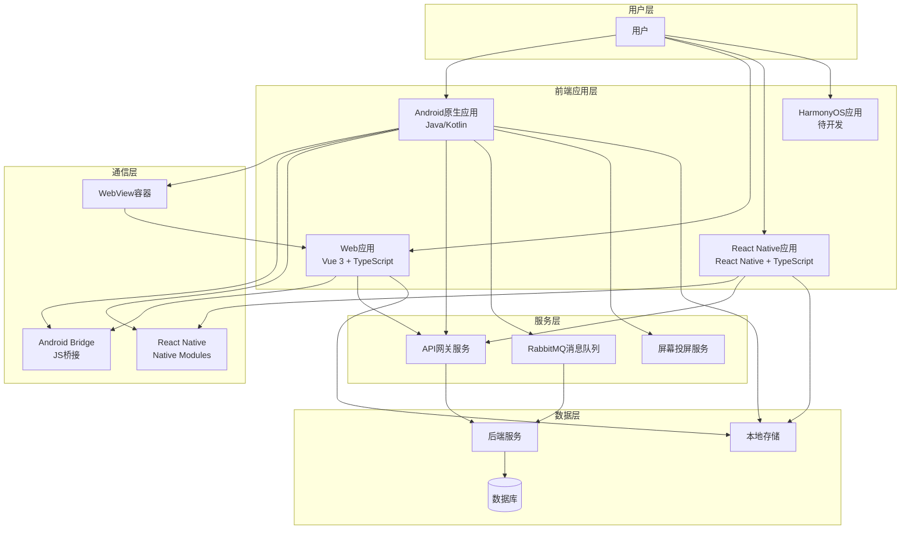
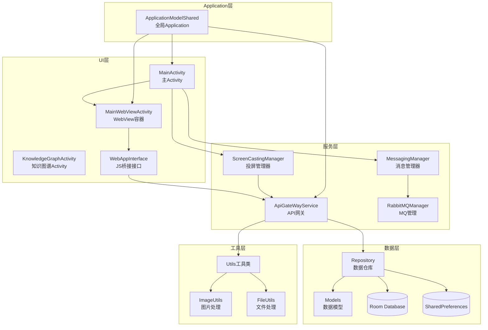
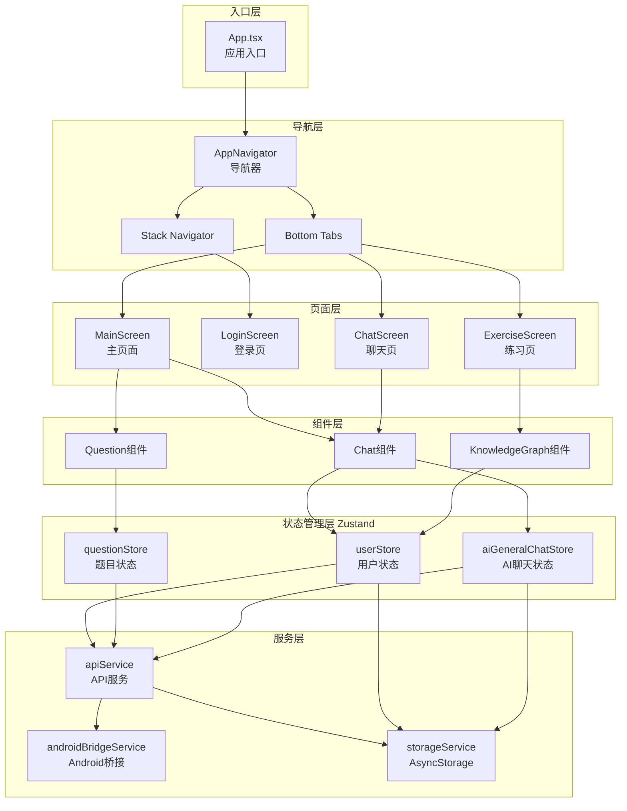
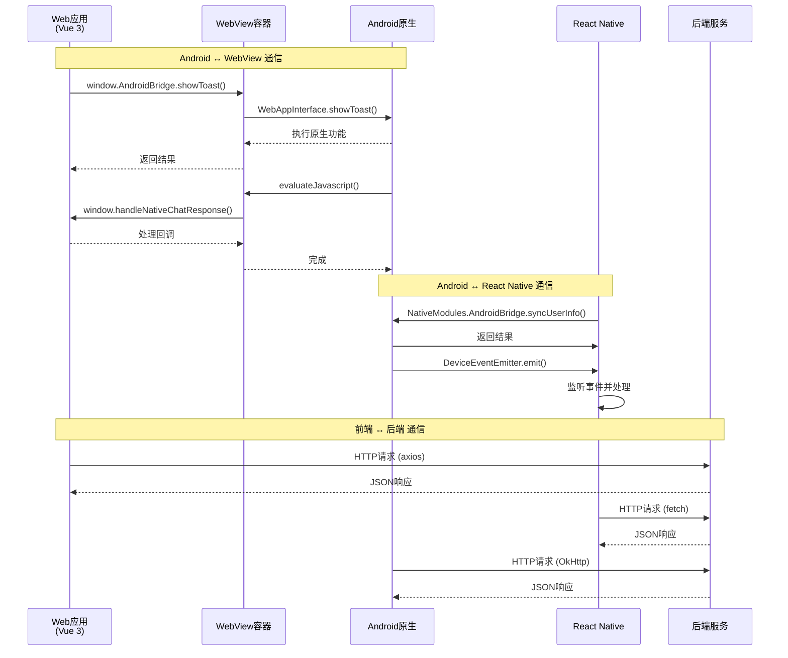
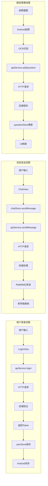
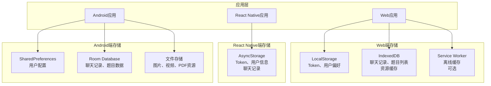

# 项目架构梳理

## 📋 概述

本项目是一个多平台教育应用系统，包含Android原生应用、Web应用（Vue 3）和React Native应用，主要用于学生学习和教师教学场景。

**项目名称**：研伴前端（iMates）  
**创建日期**：2025-11-08  
**架构版本**：v1.0

---

## 🏗️ 整体架构

### 1. 系统整体架构图



### 2. 项目结构

```
xuebanqianduan/
├── app/                    # Android原生应用
├── imates-web/            # Web应用（Vue 3）
├── imates-RN/             # React Native应用
├── imates-harmony/        # HarmonyOS应用（待开发）
├── pdflibrary/            # PDF库模块
├── image/                 # 图片处理模块
└── 项目文档/              # 项目文档
```

### 3. 技术栈概览

| 平台 | 技术栈 | 状态管理 | UI框架 |
|------|--------|----------|--------|
| Android | Java/Kotlin, Gradle | ViewModel | Material Design |
| Web | Vue 3, TypeScript, Vite | Pinia | Quasar |
| React Native | React Native, TypeScript | Zustand | React Native Components |

---

## 📱 Android原生应用架构

### 1. Android应用架构图



### 2. 目录结构

```
app/src/main/
├── java/com/cosinetech/imates/
│   ├── ApplicationModelShared.java    # 全局Application
│   ├── ui/
│   │   ├── activities/                # Activity层
│   │   │   ├── MainActivity.java      # 主Activity
│   │   │   ├── MainWebViewActivity.java # WebView容器
│   │   │   └── KnowledgeGraphActivity.java
│   │   ├── webview/                   # WebView相关
│   │   │   ├── WebAppInterface.java   # JS桥接接口
│   │   │   └── MainWebViewClient.java
│   │   └── views/                     # 自定义View
│   ├── coreapiservice/                # API服务层
│   │   ├── ApiGateWayService.java     # API网关
│   │   └── ApiUrl.java                # API地址配置
│   ├── teachermessagemq/              # 老师消息MQ
│   │   ├── MessagingManager.java      # 消息管理器
│   │   └── RabbitMQManager.java       # RabbitMQ管理
│   ├── screencasting/                 # 屏幕投屏
│   │   ├── ScreenCastingManager.java  # 投屏管理器
│   │   └── ScreenCastingCommunicator.java
│   ├── data/                           # 数据层
│   │   ├── models/                     # 数据模型
│   │   └── repository/                 # 数据仓库
│   └── utils/                          # 工具类
└── assets/
    ├── webapp/                         # 打包的Web应用
    ├── exerciseSolve/                 # 练习页面
    └── findExercise/                  # 搜题页面
```

### 2. 核心模块

#### 2.1 Application层
- **ApplicationModelShared**: 全局Application，提供ViewModel存储和WebAppInterface注册

#### 2.2 UI层
- **MainActivity**: 主Activity，处理浮窗按钮和课堂功能
- **MainWebViewActivity**: WebView容器，承载Vue应用
- **WebAppInterface**: JavaScript桥接接口，提供原生功能调用

#### 2.3 服务层
- **ApiGateWayService**: API网关服务，处理HTTP请求
- **MessagingManager**: 消息管理器，处理RabbitMQ消息
- **ScreenCastingManager**: 屏幕投屏管理器

#### 2.4 数据层
- **Repository**: 数据仓库模式，封装数据访问逻辑
- **Models**: 数据模型定义

### 4. 通信机制

#### 3.1 Android → WebView
- **方式**: `evaluateJavascript()` 调用Web端全局回调函数
- **示例**: `window.handleNativeChatResponse(requestId, jsonResponse)`

#### 3.2 WebView → Android
- **方式**: `addJavascriptInterface()` 注入 `window.AndroidBridge` 对象
- **示例**: `window.AndroidBridge.showToast(message)`

---

## 🌐 Web应用架构（Vue 3）

### 1. Web应用架构图

```
┌─────────────────────────────────────────────────────────────────────────┐
│                            入口层 (Entry Layer)                          │
├─────────────────────────────────────────────────────────────────────────┤
│                                                                           │
│  ┌──────────┐                                                           │
│  │ main.ts  │ ──────┐                                                   │
│  │ 应用入口  │       │                                                   │
│  └──────────┘       │                                                   │
│                     │                                                   │
│  ┌──────────┐       │                                                   │
│  │ App.vue  │ ◄─────┘                                                   │
│  │ 根组件    │                                                           │
│  └──────────┘                                                           │
│       │                                                                  │
│       ▼                                                                  │
└───────┼──────────────────────────────────────────────────────────────────┘
        │
        ▼
┌─────────────────────────────────────────────────────────────────────────┐
│                            路由层 (Router Layer)                         │
├─────────────────────────────────────────────────────────────────────────┤
│                                                                           │
│  ┌──────────────┐                                                        │
│  │   Router     │                                                        │
│  │  路由配置    │                                                        │
│  └──────┬───────┘                                                        │
│         │                                                                 │
│    ┌────┴────┬──────────┬──────────┬──────────┐                         │
│    │         │          │          │          │                          │
│    ▼         ▼          ▼          ▼          ▼                          │
│  ┌──────┐ ┌──────┐ ┌──────┐ ┌──────┐ ┌──────┐                          │
│  │Login │ │Main  │ │Exercise│ │Knowledge│ │... │                          │
│  │View  │ │View  │ │Solve  │ │Graph  │ │     │                          │
│  │登录页 │ │主视图│ │练习页 │ │知识图谱│ │     │                          │
│  └──────┘ └──┬───┘ └──────┘ └───┬───┘ └──────┘                          │
│              │                   │                                       │
│              ▼                   ▼                                       │
└──────────────┼───────────────────┼───────────────────────────────────────┘
               │                   │
               ▼                   ▼
┌─────────────────────────────────────────────────────────────────────────┐
│                           组件层 (Component Layer)                       │
├─────────────────────────────────────────────────────────────────────────┤
│                                                                           │
│  ┌──────────────┐              ┌──────────────┐                        │
│  │   ChatView   │              │ KnowledgeGraph│                        │
│  │   聊天组件    │              │  知识图谱组件  │                        │
│  └──────┬───────┘              └──────┬───────┘                        │
│         │                               │                                │
│  ┌──────┴───────┐              ┌───────┴───────┐                       │
│  │  QuestionList│              │    PdfPage     │                       │
│  │   题目列表    │              │   PDF组件      │                       │
│  └──────┬───────┘              └───────┬───────┘                       │
│         │                               │                                │
└─────────┼───────────────────────────────┼────────────────────────────────┘
          │                               │
          ▼                               ▼
┌─────────────────────────────────────────────────────────────────────────┐
│                      状态管理层 (State Management - Pinia)               │
├─────────────────────────────────────────────────────────────────────────┤
│                                                                           │
│  ┌──────────────┐  ┌──────────────┐  ┌──────────────┐                 │
│  │  userStore   │  │ questionStore│  │KnowledgeGraph │                 │
│  │   用户状态    │  │   题目状态    │  │    Store      │                 │
│  └──────┬───────┘  └──────┬───────┘  └──────┬───────┘                 │
│         │                  │                  │                          │
│  ┌──────┴───────┐  ┌───────┴───────┐  ┌───────┴───────┐               │
│  │resourceStore │  │    uiStore    │  │      ...       │               │
│  │   资源状态    │  │    UI状态     │  │                │               │
│  └──────┬───────┘  └───────┬───────┘  └───────┬───────┘               │
│         │                  │                  │                          │
└─────────┼──────────────────┼──────────────────┼──────────────────────────┘
          │                  │                  │
          └──────────┬───────┴──────────────────┘
                     │
                     ▼
┌─────────────────────────────────────────────────────────────────────────┐
│                            服务层 (Service Layer)                          │
├─────────────────────────────────────────────────────────────────────────┤
│                                                                           │
│  ┌──────────────────┐  ┌──────────────────┐  ┌──────────────────┐        │
│  │  api-service.ts  │  │  android-bridge │  │  http-client.ts  │        │
│  │    API服务       │  │   Android桥接    │  │   HTTP客户端     │        │
│  └────────┬─────────┘  └────────┬────────┘  └────────┬─────────┘        │
│           │                      │                     │                  │
│           └──────────┬───────────┴─────────────────────┘                  │
│                      │                                                    │
│           ┌──────────┴───────────┐                                       │
│           │  indexeddb-service   │                                       │
│           │      存储服务         │                                       │
│           └──────────┬───────────┘                                       │
│                      │                                                    │
└──────────────────────┼────────────────────────────────────────────────────┘
                       │
                       ▼
┌─────────────────────────────────────────────────────────────────────────┐
│                            工具层 (Utils Layer)                           │
├─────────────────────────────────────────────────────────────────────────┤
│                                                                           │
│  ┌──────────────┐  ┌──────────────┐  ┌──────────────┐                 │
│  │  math工具    │  │ thumbnail工具 │  │  common工具   │                 │
│  │  数学公式    │  │   缩略图      │  │   通用工具    │                 │
│  └──────────────┘  └──────────────┘  └──────────────┘                 │
│                                                                           │
└─────────────────────────────────────────────────────────────────────────┘
```

### 1.1 数据流向说明

```
用户操作
   │
   ▼
┌──────────────┐
│  组件层      │ ────┐
│ (ChatView等) │     │
└──────┬───────┘     │
       │             │
       ▼             │
┌──────────────┐     │
│  状态管理层   │     │
│   (Pinia)    │     │
└──────┬───────┘     │
       │             │
       ▼             │
┌──────────────┐     │
│   服务层      │ ◄───┘
│ (api-service)│
└──────┬───────┘
       │
       ├──► http-client.ts ──► 后端API
       │
       ├──► android-bridge.ts ──► Android原生功能
       │
       └──► indexeddb-service.ts ──► 本地存储
```

### 2. 目录结构

```
imates-web/src/
├── main.ts                    # 应用入口
├── App.vue                    # 根组件
├── router/                    # 路由配置
│   └── index.ts
├── views/                     # 页面组件
│   ├── MainView.vue          # 主视图
│   ├── LoginView.vue         # 登录页
│   ├── ExerciseSolveView.vue # 练习页
│   ├── KnowledgeGraphView.vue # 知识图谱
│   └── ...
├── components/                # 通用组件
│   ├── chat/                 # 聊天相关组件
│   ├── knowledge-graph/      # 知识图谱组件
│   └── ...
├── stores/                    # 状态管理（Pinia）
│   ├── userStore.ts          # 用户状态
│   ├── questionStore.ts      # 题目状态
│   ├── KnowledgeGraphStore.ts # 知识图谱状态
│   └── ...
├── services/                  # 服务层
│   ├── android-bridge.ts     # Android桥接
│   ├── api-service.ts        # API服务
│   ├── http-client.ts        # HTTP客户端
│   └── ...
├── types/                     # 类型定义
│   ├── api.ts
│   ├── chat.ts
│   └── ...
└── utils/                     # 工具函数
    ├── math/                 # 数学公式处理
    ├── thumbnail/            # 缩略图生成
    └── ...
```

### 3. 核心模块

#### 3.1 路由层
- **路由配置**: Hash模式（兼容WebView）
- **路由守卫**: 登录状态检查
- **主要路由**:
  - `/login`: 登录页
  - `/app/knowledge-graph`: 知识图谱
  - `/app/exercise-solve`: 练习页
  - `/app/my-resources`: 资源管理

#### 3.2 状态管理（Pinia）
- **userStore**: 用户信息、登录状态
- **questionStore**: 题目列表、题目状态
- **KnowledgeGraphStore**: 知识图谱数据
- **resourceStore**: 资源管理
- **uiStore**: UI状态（对话框、通知等）

#### 3.3 服务层
- **android-bridge.ts**: Android原生功能桥接
- **api-service.ts**: API请求封装
- **http-client.ts**: HTTP客户端（axios封装）
- **indexeddb-service.ts**: IndexedDB存储服务

#### 3.4 组件层
- **ChatView**: 聊天界面（AI聊天、老师对话）
- **KnowledgeGraph**: 知识图谱可视化
- **PdfPage**: PDF页面渲染
- **QuestionList**: 题目列表

#### 3.5 对话功能架构（详细）

##### 3.5.1 对话功能架构图

```
┌─────────────────────────────────────────────────────────────────────────┐
│                        对话功能架构（Chat Architecture）                  │
├─────────────────────────────────────────────────────────────────────────┤
│                                                                           │
│  ┌─────────────────────────────────────────────────────────────────┐    │
│  │                      组件层 (Component Layer)                   │    │
│  ├─────────────────────────────────────────────────────────────────┤    │
│  │                                                                 │    │
│  │  ┌──────────────┐  ┌──────────────┐  ┌──────────────┐        │    │
│  │  │UnifiedChat   │  │   ChatView   │  │  ChatInput   │        │    │
│  │  │   Dialog     │  │   聊天视图    │  │   输入组件    │        │    │
│  │  │统一聊天对话框 │  │              │  │              │        │    │
│  │  └──────┬───────┘  └──────┬───────┘  └──────┬───────┘        │    │
│  │         │                  │                  │                │    │
│  │         └──────────────────┼──────────────────┘                │    │
│  │                            │                                    │    │
│  │                   ┌────────┴────────┐                          │    │
│  │                   │  ChatMessage    │                          │    │
│  │                   │   消息组件      │                          │    │
│  │                   └─────────────────┘                          │    │
│  │                                                                 │    │
│  └───────────────────────────┬─────────────────────────────────────┘    │
│                              │                                           │
│                              ▼                                           │
│  ┌─────────────────────────────────────────────────────────────────┐    │
│  │                    策略层 (Strategy Layer)                       │    │
│  ├─────────────────────────────────────────────────────────────────┤    │
│  │                                                                 │    │
│  │  ┌──────────────────┐                                          │    │
│  │  │ChatStrategyFactory│                                          │    │
│  │  │   策略工厂        │                                          │    │
│  │  └──────┬───────────┘                                          │    │
│  │         │                                                       │    │
│  │    ┌────┴────┬──────────┬──────────┬──────────┐              │    │
│  │    │         │          │          │          │              │    │
│  │    ▼         ▼          ▼          ▼          ▼              │    │
│  │  ┌──────┐ ┌──────┐ ┌──────┐ ┌──────┐ ┌──────┐              │    │
│  │  │AiGen │ │AiExe │ │AiText│ │Teacher│ │...   │              │    │
│  │  │eral  │ │rcise │ │book  │ │       │ │      │              │    │
│  │  │通用AI │ │题目AI│ │教材AI│ │教师答疑│ │      │              │    │
│  │  └──────┘ └──────┘ └──────┘ └──────┘ └──────┘              │    │
│  │                                                                 │    │
│  └───────────────────────────┬─────────────────────────────────────┘    │
│                              │                                           │
│                              ▼                                           │
│  ┌─────────────────────────────────────────────────────────────────┐    │
│  │              状态管理层 (State Management - Pinia)              │    │
│  ├─────────────────────────────────────────────────────────────────┤    │
│  │                                                                 │    │
│  │  ┌──────────────────┐  ┌──────────────────┐                   │    │
│  │  │aiGeneralChatStore│  │aiExerciseChatStore│                   │    │
│  │  │  AI通用对话状态   │  │  AI题目对话状态   │                   │    │
│  │  └──────────────────┘  └──────────────────┘                   │    │
│  │                                                                 │    │
│  │  ┌──────────────────┐  ┌──────────────────┐                   │    │
│  │  │aiTextbookChatStore│  │teacherChatStore  │                   │    │
│  │  │  AI教材对话状态   │  │  教师答疑状态     │                   │    │
│  │  └──────────────────┘  └──────────────────┘                   │    │
│  │                                                                 │    │
│  └───────────────────────────┬─────────────────────────────────────┘    │
│                              │                                           │
│                              ▼                                           │
│  ┌─────────────────────────────────────────────────────────────────┐    │
│  │                      服务层 (Service Layer)                      │    │
│  ├─────────────────────────────────────────────────────────────────┤    │
│  │                                                                 │    │
│  │  ┌──────────────────┐  ┌──────────────────┐                   │    │
│  │  │  api-service.ts  │  │  chat-storage.ts │                   │    │
│  │  │   API服务        │  │   聊天存储服务    │                   │    │
│  │  └────────┬─────────┘  └────────┬─────────┘                   │    │
│  │           │                      │                             │    │
│  │           └──────────┬───────────┘                             │    │
│  │                      │                                         │    │
│  │           ┌──────────┴───────────┐                           │    │
│  │           │  http-client.ts       │                           │    │
│  │           │  HTTP客户端           │                           │    │
│  │           └──────────┬───────────┘                           │    │
│  │                      │                                         │    │
│  │           ┌──────────┴───────────┐                           │    │
│  │           │  indexeddb-service   │                           │    │
│  │           │  本地存储服务          │                           │    │
│  │           └──────────────────────┘                           │    │
│  │                                                                 │    │
│  └─────────────────────────────────────────────────────────────────┘    │
│                                                                           │
└─────────────────────────────────────────────────────────────────────────┘
```

##### 3.5.2 对话类型与策略

对话功能支持4种对话类型，通过**策略模式**实现：

| 对话类型 | 策略类 | Store | 特点 |
|---------|--------|-------|------|
| **AI通用对话** | `AiGeneralStrategy` | `aiGeneralChatStore` | 不需要题目，自由对话，支持多会话 |
| **AI题目对话** | `AiExerciseStrategy` | `aiExerciseChatStore` | 需要选择题目，针对题目提问 |
| **AI教材对话** | `AiTextbookStrategy` | `aiTextbookChatStore` | 需要选择教材章节，针对教材提问 |
| **教师答疑** | `TeacherStrategy` | `teacherChatStore` | 与老师对话，需要会话ID |

##### 3.5.3 数据流向

```
用户输入消息
   │
   ▼
┌──────────────┐
│  ChatInput   │ ────┐
│   输入组件    │     │
└──────┬───────┘     │
       │             │
       ▼             │
┌──────────────┐     │
│   ChatView   │     │
│   聊天视图    │     │
└──────┬───────┘     │
       │             │
       ▼             │
┌──────────────┐     │
│ChatStrategy  │ ◄───┘
│   策略层      │
└──────┬───────┘
       │
       ├──► AiGeneralStrategy ──► aiGeneralChatStore
       │
       ├──► AiExerciseStrategy ──► aiExerciseChatStore
       │
       ├──► AiTextbookStrategy ──► aiTextbookChatStore
       │
       └──► TeacherStrategy ──► teacherChatStore
              │
              ▼
┌──────────────────┐
│   api-service    │
│    API服务       │
└──────┬───────────┘
       │
       ├──► sendChatMessage() ──► 后端API
       │
       └──► saveChatHistory() ──► chat-storage ──► IndexedDB
```

##### 3.5.4 核心组件说明

**1. ChatView.vue（聊天视图）**
- **职责**: 聊天界面的主容器，管理消息显示、输入、滚动等
- **功能**:
  - 消息列表渲染（使用 `ChatMessageComponent`）
  - 消息选择模式（多选、转发）
  - 滚动控制（BetterScroll）
  - 键盘动画处理
  - 根据 `type` prop 动态切换策略

**2. UnifiedChatDialog.vue（统一聊天对话框）**
- **职责**: 提供统一的聊天入口，管理会话列表
- **功能**:
  - 左侧会话树（`SessionTree`）
  - 右侧聊天视图（`ChatView`）
  - 会话切换和管理
  - AI会话和教师会话的统一管理

**3. ChatInput.vue（输入组件）**
- **职责**: 消息输入和发送
- **功能**:
  - 文本输入
  - 图片选择
  - 语音输入
  - Web搜索开关
  - 模型选择（mate等）

**4. ChatMessageComponent.vue（消息组件）**
- **职责**: 单条消息的渲染
- **功能**:
  - 用户消息/AI消息/教师消息的样式
  - 消息选择（多选模式）
  - 消息操作（转发、编辑、删除）
  - 图片消息显示
  - 数学公式渲染（MathJax）

##### 3.5.5 策略模式实现

**策略接口（ChatStrategy）**
```typescript
interface ChatStrategy {
  getMessages(): ChatBubble[]              // 获取消息列表
  addMessage(message: ChatBubble): void    // 添加消息
  sendMessage(content: string): void       // 发送消息
  getWelcomeMessage(): string              // 获取欢迎消息
  requiresQuestion(): boolean               // 是否需要题目
  getMessageType(): 'ai' | 'teacher'       // 消息类型
  getSenderType(): 'ai' | 'teacher'        // 发送者类型
  saveChatHistory(): void                  // 保存历史
}
```

**策略工厂（ChatStrategyFactory）**
- 根据 `type` 参数创建对应的策略实例
- 支持选项配置（subject、session等）

**策略实现**
- 每个策略内部获取对应的Store实例
- 实现统一的接口方法
- 处理各自场景的特殊逻辑

##### 3.5.6 状态管理（Pinia Stores）

**aiGeneralChatStore（AI通用对话）**
- **状态**: `messages`, `sessions`, `currentSession`, `isChatLoading`, `enableWebSearch`
- **方法**: `sendMessage()`, `createSession()`, `loadSession()`, `saveChatHistory()`
- **特点**: 支持多会话，会话维度存储

**aiExerciseChatStore（AI题目对话）**
- **状态**: `messages`, `questionId`, `isChatLoading`, `chatResponseTimes`
- **方法**: `sendMessage()`, `loadChatHistory()`, `saveChatHistory()`
- **特点**: 题目维度存储，需要题目ID

**aiTextbookChatStore（AI教材对话）**
- **状态**: `messages`, `chapterId`, `isChatLoading`, `chatResponseTimes`
- **方法**: `sendMessage()`, `loadChatHistory()`, `saveChatHistory()`
- **特点**: 章节维度存储，需要章节ID

**teacherChatStore（教师答疑）**
- **状态**: `messages`, `sessions`, `currentSession`, `isChatLoading`
- **方法**: `sendMessage()`, `loadSession()`, `saveChatHistory()`
- **特点**: 会话维度存储，需要会话ID

##### 3.5.7 服务层

**api-service.ts（API服务）**
- `sendChatMessage(request)`: 发送聊天消息到后端
- 构建请求参数（用户信息、科目、模型等）
- 处理响应和错误

**chat-storage.ts（聊天存储服务）**
- `saveChatHistory()`: 保存聊天历史到IndexedDB
- `loadChatHistory()`: 从IndexedDB加载聊天历史
- `exportChatHistory()`: 导出聊天历史
- 支持题目维度、会话维度的存储

##### 3.5.8 消息发送流程

```
1. 用户输入消息
   │
   ▼
2. ChatInput 触发 sendMessage 事件
   │
   ▼
3. ChatView 接收事件，调用 chatStrategy.sendMessage()
   │
   ▼
4. 策略根据类型调用对应的 Store.sendMessage()
   │
   ▼
5. Store 执行：
   - 创建用户消息（可选）
   - 创建临时AI回复消息
   - 构建API请求（buildAiGeneralMessage等）
   - 调用 apiService.sendChatMessage()
   │
   ▼
6. API服务发送HTTP请求到后端
   │
   ▼
7. 接收响应，更新临时消息为实际回复
   │
   ▼
8. 保存聊天历史到IndexedDB（异步）
   │
   ▼
9. UI自动更新（响应式）
```

##### 3.5.9 消息存储结构

**IndexedDB存储键名规则**
- AI通用对话: `ai_general_chat_${sessionId}`
- AI题目对话: `ai_exercise_chat_${questionId}`
- AI教材对话: `ai_textbook_chat_${chapterId}`
- 教师答疑: `teacher_chat_${sessionId}`

**存储数据结构**
```typescript
interface ChatHistoryData {
  messages: ChatBubble[]      // 消息列表
  questionId?: string          // 题目ID（题目对话）
  chapterId?: string          // 章节ID（教材对话）
  sessionId?: string          // 会话ID（通用对话、教师答疑）
  timestamp: string            // 最后更新时间
}
```

##### 3.5.10 特殊功能

**1. 消息转发**
- 支持AI通用、AI题目、AI教材消息转发到教师答疑
- 多选模式选择多条消息批量转发

**2. 消息编辑**
- 支持编辑已发送的消息
- 重新发送编辑后的消息

**3. Web搜索**
- 支持开启/关闭Web搜索功能
- 影响AI请求的构建

**4. 模型选择**
- 支持选择不同的AI模型（mate等）
- 通过 `selectedModel` 参数传递

**5. 图片消息**
- 支持发送图片消息
- 图片转换为base64格式
- 支持图片预览和删除

**6. 语音输入**
- 支持语音输入（通过Android桥接）
- 语音转文字后发送

### 4. 技术特点

- **构建工具**: Vite（快速构建）
- **UI框架**: Quasar（Material Design风格）
- **状态管理**: Pinia（Vue 3官方推荐）
- **类型系统**: TypeScript（类型安全）
- **PDF渲染**: pdfjs-dist（PDF.js）
- **数学公式**: MathJax 3 + MathLive

---

## 📱 React Native应用架构

### 1. React Native应用架构图



### 2. 目录结构

```
imates-RN/src/
├── App.tsx                    # 应用入口
├── navigation/                # 导航配置
│   ├── AppNavigator.tsx      # 导航器
│   └── types.ts              # 导航类型
├── screens/                   # 页面组件
│   ├── MainScreen.tsx        # 主页面
│   ├── LoginScreen.tsx       # 登录页
│   └── ChatScreen.tsx       # 聊天页
├── components/                # 通用组件
│   ├── chat/                 # 聊天组件
│   └── ...
├── stores/                    # 状态管理（Zustand）
│   ├── userStore.ts          # 用户状态
│   ├── questionStore.ts      # 题目状态
│   └── ...
├── services/                  # 服务层
│   ├── androidBridgeService.ts # Android桥接
│   ├── apiService.ts         # API服务
│   └── ...
└── types/                     # 类型定义
```

### 3. 核心模块

#### 3.1 导航层
- **AppNavigator**: React Navigation配置
- **导航类型**: Stack Navigator + Bottom Tabs

#### 3.2 状态管理（Zustand）
- **userStore**: 用户状态
- **questionStore**: 题目状态
- **aiGeneralChatStore**: AI聊天状态

#### 3.3 服务层
- **androidBridgeService**: Android原生功能桥接（可选）
- **apiService**: API请求封装
- **storageService**: AsyncStorage存储服务

### 4. 技术特点

- **框架**: React Native 0.73.0
- **状态管理**: Zustand（轻量级状态管理）
- **导航**: React Navigation
- **存储**: AsyncStorage
- **设计**: 纯RN应用（不依赖原生代码）

---

## 🔄 平台间通信架构

### 1. 平台间通信架构图



### 2. Android ↔ WebView通信

#### Android → WebView
```typescript
// Android端调用
webView.evaluateJavascript(
  "window.handleNativeChatResponse('requestId', 'jsonResponse')",
  null
)
```

#### WebView → Android
```typescript
// Web端调用
window.AndroidBridge.showToast('消息')
window.AndroidBridge.sendTextMessageToTeacher(content, sessionId, subject)
```

### 3. Android ↔ React Native通信

#### React Native → Android
```typescript
// RN端调用
import { NativeModules } from 'react-native'
const { AndroidBridge } = NativeModules
AndroidBridge.syncUserInfo(userId, token, password)
```

#### Android → React Native
```java
// Android端发送事件
reactContext.getJSModule(DeviceEventManagerModule.RCTDeviceEventEmitter.class)
    .emit("userInfoUpdated", params)
```

---

## 🎯 核心功能模块

### 1. 用户认证
- **登录**: 用户名密码登录
- **Token管理**: JWT Token存储和刷新
- **用户信息同步**: Web/RN与Android原生状态同步

### 2. 聊天功能
- **AI聊天**: 与AI助手对话（文本、语音、图片）
- **老师对话**: 通过RabbitMQ与老师实时通信
- **消息存储**: IndexedDB/AsyncStorage本地存储

### 3. 知识图谱
- **可视化**: 知识节点和关系展示
- **导航**: 知识点跳转和练习
- **数据源**: 知识点查询服务

### 4. 题目管理
- **题目列表**: 题目增删改查
- **拍照搜题**: OCR识别题目
- **相似题目**: 题目相似度搜索

### 5. 资源管理
- **教材下载**: 教材资源下载和管理
- **PDF查看**: PDF文档查看和标注
- **视频播放**: 视频资源播放

### 6. 课堂功能
- **加入课堂**: UDP组播加入课堂
- **屏幕投屏**: H.264编码屏幕共享
- **实时互动**: 接收教师端命令

---

## 📦 依赖管理

### Android
- **构建工具**: Gradle
- **依赖管理**: `gradle/libs.versions.toml`
- **主要依赖**:
  - AndroidX库
  - OkHttp（网络请求）
  - Gson（JSON解析）
  - RabbitMQ客户端

### Web
- **包管理器**: npm
- **主要依赖**:
  - Vue 3.5.18
  - Quasar 2.18.2
  - Pinia 3.0.3
  - pdfjs-dist 5.4.296
  - MathLive 0.107.0

### React Native
- **包管理器**: npm
- **主要依赖**:
  - React Native 0.73.0
  - React Navigation
  - Zustand 4.4.7
  - AsyncStorage

---

## 🔧 构建和部署

### Android
```bash
# 构建APK
./gradlew assembleRelease

# 安装到设备
./gradlew installDebug
```

### Web
```bash
# 开发模式
npm run dev

# 构建生产版本
npm run build

# 构建WebView版本
npm run build:webview
```

### React Native
```bash
# 启动Metro
npm start

# Android运行
npm run android

# iOS运行
npm run ios
```

---

## 📊 数据流架构

### 1. 数据流架构图



### 2. 详细数据流说明

#### 2.1 用户登录流程
```
用户输入 → LoginView → apiService.login() → HTTP请求 → 
后端验证 → 返回Token → userStore保存 → Android同步
```

#### 2.2 消息发送流程
```
用户输入 → ChatView → chatStore.sendMessage() → 
apiService.sendMessage() → HTTP请求 → 后端处理 → 
RabbitMQ发送 → 老师端接收
```

#### 2.3 题目管理流程
```
拍照搜题 → Android拍照 → OCR识别 → apiService.addQuestion() → 
HTTP请求 → 后端保存 → questionStore更新 → UI刷新
```

---

## 🗂️ 存储架构

### 1. 存储架构图



### 2. 存储说明

#### 2.1 Web端
- **LocalStorage**: Token、用户偏好
- **IndexedDB**: 聊天记录、题目列表、资源缓存
- **Service Worker**: 离线缓存（可选）

#### 2.2 React Native端
- **AsyncStorage**: Token、用户信息、聊天记录

#### 2.3 Android端
- **SharedPreferences**: 用户配置
- **Room Database**: 聊天记录、题目数据
- **文件存储**: 图片、视频、PDF资源

---

## 🔐 安全架构

### 1. 认证机制
- **JWT Token**: 用户认证
- **Token刷新**: 自动刷新过期Token
- **Token存储**: 加密存储（Android）

### 2. 通信安全
- **HTTPS**: API请求使用HTTPS
- **证书验证**: 自定义证书验证（开发环境）
- **请求签名**: 敏感请求签名验证

### 3. 数据安全
- **数据加密**: 敏感数据加密存储
- **权限控制**: 基于角色的权限控制

---

## 🚀 性能优化

### Web端
- **代码分割**: 路由级别代码分割
- **懒加载**: 组件和资源懒加载
- **缓存策略**: IndexedDB缓存策略
- **虚拟滚动**: 长列表虚拟滚动

### Android端
- **内存优化**: 图片压缩、资源释放
- **网络优化**: 请求合并、缓存策略
- **线程优化**: 异步处理、线程池管理

### React Native端
- **FlatList优化**: 长列表优化
- **图片优化**: 图片压缩和缓存
- **Bundle优化**: 代码分割和懒加载

---

## 📝 开发规范

### 1. 代码规范
- **TypeScript**: 严格类型检查
- **ESLint**: 代码质量检查
- **Prettier**: 代码格式化

### 2. 注释规范
- **函数注释**: 以流程形式注释（第1步、第2步...）
- **类注释**: 说明职责和使用场景
- **复杂逻辑**: 详细注释说明

### 3. 命名规范
- **文件命名**: kebab-case（Web）、PascalCase（RN）
- **变量命名**: camelCase
- **常量命名**: UPPER_SNAKE_CASE

---

## 🔄 版本管理

### Git分支策略
- **main**: 主分支（生产环境）
- **develop**: 开发分支
- **feature/**: 功能分支
- **hotfix/**: 热修复分支

### 版本号规则
- **格式**: `主版本号.次版本号.修订号`
- **示例**: `1.2.3`

---

## 📚 文档结构

### 项目文档
- **项目文档/**: 架构设计、需求文档
- **docs-prd/**: 功能PRD文档
- **README.md**: 项目说明

### 代码文档
- **组件文档**: 组件使用说明
- **API文档**: API接口文档
- **架构文档**: 架构设计文档

---

## 🎯 未来规划

### 短期目标
- [ ] HarmonyOS应用开发
- [ ] 性能优化
- [ ] 功能完善

### 长期目标
- [ ] 跨平台代码复用
- [ ] 微前端架构
- [ ] 云原生部署

---

**文档维护者**: 开发团队  
**最后更新**: 2025-11-08

