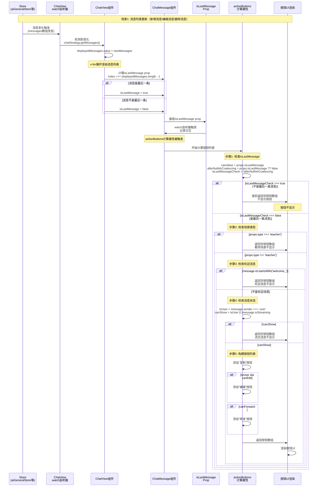
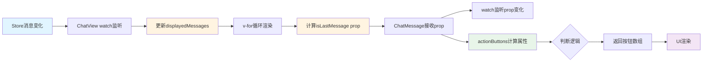

# 按钮显示逻辑时序图

## 完整流程时序图



## 关键判断逻辑流程图

```mermaid
flowchart TD
    Start([actionButtons计算属性触发]) --> Check1{检查isLastMessage}
    
    Check1 -->|isLastMessage = false<br/>不是最后一条| EarlyReturn1[提前返回<br/>不显示按钮]
    Check1 -->|isLastMessage = true<br/>是最后一条| Check2{检查场景类型}
    
    Check2 -->|type === 'teacher'| EarlyReturn2[提前返回<br/>教师场景不显示]
    Check2 -->|type !== 'teacher'| Check3{检查欢迎消息}
    
    Check3 -->|id.startsWith('welcome_')| EarlyReturn3[提前返回<br/>欢迎消息不显示]
    Check3 -->|不是欢迎消息| Check4{检查消息状态}
    
    Check4 -->|isStreaming && sender !== 'user'| EarlyReturn4[提前返回<br/>流式消息不显示]
    Check4 -->|canShow = true| BuildButtons[构建按钮列表]
    
    BuildButtons --> AddCopy[添加复制按钮]
    AddCopy --> CheckEdit{是用户消息<br/>且可编辑?}
    
    CheckEdit -->|是| AddEdit[添加编辑按钮]
    CheckEdit -->|否| CheckForward{可转发?}
    AddEdit --> CheckForward
    
    CheckForward -->|是| AddForward[添加转发按钮]
    CheckForward -->|否| ReturnButtons[返回按钮数组]
    AddForward --> ReturnButtons
    
    ReturnButtons --> RenderUI[渲染按钮UI]
    
    EarlyReturn1 --> End([结束])
    EarlyReturn2 --> End
    EarlyReturn3 --> End
    EarlyReturn4 --> End
    RenderUI --> End
    
    style EarlyReturn1 fill:#ffcccc
    style EarlyReturn2 fill:#ffcccc
    style EarlyReturn3 fill:#ffcccc
    style EarlyReturn4 fill:#ffcccc
    style RenderUI fill:#ccffcc
```

## 数据流图



## 关键代码位置

### 1. 消息更新触发点
**文件**: `ChatView.vue` (第402-417行)
```javascript
watch(
  () => [props.type, aiGeneralStore.messages, ...],
  () => {
    const newMessages = chatStrategy.value.getMessages()
    displayedMessages.value = newMessages  // 触发更新
  }
)
```

### 2. Prop 传递
**文件**: `ChatView.vue` (第72行)
```javascript
:is-last-message="index === displayedMessages.length - 1"
```

### 3. Prop 监听
**文件**: `ChatMessage.vue` (第339-356行)
```javascript
watch(
  () => props.isLastMessage,
  (newValue, oldValue) => {
    // 记录日志
  }
)
```

### 4. 按钮显示逻辑
**文件**: `ChatMessage.vue` (第475-554行)
```javascript
const actionButtons = computed(() => {
  // 1. 检查isLastMessage
  const isLastMessageCheck = !(props.isLastMessage ?? false)
  if (isLastMessageCheck) return buttons  // 不是最后一条，不显示
  
  // 2. 检查场景类型
  if (props.type === 'teacher') return buttons
  
  // 3. 检查欢迎消息
  if (props.message.id?.startsWith('welcome_')) return buttons
  
  // 4. 检查消息状态
  const canShow = isUser || !props.message.isStreaming
  if (!canShow) return buttons
  
  // 5. 构建按钮列表
  // ...
})
```

## 判断条件总结

| 条件 | 位置 | 结果 |
|------|------|------|
| `!isLastMessage` | 第1步 | ❌ 不显示按钮 |
| `type === 'teacher'` | 第2步 | ❌ 不显示按钮 |
| `id.startsWith('welcome_')` | 第3步 | ❌ 不显示按钮 |
| `!canShow` (流式消息且非用户) | 第4步 | ❌ 不显示按钮 |
| 通过所有检查 | 第5步 | ✅ 显示按钮 |

## 按钮类型

1. **复制按钮**: 所有符合条件的消息都显示
2. **编辑按钮**: 仅用户消息且 `canEdit === true` 时显示
3. **转发按钮**: `canForward === true` 时显示

## 调试标签

所有相关日志都带有 `[🔍 IsLastMessage-FIX]` 标签，可在控制台过滤查看。

## 关键变量说明

### `isLastMessageCheck` 的含义

`isLastMessageCheck` 是 `ChatMessage.vue` 中 `actionButtons` 计算属性里的一个判断变量：

```javascript
const afterNullishCoalescing = props.isLastMessage ?? false
const isLastMessageCheck = !afterNullishCoalescing
```

**含义解释**：
- `afterNullishCoalescing`: 将 `props.isLastMessage` 转换为布尔值（`undefined` → `false`）
- `isLastMessageCheck`: 取反后的值，用于判断是否**不是最后一条消息**

**逻辑流程**：
1. 如果 `props.isLastMessage = undefined` → `afterNullishCoalescing = false` → `isLastMessageCheck = true` → **提前返回，不显示按钮** ❌
2. 如果 `props.isLastMessage = false` → `afterNullishCoalescing = false` → `isLastMessageCheck = true` → **提前返回，不显示按钮** ❌
3. 如果 `props.isLastMessage = true` → `afterNullishCoalescing = true` → `isLastMessageCheck = false` → **继续执行，显示按钮** ✅

**问题表现**：
- 当 `isLastMessageCheck = true` 时，说明判断为"不是最后一条消息"，会提前返回空按钮数组
- 如果所有消息都显示 `isLastMessageCheck: true`，说明所有消息的 `isLastMessage` prop 都是 `undefined` 或 `false`

## 修复方案实现

### 已实现的修复

**文件**: `ChatView.vue`

**修复内容**：
1. 创建了 `isLastMessage()` 辅助函数，确保返回值始终是布尔类型
2. 在模板中使用函数调用替代直接表达式

**代码位置**：
- 函数定义：第 419-436 行
- 模板使用：第 72 行

**修复效果**：
- ✅ 确保 `isLastMessage` prop 始终是 `true` 或 `false`，不会是 `undefined`
- ✅ 最后一条消息（index = 5）会收到 `isLastMessage = true`
- ✅ 其他消息（index = 0-4）会收到 `isLastMessage = false`
- ✅ 按钮会正确显示在最后一条消息上

### 验证修复

修复后，控制台日志应该显示：

**对于最后一条消息（index = 5）**：
```javascript
[ChatView] isLastMessage 计算: {
  index: 5,
  length: 6,
  result: true  // ✅ 返回 true
}
[ChatMessage] isLastMessage prop 变化: {
  newValue: true  // ✅ 不再是 undefined
}
[ChatMessage] actionButtons 计算: {
  rawValue: true,  // ✅ 不再是 undefined
  afterNullishCoalescing: true,
  isLastMessageCheck: false,  // ✅ 不再是 true
  willReturnEarly: false  // ✅ 不会提前返回
}
```

**对于非最后一条消息（index = 0-4）**：
```javascript
[ChatView] isLastMessage 计算: {
  index: 0,
  length: 6,
  result: false  // ✅ 返回 false
}
[ChatMessage] isLastMessage prop 变化: {
  newValue: false  // ✅ 不再是 undefined
}
[ChatMessage] actionButtons 计算: {
  rawValue: false,  // ✅ 不再是 undefined
  afterNullishCoalescing: false,
  isLastMessageCheck: true,  // ✅ 正确判断为不是最后一条
  willReturnEarly: true  // ✅ 正确提前返回
}
```

