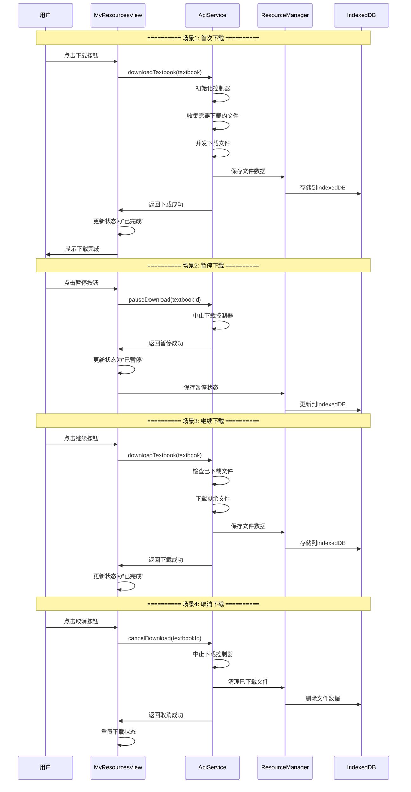

# 教材下载流程时序图

## 版本1：简略版



---

## 版本2：详细版

```mermaid
sequenceDiagram
    participant U as 用户
    participant V as MyResourcesView
    participant A as ApiService
    participant R as ResourceManager
    participant DB as IndexedDB
    participant C as AbortController

    Note over U,DB: ========== 场景1: 首次下载 ==========
    
    Note over U,V: 阶段1.1: 用户触发下载
    U->>V: 点击下载按钮
    V->>V: 设置 downloadStatus = 1
    V->>V: 设置 isDownloaded = false
    
    Note over V,A: 阶段1.2: 初始化下载
    V->>A: downloadTextbook(textbook, onProgress)
    A->>A: 判断下载类型: "首次下载"
    A->>A: 打印当前状态日志
    A->>C: 创建 AbortController
    A->>A: 存储控制器到 downloadControllers
    
    Note over A,DB: 阶段1.3: 获取资源信息
    A->>A: 获取学习资源包 (19个包)
    A->>A: 增量文件筛选 (需下载74/74个文件)
    A->>R: updateTextbookInfo(textbook)
    R->>DB: 保存学习包信息
    A->>A: 设置 totalFiles = 74
    
    Note over A,R: 阶段1.4: 并发下载文件
    A->>A: 计算 alreadyDownloadedFiles = 0
    loop 并发下载74个文件
        A->>A: downloadSingleFileStreaming(resource)
        A->>A: 更新进度 (1%, 2%, ...)
        A->>V: onProgress(progress, downloadedCount)
        V->>V: 更新 UI 进度条
        A->>R: storeFileData(fileInfo, fileData)
        R->>DB: 保存文件到 localFiles
    end
    
    Note over A,DB: 阶段1.5: 完成下载
    A->>R: forceFlushPendingUpdates()
    R->>DB: 强制刷新所有待更新数据
    A->>A: 清理下载控制器
    A->>A: 打印下载完成日志
    A->>V: 返回 success = true
    
    Note over V,DB: 阶段1.6: 更新状态
    V->>DB: 获取完整教材数据 (含 fileData)
    DB->>V: 返回完整数据
    V->>V: 设置 downloadStatus = 2
    V->>V: 设置 isDownloaded = true
    V->>R: updateTextbookInfo(更新状态)
    R->>DB: 保存完成状态
    V->>U: 显示"下载完成"消息

    Note over U,DB: ========== 场景2: 暂停下载 ==========
    
    Note over U,V: 阶段2.1: 用户触发暂停
    U->>V: 点击暂停按钮
    V->>A: pauseDownload(textbookId)
    
    Note over A,C: 阶段2.2: 中止下载
    A->>A: 打印暂停日志
    A->>A: 获取下载控制器
    A->>C: controller.abort()
    C->>A: 触发 AbortError
    A->>A: 清理控制器
    A->>A: 打印暂停成功日志
    A->>V: 返回 success = true
    
    Note over V,DB: 阶段2.3: 捕获暂停错误
    A-->>V: 抛出 AbortError
    V->>V: 捕获 AbortError
    V->>V: 设置 downloadStatus = 3
    V->>V: 设置 isDownloaded = false
    V->>R: updateTextbookInfo(保存暂停状态)
    R->>DB: 更新状态 + downloadedFiles
    V->>U: 显示"下载已暂停"消息

    Note over U,DB: ========== 场景3: 继续下载 ==========
    
    Note over U,V: 阶段3.1: 用户触发继续
    U->>V: 点击继续按钮
    V->>V: 设置 downloadStatus = 1
    V->>A: downloadTextbook(textbook, onProgress)
    
    Note over A,A: 阶段3.2: 判断继续下载
    A->>A: 判断下载类型: "继续下载（从暂停恢复）"
    A->>A: 打印当前状态: 已下载30/74
    A->>C: 创建新的 AbortController
    
    Note over A,DB: 阶段3.3: 增量文件筛选
    A->>A: 使用本地缓存的学习包
    A->>DB: 获取本地教材数据
    DB->>A: 返回包含 localFiles 的数据
    A->>A: 对比服务器文件和本地文件
    A->>A: 筛选出需要下载的44个文件
    A->>A: 计算 alreadyDownloadedFiles = 30
    
    Note over A,R: 阶段3.4: 下载剩余文件
    loop 并发下载44个文件
        A->>A: downloadSingleFileStreaming(resource)
        A->>A: 更新进度 (31/74, 32/74, ...)
        A->>V: onProgress(progress, downloadedCount)
        V->>V: 更新 UI 进度条
        A->>R: storeFileData(fileInfo, fileData)
        R->>DB: 保存文件到 localFiles
    end
    
    Note over A,DB: 阶段3.5: 完成下载
    A->>R: forceFlushPendingUpdates()
    A->>A: 打印下载完成日志
    A->>V: 返回 success = true
    V->>DB: 获取完整教材数据
    V->>V: 设置 downloadStatus = 2
    V->>R: updateTextbookInfo(更新状态)
    R->>DB: 保存完成状态

    Note over U,DB: ========== 场景4: 取消下载 ==========
    
    Note over U,V: 阶段4.1: 用户触发取消
    U->>V: 点击取消按钮
    V->>V: 显示确认对话框
    U->>V: 确认取消
    V->>A: cancelDownload(textbookId)
    
    Note over A,C: 阶段4.2: 中止下载
    A->>A: 打印取消日志
    A->>A: 获取下载控制器
    A->>C: controller.abort()
    C->>A: 触发 AbortError
    A->>A: 清理控制器
    
    Note over A,DB: 阶段4.3: 清理文件数据
    A->>R: clearTextbookFiles(textbookId)
    R->>DB: 清空 localFiles
    R->>DB: 重置 downloadedFiles = 0
    R->>DB: 设置 downloadStatus = 0
    A->>A: 打印取消成功日志
    A->>V: 返回 success = true
    
    Note over V,U: 阶段4.4: 更新UI
    V->>V: 设置 downloadStatus = 0
    V->>V: 设置 isDownloaded = false
    V->>V: 设置 downloadedFiles = 0
    V->>U: 显示"下载已取消"消息
```



---

## 版本3：极其详细版

```mermaid
sequenceDiagram
    participant U as 用户
    participant V as MyResourcesView.vue
    participant A as ApiService
    participant R as ResourceManager
    participant IDB as IndexedDBService
    participant DB as IndexedDB数据库
    participant C as AbortController
    participant HTTP as HTTP请求

    Note over U,DB: ========== 场景1: 首次下载完整流程 ==========
    
    Note over U,V: ========== 阶段1.1: 用户交互与UI准备 ==========
    U->>V: 点击"下载"按钮
    activate V
    V->>V: 触发 downloadTextbook(textbook)
    V->>V: textbook.downloadStatus = 1 (下载中)
    V->>V: textbook.isDownloaded = false
    V->>V: 更新UI显示进度条
    
    Note over V,A: ========== 阶段1.2: API服务初始化 ==========
    V->>A: downloadTextbook(textbook, onProgress)
    activate A
    A->>A: 记录开始时间 startTime = Date.now()
    A->>A: 调用 getDownloadType(textbook)
    A->>A: 返回 "首次下载"
    A->>A: 打印日志: "========== 首次下载 =========="
    A->>A: 打印日志: "教材名称: XXX"
    A->>A: 打印日志: "当前状态: 下载状态=未下载, 已下载=0, 总文件=0"
    
    Note over A,C: ========== 阶段1.3: 创建下载控制器 ==========
    A->>A: 打印日志: "步骤1: 初始化下载控制器"
    A->>C: new AbortController()
    activate C
    C-->>A: 返回 controller 实例
    A->>A: downloadControllers.set(textbookId, controller)
    A->>A: 打印日志: "步骤1完成 - 控制器ID: XXX"
    
    Note over A,R: ========== 阶段1.4: 获取学习资源包 ==========
    A->>A: 打印日志: "步骤2: 获取学习资源包"
    A->>A: 检查 textbook.learningPackages 是否存在
    alt learningPackages 已存在
        A->>A: serverPackages = textbook.learningPackages
        A->>A: 打印日志: "使用本地缓存的学习包 (19个)"
    else learningPackages 不存在
        A->>A: 调用 getServerLearningPackages(textbook)
        A->>HTTP: POST /blw-edu-yb/api/app/teacher-textbook-learning-package
        activate HTTP
        HTTP-->>A: 返回 19个学习包数据
        deactivate HTTP
        A->>A: textbook.learningPackages = serverPackages
        A->>A: 打印日志: "从服务器获取学习包 (19个)"
    end
    A->>A: 打印日志: "步骤2完成 (耗时: Xms)"
    
    Note over A,DB: ========== 阶段1.5: 增量文件筛选 ==========
    A->>A: 打印日志: "步骤3: 增量文件筛选"
    A->>R: 调用 collectFilesToUpdate(textbook, serverPackages)
    activate R
    R->>IDB: indexedDB.get('textbooks', textbook.id)
    activate IDB
    IDB->>DB: 查询教材记录
    activate DB
    DB-->>IDB: 返回教材数据（可能无 localFiles）
    deactivate DB
    IDB-->>R: 返回教材对象
    deactivate IDB
    R->>R: 构建 localFileMap (当前为空)
    loop 遍历19个学习包
        R->>R: 遍历每个包的 resourceList
        loop 遍历每个文件
            R->>R: 检查 localFileMap 中是否存在该文件
            R->>R: 检查 checksum 是否匹配
            R->>R: 检查 fileData 是否存在
            alt 文件需要下载
                R->>R: filesToUpdate.push({resource, pkg})
            end
        end
    end
    R->>R: totalServerFiles = 74
    R->>R: filesToDownload = 74
    R-->>A: 返回 {filesToUpdate: 74个, totalServerFiles: 74}
    deactivate R
    A->>A: 打印日志: "步骤3完成 - 需下载: 74/74"
    
    Note over A,DB: ========== 阶段1.6: 保存学习资源包到IndexedDB ==========
    A->>A: 打印日志: "步骤4: 保存学习资源包到IndexedDB"
    A->>R: updateTextbookInfo(textbook, undefined)
    activate R
    R->>R: Object.assign(textbook, updates)
    R->>IDB: update('textbooks', textbook)
    activate IDB
    IDB->>IDB: deepSerialize(textbook)
    IDB->>DB: 更新教材记录
    activate DB
    DB-->>IDB: 更新成功
    deactivate DB
    IDB-->>R: 返回 true
    deactivate IDB
    R-->>A: 返回 true
    deactivate R
    A->>A: 打印日志: "步骤4完成 (耗时: Xms)"
    
    Note over A,DB: ========== 阶段1.7: 设置教材总文件数 ==========
    A->>A: 打印日志: "步骤5: 设置教材总文件数"
    A->>R: getUserLocalTextbooks()
    activate R
    R->>IDB: getAll('textbooks')
    activate IDB
    IDB->>DB: 查询所有教材
    activate DB
    DB-->>IDB: 返回教材列表
    deactivate DB
    IDB-->>R: 返回教材数组
    deactivate IDB
    R->>R: 瘦身处理: 移除 localFiles 中的 fileData
    R-->>A: 返回瘦身后的教材列表
    deactivate R
    A->>A: 查找当前教材 textbookRecord
    A->>A: textbookRecord.totalFiles = 74
    A->>R: updateTextbookInfo(textbookRecord, {totalFiles: 74})
    activate R
    R->>IDB: update('textbooks', textbookRecord)
    activate IDB
    IDB->>DB: 更新教材记录
    activate DB
    DB-->>IDB: 更新成功
    deactivate DB
    IDB-->>R: 返回 true
    deactivate IDB
    R-->>A: 返回 true
    deactivate R
    A->>A: textbook.totalFiles = 74
    A->>A: 打印日志: "步骤5完成 - 总文件数: 74"
    
    Note over A,HTTP: ========== 阶段1.8: 并发下载文件 ==========
    A->>A: 打印日志: "步骤6: 并发下载文件"
    A->>A: 打印日志: "  - 需要下载: 74 文件"
    A->>A: alreadyDownloadedFiles = 74 - 74 = 0
    A->>A: 打印日志: "  - 已完成文件: 0 文件"
    A->>A: 打印日志: "  - 总文件数: 74 文件"
    A->>A: 调用 downloadFilesConcurrently(...)
    A->>A: CONCURRENT_DOWNLOADS = 6
    A->>A: downloadQueue = [...filesToUpdate] (74个文件)
    
    Note over A,HTTP: === 并发下载池初始化 ===
    loop 初始化6个并发下载任务
        A->>A: 创建 downloadTask(resourceInfo)
        activate A
        A->>A: 检查 controller.signal.aborted
        A->>A: 调用 downloadSingleFileStreaming(resource, controller)
        A->>HTTP: fetch(fileUrl, {signal: controller.signal})
        activate HTTP
        HTTP-->>A: 返回 Response 对象
        A->>HTTP: response.body.getReader()
        HTTP-->>A: 返回 ReadableStreamReader
        loop 读取文件流
            A->>HTTP: reader.read()
            HTTP-->>A: 返回 {done: false, value: Uint8Array}
            A->>A: chunks.push(value)
            A->>A: downloadedBytes += value.length
            A->>A: 检查 controller.signal.aborted
        end
        HTTP-->>A: 返回 {done: true}
        deactivate HTTP
        A->>A: result = mergeChunksEfficiently(chunks)
        alt 有 checksum
            A->>R: verifyLocalFileIntegrity(result, checksum)
            activate R
            R->>R: 计算 MD5(fileData)
            R->>R: 对比 hashHex === checksum
            R-->>A: 返回 true/false
            deactivate R
        end
        A->>A: chapterOrder = parseChapterOrderFromFileName(fileName)
        A->>R: storeFileData(fileInfo, fileData, textbook)
        activate R
        
        Note over R,DB: === 保存文件数据流程 ===
        R->>R: 初始化 textbookInfo.localFiles = []
        R->>R: 查找 localFiles 中是否存在该文件
        alt 文件不存在
            R->>R: localFiles.push({id, fileName, fileSize, checksum, isDownloaded: true, fileData, thumbnail: undefined})
        else 文件已存在
            R->>R: localFiles[index] = {...existingFile, fileData, ...}
        end
        R->>R: 调用 updateTextbookInfo(textbookInfo, undefined)
        R->>IDB: update('textbooks', textbookInfo)
        activate IDB
        IDB->>IDB: deepSerialize(textbookInfo) - 保留完整 fileData
        IDB->>DB: 更新教材记录（含 localFiles.fileData）
        activate DB
        DB-->>IDB: 更新成功
        deactivate DB
        IDB-->>R: 返回 true
        deactivate IDB
        R-->>A: 返回成功
        deactivate R
        
        A->>A: results.push({success: true, fileName, fileSize})
        A->>A: successCount++
        A->>A: completedFiles++
        A->>A: progress = (completedFiles / totalFiles) * 100
        A->>A: totalDownloadedFiles = 0 + successCount
        A->>A: 打印日志: "下载进度: X% (Y/74) - 本次新增: Z"
        A->>V: onProgress(progress, totalDownloadedFiles)
        V->>V: textbook.downloadedFiles = totalDownloadedFiles
        V->>V: 更新UI进度条显示
        deactivate A
    end
    
    Note over A,HTTP: === 动态补充下载任务 ===
    loop downloadQueue 不为空
        A->>A: 检查 controller.signal.aborted
        A->>A: await Promise.race(downloadPromises)
        A->>A: 从 downloadQueue 取出新任务
        A->>A: 创建新的 downloadTask
        Note right of A: 重复上述下载流程
    end
    
    A->>A: await Promise.all(downloadPromises)
    A->>A: 计算下载性能指标
    A->>A: totalTime = Date.now() - downloadStartTime
    A->>A: averageSpeed = totalDownloadedBytes / totalTime
    A->>A: 打印日志: "步骤6完成 (耗时: Xms)"
    A->>A: 打印日志: "  - 成功: 74 文件"
    A->>A: 打印日志: "  - 失败: 0 文件"
    A->>A: 打印日志: "  - 平均速度: X.XXmb/s"
    
    Note over A,DB: ========== 阶段1.9: 强制刷新IndexedDB ==========
    A->>A: 打印日志: "步骤7: 强制刷新IndexedDB"
    A->>R: forceFlushPendingUpdates()
    activate R
    R->>R: 检查 pendingUpdates.size
    alt 有待更新数据
        loop 遍历 pendingUpdates
            R->>IDB: update('textbooks', textbook)
            activate IDB
            IDB->>DB: 批量更新教材
            activate DB
            DB-->>IDB: 更新成功
            deactivate DB
            IDB-->>R: 返回 true
            deactivate IDB
        end
        R->>R: pendingUpdates.clear()
    end
    R-->>A: 完成刷新
    deactivate R
    A->>A: 打印日志: "步骤7完成 (耗时: Xms)"
    
    Note over A,C: ========== 阶段1.10: 清理下载控制器 ==========
    A->>A: 打印日志: "步骤8: 清理下载控制器"
    A->>A: downloadControllers.delete(textbookId)
    deactivate C
    A->>A: 打印日志: "步骤8完成 (耗时: Xms)"
    
    Note over A,A: ========== 阶段1.11: 判断下载结果 ==========
    A->>A: isSuccess = (successCount === filesToDownload)
    A->>A: totalTime = Date.now() - startTime
    alt 下载成功
        A->>A: 打印日志: "🎉 ========== 下载完成 =========="
        A->>A: 打印日志: "教材名称: XXX"
        A->>A: 打印日志: "状态: 成功, 总耗时: Xms, 成功文件: 74/74"
    else 下载失败
        A->>A: 打印日志: "❌ ========== 下载失败 =========="
        A->>A: 打印日志: "教材名称: XXX"
        A->>A: 打印日志: "状态: 失败, 失败文件: X"
    end
    A-->>V: 返回 success = true
    deactivate A
    
    Note over V,DB: ========== 阶段1.12: 更新教材完成状态 ==========
    V->>V: 打印日志: "下载成功 - 需要从 IndexedDB 获取完整数据"
    V->>IDB: resourceManager.indexedDB.get('textbooks', textbook.id)
    activate IDB
    IDB->>DB: 查询教材记录
    activate DB
    DB-->>IDB: 返回完整教材数据（包含 localFiles.fileData）
    deactivate DB
    IDB-->>V: 返回 fullTextbook
    deactivate IDB
    
    V->>V: fullTextbook.isDownloaded = true
    V->>V: fullTextbook.downloadStatus = 2
    V->>V: fullTextbook.downloadedFiles = 74
    V->>V: fullTextbook.lastDownloadTime = new Date().toISOString()
    V->>V: fullTextbook.hasUpdatesAvailable = false
    
    V->>R: updateTextbookInfo(fullTextbook, {状态字段})
    activate R
    R->>R: Object.assign(fullTextbook, updates)
    R->>IDB: update('textbooks', fullTextbook)
    activate IDB
    IDB->>IDB: deepSerialize(fullTextbook) - 保留完整 fileData
    IDB->>DB: 更新教材记录（保留 localFiles.fileData）
    activate DB
    DB-->>IDB: 更新成功
    deactivate DB
    IDB-->>R: 返回 true
    deactivate IDB
    R-->>V: 返回 true
    deactivate R
    
    V->>V: Object.assign(textbook, fullTextbook)
    V->>V: 更新UI显示"已完成"
    V->>U: 显示通知: "《XXX》下载完成"
    deactivate V

    Note over U,DB: ========== 场景2: 暂停下载完整流程 ==========
    
    Note over U,V: ========== 阶段2.1: 用户触发暂停 ==========
    U->>V: 点击"暂停"按钮
    activate V
    V->>V: 触发 pauseDownload(textbook)
    V->>A: pauseDownload(textbook.textbookId)
    activate A
    
    Note over A,A: ========== 阶段2.2: 打印暂停日志 ==========
    A->>A: 打印日志: "⏸️ ========== 暂停下载 =========="
    A->>A: 打印日志: "教材ID: XXX"
    
    Note over A,C: ========== 阶段2.3: 查找并中止控制器 ==========
    A->>A: controller = downloadControllers.get(textbookId)
    alt 控制器存在
        A->>A: 打印日志: "找到下载控制器，准备中止..."
        A->>C: controller.abort()
        activate C
        C->>C: 设置 signal.aborted = true
        C->>HTTP: 中断所有关联的 fetch 请求
        HTTP-->>C: 抛出 AbortError
        C-->>A: 触发 abort 事件
        deactivate C
        A->>A: 打印日志: "下载请求已中止"
        A->>A: downloadControllers.delete(textbookId)
        A->>A: 打印日志: "控制器已清理"
        A->>A: 打印日志: "🎉 暂停成功"
        A-->>V: 返回 success = true
    else 控制器不存在
        A->>A: 打印日志: "⚠️ 未找到活跃的下载控制器"
        A-->>V: 返回 success = true
    end
    deactivate A
    
    Note over V,V: ========== 阶段2.4: 下载任务捕获 AbortError ==========
    Note right of A: downloadTextbook 方法的 catch 块捕获异常
    A->>A: catch (error)
    A->>A: 检查 error.name === 'AbortError'
    A->>A: 打印日志: "⏸️ ========== 下载被中断 =========="
    A->>A: 打印日志: "教材名称: XXX"
    A->>A: 打印日志: "中断原因: 用户主动暂停"
    A->>A: 打印日志: "已运行时长: Xms"
    A->>A: downloadControllers.delete(textbookId)
    A-->>V: throw AbortError
    
    Note over V,DB: ========== 阶段2.5: View层处理暂停状态 ==========
    V->>V: catch (error)
    V->>V: 检查 error.name === 'AbortError'
    V->>V: textbook.downloadStatus = 3 (已暂停)
    V->>V: textbook.isDownloaded = false
    
    V->>R: updateTextbookInfo(textbook, {downloadStatus: 3, ...})
    activate R
    R->>R: Object.assign(textbook, updates)
    R->>IDB: update('textbooks', textbook)
    activate IDB
    IDB->>DB: 更新教材状态
    activate DB
    DB-->>IDB: 更新成功（保留已下载的 fileData）
    deactivate DB
    IDB-->>R: 返回 true
    deactivate IDB
    R-->>V: 返回 true
    deactivate R
    
    V->>V: 更新UI显示"已暂停"
    V->>U: 显示通知: "《XXX》下载已暂停"
    deactivate V

    Note over U,DB: ========== 场景3: 继续下载完整流程 ==========
    
    Note over U,V: ========== 阶段3.1: 用户触发继续 ==========
    U->>V: 点击"继续"按钮
    activate V
    V->>V: 触发 downloadTextbook(textbook)
    V->>V: textbook.downloadStatus = 1 (下载中)
    V->>A: downloadTextbook(textbook, onProgress)
    activate A
    
    Note over A,A: ========== 阶段3.2: 判断下载类型 ==========
    A->>A: 调用 getDownloadType(textbook)
    A->>A: 检查 downloadedFiles = 30, totalFiles = 74
    A->>A: 检查 downloadStatus = 3 (已暂停)
    A->>A: 返回 "继续下载（从暂停恢复）"
    A->>A: 打印日志: "========== 继续下载（从暂停恢复） =========="
    A->>A: 打印日志: "教材名称: XXX"
    A->>A: 打印日志: "当前状态: 下载状态=已暂停, 已下载=30, 总文件=74"
    
    Note over A,C: ========== 阶段3.3: 重新创建控制器 ==========
    A->>A: 打印日志: "步骤1: 初始化下载控制器"
    A->>C: new AbortController()
    activate C
    C-->>A: 返回新的 controller 实例
    A->>A: downloadControllers.set(textbookId, controller)
    
    Note over A,DB: ========== 阶段3.4: 使用缓存的学习包 ==========
    A->>A: 打印日志: "步骤2: 获取学习资源包"
    A->>A: 检查 textbook.learningPackages (存在19个包)
    A->>A: serverPackages = textbook.learningPackages
    A->>A: 打印日志: "使用本地缓存的学习包 (19个)"
    
    Note over A,DB: ========== 阶段3.5: 增量文件筛选（关键） ==========
    A->>A: 打印日志: "步骤3: 增量文件筛选"
    A->>R: collectFilesToUpdate(textbook, serverPackages)
    activate R
    R->>IDB: indexedDB.get('textbooks', textbook.id)
    activate IDB
    IDB->>DB: 查询教材记录
    activate DB
    DB-->>IDB: 返回教材数据（包含30个已下载文件的 fileData）
    deactivate DB
    IDB-->>R: 返回 latestTextbook
    deactivate IDB
    R->>R: localFiles = latestTextbook.localFiles (30个文件)
    R->>R: 构建 localFileMap (30个文件ID映射)
    
    loop 遍历服务器的74个文件
        R->>R: localFile = localFileMap.get(serverFile.id)
        alt localFile 不存在
            R->>R: needsDownload = true
            R->>R: filesToUpdate.push({resource, pkg})
        else localFile 存在
            alt checksum 不匹配
                R->>R: needsDownload = true
                R->>R: filesToUpdate.push({resource, pkg})
            else checksum 匹配
                R->>R: hasFileData = localFile.fileData && localFile.fileData.length > 0
                alt fileData 不存在
                    R->>R: needsDownload = true
                    R->>R: filesToUpdate.push({resource, pkg})
                else fileData 存在
                    R->>R: needsDownload = false (跳过)
                end
            end
        end
    end
    
    R->>R: filesToUpdate.length = 44
    R->>R: totalServerFiles = 74
    R-->>A: 返回 {filesToUpdate: 44个, totalServerFiles: 74}
    deactivate R
    A->>A: 打印日志: "步骤3完成 - 需下载: 44/74"
    
    Note over A,A: ========== 阶段3.6: 计算已完成文件数 ==========
    A->>A: 打印日志: "步骤6: 并发下载文件"
    A->>A: 打印日志: "  - 需要下载: 44 文件"
    A->>A: alreadyDownloadedFiles = 74 - 44 = 30
    A->>A: 打印日志: "  - 已完成文件: 30 文件"
    A->>A: 打印日志: "  - 总文件数: 74 文件"
    
    Note over A,HTTP: ========== 阶段3.7: 下载剩余44个文件 ==========
    loop 并发下载44个文件
        A->>A: 创建 downloadTask
        A->>HTTP: fetch(fileUrl)
        HTTP-->>A: 返回文件数据
        A->>R: storeFileData(fileInfo, fileData)
        R->>DB: 保存到 localFiles
        A->>A: successCount++
        A->>A: totalDownloadedFiles = 30 + successCount
        A->>A: 打印日志: "下载进度: X% (31/74, 32/74, ...)"
        A->>V: onProgress(progress, totalDownloadedFiles)
        V->>V: 更新UI进度条
    end
    
    Note over A,DB: ========== 阶段3.8: 完成下载 ==========
    A->>R: forceFlushPendingUpdates()
    A->>A: downloadControllers.delete(textbookId)
    deactivate C
    A->>A: 打印日志: "🎉 ========== 下载完成 =========="
    A->>A: 打印日志: "成功文件: 44/44"
    A-->>V: 返回 success = true
    deactivate A
    
    Note over V,DB: ========== 阶段3.9: 更新完成状态 ==========
    V->>IDB: indexedDB.get('textbooks', textbook.id)
    IDB->>DB: 查询完整数据
    DB-->>IDB: 返回包含74个文件 fileData 的教材
    IDB-->>V: 返回 fullTextbook
    V->>V: fullTextbook.downloadStatus = 2
    V->>V: fullTextbook.isDownloaded = true
    V->>R: updateTextbookInfo(fullTextbook, {状态})
    R->>DB: 保存完成状态（保留所有 fileData）
    V->>U: 显示通知: "《XXX》下载完成"
    deactivate V

    Note over U,DB: ========== 场景4: 取消下载完整流程 ==========
    
    Note over U,V: ========== 阶段4.1: 用户确认取消 ==========
    U->>V: 点击"取消"按钮
    activate V
    V->>V: 显示确认对话框
    V->>U: "确定要取消下载吗？已下载的文件将被删除。"
    U->>V: 点击"确认"
    V->>A: cancelDownload(textbook.textbookId)
    activate A
    
    Note over A,A: ========== 阶段4.2: 打印取消日志 ==========
    A->>A: 打印日志: "❌ ========== 取消下载 =========="
    A->>A: 打印日志: "教材ID: XXX"
    
    Note over A,C: ========== 阶段4.3: 中止下载控制器 ==========
    A->>A: controller = downloadControllers.get(textbookId)
    alt 控制器存在
        A->>A: 打印日志: "找到下载控制器，准备中止..."
        A->>C: controller.abort()
        activate C
        C->>HTTP: 中断所有 fetch 请求
        HTTP-->>C: 抛出 AbortError
        C-->>A: 触发 abort 事件
        deactivate C
        A->>A: 打印日志: "下载请求已中止"
        A->>A: downloadControllers.delete(textbookId)
        A->>A: 打印日志: "控制器已清理"
    else 控制器不存在
        A->>A: 打印日志: "⚠️ 未找到活跃的下载控制器"
    end
    
    Note over A,DB: ========== 阶段4.4: 清理文件数据 ==========
    A->>A: 打印日志: "🗑️ 开始清理已下载的文件数据..."
    A->>R: clearTextbookFiles(textbookId)
    activate R
    R->>IDB: get('textbooks', textbookId)
    activate IDB
    IDB->>DB: 查询教材记录
    activate DB
    DB-->>IDB: 返回教材数据
    deactivate DB
    IDB-->>R: 返回 textbook
    deactivate IDB
    
    alt textbook 存在
        R->>R: textbook.fileData = {}
        R->>R: textbook.localFiles = []
        R->>R: textbook.downloadedFiles = 0
        R->>R: textbook.isDownloaded = false
        R->>R: textbook.downloadStatus = 0
        R->>R: textbook.lastDownloadTime = ''
        R->>IDB: update('textbooks', textbook)
        activate IDB
        IDB->>DB: 更新教材记录（清空所有文件数据）
        activate DB
        DB-->>IDB: 更新成功
        deactivate DB
        IDB-->>R: 返回成功
        deactivate IDB
    end
    R-->>A: 清理完成
    deactivate R
    
    A->>A: 打印日志: "✅ 文件数据已清理"
    A->>A: 打印日志: "🎉 取消成功"
    A-->>V: 返回 success = true
    deactivate A
    
    Note over V,V: ========== 阶段4.5: 更新UI状态 ==========
    V->>V: textbook.downloadStatus = 0
    V->>V: textbook.isDownloaded = false
    V->>V: textbook.downloadedFiles = 0
    V->>V: textbook.totalFiles = 0
    V->>V: textbook.lastDownloadTime = ''
    V->>V: 更新UI显示"未下载"状态
    V->>U: 显示通知: "《XXX》下载已取消"
    deactivate V

    Note over U,DB: ========== 补充场景: 页面离开时自动暂停所有任务 ==========
    
    Note over V,V: ========== 页面卸载触发 ==========
    U->>V: 离开页面/关闭标签页
    V->>V: 触发 onUnmounted 钩子
    V->>V: 调用 pauseAllDownloadingTasks()
    V->>V: 查找所有 downloadStatus === 1 的教材
    V->>V: 发现 3 个正在下载的任务
    V->>V: 打印日志: "[页面离开] 发现 3 个正在下载的任务，开始暂停..."
    
    loop 批量暂停3个任务
        V->>A: pauseDownload(textbookId)
        A->>A: 执行暂停流程
        A-->>V: 返回成功
        V->>V: textbook.downloadStatus = 3
        V->>R: updateTextbookInfo(textbook, {暂停状态})
        R->>DB: 保存暂停状态
        V->>V: 打印日志: "[页面离开] ✅ 已暂停教材: XXX"
    end
    
    V->>V: 打印日志: "[页面离开] 🎉 所有下载任务已暂停"
    V->>V: 销毁 better-scroll
```

---

## 关键数据流说明

### 1. **IndexedDB 数据结构**
```typescript
// 教材表 (textbooks)
{
  id: "primary-key-id",           // 主键
  textbookId: "textbook-123",     // 教材ID
  textbookName: "生物必修一",
  totalFiles: 74,
  downloadedFiles: 30,            // 已下载文件数
  downloadStatus: 0|1|2|3,        // 0:未下载 1:下载中 2:已完成 3:已暂停
  isDownloaded: false,
  learningPackages: [{...}, ...], // 19个学习包
  localFiles: [                   // 本地文件列表
    {
      id: "file-id-1",
      fileName: "第1章.pdf",
      fileSize: 1024000,
      checksum: "md5-hash",
      isDownloaded: true,
      fileData: Uint8Array([...]), // 💾 完整的二进制数据
      thumbnail: "base64-image"
    },
    // ... 74个文件
  ]
}
```

### 2. **下载状态转换图**
```
未下载(0) --[点击下载]--> 下载中(1)
下载中(1) --[点击暂停]--> 已暂停(3)
下载中(1) --[下载完成]--> 已完成(2)
已暂停(3) --[点击继续]--> 下载中(1)
已暂停(3) --[点击取消]--> 未下载(0)
下载中(1) --[点击取消]--> 未下载(0)
已完成(2) --[点击更新]--> 下载中(1)
```

### 3. **关键性能优化点**
1. **瘦身处理**: `getUserLocalTextbooks()` 去掉 `fileData`，避免响应式化大型数据
2. **增量下载**: 只下载缺失或更新的文件，跳过已有文件
3. **并发控制**: 6个并发下载任务，动态补充队列
4. **批量更新**: `forceFlushPendingUpdates()` 批量写入 IndexedDB
5. **完整数据保护**: 下载完成时从 IndexedDB 获取完整数据，避免 `fileData` 丢失

### 4. **断点续传机制**
- 已下载文件保存在 `localFiles` 中（含 `fileData`）
- 继续下载时通过 `localFileMap` 检查已有文件
- 只下载 `fileData` 缺失或 `checksum` 不匹配的文件
- 进度计算: `alreadyDownloadedFiles + newlyDownloadedCount`

