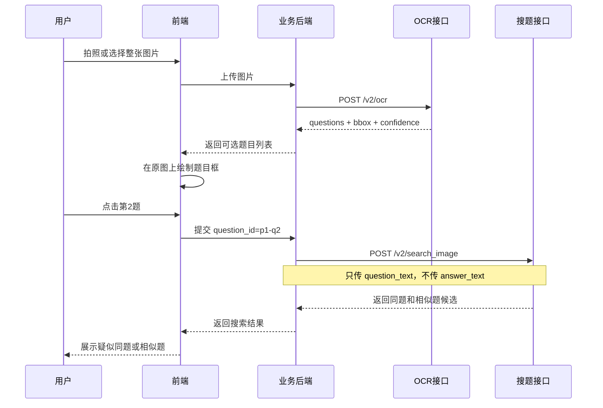

# 前端拍照搜题接入文档

## 1. 接入信息

| 项目 | 内容 |
| --- | --- |
| 前端服务地址 | 使用业务后端提供的同域 API 地址 |
| 前端图片 OCR | `POST /api/photo-question/ocr` |
| 前端选题搜索 | `POST /api/photo-question/search` |
| 内部 MathRAG OCR | `POST /v2/ocr`，仅业务后端调用 |
| 内部 MathRAG 搜题 | `POST /v2/search_image`，仅业务后端调用 |
| OCR 模型 | `PaddleOCR-VL-1.6` |

本文第 10 节包含一张图片识别两道题、用户选中第二题并搜索相似题的完整真实联调案例。

拍照搜题分成两个独立接口：

```text
上传整张图片
    ↓
前端接口一：/api/photo-question/ocr
    ↓
返回每道题及其坐标
    ↓
前端在原图上画框，用户选择一道题
    ↓
前端接口二：/api/photo-question/search
    ↓
返回同题和相似题
```

上述 `/api/photo-question/*` 是业务后端需要提供给前端的代理路由，分别映射到内部
MathRAG 的 `/v2/ocr` 和 `/v2/search_image`。

## 2. 安全要求

前端请求中不携带 PaddleOCR Token、MathRAG 接口密钥或其他第三方模型凭证。

`PADDLEOCR_API_TOKEN` 已配置在 MathRAG 服务器环境变量中。业务后端调用内部
`/v2/ocr` 时所需的访问凭证也由业务后端底层配置并自动添加。

禁止把任何上述凭证硬编码进网页、JavaScript 包、APP 安装包或 Git 仓库。

调用结构：

```text
浏览器或 APP
    ↓
业务后端拍照搜题接口
    ↓ 从服务端配置读取凭证
MathRAG /v2/ocr
    ↓ 从服务器环境变量读取 PaddleOCR Token
PaddleOCR-VL
```

前端不得绕过业务后端直接访问 MathRAG 公网地址。

## 3. 接口一：整张图片 OCR

### 3.1 请求

```http
POST /api/photo-question/ocr
Content-Type: multipart/form-data
```

请求参数：

| 字段 | 类型 | 必填 | 说明 |
| --- | --- | --- | --- |
| `image` | File | 是 | 学生整页照片 |

图片限制：

- 支持 JPG、PNG、WEBP。
- 单张最大 8MB。
- 图片宽高不能小于 64 像素。

注意：使用 `FormData` 时，不要手动设置 `Content-Type`，浏览器会自动添加 multipart boundary。

### 3.2 TypeScript 调用

```typescript
const BUSINESS_API_BASE_URL = "";

export async function recognizeStudentPhoto(
  image: File,
): Promise<OcrResponse> {
  const formData = new FormData();
  formData.append("image", image);

  const response = await fetch(
    `${BUSINESS_API_BASE_URL}/api/photo-question/ocr`,
    {
      method: "POST",
      body: formData,
    },
  );

  if (!response.ok) {
    const error = await response.json().catch(() => null);
    throw new Error(error?.detail ?? `OCR 请求失败：${response.status}`);
  }

  return response.json();
}
```

### 3.3 TypeScript 类型

```typescript
export type BoundingBox = [number, number, number, number];

export interface OcrQuestion {
  question_id: string;
  question_no: string;
  page_index: number;

  // 兼容字段，包含题干和学生作答。
  text: string;

  // 搜索相似题时只使用该字段。
  question_text: string;

  // 学生作答，不参与相似题搜索。
  answer_text: string;

  // 题干置信度。
  confidence: number | null;
  answer_confidence: number | null;

  // 整道题、题干、作答在原图上的像素坐标。
  bbox: [number, number, number, number] | null;
  question_bbox: [number, number, number, number] | null;
  answer_bbox: [number, number, number, number] | null;
}

export interface OcrBlock {
  page_index: number;
  order: number;
  label: string;
  text: string;
  bbox: [number, number, number, number] | null;
  confidence: number | null;
}

export interface OcrResponse {
  source: "image_ocr";
  provider: "paddleocr_aistudio";
  model: "PaddleOCR-VL-1.6";
  job_id: string;

  ocr_text: string;
  ocr_confidence: number | null;
  ocr_low_confidence: boolean;
  ocr_low_confidence_threshold: number;
  auto_judgement_failed: boolean;
  auto_judgement_failure_reason: string | null;

  page_count: number;
  document: {
    width: number;
    height: number;
    bbox_coordinate_space: "image_pixels";
  };
  image: {
    width: number;
    height: number;
    original_size: number;
    processed_size: number;
    resized: boolean;
  };

  questions: OcrQuestion[];
  blocks: OcrBlock[];
  warnings: string[];
}
```

### 3.4 响应示例

```json
{
  "source": "image_ocr",
  "provider": "paddleocr_aistudio",
  "model": "PaddleOCR-VL-1.6",
  "ocr_confidence": 0.8329,
  "ocr_low_confidence": false,
  "auto_judgement_failed": false,
  "page_count": 1,
  "document": {
    "width": 1600,
    "height": 1200,
    "bbox_coordinate_space": "image_pixels"
  },
  "questions": [
    {
      "question_id": "p1-q1",
      "question_no": "1",
      "page_index": 0,
      "text": "第 1 题题干和学生作答",
      "question_text": "第 1 题题干",
      "answer_text": "学生对第 1 题的作答",
      "confidence": 0.8565,
      "answer_confidence": 0.7956,
      "bbox": [95, 96, 923, 258],
      "question_bbox": [95, 96, 923, 146],
      "answer_bbox": [145, 213, 738, 258]
    },
    {
      "question_id": "p1-q2",
      "question_no": "2",
      "page_index": 0,
      "question_text": "第 2 题题干",
      "answer_text": "学生对第 2 题的作答",
      "confidence": 0.8513,
      "bbox": [91, 446, 991, 608]
    }
  ],
  "warnings": []
}
```

## 4. 在原图上展示可选题目

接口返回的 `bbox` 是基于 OCR 原图尺寸的像素坐标：

```text
[x1, y1, x2, y2]
```

前端图片缩放后，需要将坐标按比例映射到展示区域。

```typescript
export function scaleBoundingBox(
  bbox: [number, number, number, number],
  originalWidth: number,
  originalHeight: number,
  displayedWidth: number,
  displayedHeight: number,
) {
  const scaleX = displayedWidth / originalWidth;
  const scaleY = displayedHeight / originalHeight;
  const [x1, y1, x2, y2] = bbox;

  return {
    left: x1 * scaleX,
    top: y1 * scaleY,
    width: (x2 - x1) * scaleX,
    height: (y2 - y1) * scaleY,
  };
}
```

推荐页面结构：

```text
原始图片
├── 题目框 p1-q1，可点击
├── 题目框 p1-q2，可点击
└── 题目框 p1-q3，可点击
```

交互要求：

- 默认展示所有 `questions[].bbox`。
- 点击题目框后高亮当前题目。
- 同时展示对应的 `question_text`，允许用户确认 OCR 内容。
- 用户点击“搜索相似题”后，再调用接口二。
- 不要在图片 OCR 完成后自动搜索所有题目。
- `auto_judgement_failed=true` 时提示重新拍摄，不自动进入搜索。

如果前端使用 `object-fit: contain`，图片展示区可能有上下或左右留白。坐标换算时必须加上图片在容器内的实际偏移量，不能直接使用整个容器宽高。

## 5. 接口二：搜索选中的题目

### 5.1 请求

```http
POST /api/photo-question/search
Content-Type: application/json
```

请求参数：

| 字段 | 类型 | 必填 | 说明 |
| --- | --- | --- | --- |
| `ocr_text` | string | 是 | 选中题目的 `question_text` |
| `ocr_confidence` | number/null | 否 | 选中题目的 `confidence` |
| `k` | number | 否 | 返回数量，建议 `5` |
| `explain` | boolean | 否 | 前端建议传 `false` |

不要传：

- 整页 `ocr_text`
- `questions[].text`
- `answer_text`

这些内容包含其他题目或学生作答，会影响相似题搜索。

### 5.2 TypeScript 调用

```typescript
export async function searchSelectedQuestion(
  question: OcrQuestion,
): Promise<QuestionSearchResponse> {
  const response = await fetch(
    `${BUSINESS_API_BASE_URL}/api/photo-question/search`,
    {
      method: "POST",
      headers: {
        "Content-Type": "application/json",
      },
      body: JSON.stringify({
        ocr_text: question.question_text,
        ocr_confidence: question.confidence,
        k: 5,
        explain: false,
      }),
    },
  );

  if (!response.ok) {
    const error = await response.json().catch(() => null);
    throw new Error(error?.detail ?? `搜题请求失败：${response.status}`);
  }

  return response.json();
}
```

### 5.3 TypeScript 类型

```typescript
export type SameQuestionLabel =
  | "same"
  | "likely_same"
  | "similar"
  | "different";

export interface SearchResult {
  id: number;
  question: string;
  score: number;
  confidence: "high" | "medium" | "low";
  source: string;
  same_question: {
    label: SameQuestionLabel;
    is_same: boolean | null;
    probability: number;
    threshold: number;
    likely_threshold: number;
    conflicts: string[];
    model: string;
  };
}

export interface QuestionSearchResponse {
  source: "local_v2" | "none";
  ocr_text: string;
  best_score: number | null;

  is_same_question: boolean | null;
  same_question_label: SameQuestionLabel;
  question_bank_hit: boolean;
  question_bank_hit_label: SameQuestionLabel;
  question_bank_auto_reusable: boolean;

  ocr_confidence: number | null;
  ocr_low_confidence: boolean;
  auto_judgement_failed: boolean;
  auto_judgement_failure_reason: string | null;

  results: SearchResult[];
}
```

## 6. 搜题结果展示

| `same_question_label` | 前端文案 | 是否可以自动复用答案 |
| --- | --- | --- |
| `same` | 找到题库同题 | 是 |
| `likely_same` | 找到疑似同题 | 否 |
| `similar` | 找到相似题 | 否 |
| `different` | 暂未找到同题 | 否 |

前端不能根据 `best_score` 自行判断是不是同一道题。

是否允许复用题库答案，只判断：

```typescript
const canReuseAnswer =
  !response.auto_judgement_failed &&
  response.question_bank_auto_reusable;
```

即使 `question_bank_hit=true`，也可能只是 `likely_same`，不能自动复用题库答案。

## 7. 页面状态建议

```typescript
type PhotoSearchStatus =
  | "idle"
  | "uploading"
  | "recognizing"
  | "selecting"
  | "searching"
  | "result"
  | "error";
```

页面流程：

1. `idle`：等待拍照或选择图片。
2. `uploading`：图片正在上传。
3. `recognizing`：OCR 正在识别和分题。
4. `selecting`：在原图上展示可选题目框。
5. `searching`：搜索当前选中的题目。
6. `result`：展示同题和相似题。
7. `error`：展示错误及重试入口。

建议分别保存：

```typescript
const [ocrResult, setOcrResult] = useState<OcrResponse | null>(null);
const [selectedQuestionId, setSelectedQuestionId] = useState<string | null>(null);
const [searchResult, setSearchResult] =
  useState<QuestionSearchResponse | null>(null);
```

## 8. 错误处理

### OCR 接口

| HTTP 状态码 | 前端处理 |
| --- | --- |
| `400` | 提示图片格式、大小或文件损坏问题 |
| `401` | 提示接口鉴权失败，不要自动重试 |
| `422` | 提示没有上传 `image` 字段 |
| `502` | 提示 OCR 服务暂时不可用，允许稍后重试 |
| `503` | 提示 OCR 服务未配置 |

### 搜题接口

| 情况 | 前端处理 |
| --- | --- |
| `results=[]` | 提示“暂未找到相似题” |
| `auto_judgement_failed=true` | 提示重新拍摄 |
| 网络超时 | 保留当前选题，允许重新搜索 |
| HTTP 5xx | 提示服务暂时不可用 |

## 9. 前端验收用例

### 用例一：一张图识别多道题

- 上传包含至少两道题的图片。
- 原图上显示至少两个可点击题目框。
- 每个题目框对应唯一 `question_id`。

### 用例二：选中一道题

- 点击 `p1-q1`。
- 只高亮第一题区域。
- 搜索请求中的 `ocr_text` 等于第一题的 `question_text`。
- 请求中不包含第一题的 `answer_text`。

### 用例三：切换题目

- 从第一题切换到第二题。
- 清空上一道题的搜索结果。
- 使用第二题的 `question_text` 重新搜索。

### 用例四：OCR 低置信度

- `auto_judgement_failed=true` 时提示重新拍摄。
- 不自动进入相似题搜索。

### 用例五：同题与相似题展示

- `same` 可以展示题库答案。
- `likely_same` 只能展示“疑似同题”。
- `similar` 只能展示“相似题”。
- `different` 不展示成题库命中。

## 10. 全流程真实案例

### 10.1 案例图片

假设学生上传的整张图片包含两道题：

```text
1. 已知函数 f(x)=x²-4x+3，求函数的最小值。

   解：f(x)=(x-2)²-1，所以最小值为 -1。

2. 若 |a|=4，|b|=3，夹角为60°，求 a·b。

   答：a·b=|a||b|cos60°=6。
```

原图尺寸为 `1600 × 1200`。

### 10.2 完整时序



### 10.3 上传图片

前端向业务后端上传：

```typescript
const formData = new FormData();
formData.append("image", imageFile);

const response = await fetch("/api/photo-question/ocr", {
  method: "POST",
  body: formData,
});
```

业务后端从底层配置读取凭证并调用 MathRAG `/v2/ocr`。该内部请求不由浏览器执行，
前端代码和浏览器网络请求中都不出现 MathRAG 或 PaddleOCR 凭证。

### 10.4 OCR 分题结果

该案例的真实 OCR 核心响应：

```json
{
  "source": "image_ocr",
  "provider": "paddleocr_aistudio",
  "model": "PaddleOCR-VL-1.6",
  "ocr_confidence": 0.8329,
  "ocr_low_confidence": false,
  "auto_judgement_failed": false,
  "document": {
    "width": 1600,
    "height": 1200,
    "bbox_coordinate_space": "image_pixels"
  },
  "questions": [
    {
      "question_id": "p1-q1",
      "question_no": "1",
      "question_text": "1. 已知函数 $f(x)=x^{2}-4x+3$，求函数的最小值。",
      "answer_text": "解：$f(x)=(x-2)^{2}-1$，所以最小值为 -1。",
      "confidence": 0.8565,
      "bbox": [95, 96, 923, 258],
      "question_bbox": [95, 96, 923, 146],
      "answer_bbox": [145, 213, 738, 258]
    },
    {
      "question_id": "p1-q2",
      "question_no": "2",
      "question_text": "2. 若 $|a|=4$，$|b|=3$，夹角为 $60^{\\circ}$，求 $a\\cdot b$。",
      "answer_text": "答：a·b=|a||b|cos60°=6。",
      "confidence": 0.8513,
      "bbox": [91, 446, 991, 608],
      "question_bbox": [91, 446, 991, 495],
      "answer_bbox": [143, 565, 684, 608]
    }
  ],
  "warnings": []
}
```

### 10.5 原图画框

原图 `1600 × 1200` 等比例显示为 `800 × 600`：

```text
scaleX = 800 / 1600 = 0.5
scaleY = 600 / 1200 = 0.5
```

第一题显示区域：

```text
原坐标：[95, 96, 923, 258]
left：47.5
top：48
width：414
height：81
```

第二题显示区域：

```text
原坐标：[91, 446, 991, 608]
left：45.5
top：223
width：450
height：81
```

如果图片使用 `object-fit: contain`，还要加上图片在容器内的实际水平或垂直偏移量。

### 10.6 用户选择第二题

用户点击第二题后：

```typescript
const selectedQuestionId = "p1-q2";

const selectedQuestion = ocrResult.questions.find(
  (question) => question.question_id === selectedQuestionId,
);
```

前端应：

- 高亮第二题的 `bbox`。
- 展示第二题的 `question_text` 供用户确认。
- 将 `answer_text` 作为学生作答单独展示。
- 用户点击“搜索相似题”后再调用第二个接口。
- 不自动搜索图片中的全部题目。

### 10.7 搜索第二题

请求只使用选中题目的题干和题干置信度：

```json
{
  "ocr_text": "2. 若 $|a|=4$，$|b|=3$，夹角为 $60^{\\circ}$，求 $a\\cdot b$。",
  "ocr_confidence": 0.8513,
  "k": 3,
  "explain": false
}
```

请求中不能包含：

- 整页 OCR 文本。
- 第一题文本。
- 第二题的 `answer_text`。
- 包含题干和作答的兼容字段 `text`。

### 10.8 真实搜索结果

该案例第二题的真实搜索核心响应：

```json
{
  "source": "local_v2",
  "best_score": 0.665,
  "is_same_question": null,
  "same_question_label": "likely_same",
  "question_bank_hit": true,
  "question_bank_hit_label": "likely_same",
  "question_bank_auto_reusable": false,
  "ocr_confidence": 0.8513,
  "ocr_low_confidence": false,
  "auto_judgement_failed": false,
  "results": [
    {
      "id": 1977,
      "question": "题库候选题原文",
      "score": 0.665,
      "same_question": {
        "label": "likely_same",
        "is_same": null,
        "conflicts": []
      }
    },
    {
      "id": 2205,
      "question": "另一道向量相似题",
      "score": 0.658,
      "same_question": {
        "label": "different",
        "is_same": false,
        "conflicts": ["number_conflict"]
      }
    }
  ]
}
```

该结果表示题库找到了高度相关候选，但没有达到“确认同一道题”的标准。

前端应显示：

```text
找到疑似同题或相似题
```

前端不能显示：

```text
已找到原题，可以直接使用答案
```

因为：

```text
question_bank_auto_reusable = false
```

### 10.9 低置信度分支

如果 OCR 返回：

```json
{
  "ocr_confidence": 0.42,
  "ocr_low_confidence": true,
  "auto_judgement_failed": true,
  "auto_judgement_failure_reason": "ocr_low_confidence"
}
```

前端提示：

```text
图片识别结果不够清晰，请重新拍摄
```

此时不自动搜索、不复用答案，也不进入人工 OCR 审核。

### 10.10 没有识别出题目

如果 `ocr_text` 不为空，但：

```json
{
  "questions": []
}
```

说明识别出了页面文字，但没有可靠识别出题号和题目边界。前端提示：

```text
没有识别出可选择的题目，请重新拍摄并确保题号完整清晰
```

不要直接拿整页 `ocr_text` 搜索。

### 10.11 案例验收结果

| 验证项 | 结果 |
| --- | --- |
| 整张图片上传 | 通过 |
| PaddleOCR-VL 识别 | 通过 |
| 两道题分割 | 通过 |
| 题干与作答拆分 | 通过 |
| 题目坐标返回 | 通过 |
| 用户选择 `p1-q2` | 通过 |
| 选中题目搜索 | 通过 |
| 返回相似题候选 | 通过 |
| OCR 接口鉴权 | 通过 |
| 原题库 5749 道题 | 正常 |

最终链路：

```text
整张学生照片
→ 识别两道题
→ 用户选择第二题
→ 只用第二题题干搜索
→ 返回疑似同题和相似题
→ 不自动复用候选答案
```
