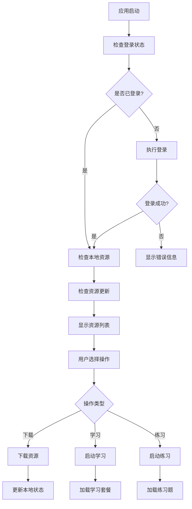

# 安卓原生知识图谱资源管理业务逻辑技术文档

## 1. 系统架构概述

知识图谱资源管理系统采用分层架构设计，主要包含以下核心组件：

- **KnowledgeGraphActivity**: 知识图谱主界面，负责展示思维导图和资源管理入口
- **LearnResourceManager**: 核心资源管理器，采用单例模式，负责所有资源操作
- **TextbookManagementActivity**: 课本管理界面，提供资源下载、更新、删除等功能
- **WebAppInterface**: WebView与原生代码的桥接接口

## 2. 核心业务逻辑流程

### 2.1 资源初始化流程

```java
// 1. 应用启动时执行资源检查
private void preformResourcesChecks() {
    if (LearnResourceManager.getInstance().isLoggedIn()) {
        // 已登录：直接检查本地资源
        checkUserLocalLearnResources();
        checkUpdateLearnResource();
    } else {
        // 未登录：先登录再检查资源
        LearnResourceManager.getInstance().login(
            AppUtils.getUserId(), 
            AppUtils.getUserPassword(), 
            new LearnResourceManager.LoginCallback() {
                @Override
                public void onSuccess(LoginResponse response) {
                    checkUserLocalLearnResources();
                    checkUpdateLearnResource();
                }
            }
        );
    }
}
```

### 2.2 本地资源检查流程

```java
// 2. 检查用户本地学习资源
private void checkUserLocalLearnResources() {
    LearnResourceManager.getInstance().loadUserAllLocalTextbooks(
        new LearnResourceManager.AllTextbooksCallback() {
            @Override
            public void onSuccess(List<UserTextbookInfo> textbooks) {
                if (textbooks == null) {
                    // 没有资源：提示下载
                    promptToDownloadResource();
                } else {
                    // 过滤已下载的资源
                    List<UserTextbookInfo> localTextbooks = new ArrayList<>();
                    for (UserTextbookInfo textbook : textbooks) {
                        if (textbook.isDownloaded) {
                            localTextbooks.add(textbook);
                        }
                    }
                    
                    if (localTextbooks.isEmpty()) {
                        promptToDownloadResource();
                    } else {
                        presentLocalLearnResource(localTextbooks);
                    }
                }
            }
        }
    );
}
```

### 2.3 资源更新检查流程

```java
// 3. 检查资源更新
private void checkUpdateLearnResource() {
    LearnResourceManager.getInstance().checkForUpdates(
        new LearnResourceManager.UpdateCheckCallback() {
            @Override
            public void onUpdateAvailable(List<TextbookVersion> updatedTextbooks) {
                // 显示更新徽章
                if (updatedTextbooks.isEmpty()) {
                    mTextViewUpdateBadge.setVisibility(View.GONE);
                } else {
                    int count = updatedTextbooks.size();
                    mTextViewUpdateBadge.setText(count >= 99 ? "99+" : String.valueOf(count));
                    mTextViewUpdateBadge.setVisibility(View.VISIBLE);
                }
            }
        }
    );
}
```

## 3. LearnResourceManager核心功能

### 3.1 资源管理器架构

```java
public class LearnResourceManager {
    // 单例模式实现
    private static LearnResourceManager instance;
    
    // 核心组件
    private final Context context;
    private final Gson gson;
    private final Handler mainHandler;
    private final ExecutorService executorService;
    
    // 用户状态
    private String currentToken;
    private String currentUsername;
}
```

### 3.2 文件管理机制

```java
// 创建用户课本目录结构
private File createUserTextbookDirectory(TextbookVersion textbook) {
    File baseDir = new File(context.getExternalFilesDir(null), "LearnResources");
    File userDir = new File(baseDir, sanitizeFileName(currentUsername));
    File subjectDir = new File(userDir, sanitizeFileName(textbook.textbookSubjectLabel));
    File textbookDir = new File(subjectDir, sanitizeFileName(
        textbook.textbookId + "_" + textbook.textbookName + "_" + 
        textbook.textbookGradeLabel + "_" + textbook.textbookSemesterLabel
    ));
    textbookDir.mkdirs();
    return textbookDir;
}

// 目录结构：/LearnResources/用户名/学科/课本ID_课本名_年级_学期/
```

### 3.3 资源索引管理

```java
// 保存资源索引
private void saveResourceIndex(File textbookDir, ResourceIndex index) {
    File indexFile = new File(textbookDir, "resource_index.json");
    String json = gson.toJson(index);
    FileOutputStream fos = new FileOutputStream(indexFile);
    fos.write(json.getBytes("UTF-8"));
    fos.close();
}

// 加载资源索引
private ResourceIndex loadResourceIndex(File textbookDir) {
    File indexFile = new File(textbookDir, "resource_index.json");
    if (!indexFile.exists()) return null;
    
    byte[] bytes = new byte[(int) indexFile.length()];
    FileInputStream fis = new FileInputStream(indexFile);
    fis.read(bytes);
    fis.close();
    
    String json = new String(bytes, "UTF-8");
    return gson.fromJson(json, ResourceIndex.class);
}
```

## 4. 课本管理界面业务逻辑

### 4.1 课本列表加载

```java
private void loadTextbooks() {
    showLoading(true);
    showEmptyState(false);

    LearnResourceManager.getInstance().fetchUserAllOnlineTextbooks(
        new LearnResourceManager.AllTextbooksCallback() {
            @Override
            public void onSuccess(List<UserTextbookInfo> textbooks) {
                showLoading(false);
                allTextbooks.clear();
                allTextbooks.addAll(textbooks);
                
                updateSubjectChips();  // 更新学科筛选标签
                filterTextbooks();     // 应用筛选
                
                if (textbooks.isEmpty()) {
                    showEmptyState(true);
                }
            }
        }
    );
}
```

### 4.2 学科筛选机制

```java
private void updateSubjectChips() {
    chipGroupSubjects.removeAllViews();
    Set<String> subjects = new HashSet<>();
    
    // 收集所有学科
    for (UserTextbookInfo textbook : allTextbooks) {
        subjects.add(textbook.textbookSubjectLabel);
    }
    
    // 添加"全部"标签
    Chip allChip = new Chip(this);
    allChip.setText("全部");
    allChip.setCheckable(true);
    allChip.setChecked(selectedSubjects.isEmpty());
    chipGroupSubjects.addView(allChip);
    
    // 添加学科标签
    for (String subject : subjects) {
        Chip chip = new Chip(this);
        chip.setText(subject);
        chip.setCheckable(true);
        chip.setChecked(selectedSubjects.contains(subject));
        chipGroupSubjects.addView(chip);
    }
}
```

### 4.3 课本筛选逻辑

```java
private void filterTextbooks() {
    filteredTextbooks.clear();
    
    if (selectedSubjects.isEmpty()) {
        // 没有选择学科：显示全部
        filteredTextbooks.addAll(allTextbooks);
    } else {
        // 按选择的学科筛选
        for (UserTextbookInfo textbook : allTextbooks) {
            if (selectedSubjects.contains(textbook.textbookSubjectLabel)) {
                filteredTextbooks.add(textbook);
            }
        }
    }
    
    textbookAdapter.notifyDataSetChanged();
    showEmptyState(filteredTextbooks.isEmpty() && !allTextbooks.isEmpty());
}
```

## 5. 学习套餐管理

### 5.1 套餐更新流程

```java
private void updateLearnPackages() {
    try {
        LearnResourceManager.getInstance().getTextbookPackagesWithLocalFiles(
            mCurrentUserTextbookInfo.textbookId,
            new LearnResourceManager.TextbookPackagesCallback() {
                @Override
                public void onSuccess(List<LocalPackageInfo> packages) {
                    mLearnPackages = packages;
                }

                @Override
                public void onError(String error) {
                    mLearnPackages.clear();
                }
            }
        );
    } catch (Exception e) {
        Log.e(TAG, "Update learn packages:" + e.getMessage());
    }
}
```

### 5.2 学习资源启动

```java
public void startPreviewLessonActivity(String sectionId, String sectionName) {
    Intent previewLessonActivity = new Intent(context, LessonPreviewActivity.class);
    previewLessonActivity.putExtra(LessonPreviewActivity.KEY_PREVIEW_SECTION_NAME, sectionName);
    
    Gson gson = new GsonBuilder()
            .setDateFormat("yyyy-MM-dd HH:mm:ss")
            .create();
            
    if (!mLearnPackages.isEmpty()) {
        // 查找匹配的学习套餐
        LocalPackageInfo info = null;
        for (LocalPackageInfo pkg : mLearnPackages) {
            if (pkg.sectionId != null && 
                pkg.sectionId.toLowerCase().equals(sectionId.toLowerCase())) {
                info = pkg;
                break;
            }
        }
        
        if (info != null) {
            List<LocalPackageInfo> packages = new ArrayList<>();
            packages.add(info);
            previewLessonActivity.putExtra(
                LessonPreviewActivity.KEY_LEARN_PACKAGE, 
                gson.toJson(packages)
            );
            startActivity(previewLessonActivity);
        } else {
            Toast.makeText(context, "没有对应的学习资源", Toast.LENGTH_SHORT).show();
        }
    } else {
        Toast.makeText(context, "选择小节去学习", Toast.LENGTH_SHORT).show();
    }
}
```

## 6. 知识点映射机制

### 6.1 知识点ID映射

```java
private String getKnowledgeId(String nodeId) {
    // 硬编码的知识点映射表
    Map<String, String> knowledgeMap = new HashMap<>();
    knowledgeMap.put("2dc0dd3d-359d-487b-be75-cbc6db7afcad", 
        "1942495553826639874,1942495552635457538,1942495554015383557...");
    // ... 更多映射关系
    
    return knowledgeMap.getOrDefault(nodeId, "");
}
```

### 6.2 练习题启动

```java
@JavascriptInterface
public void onReviewLesson(String nodeId, String nodeName) {
    if (mCurrentUserTextbookInfo == null) {
        Toast.makeText(context, "当前课本没有练习题", Toast.LENGTH_SHORT).show();
        return;
    }

    ChapterNode node = findChapterNodeById(mCurrentUserTextbookInfo.structure, nodeId);
    if (node == null) {
        Toast.makeText(context, "选择小节去练习", Toast.LENGTH_SHORT).show();
        return;
    }

    String knowledgeId = getKnowledgeId(nodeId);
    if (knowledgeId.toString().trim().isEmpty()) {
        Toast.makeText(context, "没有相关的习题", Toast.LENGTH_SHORT).show();
    } else {
        // 启动练习题界面
        new Handler(Looper.getMainLooper()).post(() -> 
            startFindExerciseActivity(knowledgeId.toString().trim())
        );
    }
}
```

## 7. 数据模型结构

### 7.1 核心数据模型

```java
// 用户课本信息
public class UserTextbookInfo {
    public String textbookId;
    public String textbookName;
    public String textbookSubjectLabel;
    public String textbookGradeLabel;
    public String textbookSemesterLabel;
    public boolean isDownloaded;
    public List<ChapterNode> structure;
}

// 本地套餐信息
public class LocalPackageInfo {
    public String sectionId;
    public String packageName;
    public List<ResourceFile> files;
}

// 章节节点
public class ChapterNode {
    public String id;
    public String name;
    public String label;
    public String knowledgeList;
    public List<ChapterNode> children;
}
```

## 8. 错误处理机制

### 8.1 资源检查异常处理

```java
private void preformResourcesChecks() {
    try {
        if (LearnResourceManager.getInstance().isLoggedIn()) {
            checkUserLocalLearnResources();
            checkUpdateLearnResource();
        } else {
            // 登录失败处理
            LearnResourceManager.getInstance().login(
                AppUtils.getUserId(), 
                AppUtils.getUserPassword(), 
                new LearnResourceManager.LoginCallback() {
                    @Override
                    public void onError(String error) {
                        checkUserLocalLearnResources();
                        Toast.makeText(KnowledgeGraphActivity.this, 
                            "登录研伴失败, 无法获取在线资源", Toast.LENGTH_SHORT).show();
                    }
                }
            );
        }
    } catch (Exception e) {
        Log.e(TAG, "Perform resource check:" + e.getMessage());
    }
}
```

## 9. 性能优化策略

### 9.1 异步处理

- 使用`ExecutorService`线程池处理网络请求
- 使用`Handler`确保UI更新在主线程执行
- 资源加载采用回调机制避免阻塞

### 9.2 缓存机制

- 本地文件系统缓存资源索引
- 用户学习数据持久化存储
- 资源下载状态本地记录

### 9.3 内存管理

- 及时清理Handler回调避免内存泄漏
- 使用弱引用避免循环引用
- 资源释放时清理相关数据

## 10. 系统流程图



## 11. 总结

知识图谱资源管理系统通过分层架构设计，实现了完整的资源管理功能：

1. **资源发现**: 通过API获取在线课本列表
2. **资源下载**: 支持课本资源的本地下载和存储
3. **资源管理**: 提供下载、更新、删除等管理功能
4. **资源使用**: 将资源与知识点关联，支持学习和练习
5. **状态同步**: 实时检查资源更新状态

系统采用单例模式的资源管理器，确保资源操作的一致性和高效性，通过WebView桥接实现原生与Web的交互，为用户提供完整的知识图谱学习体验。

### 技术特点

- **模块化设计**: 各组件职责清晰，便于维护和扩展
- **异步处理**: 避免UI阻塞，提升用户体验
- **本地缓存**: 减少网络请求，提高访问效率
- **错误处理**: 完善的异常处理机制，保证系统稳定性
- **性能优化**: 内存管理和资源释放机制完善
