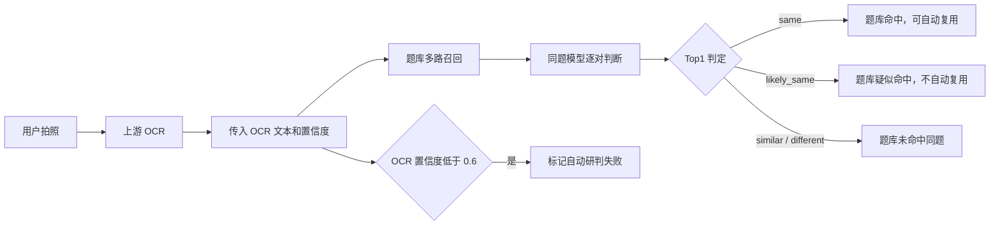

# 拍照搜题题库命中与同题判定接口文档

## 1. 文档信息

| 项目 | 内容 |
| --- | --- |
| 系统 | MathRAG v2 拍照搜题 |
| 文档版本 | v1.1 |
| 更新时间 | 2026-07-18 |
| 当前状态 | 已部署，可联调 |
| 服务地址 | `http://49.232.39.212:18211` |
| Swagger | `http://49.232.39.212:18211/docs` |

## 2. 当前能力

系统接收上游 OCR 识别出的题目文本，在现有题库中召回候选题，并判断候选题与拍照题目是否为同一道题。

当前版本支持：

- 清洗题号、空格、全角符号、HTML 转义、LaTeX 格式和常见 OCR 噪声。
- 根据文本、字符片段、知识点、求解目标、数字、变量、函数和运算符召回候选题。
- 独立判断两段题目是同题、疑似同题、相似题还是不同题。
- 拦截数字、公式、条件、知识点和求解目标冲突。
- OCR 置信度低时返回自动研判失败标识。

当前版本不包含：

- 服务端图片 OCR。调用方需要先完成 OCR，再传 `ocr_text`。
- OCR 人工审核流程。
- 对低置信 OCR 文本猜测或补全缺失条件。

## 3. 业务流程



## 4. 核心接口

### 4.1 拍照搜题

```http
POST /v2/search_image
Content-Type: application/json
```

请求参数：

| 字段 | 类型 | 必填 | 默认值 | 说明 |
| --- | --- | --- | --- | --- |
| `ocr_text` | string | 当前必填 | - | 上游 OCR 或公式识别后的完整题目文本 |
| `ocr_confidence` | number | 否 | `null` | OCR 整体置信度，取值范围 `0～1` |
| `image_base64` | string | 否 | `null` | 预留字段，当前不会执行图片 OCR |
| `k` | integer | 否 | `5` | 返回候选数量，范围 `1～20` |
| `explain` | boolean | 否 | `true` | 是否返回详细匹配特征 |

请求示例：

```bash
curl -X POST 'http://49.232.39.212:18211/v2/search_image' \
  -H 'Content-Type: application/json' \
  -d '{
    "ocr_text": "函数 f(x)=e^x-x-1，证明 f(x)>=0",
    "ocr_confidence": 0.92,
    "k": 3,
    "explain": false
  }'
```

响应核心示例：

```json
{
  "source": "local_v2",
  "ocr_text": "函数 f(x)=e^x-x-1，证明 f(x)>=0",
  "best_score": 0.6587,
  "is_same_question": null,
  "same_question_label": "likely_same",
  "question_bank_hit": true,
  "question_bank_hit_label": "likely_same",
  "question_bank_auto_reusable": false,
  "ocr_confidence": 0.92,
  "ocr_low_confidence": false,
  "ocr_low_confidence_threshold": 0.6,
  "auto_judgement_failed": false,
  "auto_judgement_failure_reason": null,
  "results": [
    {
      "id": 4838,
      "question": "题库中的候选题原文",
      "score": 0.6587,
      "same_question": {
        "label": "likely_same",
        "is_same": null,
        "probability": 0.82,
        "threshold": 0.895,
        "likely_threshold": 0.695,
        "conflicts": [],
        "model": "same-question-ensemble-v1"
      }
    }
  ]
}
```

说明：示例中的分数和概率仅用于说明字段格式，实际值由输入文本和题库内容决定。

### 4.2 文本搜题

不经过拍照/OCR 状态判断时，可以使用：

```http
POST /v2/search
Content-Type: application/json
```

请求示例：

```json
{
  "query": "函数 f(x)=e^x-x-1，证明 f(x)>=0",
  "k": 3,
  "candidate_pool": 50,
  "min_score": 0,
  "explain": false,
  "solve_fallback": false
}
```

### 4.3 直接比较两道题

```http
POST /v2/same_question
Content-Type: application/json
```

请求示例：

```json
{
  "query": "若|a|=4且|b|=3，夹角135度，求a点乘b",
  "candidate": "若|a|=4且|b|=3，夹角60度，求a点乘b"
}
```

响应示例：

```json
{
  "label": "similar",
  "is_same": false,
  "probability": 0.21,
  "threshold": 0.895,
  "likely_threshold": 0.695,
  "conflicts": [
    "number_conflict",
    "strong_math_condition_conflict"
  ],
  "evidence": {
    "small_probability": 0.31,
    "large_probability": 0.25,
    "sequence_ratio": 0.91,
    "number_query_coverage": 0.75
  },
  "model": "same-question-ensemble-v1"
}
```

### 4.4 健康检查

```http
GET /v2/health
```

正常响应：

```json
{
  "status": "ok",
  "index_size": 5749,
  "mode": "math-aware-hybrid",
  "same_question_model": {
    "loaded": true
  }
}
```

联调时应至少检查：

- `status` 等于 `ok`。
- `index_size` 大于 `0`。
- `same_question_model.loaded` 等于 `true`。

## 5. 后端核心字段

| 字段 | 类型 | 含义 |
| --- | --- | --- |
| `question_bank_hit` | boolean | Top1 是 `same` 或 `likely_same` 时为 `true` |
| `question_bank_hit_label` | string | Top1 的同题判定标签 |
| `question_bank_auto_reusable` | boolean | 只有明确判定为 `same` 时为 `true` |
| `is_same_question` | boolean/null | `true` 为确认同题，`null` 为疑似同题，`false` 为非同题 |
| `same_question_label` | string | `same`、`likely_same`、`similar` 或 `different` |
| `best_score` | number/null | Top1 的题库召回综合分，不等于同题概率 |
| `results[].same_question.probability` | number | 同题融合模型概率 |
| `results[].same_question.conflicts` | array | 检测到的数学条件冲突 |

特别注意：

- `best_score` 是检索排序分，不能直接用于判断是不是同一道题。
- 同题判断以 `same_question_label` 和 `question_bank_auto_reusable` 为准。
- `question_bank_hit=true` 不一定允许复用答案，因为 `likely_same` 也算题库疑似命中。

## 6. 标签与后端动作

| 标签 | `is_same_question` | `question_bank_hit` | `question_bank_auto_reusable` | 建议动作 |
| --- | --- | --- | --- | --- |
| `same` | `true` | `true` | `true` | 确认题库同题，可自动复用题库内容 |
| `likely_same` | `null` | `true` | `false` | 题库疑似命中，不能自动复用 |
| `similar` | `false` | `false` | `false` | 仅为相似题，不能复用答案 |
| `different` | `false` | `false` | `false` | 题库未找到同题 |

建议后端判断：

```text
允许自动复用 = question_bank_auto_reusable
题库是否疑似搜到 = question_bank_hit
```

不要使用下面的判断：

```text
best_score > 某个阈值
```

因为检索相似不代表数学条件一致。

## 7. OCR 低置信度处理

当前 OCR 低置信度阈值为 `0.6`。

当：

```text
ocr_confidence < 0.6
```

系统返回：

```json
{
  "ocr_confidence": 0.42,
  "ocr_low_confidence": true,
  "ocr_low_confidence_threshold": 0.6,
  "auto_judgement_failed": true,
  "auto_judgement_failure_reason": "ocr_low_confidence"
}
```

本版本不进入 OCR 人工审核流程。后端收到 `auto_judgement_failed=true` 后，应记录本次自动研判失败，不应仅根据题库命中结果执行自动判罚或答案复用。

推荐后端最终自动处理条件：

```text
auto_judgement_failed == false
AND question_bank_auto_reusable == true
```

如果调用方不传 `ocr_confidence`，系统无法判断 OCR 是否低置信，此时：

```json
{
  "ocr_confidence": null,
  "ocr_low_confidence": false,
  "auto_judgement_failed": false
}
```

因此生产调用建议始终传入 OCR 置信度。

## 8. 同题判定规则

系统输出四档结果：

- `same`：归一化后完全一致，或者融合模型达到严格阈值并且没有数学条件冲突。
- `likely_same`：整体证据支持同题，但没有达到自动确认标准。
- `similar`：文本或知识点相似，但不能认为是同一道题。
- `different`：没有足够同题证据。

自动判定 `same` 需要：

```text
融合模型概率 >= 0.895
AND 大模型概率 >= 0.95
AND 不存在阻断冲突
```

阻断冲突包括：

- `number_conflict`：查询中的关键数字未被候选题覆盖。
- `target_conflict`：求解对象不同。
- `topic_conflict`：知识点或题型冲突。
- `goal_conflict`：求值、证明、范围、最值等任务冲突。
- `strong_math_condition_conflict`：公式、等式、不等式、数列或关键数学条件冲突。

## 9. 无 OCR 文本时的响应

如果只传 `image_base64`，没有传 `ocr_text`，当前服务不会识别图片，返回：

```json
{
  "source": "none",
  "reason": "image_ocr_not_configured",
  "message": "v2 已预留图片入口；当前请先传 ocr_text，后续可接 Mathpix/UniMERNet/自建 OCR。",
  "image_received": true
}
```

调用方应把图片交给 OCR 服务，获得文本后重新调用 `/v2/search_image`。

## 10. 联调验收用例

### 用例一：确认同题

两段题目只存在空格、标点或 LaTeX 格式差异。

预期：

```json
{
  "same_question_label": "same",
  "question_bank_auto_reusable": true
}
```

### 用例二：数字冲突

两道题文字相同，但角度、参数或常数不同。

预期：

```json
{
  "same_question_label": "similar",
  "question_bank_auto_reusable": false
}
```

同时 `conflicts` 应包含数字或数学条件冲突。

### 用例三：求解目标冲突

一道题求点积，另一道题求向量和的模。

预期：

```json
{
  "question_bank_auto_reusable": false
}
```

### 用例四：OCR 低置信度

传入：

```json
{
  "ocr_text": "函数 f(x)=e^x-x-1，证明 f(x)>=0",
  "ocr_confidence": 0.42,
  "k": 1,
  "explain": false
}
```

预期：

```json
{
  "ocr_low_confidence": true,
  "auto_judgement_failed": true,
  "auto_judgement_failure_reason": "ocr_low_confidence"
}
```

## 11. 当前部署说明

- 新服务运行在独立端口 `18211`。
- 原服务和原端口未修改。
- 新服务使用迁移后的原题库数据，当前索引题目数为 `5749`。
- 同题模型文件已加载。
- API 当前未设置业务鉴权，调用方应避免直接暴露给不可信客户端。

