# 教材下载流程完整时序图

## 详细时序图

```mermaid
sequenceDiagram
    participant U as 用户
    participant V as MyResourcesView
    participant A as ApiService
    participant R as ResourceManager
    participant DB as IndexedDB
    participant S as 服务器
    participant C as 下载控制器

    Note over U,S: ========== 场景1: 首次下载教材 ==========

    U->>V: 点击下载按钮
    V->>V: 检查教材状态<br/>(!isDownloaded && downloadedFiles === 0)
    V->>A: downloadTextbook(textbook)
    
    Note over A,C: 阶段1: 初始化下载控制器
    A->>C: 创建AbortController()
    A->>A: 存储控制器到downloadControllers Map
    A->>V: 设置downloadStatus = 1 (下载中)
    V->>V: 更新UI显示下载状态
    
    Note over A,S: 阶段2: 获取学习资源包
    A->>A: 检查textbook.learningPackages是否存在
    alt 首次下载(learningPackages为空)
        A->>S: getLearningResources(textbook.id)
        S-->>A: 返回LearningPackage[]数据
        A->>A: 设置textbook.learningPackages = serverPackages
    else 继续下载(learningPackages已存在)
        A->>A: 使用已有的learningPackages
    end
    
    Note over A,DB: 阶段3: 增量文件筛选
    A->>R: 获取本地学习资源包
    R->>DB: 查询textbooks表
    DB-->>R: 返回本地教材数据
    R-->>A: 返回localLearningPackages
    
    A->>A: 遍历服务器学习资源包
    loop 每个服务器学习包
        A->>A: 查找对应的本地包
        alt 本地包不存在
            A->>A: 标记所有文件需要下载
        else 本地包存在
            A->>A: 遍历服务器文件列表
            loop 每个服务器文件
                A->>A: 查找对应的本地文件
                alt 本地文件不存在
                    A->>A: 标记文件需要下载 (原因: 新文件)
                else 本地文件存在
                    alt 校验和不匹配
                        A->>A: 标记文件需要下载 (原因: 文件已更新)
                    else 校验和匹配
                        A->>R: hasFileData(textbookId, fileId)
                        R->>DB: 检查fileData是否存在
                        DB-->>R: 返回fileData存在性
                        R-->>A: 返回检查结果
                        alt fileData不存在
                            A->>A: 标记文件需要下载 (原因: 暂停后继续下载)
                        else fileData存在
                            A->>A: 跳过文件下载
                        end
                    end
                end
            end
        end
    end
    
    Note over A,DB: 阶段4: 保存学习资源包信息
    A->>R: updateTextbookInfo(textbook, undefined, false)
    R->>R: 添加到pendingUpdates队列
    R->>R: 触发防抖刷新(1秒延迟)
    
    Note over A,DB: 阶段5: 设置教材总文件数
    A->>R: setTextbookTotalFiles(textbookId, totalServerFiles)
    R->>DB: 更新textbooks表totalFiles字段
    DB-->>R: 更新成功
    R-->>A: 设置完成
    
    alt 没有文件需要下载
        A->>V: 返回下载成功
        V->>V: 设置downloadStatus = 2 (下载完成)
    else 有文件需要下载
        Note over A,S: 阶段6: 并发下载文件
        A->>A: 创建下载任务队列(最多6个并发)
        loop 每个需要下载的文件
            A->>A: 检查AbortController.signal.aborted
            alt 下载已取消
                A->>A: 跳过文件下载
            else 继续下载
                A->>A: 初始化文件进度为0
                A->>S: 获取资源下载URL
                S-->>A: 返回相对路径URL
                A->>S: fetch(downloadUrl, {signal: controller.signal})
                S-->>A: 返回文件流
                
                Note over A,A: 流式下载处理
                A->>A: 创建ReadableStream reader
                loop 读取文件块
                    A->>A: reader.read()
                    A->>A: 检查controller.signal.aborted
                    alt 下载已取消
                        A->>A: reader.releaseLock()
                        A->>A: 抛出AbortError
                    else 继续读取
                        A->>A: chunks.push(value)
                        A->>A: 更新文件进度
                        A->>V: 调用onProgress回调
                        V->>V: 更新UI进度显示
                    end
                end
                
                A->>A: mergeChunksEfficiently(chunks)
                A->>A: 计算MD5校验和
                alt 校验和匹配
                    A->>R: storeFileData(fileInfo, fileData, false)
                    R->>R: 获取教材信息
                    R->>R: 查找对应学习包
                    R->>R: 初始化localFiles数组
                    R->>R: 创建/更新LocalFileInfo
                    R->>R: 添加到pendingUpdates队列
                    R->>R: 触发防抖刷新
                    A->>A: 标记下载成功
                else 校验和不匹配
                    A->>A: 抛出校验失败错误
                end
            end
        end
        
        Note over A,DB: 阶段7: 强制刷新IndexedDB
        A->>R: forceFlushPendingUpdates()
        R->>R: 批量更新所有pendingUpdates
        loop 每个待更新的教材
            R->>R: deepSerialize(textbook)
            R->>DB: 更新textbooks表
            DB-->>R: 更新成功
        end
        R->>R: 清空pendingUpdates队列
        
        Note over A,C: 阶段8: 清理下载控制器
        A->>A: 从downloadControllers删除控制器
        A->>V: 返回下载结果
    end
    
    alt 下载成功
        V->>V: 设置isDownloaded = true
        V->>V: 设置downloadStatus = 2 (下载完成)
        V->>V: 设置downloadedFiles = totalFiles
        V->>V: 设置lastDownloadTime = 当前时间
        V->>V: 设置hasUpdatesAvailable = false
        V->>R: updateTextbookInfo(textbook, undefined, true)
        R->>DB: 立即更新教材状态
        V->>V: 显示下载完成消息
    else 下载失败
        alt 用户主动暂停(AbortError)
            V->>V: 设置downloadStatus = 3 (已暂停)
            V->>V: 保持已下载的文件状态
            V->>R: updateTextbookInfo(textbook, undefined, true)
            V->>V: 显示暂停消息
        else 网络错误或其他异常
            V->>V: 设置downloadStatus = 0 (下载失败)
            V->>V: 保持已下载的文件状态
            V->>V: 显示错误消息
        end
    end

    Note over U,S: ========== 场景2: 暂停下载 ==========

    U->>V: 点击暂停按钮
    V->>A: pauseDownload(textbookId)
    A->>A: 从downloadControllers获取控制器
    A->>C: controller.abort()
    C->>C: 触发abort事件
    C->>A: 中断所有正在进行的下载请求
    A->>A: 从downloadControllers删除控制器
    A->>V: 返回暂停成功
    V->>V: 设置downloadStatus = 3 (已暂停)
    V->>R: updateTextbookInfo(textbook, undefined, true)
    R->>DB: 立即更新教材状态
    V->>V: 显示暂停消息

    Note over U,S: ========== 场景3: 继续下载(增量下载) ==========

    U->>V: 点击继续下载按钮
    V->>V: 检查教材状态<br/>(downloadedFiles > 0 && downloadedFiles < totalFiles)
    V->>A: downloadTextbook(textbook)
    
    Note over A,S: 阶段1: 重新初始化下载控制器
    A->>C: 创建新的AbortController()
    A->>A: 存储控制器到downloadControllers Map
    A->>V: 设置downloadStatus = 1 (下载中)
    
    Note over A,S: 阶段2: 获取学习资源包(使用已有数据)
    A->>A: 使用textbook.learningPackages(已存在)
    
    Note over A,DB: 阶段3: 增量文件筛选(关键优化)
    A->>R: 获取本地学习资源包
    R->>DB: 查询textbooks表
    DB-->>R: 返回本地教材数据
    R-->>A: 返回localLearningPackages
    
    A->>A: 遍历服务器学习资源包
    loop 每个服务器学习包
        A->>A: 查找对应的本地包
        alt 本地包不存在
            A->>A: 标记所有文件需要下载
        else 本地包存在
            A->>A: 遍历服务器文件列表
            loop 每个服务器文件
                A->>A: 查找对应的本地文件
                alt 本地文件不存在
                    A->>A: 标记文件需要下载 (原因: 新文件)
                else 本地文件存在
                    alt 校验和不匹配
                        A->>A: 标记文件需要下载 (原因: 文件已更新)
                    else 校验和匹配
                        A->>R: hasFileData(textbookId, fileId)
                        R->>DB: 检查fileData是否存在
                        DB-->>R: 返回fileData存在性
                        R-->>A: 返回检查结果
                        alt fileData不存在
                            A->>A: 标记文件需要下载 (原因: 暂停后继续下载)
                        else fileData存在
                            A->>A: 跳过文件下载 (关键优化点)
                        end
                    end
                end
            end
        end
    end
    
    Note over A: 关键优化: 只下载fileData中不存在的文件
    Note over A: 避免重复下载已完成的文件
    
    Note over A,S: 阶段4-8: 执行下载流程(同场景1)
    A->>A: 保存学习资源包信息
    A->>A: 设置教材总文件数
    A->>A: 并发下载需要更新的文件
    A->>A: 强制刷新IndexedDB
    A->>A: 清理下载控制器
    
    alt 下载成功
        V->>V: 设置isDownloaded = true
        V->>V: 设置downloadStatus = 2 (下载完成)
        V->>V: 显示下载完成消息
    else 下载失败
        alt 用户主动暂停
            V->>V: 设置downloadStatus = 3 (已暂停)
            V->>V: 显示暂停消息
        else 网络错误
            V->>V: 设置downloadStatus = 0 (下载失败)
            V->>V: 显示错误消息
        end
    end

    Note over U,S: ========== 场景4: 重新下载(全量下载) ==========

    U->>V: 点击重新下载按钮
    V->>V: 检查教材状态<br/>(downloadStatus === 0 && downloadedFiles === 0)
    V->>A: downloadTextbook(textbook)
    
    Note over A,S: 阶段1: 初始化下载控制器
    A->>C: 创建AbortController()
    A->>A: 存储控制器到downloadControllers Map
    A->>V: 设置downloadStatus = 1 (下载中)
    
    Note over A,S: 阶段2: 获取学习资源包
    A->>S: getLearningResources(textbook.id)
    S-->>A: 返回LearningPackage[]数据
    A->>A: 设置textbook.learningPackages = serverPackages
    
    Note over A,DB: 阶段3: 全量文件筛选
    A->>R: 获取本地学习资源包
    R->>DB: 查询textbooks表
    DB-->>R: 返回本地教材数据
    R-->>A: 返回localLearningPackages
    
    A->>A: 遍历服务器学习资源包
    loop 每个服务器学习包
        A->>A: 查找对应的本地包
        alt 本地包不存在
            A->>A: 标记所有文件需要下载
        else 本地包存在
            A->>A: 遍历服务器文件列表
            loop 每个服务器文件
                A->>A: 查找对应的本地文件
                alt 本地文件不存在
                    A->>A: 标记文件需要下载 (原因: 新文件)
                else 本地文件存在
                    alt 校验和不匹配
                        A->>A: 标记文件需要下载 (原因: 文件已更新)
                    else 校验和匹配
                        A->>A: 标记文件需要下载 (原因: 强制重新下载)
                        Note over A: 重新下载: 忽略fileData存在性检查
                    end
                end
            end
        end
    end
    
    Note over A: 重新下载: 忽略fileData存在性检查
    Note over A: 强制重新下载所有文件
    
    Note over A,S: 阶段4-8: 执行下载流程(同场景1)
    A->>A: 保存学习资源包信息
    A->>A: 设置教材总文件数
    A->>A: 并发下载所有文件
    A->>A: 强制刷新IndexedDB
    A->>A: 清理下载控制器
    
    alt 下载成功
        V->>V: 设置isDownloaded = true
        V->>V: 设置downloadStatus = 2 (下载完成)
        V->>V: 显示下载完成消息
    else 下载失败
        alt 用户主动暂停
            V->>V: 设置downloadStatus = 3 (已暂停)
            V->>V: 显示暂停消息
        else 网络错误
            V->>V: 设置downloadStatus = 0 (下载失败)
            V->>V: 显示错误消息
        end
    end

    Note over U,S: ========== 场景5: 教材更新检测与下载 ==========

    U->>V: 页面加载/点击检查更新按钮
    V->>A: checkForUpdates()
    
    Note over A,S: 阶段1: 获取服务器教材版本
    A->>S: getTextbookVersions()
    S-->>A: 返回TextbookVersion[]数据
    
    Note over A,DB: 阶段2: 获取本地教材信息
    A->>R: getUserLocalTextbooks()
    R->>DB: 查询textbooks表
    DB-->>R: 返回本地教材数据
    R-->>A: 返回UserTextbookInfo[]数据
    
    Note over A,A: 阶段3: 三级对比检查
    A->>A: 遍历服务器教材版本
    loop 每个服务器教材
        A->>A: 查找对应的本地教材
        alt 本地教材不存在
            A->>A: 标记需要更新
        else 本地教材存在
            Note over A,A: 第一级: 教材级别检查
            A->>A: 比较textbookUpdateTime
            alt 教材更新时间更新
                A->>A: 标记需要更新
            else 教材更新时间相同
                Note over A,A: 第二级: 包级别检查
                A->>S: getLearningResources(serverTextbook.id)
                S-->>A: 返回服务器学习包
                A->>A: 获取本地学习包
                loop 每个服务器学习包
                    A->>A: 查找对应的本地包
                    alt 本地包不存在
                        A->>A: 标记需要更新
                    else 本地包存在
                        A->>A: 比较包更新时间
                        alt 包更新时间更新
                            A->>A: 标记需要更新
                        else 包更新时间相同
                            Note over A,A: 第三级: 文件级别检查
                            A->>A: 遍历服务器文件列表
                            loop 每个服务器文件
                                A->>A: 查找对应的本地文件
                                alt 本地文件不存在
                                    A->>A: 标记需要更新
                                else 本地文件存在
                                    A->>A: 比较文件校验和
                                    alt 校验和不匹配
                                        A->>A: 标记需要更新
                                    else 校验和匹配
                                        A->>A: 文件无需更新
                                    end
                                end
                            end
                        end
                    end
                end
            end
        end
    end
    
    A->>V: 返回需要更新的教材列表
    
    alt 检测到更新
        V->>V: 更新教材hasUpdatesAvailable = true
        V->>R: updateTextbookInfo(textbook, {hasUpdatesAvailable: true}, false)
        V->>V: 显示更新提示UI
        V->>V: 显示更新按钮和版本信息
        
        U->>V: 点击更新按钮
        V->>V: 显示确认对话框
        U->>V: 确认更新
        V->>A: downloadTextbook(textbook)
        
        Note over A,S: 阶段4: 增量更新下载
        A->>A: 设置downloadStatus = 1 (更新中)
        A->>A: 获取学习资源包(使用已有数据)
        A->>A: 筛选需要更新的文件(校验和不匹配的文件)
        
        Note over A: 更新优化: 只下载变更的文件
        Note over A: 避免重新下载未变更的文件
        
        A->>A: 执行下载流程(同场景1)
        
        alt 更新成功
            V->>V: 设置downloadStatus = 2 (更新完成)
            V->>V: 设置hasUpdatesAvailable = false
            V->>V: 显示更新完成消息
        else 更新失败
            V->>V: 设置downloadStatus = 0 (更新失败)
            V->>V: 显示更新失败消息
        end
    else 无更新
        V->>V: 设置所有教材hasUpdatesAvailable = false
        V->>R: updateTextbookInfo(textbook, {hasUpdatesAvailable: false}, false)
        V->>V: 显示当前版本信息
        V->>V: 显示"所有教材都是最新版本"消息
    end

    Note over U,S: ========== 场景6: 下载失败处理 ==========

    U->>V: 点击下载按钮
    V->>A: downloadTextbook(textbook)
    A->>V: 设置downloadStatus = 1 (下载中)
    
    A->>S: 获取服务器端学习资源包
    S-->>A: 返回learningPackages数据
    
    Note over A,S: 下载文件过程中发生错误
    loop 下载文件过程中
        A->>S: 下载文件数据
        alt 网络错误
            S-->>A: 网络超时/连接失败
            A->>A: 捕获网络异常
            A->>V: 设置downloadStatus = 0 (下载失败)
            V->>V: 显示网络错误消息
        else 服务器错误
            S-->>A: HTTP 500/404等错误
            A->>A: 捕获服务器异常
            A->>V: 设置downloadStatus = 0 (下载失败)
            V->>V: 显示服务器错误消息
        else 文件校验失败
            A->>A: 计算文件MD5校验和
            A->>A: 比较校验和不匹配
            A->>A: 抛出校验失败异常
            A->>V: 设置downloadStatus = 0 (下载失败)
            V->>V: 显示校验失败消息
        else 存储错误
            A->>R: storeFileData(fileInfo, fileData)
            R->>DB: 存储到IndexedDB
            DB-->>R: 存储失败
            R-->>A: 抛出存储异常
            A->>V: 设置downloadStatus = 0 (下载失败)
            V->>V: 显示存储错误消息
        end
        
        Note over A,V: 下载失败，保持已下载的文件状态
        Note over A,V: 用户可以重新尝试下载
    end
    
    V->>V: 显示重试按钮
    V->>V: 保持已下载的文件进度

    Note over U,S: ========== 场景7: 页面加载与数据合并 ==========

    U->>V: 访问MyResourcesView页面
    V->>V: 触发loadResources()
    
    Note over V,A: 阶段1: 检查登录状态
    V->>R: isLoggedIn()
    R->>R: 检查localStorage中的token和userId
    R-->>V: 返回登录状态
    
    alt 未登录
        V->>A: autoLogin()
        A->>A: 从localStorage获取用户凭据
        A->>S: loginYanban(userId, password)
        S-->>A: 返回登录结果
        alt 自动登录成功
            A-->>V: 返回登录成功
        else 自动登录失败
            A-->>V: 返回登录失败
            V->>V: 显示登录失败消息
            V->>V: 清空教材列表
        end
    else 已登录
        Note over V: 继续执行数据加载
    end
    
    Note over V,S: 阶段2: 获取服务器教材数据
    V->>A: fetchUserAllOnlineTextbooks()
    A->>S: POST /api/learning-resource/textbook-management/fetch-online
    S-->>A: 返回UserTextbookInfo[]数据
    A-->>V: 返回服务器教材列表
    
    Note over V,DB: 阶段3: 获取本地教材数据
    V->>R: indexedDB.getAll('textbooks')
    R->>DB: 查询textbooks表
    DB-->>R: 返回本地教材数据
    R-->>V: 返回本地教材列表
    
    Note over V,V: 阶段4: 数据合并与状态更新
    V->>V: mergeServerAndLocalData(serverTextbooks, localTextbooks)
    loop 每个服务器教材
        V->>V: 查找对应的本地教材
        alt 本地教材存在
            V->>V: 合并数据(本地状态 + 服务器信息)
            V->>V: 保留本地下载状态和进度
            V->>V: 更新服务器最新信息
        else 本地教材不存在
            V->>V: 创建新教材记录
            V->>V: 设置默认状态(未下载)
        end
    end
    
    loop 每个本地教材
        V->>V: 检查是否存在于服务器
        alt 不存在于服务器
            V->>V: 添加到合并列表(本地独有教材)
        end
    end
    
    Note over V,DB: 阶段5: 更新本地存储
    loop 每个合并后的教材
        V->>R: updateTextbookInfo(textbook)
        R->>R: 添加到pendingUpdates队列
        R->>R: 触发防抖刷新
    end
    
    V->>V: 更新教材列表到UI
    V->>V: 更新学科筛选选项
    V->>V: 默认选择"全部"学科
    
    Note over V,V: 阶段6: 定期检查更新
    V->>V: 设置定时器(每5分钟)
    V->>V: 定期执行checkForUpdates()
    V->>V: 自动检测教材更新

    Note over U,S: ========== 场景8: 查看教材 ==========

    U->>V: 点击查看按钮
    V->>V: 检查教材状态<br/>(isDownloaded && downloadStatus === 2)
    V->>V: 跳转到PDF查看页面
    V->>V: router.push({name: 'pdfViewer', query: {textbookId, textbookName}})

    Note over U,S: ========== 场景9: 跳转知识图谱 ==========

    U->>V: 点击去学习按钮
    V->>V: 检查教材状态<br/>(isDownloaded && downloadStatus === 2)
    V->>V: 跳转到知识图谱页面
    V->>V: router.push({name: 'knowledgeGraph', query: {textbookId, textbookName}})

    Note over U,S: ========== 场景10: 清理过期数据 ==========

    U->>V: 页面加载完成
    V->>R: cleanupExpiredData()
    R->>R: 计算30天前的时间戳
    R->>DB: 查询所有教材数据
    loop 每个教材
        R->>R: 检查lastDownloadTime
        alt 超过30天且未下载
            R->>R: cleanupTextbookRelatedData(textbookId)
            R->>DB: 删除教材记录
        else 未过期或已下载
            R->>R: 保留教材记录
        end
    end
```



## 关键优化点详细说明

### 1. 增量下载优化机制
- **继续下载时**：只下载 `fileData` 中不存在的文件
- **避免重复下载**：已下载完成的文件不会重新下载
- **提高效率**：减少网络请求和存储操作
- **断点续传**：支持暂停后继续下载

### 2. 文件筛选逻辑详解
```typescript
// 文件需要下载的条件：
1. localFiles 中没有记录 (新文件)
2. 校验和不匹配 (文件已更新)  
3. fileData 中不存在实际数据 (暂停后继续下载)

// 文件需要更新的条件：
1. 校验和不匹配 (服务器文件已变更)
2. 版本号不同 (教材版本更新)
3. 包更新时间不同 (学习包更新)
```

### 3. 状态管理机制
- `downloadStatus = 0`: 未下载/下载失败
- `downloadStatus = 1`: 下载中
- `downloadStatus = 2`: 下载完成
- `downloadStatus = 3`: 已暂停

### 4. 进度回调机制
- 实时更新下载进度
- 显示已下载文件数/总文件数
- 提供用户友好的进度反馈
- 支持取消下载操作

### 5. 三级对比更新检测
- **第一级**：教材级别检查(更新时间)
- **第二级**：包级别检查(学习包更新时间)
- **第三级**：文件级别检查(文件校验和)

### 6. 并发下载优化
- 最多6个并发下载任务
- 流式下载减少内存占用
- 支持下载取消操作
- 错误重试机制

### 7. 数据存储优化
- 使用IndexedDB存储文件数据
- 批量更新减少数据库操作
- 防抖机制优化性能
- 深度序列化确保数据完整性

## 不同场景的Note分割说明

1. **场景1**: 首次下载 - 完整流程展示
2. **场景2**: 暂停下载 - 中断机制
3. **场景3**: 继续下载 - 增量下载优化
4. **场景4**: 重新下载 - 全量下载
5. **场景5**: 教材更新检测与下载 - 智能更新机制
6. **场景6**: 错误处理 - 异常情况处理
7. **场景7**: 页面加载与数据合并 - 数据同步机制
8. **场景8**: 查看教材 - 跳转PDF查看
9. **场景9**: 跳转知识图谱 - 跳转学习页面
10. **场景10**: 清理过期数据 - 存储空间管理

每个场景都通过 `Note over` 进行清晰分割，便于理解不同操作模式下的流程差异和优化策略。
