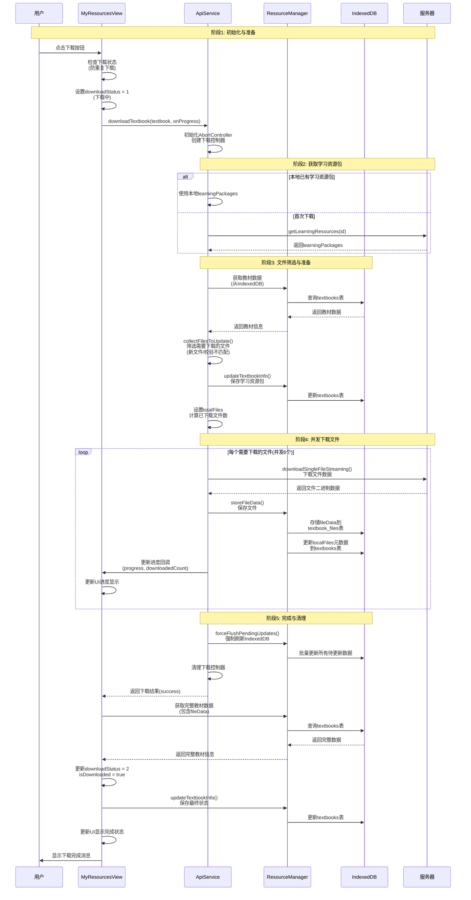

# 资源下载时序图

## 简略版本

## 详细版本

```mermaid
sequenceDiagram
    participant U as 用户
    participant V as MyResourcesView
    participant A as ApiService
    participant R as ResourceManager
    participant DB as IndexedDB
    participant S as 服务器

    Note over U,S: 阶段1: 用户触发与初始化
    U->>V: 点击下载按钮
    V->>V: 检查downloadStatus === 1<br/>(正在下载中?)
    alt 正在下载中
        V->>U: 显示"正在下载中"提示
        Note over V: 终止流程
    end
    V->>V: 检查downloadStatus === 2<br/>(已下载完成?)
    alt 已下载完成
        Note over V: 终止流程
    end
    V->>V: 设置downloadStatus = 1<br/>isDownloaded = false
    V->>A: downloadTextbook(textbook, onProgress)
    Note over A: 开始下载流程

    Note over A,S: 阶段2: 初始化下载控制器
    A->>A: 创建AbortController实例
    A->>A: 将controller存储到<br/>downloadControllers Map<br/>(key: textbookId)
    Note over A: 用于支持暂停/取消下载

    Note over A,S: 阶段3: 获取学习资源包
    A->>A: 检查textbook.learningPackages<br/>是否已有数据
    alt 本地已有learningPackages
        A->>A: 使用本地learningPackages<br/>serverPackages = textbook.learningPackages
        Note over A: 优化：避免重复请求服务器
    else 首次下载或无本地数据
        A->>A: getServerLearningPackages(textbook)
        A->>A: getLearningResources(textbook.id)
        A->>S: POST /blw-edu-yb/api/app/learning-resources<br/>请求体: {id: textbook.id}
        S-->>A: 返回learningPackages数组<br/>包含packageId、packageName等
        A->>A: 更新textbook.learningPackages<br/>= serverPackages
    end
    alt 没有学习资源包
        A-->>V: 返回true(无文件需下载)
        Note over A,V: 提前结束
    end

    Note over A,DB: 阶段4: 收集需要更新的文件
    A->>A: collectFilesToUpdate(textbook, serverPackages)
    Note over A: 第1步：获取本地学习资源包
    A->>A: localLearningPackages =<br/>textbook.learningPackages || []
    Note over A: 第2步：从IndexedDB获取最新教材数据
    A->>R: indexedDB.get('textbooks', textbook.id)
    R->>DB: 查询textbooks表<br/>使用主键id
    DB-->>R: 返回UserTextbookInfo
    alt 通过id查不到
        A->>R: indexedDB.getByIndex('textbooks',<br/>'textbookId', textbook.textbookId)
        R->>DB: 通过textbookId索引查询
        alt ⚠️ 索引不存在问题
            Note over R,DB: ⚠️ 问题点1: textbookId索引不存在<br/>自动降级到getAll查询
            R->>DB: getAll('textbooks')
            DB-->>R: 返回所有教材
            R->>R: 在内存中查找匹配的教材<br/>(通过textbookId)
        end
        DB-->>R: 返回教材数据
    end
    R-->>A: 返回latestTextbook
    Note over A: 第3步：构建本地文件映射表
    A->>A: 创建localFileMap<br/>key: file.id, value: LocalFileInfo
    A->>A: 遍历latestTextbook.localFiles<br/>填充localFileMap
    Note over A: 第4步：遍历服务器学习资源包
    loop 每个服务器学习包
        loop 每个资源文件
            A->>A: 检查文件是否需要下载<br/>(新文件/校验和不匹配/fileData不存在)
            alt 需要下载
                A->>A: 添加到filesToUpdate数组
            end
            A->>A: totalServerFiles++
        end
    end
    A-->>A: 返回{filesToUpdate, totalServerFiles}

    Note over A,DB: 阶段5: 保存学习资源包与设置总文件数
    A->>R: updateTextbookInfo(textbook, undefined)
    R->>R: 深度序列化textbook对象<br/>(移除函数、处理Date等)
    R->>R: 添加到pendingUpdates Map<br/>(key: textbook.id)
    R->>R: 触发防抖刷新(1秒延迟)
    R->>DB: 更新textbooks表<br/>(保存learningPackages)
    A->>R: getUserLocalTextbooks()
    R->>DB: 查询所有textbooks
    DB-->>R: 返回教材列表
    R-->>A: 返回textbooks数组
    A->>A: 查找匹配的textbookRecord<br/>(通过textbookId)
    A->>R: updateTextbookInfo(textbookRecord,<br/>{totalFiles: totalServerFiles})
    R->>DB: 更新textbooks表
    A->>A: textbook.totalFiles = totalServerFiles
    alt filesToDownload === 0
        A-->>V: 返回true(无需下载)
        Note over A,V: 提前结束
    end

    Note over A,S: 阶段6: 并发下载文件
    A->>A: downloadFilesConcurrently(filesToUpdate,<br/>totalFiles, textbookId, controller,<br/>onProgress, textbook)
    Note over A: 初始化下载统计
    A->>A: 设置CONCURRENT_DOWNLOADS = 6<br/>创建下载队列<br/>初始化计数器
    Note over A: 创建下载任务函数
    A->>A: 定义downloadTask异步函数
    loop 并发执行6个下载任务
        par 任务1
            A->>A: 检查controller.signal.aborted
            alt 已取消
                A->>A: 记录失败，跳过
            else 继续下载
                A->>S: downloadSingleFileStreaming(resource, controller)
                Note over S: 流式下载文件数据
                S-->>A: 返回Uint8Array文件数据
                A->>A: totalDownloadedBytes += fileData.length
                A->>A: 解析章节顺序<br/>parseChapterOrderFromFileName()
                A->>A: 构建fileInfo对象<br/>(id, textbookId, packageId,<br/>fileName, fileSize, checksum等)
                A->>R: storeFileData(fileInfo, fileData, textbook)
                Note over R: 第1步：存储fileData到textbook_files表
                R->>DB: update('textbook_files', {<br/>fileId, textbookId, fileData})
                DB-->>R: 存储成功
                Note over R: 第2步：获取教材信息
                alt 传入textbook参数
                    R->>R: 使用传入的textbook
                else 未传入
                    R->>DB: getByIndex('textbooks',<br/>'textbookId', textbookId)
                    DB-->>R: 返回教材信息
                end
                Note over R: 第3步：查找学习包
                R->>R: 在textbookInfo.learningPackages<br/>中查找packageId匹配的包
                Note over R: 第4步：初始化localFiles数组
                alt localFiles不存在
                    R->>R: textbookInfo.localFiles = []
                end
                Note over R: 第5步：查找或创建本地文件元数据
                alt 文件已存在
                    R->>R: 更新existing localFile元数据<br/>(不含fileData)
                else 新文件
                    R->>R: 创建新的localFile元数据<br/>添加到localFiles数组
                end
                Note over R: 第6步：保存教材信息
                R->>R: 添加到pendingUpdates Map
                R->>R: 触发防抖刷新
                R->>DB: 更新textbooks表<br/>(保存localFiles元数据)
                R-->>A: 存储成功
                A->>A: 记录成功，successCount++
            end
        and 任务2
            Note over A: 同上...
        and 任务3-6
            Note over A: 同上...
        end
        A->>A: completedFiles++
        A->>A: 计算进度<br/>progress = (completedFiles / totalFiles) * 100
        A->>V: onProgress(progress, successCount)
        V->>V: 更新textbook.downloadedFiles<br/>= downloadedCount
        V->>V: 更新UI进度条显示
    end
    A-->>A: 返回下载统计结果<br/>{successCount, errorCount,<br/>totalDownloadedBytes, averageSpeed}

    Note over A,DB: 阶段7: 强制刷新与清理
    A->>R: forceFlushPendingUpdates()
    R->>R: 立即执行防抖函数<br/>(不等待延迟)
    R->>R: 遍历pendingUpdates Map
    loop 每个待更新的教材
        R->>DB: 立即更新textbooks表
    end
    R->>R: 清空pendingUpdates Map
    R-->>A: 刷新完成
    A->>A: 清理下载控制器<br/>downloadControllers.delete(textbookId)

    Note over V,DB: 阶段8: 更新UI状态
    A-->>V: 返回下载结果(success: boolean)
    alt 下载成功
        Note over V: ⚠️ 问题点2: 使用textbook.id查询<br/>可能ID不一致导致查询失败
        V->>R: indexedDB.get('textbooks', textbook.id)
        R->>DB: 查询textbooks表<br/>使用主键id
        alt ⚠️ 查询失败(无法获取完整教材数据)
            Note over V,DB: ⚠️ 问题: textbook.id与数据库中的ID不一致<br/>或教材尚未保存到IndexedDB
            DB-->>R: 返回null
            R-->>V: 返回null
            Note over V: 降级方案: 使用当前textbook更新状态<br/>不获取完整数据
        else 查询成功
            DB-->>R: 返回完整教材数据<br/>(包含localFiles)
            R-->>V: 返回fullTextbook
        end
        V->>V: 更新fullTextbook状态<br/>isDownloaded = true<br/>downloadStatus = 2<br/>downloadedFiles = totalFiles<br/>lastDownloadTime = now<br/>hasUpdatesAvailable = false
        V->>R: updateTextbookInfo(fullTextbook, updates)
        R->>DB: 更新textbooks表<br/>(保存最终状态)
        V->>V: Object.assign(textbook, fullTextbook)<br/>更新Vue组件中的textbook对象
        V->>V: 更新UI显示<br/>显示完成状态
        V->>U: 显示"下载完成"成功消息
    else 下载失败
        V->>V: 设置downloadStatus = 0<br/>isDownloaded = false
        V->>R: updateTextbookInfo(textbook, updates)
        R->>DB: 更新textbooks表
        V->>V: 更新UI显示失败状态
        V->>U: 显示"下载失败"错误消息
    end
    alt 用户主动暂停(AbortError)
        V->>V: 设置downloadStatus = 3<br/>isDownloaded = false
        V->>R: updateTextbookInfo(textbook,<br/>{downloadStatus: 3,<br/>downloadedFiles: currentCount})
        R->>DB: 更新textbooks表<br/>(保存暂停状态和已下载数量)
        V->>V: 更新UI显示暂停状态
    end
```

## 关键阶段说明

### 阶段1: 初始化与准备
- 用户触发下载操作
- 检查下载状态，防止重复下载
- 初始化下载控制器

### 阶段2: 获取学习资源包
- 优先使用本地已有的学习资源包数据
- 首次下载时从服务器获取
- 避免重复请求服务器

### 阶段3: 文件筛选与准备
- 从IndexedDB获取最新教材数据
- 对比服务器和本地文件
- 筛选需要下载的文件（增量下载）
- 保存学习资源包到IndexedDB

### 阶段4: 并发下载文件
- 并发下载6个文件（性能优化）
- 流式下载文件数据
- 存储文件数据到textbook_files表
- 更新localFiles元数据到textbooks表
- 实时更新下载进度

### 阶段5: 完成与清理
- 强制刷新所有待更新数据到IndexedDB
- 清理下载控制器
- 更新最终下载状态
- 更新UI显示

## 性能优化点

1. **优先使用本地数据**：避免重复请求服务器
2. **增量下载**：只下载新文件或校验和不匹配的文件
3. **并发下载**：同时下载6个文件，提升下载速度
4. **批量更新**：使用防抖机制批量更新IndexedDB
5. **分离存储**：文件数据存储到独立表，元数据存储到主表
6. **索引查询**：优先使用索引查询，性能更好

## 错误处理

1. **索引不存在**：自动降级到全表查询
2. **下载失败**：记录错误，继续下载其他文件
3. **暂停下载**：支持用户主动暂停，保存已下载数量
4. **网络错误**：自动重试或跳过失败文件

## 已知问题点

### 问题点1: textbookId索引不存在（阶段4）
**位置**：阶段4 - 收集需要更新的文件  
**现象**：`[ApiService.collectFilesToUpdate] ⚠️ textbookId索引不存在，改用getAll查询`  
**原因**：IndexedDB数据库中可能没有创建`textbookId`索引（旧版本数据库或索引创建失败）  
**处理**：自动降级到`getAll`查询，在内存中查找匹配的教材  
**影响**：性能略有下降（需要查询所有教材），但不影响功能

### 问题点2: 无法获取完整教材数据（阶段8）
**位置**：阶段8 - 更新UI状态  
**现象**：`[下载] ⚠️ 无法获取完整教材数据，使用当前 textbook 更新`  
**原因**：
1. `textbook.id`与数据库中的主键ID不一致
2. 教材可能尚未保存到IndexedDB（首次下载时）
3. 教材数据在下载过程中被删除或修改

**处理**：降级方案 - 使用当前`textbook`对象更新状态，不获取完整数据  
**影响**：
- 功能正常：下载完成状态仍能正确更新
- 数据完整性：可能缺少`localFiles`中的完整数据（但文件已保存到`textbook_files`表）
- UI显示：可能无法显示完整的文件列表

**建议修复**：
1. 确保教材在下载前已保存到IndexedDB（使用`textbook.id`作为主键）
2. 在查询失败时，尝试使用`textbookId`索引查询（如果索引存在）
3. 添加更多的日志记录，帮助定位ID不一致的原因

